      

# COVID-19 - Pandemic in India!

## About COVID-19

The **coronavirus (COVID-19)** pandemic is the greatest global humanitarian challenge the world has faced since World War II. The pandemic virus has spread widely, and the number of cases is rising daily. The government is working to slow down its spread.

Till date it has spread across 215 countries infecting 5,491,194 people and killing 346,331 so far. In India, as many as 138,536 COVID-19 cases have been reported so far. Of these, 57,692 have recovered and 4,024 have died. 
COVID19 

**Corona Virus Explained in Simple Terms:**
- Let's say Raghav got infected yesterday, but he won't know it untill next 14 days
- Raghav thinks he is healthy but he is infecting 10 persons per day
- Now these 10 persons think they are completely healthy, they travel, go out and infect 100 others
- These 100 persons think they are healthy but they have already infected 1000 persons
- No one knows who is healthy or who can infect you
- All you can do is be responsible, stay in quarentine


## Problem Statement:

India has responded quickly, implementing a proactive, nationwide, lockdown, to flatten the curve and use the time to plan and resource responses adequately. As of 23rd May 2020, India has witnessed 3720 deaths from 32 States and Union Territories, with a total of 123202 confirmed cases due to COVID-19. Globally the Data Scientists are using AI and machine learning to analyze, predict, and take safety measures against COVID-19 in India. 


We need a explore the COVID situation in India and the world, and strong model that predicts how the virus could spread across India in the next 15 days.
###Steps to be achieved:
- Analyze the present condition in India
- Collect the COVID-19 data from websites
- Figure out the death rate and cure rate per 100 citizens across the affected states
- Plotting charts to visualize the following: 
 - Age group distribution of affected patients
 - Total sample tests done till date
 - Growth rate of COVID in top 15 states
 - Top 10 States in each health facility
 - State wise testing insights
- ICMR testing centres in each state
- Use Facebook Prophet to predict the confirmed cases in India
- Use ARIMA time series model to predict the confirmed cases in India
- Compare the Indian COVID-19 cases on global level

### Importing the required libraries


```python
# importing the required libraries
# !pip install folium
import pandas as pd

# Visualisation libraries
import matplotlib.pyplot as plt
%matplotlib inline
import seaborn as sns
import plotly.express as px
import plotly.graph_objects as go
import folium 
from folium import plugins

# Manipulating the default plot size
plt.rcParams['figure.figsize'] = 10, 12

# Disable warnings 
import warnings
warnings.filterwarnings('ignore')
```

# Part 1: Analysing the present condition in India


**How it started in India?:** 

The first **COVID-19** case was reported on 30th January 2020 when a student arrived **Kerala** from Wuhan. Just in next 2 days, Kerela reported 2 more cases. For almost a month, no new cases were reported in India, however, on 2nd March 2020, five new cases of corona virus were reported in Kerala again and since then the cases have been rising affecting **25** states, till now *(Bihar and Manipur being the most recent)*. Here is a brief timeline of the cases in India.
###COVID-19 in India - Timeline
 <br>


## Recent COVID-19 updates in India

- Sikkim on Saturday reported its first +ve COVID-19 case
- With over 6,500 fresh cases, the Covid in India rose to 1,25,101 on Saturday morning, with 3,720 fatalities
- West Bengal asks Railways not to send migrant trains to State till May 26 in view of Cyclone Amphan
- 196 new COVID 19 positive cases were reported in Karnataka on Saturday
- Complete lockdown in Bengaluru on Sunday. 
 - Bruhat Bengaluru Mahanagara Palike (BBMP) Commissioner B.H. Anil Kumar said the conditions and restrictions on Sunday will be similar to that under coronavirus lockdown 1.0.


## How is AI-ML useful in fighting the COVID-19 pandemic?
- Medical resource optimization
- Ensuring demand planning stability
- Contact tracing 
- Situational awareness and critical response analysis


## 1.1 Scraping the datasets from the [official Govt. website](https://www.mohfw.gov.in)


```python
# for date and time opeations
from datetime import datetime
# for file and folder operations
import os
# for regular expression opeations
import re
# for listing files in a folder
import glob
# for getting web contents
import requests 
import json
import csv
import numpy as np
# for scraping web contents
# from bs4 import BeautifulSoup
```


```python
raw_1 = pd.read_csv('https://api.covid19india.org/csv/latest/raw_data1.csv')
raw_2 = pd.read_csv('https://api.covid19india.org/csv/latest/raw_data2.csv')
raw_3 = pd.read_csv('https://api.covid19india.org/csv/latest/raw_data3.csv')
raw_4 = pd.read_csv('https://api.covid19india.org/csv/latest/raw_data4.csv')
raw_5 = pd.read_csv('https://api.covid19india.org/csv/latest/raw_data5.csv')
raw_6 = pd.read_csv('https://api.covid19india.org/csv/latest/raw_data6.csv')
raw_7 = pd.read_csv('https://api.covid19india.org/csv/latest/raw_data7.csv')
raw_8 = pd.read_csv('https://api.covid19india.org/csv/latest/raw_data8.csv')
raw_9 = pd.read_csv('https://api.covid19india.org/csv/latest/raw_data9.csv')
raw_10 = pd.read_csv('https://api.covid19india.org/csv/latest/raw_data10.csv')
raw_11 = pd.read_csv('https://api.covid19india.org/csv/latest/raw_data11.csv')
raw_12 = pd.read_csv('https://api.covid19india.org/csv/latest/raw_data12.csv')
raw_13 = pd.read_csv('https://api.covid19india.org/csv/latest/raw_data13.csv')
raw_14 = pd.read_csv('https://api.covid19india.org/csv/latest/raw_data14.csv')
raw_15 = pd.read_csv('https://api.covid19india.org/csv/latest/raw_data15.csv')
raw_16 = pd.read_csv('https://api.covid19india.org/csv/latest/raw_data16.csv')
```


```python
full_data = pd.concat([raw_1,
raw_2,
raw_3,
raw_4,
raw_5,
raw_6,
raw_7,
raw_8,
raw_9,
raw_10,
raw_11,
raw_12,
raw_13,
raw_14,
raw_15,
raw_16])

print(full_data.shape)
full_data.head()
```

    (352525, 22)
    


<div>
<style scoped>
    .dataframe tbody tr th:only-of-type {
        vertical-align: middle;
    }

    .dataframe tbody tr th {
        vertical-align: top;
    }

    .dataframe thead th {
        text-align: right;
    }
</style>
<table border="1" class="dataframe">
  <thead>
    <tr style="text-align: right;">
      <th></th>
      <th>Patient Number</th>
      <th>State Patient Number</th>
      <th>Date Announced</th>
      <th>Estimated Onset Date</th>
      <th>Age Bracket</th>
      <th>Gender</th>
      <th>Detected City</th>
      <th>Detected District</th>
      <th>Detected State</th>
      <th>State code</th>
      <th>...</th>
      <th>Contracted from which Patient (Suspected)</th>
      <th>Nationality</th>
      <th>Type of transmission</th>
      <th>Status Change Date</th>
      <th>Source_1</th>
      <th>Source_2</th>
      <th>Source_3</th>
      <th>Backup Notes</th>
      <th>Num Cases</th>
      <th>Entry_ID</th>
    </tr>
  </thead>
  <tbody>
    <tr>
      <th>0</th>
      <td>1.0</td>
      <td>KL-TS-P1</td>
      <td>30/01/2020</td>
      <td>NaN</td>
      <td>20</td>
      <td>F</td>
      <td>Thrissur</td>
      <td>Thrissur</td>
      <td>Kerala</td>
      <td>KL</td>
      <td>...</td>
      <td>NaN</td>
      <td>India</td>
      <td>Imported</td>
      <td>14/02/2020</td>
      <td>https://twitter.com/vijayanpinarayi/status/122...</td>
      <td>https://weather.com/en-IN/india/news/news/2020...</td>
      <td>NaN</td>
      <td>Student from Wuhan</td>
      <td>1.0</td>
      <td>NaN</td>
    </tr>
    <tr>
      <th>1</th>
      <td>2.0</td>
      <td>KL-AL-P1</td>
      <td>02/02/2020</td>
      <td>NaN</td>
      <td>NaN</td>
      <td>NaN</td>
      <td>Alappuzha</td>
      <td>Alappuzha</td>
      <td>Kerala</td>
      <td>KL</td>
      <td>...</td>
      <td>NaN</td>
      <td>India</td>
      <td>Imported</td>
      <td>14/02/2020</td>
      <td>https://www.indiatoday.in/india/story/kerala-r...</td>
      <td>https://weather.com/en-IN/india/news/news/2020...</td>
      <td>NaN</td>
      <td>Student from Wuhan</td>
      <td>1.0</td>
      <td>NaN</td>
    </tr>
    <tr>
      <th>2</th>
      <td>3.0</td>
      <td>KL-KS-P1</td>
      <td>03/02/2020</td>
      <td>NaN</td>
      <td>NaN</td>
      <td>NaN</td>
      <td>Kasaragod</td>
      <td>Kasaragod</td>
      <td>Kerala</td>
      <td>KL</td>
      <td>...</td>
      <td>NaN</td>
      <td>India</td>
      <td>Imported</td>
      <td>14/02/2020</td>
      <td>https://www.indiatoday.in/india/story/kerala-n...</td>
      <td>https://twitter.com/ANI/status/122422148580539...</td>
      <td>https://weather.com/en-IN/india/news/news/2020...</td>
      <td>Student from Wuhan</td>
      <td>1.0</td>
      <td>NaN</td>
    </tr>
    <tr>
      <th>3</th>
      <td>4.0</td>
      <td>DL-P1</td>
      <td>02/03/2020</td>
      <td>NaN</td>
      <td>45</td>
      <td>M</td>
      <td>East Delhi (Mayur Vihar)</td>
      <td>East Delhi</td>
      <td>Delhi</td>
      <td>DL</td>
      <td>...</td>
      <td>NaN</td>
      <td>India</td>
      <td>Imported</td>
      <td>15/03/2020</td>
      <td>https://www.indiatoday.in/india/story/not-a-ja...</td>
      <td>https://economictimes.indiatimes.com/news/poli...</td>
      <td>NaN</td>
      <td>Travel history to Italy and Austria</td>
      <td>1.0</td>
      <td>NaN</td>
    </tr>
    <tr>
      <th>4</th>
      <td>5.0</td>
      <td>TS-P1</td>
      <td>02/03/2020</td>
      <td>NaN</td>
      <td>24</td>
      <td>M</td>
      <td>Hyderabad</td>
      <td>Hyderabad</td>
      <td>Telangana</td>
      <td>TG</td>
      <td>...</td>
      <td>NaN</td>
      <td>India</td>
      <td>Imported</td>
      <td>02/03/2020</td>
      <td>https://www.deccanherald.com/national/south/qu...</td>
      <td>https://www.indiatoday.in/india/story/coronavi...</td>
      <td>https://www.thehindu.com/news/national/coronav...</td>
      <td>Travel history to Dubai, Singapore contact</td>
      <td>1.0</td>
      <td>NaN</td>
    </tr>
  </tbody>
</table>
<p>5 rows × 22 columns</p>
</div>


## Daily Cases


```python
day_wise = pd.read_csv('https://api.covid19india.org/csv/latest/case_time_series.csv')

day_wise.head()
```


<div>
<style scoped>
    .dataframe tbody tr th:only-of-type {
        vertical-align: middle;
    }

    .dataframe tbody tr th {
        vertical-align: top;
    }

    .dataframe thead th {
        text-align: right;
    }
</style>
<table border="1" class="dataframe">
  <thead>
    <tr style="text-align: right;">
      <th></th>
      <th>Date</th>
      <th>Daily Confirmed</th>
      <th>Total Confirmed</th>
      <th>Daily Recovered</th>
      <th>Total Recovered</th>
      <th>Daily Deceased</th>
      <th>Total Deceased</th>
    </tr>
  </thead>
  <tbody>
    <tr>
      <th>0</th>
      <td>30 January</td>
      <td>1</td>
      <td>1</td>
      <td>0</td>
      <td>0</td>
      <td>0</td>
      <td>0</td>
    </tr>
    <tr>
      <th>1</th>
      <td>31 January</td>
      <td>0</td>
      <td>1</td>
      <td>0</td>
      <td>0</td>
      <td>0</td>
      <td>0</td>
    </tr>
    <tr>
      <th>2</th>
      <td>01 February</td>
      <td>0</td>
      <td>1</td>
      <td>0</td>
      <td>0</td>
      <td>0</td>
      <td>0</td>
    </tr>
    <tr>
      <th>3</th>
      <td>02 February</td>
      <td>1</td>
      <td>2</td>
      <td>0</td>
      <td>0</td>
      <td>0</td>
      <td>0</td>
    </tr>
    <tr>
      <th>4</th>
      <td>03 February</td>
      <td>1</td>
      <td>3</td>
      <td>0</td>
      <td>0</td>
      <td>0</td>
      <td>0</td>
    </tr>
  </tbody>
</table>
</div>


## State Wise


```python
state_wise = pd.read_csv('https://api.covid19india.org/csv/latest/state_wise.csv')

state_wise.head()
```


<div>
<style scoped>
    .dataframe tbody tr th:only-of-type {
        vertical-align: middle;
    }

    .dataframe tbody tr th {
        vertical-align: top;
    }

    .dataframe thead th {
        text-align: right;
    }
</style>
<table border="1" class="dataframe">
  <thead>
    <tr style="text-align: right;">
      <th></th>
      <th>State</th>
      <th>Confirmed</th>
      <th>Recovered</th>
      <th>Deaths</th>
      <th>Active</th>
      <th>Last_Updated_Time</th>
      <th>Migrated_Other</th>
      <th>State_code</th>
      <th>Delta_Confirmed</th>
      <th>Delta_Recovered</th>
      <th>Delta_Deaths</th>
      <th>State_Notes</th>
    </tr>
  </thead>
  <tbody>
    <tr>
      <th>0</th>
      <td>Total</td>
      <td>6877073</td>
      <td>5871898</td>
      <td>106037</td>
      <td>898090</td>
      <td>08/10/2020 21:24:52</td>
      <td>1048</td>
      <td>TT</td>
      <td>44085</td>
      <td>47436</td>
      <td>483</td>
      <td>NaN</td>
    </tr>
    <tr>
      <th>1</th>
      <td>Maharashtra</td>
      <td>1480489</td>
      <td>1196441</td>
      <td>39072</td>
      <td>244527</td>
      <td>07/10/2020 22:32:57</td>
      <td>449</td>
      <td>MH</td>
      <td>0</td>
      <td>0</td>
      <td>0</td>
      <td>[Sep 9] :239 cases have been removed from the ...</td>
    </tr>
    <tr>
      <th>2</th>
      <td>Andhra Pradesh</td>
      <td>734427</td>
      <td>678828</td>
      <td>6086</td>
      <td>49513</td>
      <td>07/10/2020 17:50:55</td>
      <td>0</td>
      <td>AP</td>
      <td>0</td>
      <td>0</td>
      <td>0</td>
      <td>NaN</td>
    </tr>
    <tr>
      <th>3</th>
      <td>Karnataka</td>
      <td>679356</td>
      <td>552519</td>
      <td>9675</td>
      <td>117143</td>
      <td>08/10/2020 21:13:54</td>
      <td>19</td>
      <td>KA</td>
      <td>10704</td>
      <td>9613</td>
      <td>101</td>
      <td>NaN</td>
    </tr>
    <tr>
      <th>4</th>
      <td>Tamil Nadu</td>
      <td>640943</td>
      <td>586454</td>
      <td>10052</td>
      <td>44437</td>
      <td>08/10/2020 21:13:56</td>
      <td>0</td>
      <td>TN</td>
      <td>5088</td>
      <td>5718</td>
      <td>68</td>
      <td>[July 22]: 444 backdated deceased entries adde...</td>
    </tr>
  </tbody>
</table>
</div>


```python
from datetime import date

state_wise_daily = pd.read_csv('https://api.covid19india.org/csv/latest/state_wise_daily.csv')

state_wise_daily = state_wise_daily.melt(id_vars=['Date','Status'],
                                        value_vars=state_wise_daily.columns[2:],
                                        var_name='State',value_name='Count')

state_wise_daily = state_wise_daily.pivot_table(index=['Date','State'],
                                        columns=['Status'],values='Count').reset_index()

state_codes = {code:state for code, state in zip(state_wise['State_code'], state_wise['State'])}
state_codes['DD'] = 'Daman and Diu'
state_wise_daily['State_Name'] = state_wise_daily['State'].map(state_codes)

state_wise_daily
```


<div>
<style scoped>
    .dataframe tbody tr th:only-of-type {
        vertical-align: middle;
    }

    .dataframe tbody tr th {
        vertical-align: top;
    }

    .dataframe thead th {
        text-align: right;
    }
</style>
<table border="1" class="dataframe">
  <thead>
    <tr style="text-align: right;">
      <th>Status</th>
      <th>Date</th>
      <th>State</th>
      <th>Confirmed</th>
      <th>Deceased</th>
      <th>Recovered</th>
      <th>State_Name</th>
    </tr>
  </thead>
  <tbody>
    <tr>
      <th>0</th>
      <td>01-Apr-20</td>
      <td>AN</td>
      <td>0</td>
      <td>0</td>
      <td>0</td>
      <td>Andaman and Nicobar Islands</td>
    </tr>
    <tr>
      <th>1</th>
      <td>01-Apr-20</td>
      <td>AP</td>
      <td>67</td>
      <td>0</td>
      <td>1</td>
      <td>Andhra Pradesh</td>
    </tr>
    <tr>
      <th>2</th>
      <td>01-Apr-20</td>
      <td>AR</td>
      <td>0</td>
      <td>0</td>
      <td>0</td>
      <td>Arunachal Pradesh</td>
    </tr>
    <tr>
      <th>3</th>
      <td>01-Apr-20</td>
      <td>AS</td>
      <td>15</td>
      <td>0</td>
      <td>0</td>
      <td>Assam</td>
    </tr>
    <tr>
      <th>4</th>
      <td>01-Apr-20</td>
      <td>BR</td>
      <td>3</td>
      <td>0</td>
      <td>0</td>
      <td>Bihar</td>
    </tr>
    <tr>
      <th>...</th>
      <td>...</td>
      <td>...</td>
      <td>...</td>
      <td>...</td>
      <td>...</td>
      <td>...</td>
    </tr>
    <tr>
      <th>8107</th>
      <td>31-May-20</td>
      <td>TT</td>
      <td>8789</td>
      <td>222</td>
      <td>4928</td>
      <td>Total</td>
    </tr>
    <tr>
      <th>8108</th>
      <td>31-May-20</td>
      <td>UN</td>
      <td>448</td>
      <td>0</td>
      <td>0</td>
      <td>State Unassigned</td>
    </tr>
    <tr>
      <th>8109</th>
      <td>31-May-20</td>
      <td>UP</td>
      <td>374</td>
      <td>4</td>
      <td>192</td>
      <td>Uttar Pradesh</td>
    </tr>
    <tr>
      <th>8110</th>
      <td>31-May-20</td>
      <td>UT</td>
      <td>158</td>
      <td>0</td>
      <td>0</td>
      <td>Uttarakhand</td>
    </tr>
    <tr>
      <th>8111</th>
      <td>31-May-20</td>
      <td>WB</td>
      <td>371</td>
      <td>8</td>
      <td>187</td>
      <td>West Bengal</td>
    </tr>
  </tbody>
</table>
<p>8112 rows × 6 columns</p>
</div>


```python
state_wise.head()
```


<div>
<style scoped>
    .dataframe tbody tr th:only-of-type {
        vertical-align: middle;
    }

    .dataframe tbody tr th {
        vertical-align: top;
    }

    .dataframe thead th {
        text-align: right;
    }
</style>
<table border="1" class="dataframe">
  <thead>
    <tr style="text-align: right;">
      <th></th>
      <th>State</th>
      <th>Confirmed</th>
      <th>Recovered</th>
      <th>Deaths</th>
      <th>Active</th>
      <th>Last_Updated_Time</th>
      <th>Migrated_Other</th>
      <th>State_code</th>
      <th>Delta_Confirmed</th>
      <th>Delta_Recovered</th>
      <th>Delta_Deaths</th>
      <th>State_Notes</th>
    </tr>
  </thead>
  <tbody>
    <tr>
      <th>0</th>
      <td>Total</td>
      <td>6877073</td>
      <td>5871898</td>
      <td>106037</td>
      <td>898090</td>
      <td>08/10/2020 21:24:52</td>
      <td>1048</td>
      <td>TT</td>
      <td>44085</td>
      <td>47436</td>
      <td>483</td>
      <td>NaN</td>
    </tr>
    <tr>
      <th>1</th>
      <td>Maharashtra</td>
      <td>1480489</td>
      <td>1196441</td>
      <td>39072</td>
      <td>244527</td>
      <td>07/10/2020 22:32:57</td>
      <td>449</td>
      <td>MH</td>
      <td>0</td>
      <td>0</td>
      <td>0</td>
      <td>[Sep 9] :239 cases have been removed from the ...</td>
    </tr>
    <tr>
      <th>2</th>
      <td>Andhra Pradesh</td>
      <td>734427</td>
      <td>678828</td>
      <td>6086</td>
      <td>49513</td>
      <td>07/10/2020 17:50:55</td>
      <td>0</td>
      <td>AP</td>
      <td>0</td>
      <td>0</td>
      <td>0</td>
      <td>NaN</td>
    </tr>
    <tr>
      <th>3</th>
      <td>Karnataka</td>
      <td>679356</td>
      <td>552519</td>
      <td>9675</td>
      <td>117143</td>
      <td>08/10/2020 21:13:54</td>
      <td>19</td>
      <td>KA</td>
      <td>10704</td>
      <td>9613</td>
      <td>101</td>
      <td>NaN</td>
    </tr>
    <tr>
      <th>4</th>
      <td>Tamil Nadu</td>
      <td>640943</td>
      <td>586454</td>
      <td>10052</td>
      <td>44437</td>
      <td>08/10/2020 21:13:56</td>
      <td>0</td>
      <td>TN</td>
      <td>5088</td>
      <td>5718</td>
      <td>68</td>
      <td>[July 22]: 444 backdated deceased entries adde...</td>
    </tr>
  </tbody>
</table>
</div>


# Data Cleaning


```python
# date-time information
# =====================
#saving a copy of the dataframe
df_India = state_wise.copy()
# today's date
now  = datetime.now()
# format date to month-day-year
df_India['Date'] = now.strftime("%m/%d/%Y") 

# add 'Date' column to dataframe
df_India['Date'] = pd.to_datetime(df_India['Date'], format='%m/%d/%Y')

df_India.head(36)
```


<div>
<style scoped>
    .dataframe tbody tr th:only-of-type {
        vertical-align: middle;
    }

    .dataframe tbody tr th {
        vertical-align: top;
    }

    .dataframe thead th {
        text-align: right;
    }
</style>
<table border="1" class="dataframe">
  <thead>
    <tr style="text-align: right;">
      <th></th>
      <th>State</th>
      <th>Confirmed</th>
      <th>Recovered</th>
      <th>Deaths</th>
      <th>Active</th>
      <th>Last_Updated_Time</th>
      <th>Migrated_Other</th>
      <th>State_code</th>
      <th>Delta_Confirmed</th>
      <th>Delta_Recovered</th>
      <th>Delta_Deaths</th>
      <th>State_Notes</th>
      <th>Date</th>
    </tr>
  </thead>
  <tbody>
    <tr>
      <th>0</th>
      <td>Total</td>
      <td>6877073</td>
      <td>5871898</td>
      <td>106037</td>
      <td>898090</td>
      <td>08/10/2020 21:24:52</td>
      <td>1048</td>
      <td>TT</td>
      <td>44085</td>
      <td>47436</td>
      <td>483</td>
      <td>NaN</td>
      <td>2020-10-08</td>
    </tr>
    <tr>
      <th>1</th>
      <td>Maharashtra</td>
      <td>1480489</td>
      <td>1196441</td>
      <td>39072</td>
      <td>244527</td>
      <td>07/10/2020 22:32:57</td>
      <td>449</td>
      <td>MH</td>
      <td>0</td>
      <td>0</td>
      <td>0</td>
      <td>[Sep 9] :239 cases have been removed from the ...</td>
      <td>2020-10-08</td>
    </tr>
    <tr>
      <th>2</th>
      <td>Andhra Pradesh</td>
      <td>734427</td>
      <td>678828</td>
      <td>6086</td>
      <td>49513</td>
      <td>07/10/2020 17:50:55</td>
      <td>0</td>
      <td>AP</td>
      <td>0</td>
      <td>0</td>
      <td>0</td>
      <td>NaN</td>
      <td>2020-10-08</td>
    </tr>
    <tr>
      <th>3</th>
      <td>Karnataka</td>
      <td>679356</td>
      <td>552519</td>
      <td>9675</td>
      <td>117143</td>
      <td>08/10/2020 21:13:54</td>
      <td>19</td>
      <td>KA</td>
      <td>10704</td>
      <td>9613</td>
      <td>101</td>
      <td>NaN</td>
      <td>2020-10-08</td>
    </tr>
    <tr>
      <th>4</th>
      <td>Tamil Nadu</td>
      <td>640943</td>
      <td>586454</td>
      <td>10052</td>
      <td>44437</td>
      <td>08/10/2020 21:13:56</td>
      <td>0</td>
      <td>TN</td>
      <td>5088</td>
      <td>5718</td>
      <td>68</td>
      <td>[July 22]: 444 backdated deceased entries adde...</td>
      <td>2020-10-08</td>
    </tr>
    <tr>
      <th>5</th>
      <td>Uttar Pradesh</td>
      <td>427459</td>
      <td>378662</td>
      <td>6245</td>
      <td>42552</td>
      <td>08/10/2020 21:21:49</td>
      <td>0</td>
      <td>UP</td>
      <td>3133</td>
      <td>3690</td>
      <td>45</td>
      <td>NaN</td>
      <td>2020-10-08</td>
    </tr>
    <tr>
      <th>6</th>
      <td>Delhi</td>
      <td>300833</td>
      <td>272948</td>
      <td>5643</td>
      <td>22242</td>
      <td>08/10/2020 21:13:59</td>
      <td>0</td>
      <td>DL</td>
      <td>2726</td>
      <td>2643</td>
      <td>27</td>
      <td>[July 14]: Value for the total tests conducted...</td>
      <td>2020-10-08</td>
    </tr>
    <tr>
      <th>7</th>
      <td>West Bengal</td>
      <td>284030</td>
      <td>249737</td>
      <td>5439</td>
      <td>28854</td>
      <td>08/10/2020 21:21:51</td>
      <td>0</td>
      <td>WB</td>
      <td>3526</td>
      <td>2970</td>
      <td>63</td>
      <td>NaN</td>
      <td>2020-10-08</td>
    </tr>
    <tr>
      <th>8</th>
      <td>Odisha</td>
      <td>244142</td>
      <td>216984</td>
      <td>1027</td>
      <td>26131</td>
      <td>08/10/2020 21:14:03</td>
      <td>0</td>
      <td>OR</td>
      <td>3144</td>
      <td>3312</td>
      <td>16</td>
      <td>[July 12th] :20 non-covid deaths reported in s...</td>
      <td>2020-10-08</td>
    </tr>
    <tr>
      <th>9</th>
      <td>Kerala</td>
      <td>258851</td>
      <td>167256</td>
      <td>931</td>
      <td>90579</td>
      <td>08/10/2020 20:37:52</td>
      <td>85</td>
      <td>KL</td>
      <td>5445</td>
      <td>7003</td>
      <td>24</td>
      <td>Mahe native who expired in Kannur included in ...</td>
      <td>2020-10-08</td>
    </tr>
    <tr>
      <th>10</th>
      <td>Telangana</td>
      <td>206644</td>
      <td>179075</td>
      <td>1201</td>
      <td>26368</td>
      <td>08/10/2020 10:44:51</td>
      <td>0</td>
      <td>TG</td>
      <td>1896</td>
      <td>2067</td>
      <td>12</td>
      <td>[July 27] : Telangana bulletin for the previou...</td>
      <td>2020-10-08</td>
    </tr>
    <tr>
      <th>11</th>
      <td>Bihar</td>
      <td>192671</td>
      <td>180357</td>
      <td>929</td>
      <td>11384</td>
      <td>08/10/2020 21:21:53</td>
      <td>1</td>
      <td>BR</td>
      <td>1244</td>
      <td>1006</td>
      <td>2</td>
      <td>NaN</td>
      <td>2020-10-08</td>
    </tr>
    <tr>
      <th>12</th>
      <td>Assam</td>
      <td>191397</td>
      <td>157635</td>
      <td>794</td>
      <td>32965</td>
      <td>08/10/2020 21:14:07</td>
      <td>3</td>
      <td>AS</td>
      <td>1188</td>
      <td>0</td>
      <td>9</td>
      <td>NaN</td>
      <td>2020-10-08</td>
    </tr>
    <tr>
      <th>13</th>
      <td>Gujarat</td>
      <td>147950</td>
      <td>128023</td>
      <td>3541</td>
      <td>16386</td>
      <td>08/10/2020 21:14:08</td>
      <td>0</td>
      <td>GJ</td>
      <td>1278</td>
      <td>1266</td>
      <td>10</td>
      <td>NaN</td>
      <td>2020-10-08</td>
    </tr>
    <tr>
      <th>14</th>
      <td>Rajasthan</td>
      <td>150467</td>
      <td>127526</td>
      <td>1590</td>
      <td>21351</td>
      <td>07/10/2020 19:54:02</td>
      <td>0</td>
      <td>RJ</td>
      <td>0</td>
      <td>0</td>
      <td>0</td>
      <td>NaN</td>
      <td>2020-10-08</td>
    </tr>
    <tr>
      <th>15</th>
      <td>Madhya Pradesh</td>
      <td>142012</td>
      <td>122687</td>
      <td>2547</td>
      <td>16778</td>
      <td>08/10/2020 21:24:54</td>
      <td>0</td>
      <td>MP</td>
      <td>1705</td>
      <td>2420</td>
      <td>29</td>
      <td>NaN</td>
      <td>2020-10-08</td>
    </tr>
    <tr>
      <th>16</th>
      <td>Haryana</td>
      <td>138582</td>
      <td>126267</td>
      <td>1548</td>
      <td>10767</td>
      <td>08/10/2020 21:21:58</td>
      <td>0</td>
      <td>HR</td>
      <td>1184</td>
      <td>1426</td>
      <td>20</td>
      <td>[Aug 2]: 21 Foreign Evacuees have been merged ...</td>
      <td>2020-10-08</td>
    </tr>
    <tr>
      <th>17</th>
      <td>Chhattisgarh</td>
      <td>131739</td>
      <td>103828</td>
      <td>1134</td>
      <td>26777</td>
      <td>07/10/2020 23:21:49</td>
      <td>0</td>
      <td>CT</td>
      <td>0</td>
      <td>0</td>
      <td>0</td>
      <td>[Sep 9]:57 backdated deceased cases have been ...</td>
      <td>2020-10-08</td>
    </tr>
    <tr>
      <th>18</th>
      <td>Punjab</td>
      <td>120868</td>
      <td>107200</td>
      <td>3741</td>
      <td>9927</td>
      <td>08/10/2020 20:37:54</td>
      <td>0</td>
      <td>PB</td>
      <td>0</td>
      <td>1615</td>
      <td>29</td>
      <td>NaN</td>
      <td>2020-10-08</td>
    </tr>
    <tr>
      <th>19</th>
      <td>Jharkhand</td>
      <td>89702</td>
      <td>79176</td>
      <td>767</td>
      <td>9759</td>
      <td>07/10/2020 22:33:14</td>
      <td>0</td>
      <td>JH</td>
      <td>0</td>
      <td>0</td>
      <td>0</td>
      <td>NaN</td>
      <td>2020-10-08</td>
    </tr>
    <tr>
      <th>20</th>
      <td>Jammu and Kashmir</td>
      <td>81793</td>
      <td>69020</td>
      <td>1291</td>
      <td>11482</td>
      <td>08/10/2020 21:14:12</td>
      <td>0</td>
      <td>JK</td>
      <td>696</td>
      <td>1336</td>
      <td>9</td>
      <td>NaN</td>
      <td>2020-10-08</td>
    </tr>
    <tr>
      <th>21</th>
      <td>Uttarakhand</td>
      <td>52959</td>
      <td>43631</td>
      <td>688</td>
      <td>8367</td>
      <td>07/10/2020 21:48:59</td>
      <td>273</td>
      <td>UT</td>
      <td>0</td>
      <td>0</td>
      <td>0</td>
      <td>NaN</td>
      <td>2020-10-08</td>
    </tr>
    <tr>
      <th>22</th>
      <td>Goa</td>
      <td>37102</td>
      <td>31902</td>
      <td>484</td>
      <td>4716</td>
      <td>08/10/2020 21:14:14</td>
      <td>0</td>
      <td>GA</td>
      <td>432</td>
      <td>458</td>
      <td>7</td>
      <td>NaN</td>
      <td>2020-10-08</td>
    </tr>
    <tr>
      <th>23</th>
      <td>Puducherry</td>
      <td>30539</td>
      <td>25256</td>
      <td>556</td>
      <td>4727</td>
      <td>08/10/2020 21:14:16</td>
      <td>0</td>
      <td>PY</td>
      <td>378</td>
      <td>326</td>
      <td>5</td>
      <td>NaN</td>
      <td>2020-10-08</td>
    </tr>
    <tr>
      <th>24</th>
      <td>Tripura</td>
      <td>27756</td>
      <td>23043</td>
      <td>301</td>
      <td>4389</td>
      <td>08/10/2020 11:38:56</td>
      <td>23</td>
      <td>TR</td>
      <td>214</td>
      <td>389</td>
      <td>3</td>
      <td>[Aug 4]: Tripura bulletin for the previous day...</td>
      <td>2020-10-08</td>
    </tr>
    <tr>
      <th>25</th>
      <td>Himachal Pradesh</td>
      <td>16565</td>
      <td>13316</td>
      <td>226</td>
      <td>2996</td>
      <td>07/10/2020 22:33:17</td>
      <td>27</td>
      <td>HP</td>
      <td>0</td>
      <td>0</td>
      <td>0</td>
      <td>NaN</td>
      <td>2020-10-08</td>
    </tr>
    <tr>
      <th>26</th>
      <td>Chandigarh</td>
      <td>12922</td>
      <td>11344</td>
      <td>186</td>
      <td>1392</td>
      <td>08/10/2020 21:14:18</td>
      <td>0</td>
      <td>CH</td>
      <td>102</td>
      <td>154</td>
      <td>4</td>
      <td>NaN</td>
      <td>2020-10-08</td>
    </tr>
    <tr>
      <th>27</th>
      <td>Manipur</td>
      <td>12489</td>
      <td>9604</td>
      <td>80</td>
      <td>2805</td>
      <td>07/10/2020 19:40:19</td>
      <td>0</td>
      <td>MN</td>
      <td>0</td>
      <td>0</td>
      <td>0</td>
      <td>NaN</td>
      <td>2020-10-08</td>
    </tr>
    <tr>
      <th>28</th>
      <td>Arunachal Pradesh</td>
      <td>11267</td>
      <td>8396</td>
      <td>21</td>
      <td>2850</td>
      <td>08/10/2020 00:47:05</td>
      <td>0</td>
      <td>AR</td>
      <td>0</td>
      <td>0</td>
      <td>0</td>
      <td>[July 25]: All numbers corresponding to Papum ...</td>
      <td>2020-10-08</td>
    </tr>
    <tr>
      <th>29</th>
      <td>Meghalaya</td>
      <td>7165</td>
      <td>4694</td>
      <td>60</td>
      <td>2411</td>
      <td>07/10/2020 21:49:06</td>
      <td>0</td>
      <td>ML</td>
      <td>0</td>
      <td>0</td>
      <td>0</td>
      <td>NaN</td>
      <td>2020-10-08</td>
    </tr>
    <tr>
      <th>30</th>
      <td>Nagaland</td>
      <td>6715</td>
      <td>5450</td>
      <td>12</td>
      <td>1194</td>
      <td>07/10/2020 19:40:22</td>
      <td>59</td>
      <td>NL</td>
      <td>0</td>
      <td>0</td>
      <td>0</td>
      <td>NaN</td>
      <td>2020-10-08</td>
    </tr>
    <tr>
      <th>31</th>
      <td>Ladakh</td>
      <td>4802</td>
      <td>3511</td>
      <td>63</td>
      <td>1228</td>
      <td>08/10/2020 01:48:06</td>
      <td>0</td>
      <td>LA</td>
      <td>0</td>
      <td>0</td>
      <td>0</td>
      <td>[Sep 08] : Testing details are not available i...</td>
      <td>2020-10-08</td>
    </tr>
    <tr>
      <th>32</th>
      <td>Andaman and Nicobar Islands</td>
      <td>3935</td>
      <td>3696</td>
      <td>54</td>
      <td>185</td>
      <td>07/10/2020 23:21:51</td>
      <td>0</td>
      <td>AN</td>
      <td>0</td>
      <td>0</td>
      <td>0</td>
      <td>NaN</td>
      <td>2020-10-08</td>
    </tr>
    <tr>
      <th>33</th>
      <td>Dadra and Nagar Haveli and Daman and Diu</td>
      <td>3118</td>
      <td>2979</td>
      <td>2</td>
      <td>109</td>
      <td>07/10/2020 20:13:04</td>
      <td>28</td>
      <td>DN</td>
      <td>0</td>
      <td>0</td>
      <td>0</td>
      <td>NaN</td>
      <td>2020-10-08</td>
    </tr>
    <tr>
      <th>34</th>
      <td>Sikkim</td>
      <td>3234</td>
      <td>2534</td>
      <td>51</td>
      <td>568</td>
      <td>07/10/2020 23:21:53</td>
      <td>81</td>
      <td>SK</td>
      <td>0</td>
      <td>0</td>
      <td>0</td>
      <td>NaN</td>
      <td>2020-10-08</td>
    </tr>
    <tr>
      <th>35</th>
      <td>Mizoram</td>
      <td>2150</td>
      <td>1919</td>
      <td>0</td>
      <td>231</td>
      <td>08/10/2020 10:41:00</td>
      <td>0</td>
      <td>MZ</td>
      <td>2</td>
      <td>24</td>
      <td>0</td>
      <td>NaN</td>
      <td>2020-10-08</td>
    </tr>
  </tbody>
</table>
</div>


```python
# latitude and longitude information
# ==================================

# latitude of the states
lat = {'Delhi':28.7041, 'Haryana':29.0588, 'Kerala':10.8505, 'Rajasthan':27.0238,
       'Telengana':18.1124, 'Uttar Pradesh':26.8467, 'Ladakh':34.2996, 'Tamil Nadu':11.1271,
       'Jammu and Kashmir':33.7782, 'Punjab':31.1471, 'Karnataka':15.3173, 'Maharashtra':19.7515,
       'Andhra Pradesh':15.9129, 'Odisha':20.9517, 'Uttarakhand':30.0668, 'West Bengal':22.9868, 
       'Puducherry': 11.9416, 'Chandigarh': 30.7333, 'Chhattisgarh':21.2787, 'Gujarat': 22.2587, 
       'Himachal Pradesh': 31.1048, 'Madhya Pradesh': 22.9734, 'Bihar': 25.0961, 'Manipur':24.6637, 
       'Mizoram':23.1645, 'Goa': 15.2993, 'Andaman and Nicobar Islands': 11.7401, 'Assam' : 26.2006, 
       'Jharkhand': 23.6102, 'Arunachal Pradesh': 28.2180, 'Tripura': 23.9408, 'Nagaland': 26.1584, 
       'Meghalaya' : 25.4670, 'Dadar Nagar Haveli' : 20.1809, 'Sikkim': 27.5330}

# longitude of the states
long = {'Delhi':77.1025, 'Haryana':76.0856, 'Kerala':76.2711, 'Rajasthan':74.2179,
        'Telengana':79.0193, 'Uttar Pradesh':80.9462, 'Ladakh':78.2932, 'Tamil Nadu':78.6569,
        'Jammu and Kashmir':76.5762, 'Punjab':75.3412, 'Karnataka':75.7139, 'Maharashtra':75.7139,
        'Andhra Pradesh':79.7400, 'Odisha':85.0985, 'Uttarakhand':79.0193, 'West Bengal':87.8550, 
        'Puducherry': 79.8083, 'Chandigarh': 76.7794, 'Chhattisgarh':81.8661, 'Gujarat': 71.1924, 
        'Himachal Pradesh': 77.1734, 'Madhya Pradesh': 78.6569, 'Bihar': 85.3131, 'Manipur':93.9063, 
        'Mizoram':92.9376, 'Goa': 74.1240, 'Andaman and Nicobar Islands': 92.6586, 'Assam' : 92.9376, 
        'Jharkhand': 85.2799, 'Arunachal Pradesh': 94.7278, 'Tripura': 91.9882, 'Nagaland': 94.5624,
        'Meghalaya' : 91.3662, 'Dadar Nagar Haveli' : 73.0169, 'Sikkim': 88.5122}

# add latitude column based on 'Name of State / UT' column
df_India['Latitude'] = df_India['State'].map(lat)

# add longitude column based on 'Name of State / UT' column
df_India['Longitude'] = df_India['State'].map(long)

df_India.head()
```


<div>
<style scoped>
    .dataframe tbody tr th:only-of-type {
        vertical-align: middle;
    }

    .dataframe tbody tr th {
        vertical-align: top;
    }

    .dataframe thead th {
        text-align: right;
    }
</style>
<table border="1" class="dataframe">
  <thead>
    <tr style="text-align: right;">
      <th></th>
      <th>State</th>
      <th>Confirmed</th>
      <th>Recovered</th>
      <th>Deaths</th>
      <th>Active</th>
      <th>Last_Updated_Time</th>
      <th>Migrated_Other</th>
      <th>State_code</th>
      <th>Delta_Confirmed</th>
      <th>Delta_Recovered</th>
      <th>Delta_Deaths</th>
      <th>State_Notes</th>
      <th>Date</th>
      <th>Latitude</th>
      <th>Longitude</th>
    </tr>
  </thead>
  <tbody>
    <tr>
      <th>0</th>
      <td>Total</td>
      <td>6877073</td>
      <td>5871898</td>
      <td>106037</td>
      <td>898090</td>
      <td>08/10/2020 21:24:52</td>
      <td>1048</td>
      <td>TT</td>
      <td>44085</td>
      <td>47436</td>
      <td>483</td>
      <td>NaN</td>
      <td>2020-10-08</td>
      <td>NaN</td>
      <td>NaN</td>
    </tr>
    <tr>
      <th>1</th>
      <td>Maharashtra</td>
      <td>1480489</td>
      <td>1196441</td>
      <td>39072</td>
      <td>244527</td>
      <td>07/10/2020 22:32:57</td>
      <td>449</td>
      <td>MH</td>
      <td>0</td>
      <td>0</td>
      <td>0</td>
      <td>[Sep 9] :239 cases have been removed from the ...</td>
      <td>2020-10-08</td>
      <td>19.7515</td>
      <td>75.7139</td>
    </tr>
    <tr>
      <th>2</th>
      <td>Andhra Pradesh</td>
      <td>734427</td>
      <td>678828</td>
      <td>6086</td>
      <td>49513</td>
      <td>07/10/2020 17:50:55</td>
      <td>0</td>
      <td>AP</td>
      <td>0</td>
      <td>0</td>
      <td>0</td>
      <td>NaN</td>
      <td>2020-10-08</td>
      <td>15.9129</td>
      <td>79.7400</td>
    </tr>
    <tr>
      <th>3</th>
      <td>Karnataka</td>
      <td>679356</td>
      <td>552519</td>
      <td>9675</td>
      <td>117143</td>
      <td>08/10/2020 21:13:54</td>
      <td>19</td>
      <td>KA</td>
      <td>10704</td>
      <td>9613</td>
      <td>101</td>
      <td>NaN</td>
      <td>2020-10-08</td>
      <td>15.3173</td>
      <td>75.7139</td>
    </tr>
    <tr>
      <th>4</th>
      <td>Tamil Nadu</td>
      <td>640943</td>
      <td>586454</td>
      <td>10052</td>
      <td>44437</td>
      <td>08/10/2020 21:13:56</td>
      <td>0</td>
      <td>TN</td>
      <td>5088</td>
      <td>5718</td>
      <td>68</td>
      <td>[July 22]: 444 backdated deceased entries adde...</td>
      <td>2020-10-08</td>
      <td>11.1271</td>
      <td>78.6569</td>
    </tr>
  </tbody>
</table>
</div>


```python

# rename columns
    
df_India = df_India.rename(columns={'Delta_Recovered' :'Cured/Discharged', 
                                      'Total Confirmed cases *': 'Confirmed', 
                                      'Total Confirmed cases ': 'Confirmed', 
                                      'Total Confirmed cases* ': 'Confirmed'})
df_India = df_India.rename(columns={'Cured/Discharged':'Delta_Cured'})
df_India = df_India.rename(columns={'State':'State/UnionTerritory'})
df_India = df_India.rename(columns={'State':'State/UnionTerritory'})

df_India = df_India.rename(columns=lambda x: re.sub('Total Confirmed cases \(Including .* foreign Nationals\) ',
                                                      'Total Confirmed cases',x))
df_India = df_India.rename(columns={'Deaths ( more than 70% cases due to comorbidities )':'Deaths', 
                                      'Deaths**':'Deaths'})
```


```python
# unique state names
df_India['State/UnionTerritory'].unique()
```


    array(['Total', 'Maharashtra', 'Andhra Pradesh', 'Karnataka',
           'Tamil Nadu', 'Uttar Pradesh', 'Delhi', 'West Bengal', 'Odisha',
           'Kerala', 'Telangana', 'Bihar', 'Assam', 'Gujarat', 'Rajasthan',
           'Madhya Pradesh', 'Haryana', 'Chhattisgarh', 'Punjab', 'Jharkhand',
           'Jammu and Kashmir', 'Uttarakhand', 'Goa', 'Puducherry', 'Tripura',
           'Himachal Pradesh', 'Chandigarh', 'Manipur', 'Arunachal Pradesh',
           'Meghalaya', 'Nagaland', 'Ladakh', 'Andaman and Nicobar Islands',
           'Dadra and Nagar Haveli and Daman and Diu', 'Sikkim', 'Mizoram',
           'State Unassigned', 'Lakshadweep'], dtype=object)


```python
# number of missing values 
df_India.isna().sum()
```


    State/UnionTerritory     0
    Confirmed                0
    Recovered                0
    Deaths                   0
    Active                   0
    Last_Updated_Time        0
    Migrated_Other           0
    State_code               0
    Delta_Confirmed          0
    Delta_Cured              0
    Delta_Deaths             0
    State_Notes             26
    Date                     0
    Latitude                 5
    Longitude                5
    dtype: int64


```python
# number of unique values 
df_India.nunique()
```


    State/UnionTerritory    38
    Confirmed               37
    Recovered               37
    Deaths                  36
    Active                  37
    Last_Updated_Time       38
    Migrated_Other          13
    State_code              38
    Delta_Confirmed         21
    Delta_Cured             21
    Delta_Deaths            19
    State_Notes             12
    Date                     1
    Latitude                33
    Longitude               30
    dtype: int64


```python
# fix datatype
df_India['Date'] = pd.to_datetime(df_India['Date'])
```


```python
# rename state/UT names
df_India['State/UnionTerritory'].replace('Chattisgarh', 'Chhattisgarh', inplace=True)
df_India['State/UnionTerritory'].replace('Pondicherry', 'Puducherry', inplace=True) 
```

## Final dataframe


```python
df_India = df_India.drop(['Migrated_Other','State_Notes'], axis=1)
df_India = df_India.drop([0], axis=0)

df_India.head(36)
```


<div>
<style scoped>
    .dataframe tbody tr th:only-of-type {
        vertical-align: middle;
    }

    .dataframe tbody tr th {
        vertical-align: top;
    }

    .dataframe thead th {
        text-align: right;
    }
</style>
<table border="1" class="dataframe">
  <thead>
    <tr style="text-align: right;">
      <th></th>
      <th>State/UnionTerritory</th>
      <th>Confirmed</th>
      <th>Recovered</th>
      <th>Deaths</th>
      <th>Active</th>
      <th>Last_Updated_Time</th>
      <th>State_code</th>
      <th>Delta_Confirmed</th>
      <th>Delta_Cured</th>
      <th>Delta_Deaths</th>
      <th>Date</th>
      <th>Latitude</th>
      <th>Longitude</th>
    </tr>
  </thead>
  <tbody>
    <tr>
      <th>1</th>
      <td>Maharashtra</td>
      <td>1480489</td>
      <td>1196441</td>
      <td>39072</td>
      <td>244527</td>
      <td>07/10/2020 22:32:57</td>
      <td>MH</td>
      <td>0</td>
      <td>0</td>
      <td>0</td>
      <td>2020-10-08</td>
      <td>19.7515</td>
      <td>75.7139</td>
    </tr>
    <tr>
      <th>2</th>
      <td>Andhra Pradesh</td>
      <td>734427</td>
      <td>678828</td>
      <td>6086</td>
      <td>49513</td>
      <td>07/10/2020 17:50:55</td>
      <td>AP</td>
      <td>0</td>
      <td>0</td>
      <td>0</td>
      <td>2020-10-08</td>
      <td>15.9129</td>
      <td>79.7400</td>
    </tr>
    <tr>
      <th>3</th>
      <td>Karnataka</td>
      <td>679356</td>
      <td>552519</td>
      <td>9675</td>
      <td>117143</td>
      <td>08/10/2020 21:13:54</td>
      <td>KA</td>
      <td>10704</td>
      <td>9613</td>
      <td>101</td>
      <td>2020-10-08</td>
      <td>15.3173</td>
      <td>75.7139</td>
    </tr>
    <tr>
      <th>4</th>
      <td>Tamil Nadu</td>
      <td>640943</td>
      <td>586454</td>
      <td>10052</td>
      <td>44437</td>
      <td>08/10/2020 21:13:56</td>
      <td>TN</td>
      <td>5088</td>
      <td>5718</td>
      <td>68</td>
      <td>2020-10-08</td>
      <td>11.1271</td>
      <td>78.6569</td>
    </tr>
    <tr>
      <th>5</th>
      <td>Uttar Pradesh</td>
      <td>427459</td>
      <td>378662</td>
      <td>6245</td>
      <td>42552</td>
      <td>08/10/2020 21:21:49</td>
      <td>UP</td>
      <td>3133</td>
      <td>3690</td>
      <td>45</td>
      <td>2020-10-08</td>
      <td>26.8467</td>
      <td>80.9462</td>
    </tr>
    <tr>
      <th>6</th>
      <td>Delhi</td>
      <td>300833</td>
      <td>272948</td>
      <td>5643</td>
      <td>22242</td>
      <td>08/10/2020 21:13:59</td>
      <td>DL</td>
      <td>2726</td>
      <td>2643</td>
      <td>27</td>
      <td>2020-10-08</td>
      <td>28.7041</td>
      <td>77.1025</td>
    </tr>
    <tr>
      <th>7</th>
      <td>West Bengal</td>
      <td>284030</td>
      <td>249737</td>
      <td>5439</td>
      <td>28854</td>
      <td>08/10/2020 21:21:51</td>
      <td>WB</td>
      <td>3526</td>
      <td>2970</td>
      <td>63</td>
      <td>2020-10-08</td>
      <td>22.9868</td>
      <td>87.8550</td>
    </tr>
    <tr>
      <th>8</th>
      <td>Odisha</td>
      <td>244142</td>
      <td>216984</td>
      <td>1027</td>
      <td>26131</td>
      <td>08/10/2020 21:14:03</td>
      <td>OR</td>
      <td>3144</td>
      <td>3312</td>
      <td>16</td>
      <td>2020-10-08</td>
      <td>20.9517</td>
      <td>85.0985</td>
    </tr>
    <tr>
      <th>9</th>
      <td>Kerala</td>
      <td>258851</td>
      <td>167256</td>
      <td>931</td>
      <td>90579</td>
      <td>08/10/2020 20:37:52</td>
      <td>KL</td>
      <td>5445</td>
      <td>7003</td>
      <td>24</td>
      <td>2020-10-08</td>
      <td>10.8505</td>
      <td>76.2711</td>
    </tr>
    <tr>
      <th>10</th>
      <td>Telangana</td>
      <td>206644</td>
      <td>179075</td>
      <td>1201</td>
      <td>26368</td>
      <td>08/10/2020 10:44:51</td>
      <td>TG</td>
      <td>1896</td>
      <td>2067</td>
      <td>12</td>
      <td>2020-10-08</td>
      <td>NaN</td>
      <td>NaN</td>
    </tr>
    <tr>
      <th>11</th>
      <td>Bihar</td>
      <td>192671</td>
      <td>180357</td>
      <td>929</td>
      <td>11384</td>
      <td>08/10/2020 21:21:53</td>
      <td>BR</td>
      <td>1244</td>
      <td>1006</td>
      <td>2</td>
      <td>2020-10-08</td>
      <td>25.0961</td>
      <td>85.3131</td>
    </tr>
    <tr>
      <th>12</th>
      <td>Assam</td>
      <td>191397</td>
      <td>157635</td>
      <td>794</td>
      <td>32965</td>
      <td>08/10/2020 21:14:07</td>
      <td>AS</td>
      <td>1188</td>
      <td>0</td>
      <td>9</td>
      <td>2020-10-08</td>
      <td>26.2006</td>
      <td>92.9376</td>
    </tr>
    <tr>
      <th>13</th>
      <td>Gujarat</td>
      <td>147950</td>
      <td>128023</td>
      <td>3541</td>
      <td>16386</td>
      <td>08/10/2020 21:14:08</td>
      <td>GJ</td>
      <td>1278</td>
      <td>1266</td>
      <td>10</td>
      <td>2020-10-08</td>
      <td>22.2587</td>
      <td>71.1924</td>
    </tr>
    <tr>
      <th>14</th>
      <td>Rajasthan</td>
      <td>150467</td>
      <td>127526</td>
      <td>1590</td>
      <td>21351</td>
      <td>07/10/2020 19:54:02</td>
      <td>RJ</td>
      <td>0</td>
      <td>0</td>
      <td>0</td>
      <td>2020-10-08</td>
      <td>27.0238</td>
      <td>74.2179</td>
    </tr>
    <tr>
      <th>15</th>
      <td>Madhya Pradesh</td>
      <td>142012</td>
      <td>122687</td>
      <td>2547</td>
      <td>16778</td>
      <td>08/10/2020 21:24:54</td>
      <td>MP</td>
      <td>1705</td>
      <td>2420</td>
      <td>29</td>
      <td>2020-10-08</td>
      <td>22.9734</td>
      <td>78.6569</td>
    </tr>
    <tr>
      <th>16</th>
      <td>Haryana</td>
      <td>138582</td>
      <td>126267</td>
      <td>1548</td>
      <td>10767</td>
      <td>08/10/2020 21:21:58</td>
      <td>HR</td>
      <td>1184</td>
      <td>1426</td>
      <td>20</td>
      <td>2020-10-08</td>
      <td>29.0588</td>
      <td>76.0856</td>
    </tr>
    <tr>
      <th>17</th>
      <td>Chhattisgarh</td>
      <td>131739</td>
      <td>103828</td>
      <td>1134</td>
      <td>26777</td>
      <td>07/10/2020 23:21:49</td>
      <td>CT</td>
      <td>0</td>
      <td>0</td>
      <td>0</td>
      <td>2020-10-08</td>
      <td>21.2787</td>
      <td>81.8661</td>
    </tr>
    <tr>
      <th>18</th>
      <td>Punjab</td>
      <td>120868</td>
      <td>107200</td>
      <td>3741</td>
      <td>9927</td>
      <td>08/10/2020 20:37:54</td>
      <td>PB</td>
      <td>0</td>
      <td>1615</td>
      <td>29</td>
      <td>2020-10-08</td>
      <td>31.1471</td>
      <td>75.3412</td>
    </tr>
    <tr>
      <th>19</th>
      <td>Jharkhand</td>
      <td>89702</td>
      <td>79176</td>
      <td>767</td>
      <td>9759</td>
      <td>07/10/2020 22:33:14</td>
      <td>JH</td>
      <td>0</td>
      <td>0</td>
      <td>0</td>
      <td>2020-10-08</td>
      <td>23.6102</td>
      <td>85.2799</td>
    </tr>
    <tr>
      <th>20</th>
      <td>Jammu and Kashmir</td>
      <td>81793</td>
      <td>69020</td>
      <td>1291</td>
      <td>11482</td>
      <td>08/10/2020 21:14:12</td>
      <td>JK</td>
      <td>696</td>
      <td>1336</td>
      <td>9</td>
      <td>2020-10-08</td>
      <td>33.7782</td>
      <td>76.5762</td>
    </tr>
    <tr>
      <th>21</th>
      <td>Uttarakhand</td>
      <td>52959</td>
      <td>43631</td>
      <td>688</td>
      <td>8367</td>
      <td>07/10/2020 21:48:59</td>
      <td>UT</td>
      <td>0</td>
      <td>0</td>
      <td>0</td>
      <td>2020-10-08</td>
      <td>30.0668</td>
      <td>79.0193</td>
    </tr>
    <tr>
      <th>22</th>
      <td>Goa</td>
      <td>37102</td>
      <td>31902</td>
      <td>484</td>
      <td>4716</td>
      <td>08/10/2020 21:14:14</td>
      <td>GA</td>
      <td>432</td>
      <td>458</td>
      <td>7</td>
      <td>2020-10-08</td>
      <td>15.2993</td>
      <td>74.1240</td>
    </tr>
    <tr>
      <th>23</th>
      <td>Puducherry</td>
      <td>30539</td>
      <td>25256</td>
      <td>556</td>
      <td>4727</td>
      <td>08/10/2020 21:14:16</td>
      <td>PY</td>
      <td>378</td>
      <td>326</td>
      <td>5</td>
      <td>2020-10-08</td>
      <td>11.9416</td>
      <td>79.8083</td>
    </tr>
    <tr>
      <th>24</th>
      <td>Tripura</td>
      <td>27756</td>
      <td>23043</td>
      <td>301</td>
      <td>4389</td>
      <td>08/10/2020 11:38:56</td>
      <td>TR</td>
      <td>214</td>
      <td>389</td>
      <td>3</td>
      <td>2020-10-08</td>
      <td>23.9408</td>
      <td>91.9882</td>
    </tr>
    <tr>
      <th>25</th>
      <td>Himachal Pradesh</td>
      <td>16565</td>
      <td>13316</td>
      <td>226</td>
      <td>2996</td>
      <td>07/10/2020 22:33:17</td>
      <td>HP</td>
      <td>0</td>
      <td>0</td>
      <td>0</td>
      <td>2020-10-08</td>
      <td>31.1048</td>
      <td>77.1734</td>
    </tr>
    <tr>
      <th>26</th>
      <td>Chandigarh</td>
      <td>12922</td>
      <td>11344</td>
      <td>186</td>
      <td>1392</td>
      <td>08/10/2020 21:14:18</td>
      <td>CH</td>
      <td>102</td>
      <td>154</td>
      <td>4</td>
      <td>2020-10-08</td>
      <td>30.7333</td>
      <td>76.7794</td>
    </tr>
    <tr>
      <th>27</th>
      <td>Manipur</td>
      <td>12489</td>
      <td>9604</td>
      <td>80</td>
      <td>2805</td>
      <td>07/10/2020 19:40:19</td>
      <td>MN</td>
      <td>0</td>
      <td>0</td>
      <td>0</td>
      <td>2020-10-08</td>
      <td>24.6637</td>
      <td>93.9063</td>
    </tr>
    <tr>
      <th>28</th>
      <td>Arunachal Pradesh</td>
      <td>11267</td>
      <td>8396</td>
      <td>21</td>
      <td>2850</td>
      <td>08/10/2020 00:47:05</td>
      <td>AR</td>
      <td>0</td>
      <td>0</td>
      <td>0</td>
      <td>2020-10-08</td>
      <td>28.2180</td>
      <td>94.7278</td>
    </tr>
    <tr>
      <th>29</th>
      <td>Meghalaya</td>
      <td>7165</td>
      <td>4694</td>
      <td>60</td>
      <td>2411</td>
      <td>07/10/2020 21:49:06</td>
      <td>ML</td>
      <td>0</td>
      <td>0</td>
      <td>0</td>
      <td>2020-10-08</td>
      <td>25.4670</td>
      <td>91.3662</td>
    </tr>
    <tr>
      <th>30</th>
      <td>Nagaland</td>
      <td>6715</td>
      <td>5450</td>
      <td>12</td>
      <td>1194</td>
      <td>07/10/2020 19:40:22</td>
      <td>NL</td>
      <td>0</td>
      <td>0</td>
      <td>0</td>
      <td>2020-10-08</td>
      <td>26.1584</td>
      <td>94.5624</td>
    </tr>
    <tr>
      <th>31</th>
      <td>Ladakh</td>
      <td>4802</td>
      <td>3511</td>
      <td>63</td>
      <td>1228</td>
      <td>08/10/2020 01:48:06</td>
      <td>LA</td>
      <td>0</td>
      <td>0</td>
      <td>0</td>
      <td>2020-10-08</td>
      <td>34.2996</td>
      <td>78.2932</td>
    </tr>
    <tr>
      <th>32</th>
      <td>Andaman and Nicobar Islands</td>
      <td>3935</td>
      <td>3696</td>
      <td>54</td>
      <td>185</td>
      <td>07/10/2020 23:21:51</td>
      <td>AN</td>
      <td>0</td>
      <td>0</td>
      <td>0</td>
      <td>2020-10-08</td>
      <td>11.7401</td>
      <td>92.6586</td>
    </tr>
    <tr>
      <th>33</th>
      <td>Dadra and Nagar Haveli and Daman and Diu</td>
      <td>3118</td>
      <td>2979</td>
      <td>2</td>
      <td>109</td>
      <td>07/10/2020 20:13:04</td>
      <td>DN</td>
      <td>0</td>
      <td>0</td>
      <td>0</td>
      <td>2020-10-08</td>
      <td>NaN</td>
      <td>NaN</td>
    </tr>
    <tr>
      <th>34</th>
      <td>Sikkim</td>
      <td>3234</td>
      <td>2534</td>
      <td>51</td>
      <td>568</td>
      <td>07/10/2020 23:21:53</td>
      <td>SK</td>
      <td>0</td>
      <td>0</td>
      <td>0</td>
      <td>2020-10-08</td>
      <td>27.5330</td>
      <td>88.5122</td>
    </tr>
    <tr>
      <th>35</th>
      <td>Mizoram</td>
      <td>2150</td>
      <td>1919</td>
      <td>0</td>
      <td>231</td>
      <td>08/10/2020 10:41:00</td>
      <td>MZ</td>
      <td>2</td>
      <td>24</td>
      <td>0</td>
      <td>2020-10-08</td>
      <td>23.1645</td>
      <td>92.9376</td>
    </tr>
    <tr>
      <th>36</th>
      <td>State Unassigned</td>
      <td>0</td>
      <td>0</td>
      <td>0</td>
      <td>0</td>
      <td>19/07/2020 09:40:01</td>
      <td>UN</td>
      <td>0</td>
      <td>0</td>
      <td>0</td>
      <td>2020-10-08</td>
      <td>NaN</td>
      <td>NaN</td>
    </tr>
  </tbody>
</table>
</div>


```python
# complete data info
df_India.info()
```

    <class 'pandas.core.frame.DataFrame'>
    Int64Index: 37 entries, 1 to 37
    Data columns (total 13 columns):
     #   Column                Non-Null Count  Dtype         
    ---  ------                --------------  -----         
     0   State/UnionTerritory  37 non-null     object        
     1   Confirmed             37 non-null     int64         
     2   Recovered             37 non-null     int64         
     3   Deaths                37 non-null     int64         
     4   Active                37 non-null     int64         
     5   Last_Updated_Time     37 non-null     object        
     6   State_code            37 non-null     object        
     7   Delta_Confirmed       37 non-null     int64         
     8   Delta_Cured           37 non-null     int64         
     9   Delta_Deaths          37 non-null     int64         
     10  Date                  37 non-null     datetime64[ns]
     11  Latitude              33 non-null     float64       
     12  Longitude             33 non-null     float64       
    dtypes: datetime64[ns](1), float64(2), int64(7), object(3)
    memory usage: 4.0+ KB
    

## Save as .csv file


```python
# saving data
# ===========

# file names as year-month-day.csv format
file_name = now.strftime("%Y_%m_%d")+' - COVID-19_India_preprocessed.csv'

# location for saving the file
file_loc = '/content/'

# save file as a scv file
df_India.to_csv(file_loc + file_name, index=False)
```

## 1.2 Analysing COVID19 Cases in India


```python
from datetime import date


total_cases = df_India['Confirmed'].sum()
print('Total number of confirmed COVID 2019 cases across India till date ',date.today(),':', total_cases)
```

    Total number of confirmed COVID 2019 cases across India till date  2020-10-08 : 6877073
    


```python
#Learn how to highlight your dataframe
df_temp = df_India.drop(['Latitude', 'Longitude', 'Date'], axis = 1) #Removing Date, Latitude and Longitude and other extra columns
df_temp.style.background_gradient(cmap='Reds')
```


<style  type="text/css" >
#T_5a76ac64_0982_11eb_954c_81ecfe8bb601row0_col1,#T_5a76ac64_0982_11eb_954c_81ecfe8bb601row0_col2,#T_5a76ac64_0982_11eb_954c_81ecfe8bb601row0_col3,#T_5a76ac64_0982_11eb_954c_81ecfe8bb601row0_col4,#T_5a76ac64_0982_11eb_954c_81ecfe8bb601row2_col7,#T_5a76ac64_0982_11eb_954c_81ecfe8bb601row2_col8,#T_5a76ac64_0982_11eb_954c_81ecfe8bb601row2_col9{
            background-color:  #67000d;
            color:  #f1f1f1;
        }#T_5a76ac64_0982_11eb_954c_81ecfe8bb601row0_col7,#T_5a76ac64_0982_11eb_954c_81ecfe8bb601row0_col8,#T_5a76ac64_0982_11eb_954c_81ecfe8bb601row0_col9,#T_5a76ac64_0982_11eb_954c_81ecfe8bb601row1_col7,#T_5a76ac64_0982_11eb_954c_81ecfe8bb601row1_col8,#T_5a76ac64_0982_11eb_954c_81ecfe8bb601row1_col9,#T_5a76ac64_0982_11eb_954c_81ecfe8bb601row11_col8,#T_5a76ac64_0982_11eb_954c_81ecfe8bb601row13_col7,#T_5a76ac64_0982_11eb_954c_81ecfe8bb601row13_col8,#T_5a76ac64_0982_11eb_954c_81ecfe8bb601row13_col9,#T_5a76ac64_0982_11eb_954c_81ecfe8bb601row16_col7,#T_5a76ac64_0982_11eb_954c_81ecfe8bb601row16_col8,#T_5a76ac64_0982_11eb_954c_81ecfe8bb601row16_col9,#T_5a76ac64_0982_11eb_954c_81ecfe8bb601row17_col7,#T_5a76ac64_0982_11eb_954c_81ecfe8bb601row18_col7,#T_5a76ac64_0982_11eb_954c_81ecfe8bb601row18_col8,#T_5a76ac64_0982_11eb_954c_81ecfe8bb601row18_col9,#T_5a76ac64_0982_11eb_954c_81ecfe8bb601row20_col7,#T_5a76ac64_0982_11eb_954c_81ecfe8bb601row20_col8,#T_5a76ac64_0982_11eb_954c_81ecfe8bb601row20_col9,#T_5a76ac64_0982_11eb_954c_81ecfe8bb601row24_col7,#T_5a76ac64_0982_11eb_954c_81ecfe8bb601row24_col8,#T_5a76ac64_0982_11eb_954c_81ecfe8bb601row24_col9,#T_5a76ac64_0982_11eb_954c_81ecfe8bb601row26_col3,#T_5a76ac64_0982_11eb_954c_81ecfe8bb601row26_col7,#T_5a76ac64_0982_11eb_954c_81ecfe8bb601row26_col8,#T_5a76ac64_0982_11eb_954c_81ecfe8bb601row26_col9,#T_5a76ac64_0982_11eb_954c_81ecfe8bb601row27_col3,#T_5a76ac64_0982_11eb_954c_81ecfe8bb601row27_col7,#T_5a76ac64_0982_11eb_954c_81ecfe8bb601row27_col8,#T_5a76ac64_0982_11eb_954c_81ecfe8bb601row27_col9,#T_5a76ac64_0982_11eb_954c_81ecfe8bb601row28_col3,#T_5a76ac64_0982_11eb_954c_81ecfe8bb601row28_col7,#T_5a76ac64_0982_11eb_954c_81ecfe8bb601row28_col8,#T_5a76ac64_0982_11eb_954c_81ecfe8bb601row28_col9,#T_5a76ac64_0982_11eb_954c_81ecfe8bb601row29_col3,#T_5a76ac64_0982_11eb_954c_81ecfe8bb601row29_col7,#T_5a76ac64_0982_11eb_954c_81ecfe8bb601row29_col8,#T_5a76ac64_0982_11eb_954c_81ecfe8bb601row29_col9,#T_5a76ac64_0982_11eb_954c_81ecfe8bb601row30_col1,#T_5a76ac64_0982_11eb_954c_81ecfe8bb601row30_col2,#T_5a76ac64_0982_11eb_954c_81ecfe8bb601row30_col3,#T_5a76ac64_0982_11eb_954c_81ecfe8bb601row30_col7,#T_5a76ac64_0982_11eb_954c_81ecfe8bb601row30_col8,#T_5a76ac64_0982_11eb_954c_81ecfe8bb601row30_col9,#T_5a76ac64_0982_11eb_954c_81ecfe8bb601row31_col1,#T_5a76ac64_0982_11eb_954c_81ecfe8bb601row31_col2,#T_5a76ac64_0982_11eb_954c_81ecfe8bb601row31_col3,#T_5a76ac64_0982_11eb_954c_81ecfe8bb601row31_col4,#T_5a76ac64_0982_11eb_954c_81ecfe8bb601row31_col7,#T_5a76ac64_0982_11eb_954c_81ecfe8bb601row31_col8,#T_5a76ac64_0982_11eb_954c_81ecfe8bb601row31_col9,#T_5a76ac64_0982_11eb_954c_81ecfe8bb601row32_col1,#T_5a76ac64_0982_11eb_954c_81ecfe8bb601row32_col2,#T_5a76ac64_0982_11eb_954c_81ecfe8bb601row32_col3,#T_5a76ac64_0982_11eb_954c_81ecfe8bb601row32_col4,#T_5a76ac64_0982_11eb_954c_81ecfe8bb601row32_col7,#T_5a76ac64_0982_11eb_954c_81ecfe8bb601row32_col8,#T_5a76ac64_0982_11eb_954c_81ecfe8bb601row32_col9,#T_5a76ac64_0982_11eb_954c_81ecfe8bb601row33_col1,#T_5a76ac64_0982_11eb_954c_81ecfe8bb601row33_col2,#T_5a76ac64_0982_11eb_954c_81ecfe8bb601row33_col3,#T_5a76ac64_0982_11eb_954c_81ecfe8bb601row33_col4,#T_5a76ac64_0982_11eb_954c_81ecfe8bb601row33_col7,#T_5a76ac64_0982_11eb_954c_81ecfe8bb601row33_col8,#T_5a76ac64_0982_11eb_954c_81ecfe8bb601row33_col9,#T_5a76ac64_0982_11eb_954c_81ecfe8bb601row34_col1,#T_5a76ac64_0982_11eb_954c_81ecfe8bb601row34_col2,#T_5a76ac64_0982_11eb_954c_81ecfe8bb601row34_col3,#T_5a76ac64_0982_11eb_954c_81ecfe8bb601row34_col4,#T_5a76ac64_0982_11eb_954c_81ecfe8bb601row34_col7,#T_5a76ac64_0982_11eb_954c_81ecfe8bb601row34_col8,#T_5a76ac64_0982_11eb_954c_81ecfe8bb601row34_col9,#T_5a76ac64_0982_11eb_954c_81ecfe8bb601row35_col1,#T_5a76ac64_0982_11eb_954c_81ecfe8bb601row35_col2,#T_5a76ac64_0982_11eb_954c_81ecfe8bb601row35_col3,#T_5a76ac64_0982_11eb_954c_81ecfe8bb601row35_col4,#T_5a76ac64_0982_11eb_954c_81ecfe8bb601row35_col7,#T_5a76ac64_0982_11eb_954c_81ecfe8bb601row35_col8,#T_5a76ac64_0982_11eb_954c_81ecfe8bb601row35_col9,#T_5a76ac64_0982_11eb_954c_81ecfe8bb601row36_col1,#T_5a76ac64_0982_11eb_954c_81ecfe8bb601row36_col2,#T_5a76ac64_0982_11eb_954c_81ecfe8bb601row36_col3,#T_5a76ac64_0982_11eb_954c_81ecfe8bb601row36_col4,#T_5a76ac64_0982_11eb_954c_81ecfe8bb601row36_col7,#T_5a76ac64_0982_11eb_954c_81ecfe8bb601row36_col8,#T_5a76ac64_0982_11eb_954c_81ecfe8bb601row36_col9{
            background-color:  #fff5f0;
            color:  #000000;
        }#T_5a76ac64_0982_11eb_954c_81ecfe8bb601row1_col1{
            background-color:  #fb6c4c;
            color:  #000000;
        }#T_5a76ac64_0982_11eb_954c_81ecfe8bb601row1_col2{
            background-color:  #f4503a;
            color:  #000000;
        }#T_5a76ac64_0982_11eb_954c_81ecfe8bb601row1_col3{
            background-color:  #fed8c7;
            color:  #000000;
        }#T_5a76ac64_0982_11eb_954c_81ecfe8bb601row1_col4{
            background-color:  #fdcab5;
            color:  #000000;
        }#T_5a76ac64_0982_11eb_954c_81ecfe8bb601row2_col1{
            background-color:  #fb7757;
            color:  #000000;
        }#T_5a76ac64_0982_11eb_954c_81ecfe8bb601row2_col2{
            background-color:  #fb7656;
            color:  #000000;
        }#T_5a76ac64_0982_11eb_954c_81ecfe8bb601row2_col3{
            background-color:  #fcbca2;
            color:  #000000;
        }#T_5a76ac64_0982_11eb_954c_81ecfe8bb601row2_col4{
            background-color:  #fb7151;
            color:  #000000;
        }#T_5a76ac64_0982_11eb_954c_81ecfe8bb601row3_col1{
            background-color:  #fc8060;
            color:  #000000;
        }#T_5a76ac64_0982_11eb_954c_81ecfe8bb601row3_col2{
            background-color:  #fb6d4d;
            color:  #000000;
        }#T_5a76ac64_0982_11eb_954c_81ecfe8bb601row3_col3,#T_5a76ac64_0982_11eb_954c_81ecfe8bb601row5_col7{
            background-color:  #fcb99f;
            color:  #000000;
        }#T_5a76ac64_0982_11eb_954c_81ecfe8bb601row3_col4,#T_5a76ac64_0982_11eb_954c_81ecfe8bb601row7_col2{
            background-color:  #fdd0bc;
            color:  #000000;
        }#T_5a76ac64_0982_11eb_954c_81ecfe8bb601row3_col7{
            background-color:  #fb7252;
            color:  #000000;
        }#T_5a76ac64_0982_11eb_954c_81ecfe8bb601row3_col8{
            background-color:  #f24633;
            color:  #000000;
        }#T_5a76ac64_0982_11eb_954c_81ecfe8bb601row3_col9{
            background-color:  #e12d26;
            color:  #f1f1f1;
        }#T_5a76ac64_0982_11eb_954c_81ecfe8bb601row4_col1,#T_5a76ac64_0982_11eb_954c_81ecfe8bb601row14_col9,#T_5a76ac64_0982_11eb_954c_81ecfe8bb601row17_col9{
            background-color:  #fcaf93;
            color:  #000000;
        }#T_5a76ac64_0982_11eb_954c_81ecfe8bb601row4_col2{
            background-color:  #fca588;
            color:  #000000;
        }#T_5a76ac64_0982_11eb_954c_81ecfe8bb601row4_col3,#T_5a76ac64_0982_11eb_954c_81ecfe8bb601row7_col9,#T_5a76ac64_0982_11eb_954c_81ecfe8bb601row14_col7{
            background-color:  #fdd7c6;
            color:  #000000;
        }#T_5a76ac64_0982_11eb_954c_81ecfe8bb601row4_col4,#T_5a76ac64_0982_11eb_954c_81ecfe8bb601row8_col1{
            background-color:  #fdd2bf;
            color:  #000000;
        }#T_5a76ac64_0982_11eb_954c_81ecfe8bb601row4_col7{
            background-color:  #fcae92;
            color:  #000000;
        }#T_5a76ac64_0982_11eb_954c_81ecfe8bb601row4_col8{
            background-color:  #fc8f6f;
            color:  #000000;
        }#T_5a76ac64_0982_11eb_954c_81ecfe8bb601row4_col9{
            background-color:  #fb7b5b;
            color:  #000000;
        }#T_5a76ac64_0982_11eb_954c_81ecfe8bb601row5_col1{
            background-color:  #fdc9b3;
            color:  #000000;
        }#T_5a76ac64_0982_11eb_954c_81ecfe8bb601row5_col2{
            background-color:  #fcc2aa;
            color:  #000000;
        }#T_5a76ac64_0982_11eb_954c_81ecfe8bb601row5_col3{
            background-color:  #fedbcc;
            color:  #000000;
        }#T_5a76ac64_0982_11eb_954c_81ecfe8bb601row5_col4,#T_5a76ac64_0982_11eb_954c_81ecfe8bb601row12_col3,#T_5a76ac64_0982_11eb_954c_81ecfe8bb601row15_col1{
            background-color:  #fee6da;
            color:  #000000;
        }#T_5a76ac64_0982_11eb_954c_81ecfe8bb601row5_col8{
            background-color:  #fcb398;
            color:  #000000;
        }#T_5a76ac64_0982_11eb_954c_81ecfe8bb601row5_col9{
            background-color:  #fcb69b;
            color:  #000000;
        }#T_5a76ac64_0982_11eb_954c_81ecfe8bb601row6_col1{
            background-color:  #fdccb8;
            color:  #000000;
        }#T_5a76ac64_0982_11eb_954c_81ecfe8bb601row6_col2{
            background-color:  #fdc7b2;
            color:  #000000;
        }#T_5a76ac64_0982_11eb_954c_81ecfe8bb601row6_col3,#T_5a76ac64_0982_11eb_954c_81ecfe8bb601row8_col2,#T_5a76ac64_0982_11eb_954c_81ecfe8bb601row9_col1,#T_5a76ac64_0982_11eb_954c_81ecfe8bb601row19_col8{
            background-color:  #fedccd;
            color:  #000000;
        }#T_5a76ac64_0982_11eb_954c_81ecfe8bb601row6_col4,#T_5a76ac64_0982_11eb_954c_81ecfe8bb601row9_col9,#T_5a76ac64_0982_11eb_954c_81ecfe8bb601row12_col7{
            background-color:  #fee1d4;
            color:  #000000;
        }#T_5a76ac64_0982_11eb_954c_81ecfe8bb601row6_col7{
            background-color:  #fca183;
            color:  #000000;
        }#T_5a76ac64_0982_11eb_954c_81ecfe8bb601row6_col8{
            background-color:  #fca78b;
            color:  #000000;
        }#T_5a76ac64_0982_11eb_954c_81ecfe8bb601row6_col9{
            background-color:  #ef3c2c;
            color:  #f1f1f1;
        }#T_5a76ac64_0982_11eb_954c_81ecfe8bb601row7_col1{
            background-color:  #fdd4c2;
            color:  #000000;
        }#T_5a76ac64_0982_11eb_954c_81ecfe8bb601row7_col3,#T_5a76ac64_0982_11eb_954c_81ecfe8bb601row8_col3,#T_5a76ac64_0982_11eb_954c_81ecfe8bb601row10_col3,#T_5a76ac64_0982_11eb_954c_81ecfe8bb601row21_col1,#T_5a76ac64_0982_11eb_954c_81ecfe8bb601row21_col2{
            background-color:  #fff1ea;
            color:  #000000;
        }#T_5a76ac64_0982_11eb_954c_81ecfe8bb601row7_col4,#T_5a76ac64_0982_11eb_954c_81ecfe8bb601row9_col4,#T_5a76ac64_0982_11eb_954c_81ecfe8bb601row12_col2,#T_5a76ac64_0982_11eb_954c_81ecfe8bb601row13_col2,#T_5a76ac64_0982_11eb_954c_81ecfe8bb601row15_col2{
            background-color:  #fee3d7;
            color:  #000000;
        }#T_5a76ac64_0982_11eb_954c_81ecfe8bb601row7_col7{
            background-color:  #fcad90;
            color:  #000000;
        }#T_5a76ac64_0982_11eb_954c_81ecfe8bb601row7_col8{
            background-color:  #fc9c7d;
            color:  #000000;
        }#T_5a76ac64_0982_11eb_954c_81ecfe8bb601row8_col4{
            background-color:  #fc9474;
            color:  #000000;
        }#T_5a76ac64_0982_11eb_954c_81ecfe8bb601row8_col7{
            background-color:  #fa6648;
            color:  #000000;
        }#T_5a76ac64_0982_11eb_954c_81ecfe8bb601row8_col8{
            background-color:  #d11e1f;
            color:  #f1f1f1;
        }#T_5a76ac64_0982_11eb_954c_81ecfe8bb601row8_col9{
            background-color:  #fcbfa7;
            color:  #000000;
        }#T_5a76ac64_0982_11eb_954c_81ecfe8bb601row9_col2,#T_5a76ac64_0982_11eb_954c_81ecfe8bb601row10_col2{
            background-color:  #fed9c9;
            color:  #000000;
        }#T_5a76ac64_0982_11eb_954c_81ecfe8bb601row9_col3,#T_5a76ac64_0982_11eb_954c_81ecfe8bb601row16_col3,#T_5a76ac64_0982_11eb_954c_81ecfe8bb601row23_col9{
            background-color:  #fff0e9;
            color:  #000000;
        }#T_5a76ac64_0982_11eb_954c_81ecfe8bb601row9_col7{
            background-color:  #fdd1be;
            color:  #000000;
        }#T_5a76ac64_0982_11eb_954c_81ecfe8bb601row9_col8{
            background-color:  #fdc5ae;
            color:  #000000;
        }#T_5a76ac64_0982_11eb_954c_81ecfe8bb601row10_col1,#T_5a76ac64_0982_11eb_954c_81ecfe8bb601row11_col1,#T_5a76ac64_0982_11eb_954c_81ecfe8bb601row11_col2,#T_5a76ac64_0982_11eb_954c_81ecfe8bb601row12_col8{
            background-color:  #fedfd0;
            color:  #000000;
        }#T_5a76ac64_0982_11eb_954c_81ecfe8bb601row10_col4,#T_5a76ac64_0982_11eb_954c_81ecfe8bb601row15_col4{
            background-color:  #ffeee6;
            color:  #000000;
        }#T_5a76ac64_0982_11eb_954c_81ecfe8bb601row10_col7{
            background-color:  #fee2d5;
            color:  #000000;
        }#T_5a76ac64_0982_11eb_954c_81ecfe8bb601row10_col8,#T_5a76ac64_0982_11eb_954c_81ecfe8bb601row13_col1,#T_5a76ac64_0982_11eb_954c_81ecfe8bb601row14_col2{
            background-color:  #fee4d8;
            color:  #000000;
        }#T_5a76ac64_0982_11eb_954c_81ecfe8bb601row10_col9,#T_5a76ac64_0982_11eb_954c_81ecfe8bb601row11_col3,#T_5a76ac64_0982_11eb_954c_81ecfe8bb601row18_col3,#T_5a76ac64_0982_11eb_954c_81ecfe8bb601row22_col1,#T_5a76ac64_0982_11eb_954c_81ecfe8bb601row22_col2,#T_5a76ac64_0982_11eb_954c_81ecfe8bb601row23_col7{
            background-color:  #fff2eb;
            color:  #000000;
        }#T_5a76ac64_0982_11eb_954c_81ecfe8bb601row11_col4{
            background-color:  #fedecf;
            color:  #000000;
        }#T_5a76ac64_0982_11eb_954c_81ecfe8bb601row11_col7,#T_5a76ac64_0982_11eb_954c_81ecfe8bb601row15_col7,#T_5a76ac64_0982_11eb_954c_81ecfe8bb601row16_col4{
            background-color:  #fee3d6;
            color:  #000000;
        }#T_5a76ac64_0982_11eb_954c_81ecfe8bb601row11_col9,#T_5a76ac64_0982_11eb_954c_81ecfe8bb601row13_col4,#T_5a76ac64_0982_11eb_954c_81ecfe8bb601row16_col1,#T_5a76ac64_0982_11eb_954c_81ecfe8bb601row16_col2,#T_5a76ac64_0982_11eb_954c_81ecfe8bb601row17_col2,#T_5a76ac64_0982_11eb_954c_81ecfe8bb601row19_col9{
            background-color:  #fee7db;
            color:  #000000;
        }#T_5a76ac64_0982_11eb_954c_81ecfe8bb601row12_col1,#T_5a76ac64_0982_11eb_954c_81ecfe8bb601row12_col9{
            background-color:  #fee5d8;
            color:  #000000;
        }#T_5a76ac64_0982_11eb_954c_81ecfe8bb601row12_col4,#T_5a76ac64_0982_11eb_954c_81ecfe8bb601row14_col4,#T_5a76ac64_0982_11eb_954c_81ecfe8bb601row21_col9{
            background-color:  #feeae0;
            color:  #000000;
        }#T_5a76ac64_0982_11eb_954c_81ecfe8bb601row13_col3,#T_5a76ac64_0982_11eb_954c_81ecfe8bb601row15_col3,#T_5a76ac64_0982_11eb_954c_81ecfe8bb601row17_col4,#T_5a76ac64_0982_11eb_954c_81ecfe8bb601row18_col4,#T_5a76ac64_0982_11eb_954c_81ecfe8bb601row21_col7,#T_5a76ac64_0982_11eb_954c_81ecfe8bb601row23_col8,#T_5a76ac64_0982_11eb_954c_81ecfe8bb601row25_col9{
            background-color:  #ffeee7;
            color:  #000000;
        }#T_5a76ac64_0982_11eb_954c_81ecfe8bb601row14_col1,#T_5a76ac64_0982_11eb_954c_81ecfe8bb601row17_col3{
            background-color:  #fee5d9;
            color:  #000000;
        }#T_5a76ac64_0982_11eb_954c_81ecfe8bb601row14_col3,#T_5a76ac64_0982_11eb_954c_81ecfe8bb601row18_col2,#T_5a76ac64_0982_11eb_954c_81ecfe8bb601row19_col7{
            background-color:  #feeae1;
            color:  #000000;
        }#T_5a76ac64_0982_11eb_954c_81ecfe8bb601row14_col8{
            background-color:  #fcbba1;
            color:  #000000;
        }#T_5a76ac64_0982_11eb_954c_81ecfe8bb601row15_col8{
            background-color:  #fedaca;
            color:  #000000;
        }#T_5a76ac64_0982_11eb_954c_81ecfe8bb601row15_col9{
            background-color:  #fdcbb6;
            color:  #000000;
        }#T_5a76ac64_0982_11eb_954c_81ecfe8bb601row17_col1{
            background-color:  #fee8dd;
            color:  #000000;
        }#T_5a76ac64_0982_11eb_954c_81ecfe8bb601row17_col8{
            background-color:  #fdd3c1;
            color:  #000000;
        }#T_5a76ac64_0982_11eb_954c_81ecfe8bb601row18_col1{
            background-color:  #ffebe2;
            color:  #000000;
        }#T_5a76ac64_0982_11eb_954c_81ecfe8bb601row19_col1,#T_5a76ac64_0982_11eb_954c_81ecfe8bb601row19_col2{
            background-color:  #ffece3;
            color:  #000000;
        }#T_5a76ac64_0982_11eb_954c_81ecfe8bb601row19_col3,#T_5a76ac64_0982_11eb_954c_81ecfe8bb601row20_col4,#T_5a76ac64_0982_11eb_954c_81ecfe8bb601row22_col8{
            background-color:  #fff0e8;
            color:  #000000;
        }#T_5a76ac64_0982_11eb_954c_81ecfe8bb601row19_col4,#T_5a76ac64_0982_11eb_954c_81ecfe8bb601row21_col8,#T_5a76ac64_0982_11eb_954c_81ecfe8bb601row22_col9{
            background-color:  #ffede5;
            color:  #000000;
        }#T_5a76ac64_0982_11eb_954c_81ecfe8bb601row20_col1,#T_5a76ac64_0982_11eb_954c_81ecfe8bb601row20_col2,#T_5a76ac64_0982_11eb_954c_81ecfe8bb601row22_col7{
            background-color:  #ffefe8;
            color:  #000000;
        }#T_5a76ac64_0982_11eb_954c_81ecfe8bb601row20_col3,#T_5a76ac64_0982_11eb_954c_81ecfe8bb601row21_col4,#T_5a76ac64_0982_11eb_954c_81ecfe8bb601row22_col4,#T_5a76ac64_0982_11eb_954c_81ecfe8bb601row23_col1,#T_5a76ac64_0982_11eb_954c_81ecfe8bb601row23_col2,#T_5a76ac64_0982_11eb_954c_81ecfe8bb601row23_col4,#T_5a76ac64_0982_11eb_954c_81ecfe8bb601row25_col8{
            background-color:  #fff2ec;
            color:  #000000;
        }#T_5a76ac64_0982_11eb_954c_81ecfe8bb601row21_col3,#T_5a76ac64_0982_11eb_954c_81ecfe8bb601row22_col3,#T_5a76ac64_0982_11eb_954c_81ecfe8bb601row24_col4{
            background-color:  #fff3ed;
            color:  #000000;
        }#T_5a76ac64_0982_11eb_954c_81ecfe8bb601row23_col3,#T_5a76ac64_0982_11eb_954c_81ecfe8bb601row24_col3,#T_5a76ac64_0982_11eb_954c_81ecfe8bb601row25_col3,#T_5a76ac64_0982_11eb_954c_81ecfe8bb601row25_col4,#T_5a76ac64_0982_11eb_954c_81ecfe8bb601row27_col1,#T_5a76ac64_0982_11eb_954c_81ecfe8bb601row27_col2,#T_5a76ac64_0982_11eb_954c_81ecfe8bb601row28_col1,#T_5a76ac64_0982_11eb_954c_81ecfe8bb601row28_col2,#T_5a76ac64_0982_11eb_954c_81ecfe8bb601row29_col1,#T_5a76ac64_0982_11eb_954c_81ecfe8bb601row29_col2,#T_5a76ac64_0982_11eb_954c_81ecfe8bb601row29_col4,#T_5a76ac64_0982_11eb_954c_81ecfe8bb601row30_col4{
            background-color:  #fff4ef;
            color:  #000000;
        }#T_5a76ac64_0982_11eb_954c_81ecfe8bb601row24_col1,#T_5a76ac64_0982_11eb_954c_81ecfe8bb601row24_col2,#T_5a76ac64_0982_11eb_954c_81ecfe8bb601row25_col1,#T_5a76ac64_0982_11eb_954c_81ecfe8bb601row25_col2,#T_5a76ac64_0982_11eb_954c_81ecfe8bb601row25_col7,#T_5a76ac64_0982_11eb_954c_81ecfe8bb601row26_col1,#T_5a76ac64_0982_11eb_954c_81ecfe8bb601row26_col2,#T_5a76ac64_0982_11eb_954c_81ecfe8bb601row26_col4,#T_5a76ac64_0982_11eb_954c_81ecfe8bb601row27_col4,#T_5a76ac64_0982_11eb_954c_81ecfe8bb601row28_col4{
            background-color:  #fff4ee;
            color:  #000000;
        }</style><table id="T_5a76ac64_0982_11eb_954c_81ecfe8bb601" ><thead>    <tr>        <th class="blank level0" ></th>        <th class="col_heading level0 col0" >State/UnionTerritory</th>        <th class="col_heading level0 col1" >Confirmed</th>        <th class="col_heading level0 col2" >Recovered</th>        <th class="col_heading level0 col3" >Deaths</th>        <th class="col_heading level0 col4" >Active</th>        <th class="col_heading level0 col5" >Last_Updated_Time</th>        <th class="col_heading level0 col6" >State_code</th>        <th class="col_heading level0 col7" >Delta_Confirmed</th>        <th class="col_heading level0 col8" >Delta_Cured</th>        <th class="col_heading level0 col9" >Delta_Deaths</th>    </tr></thead><tbody>
                <tr>
                        <th id="T_5a76ac64_0982_11eb_954c_81ecfe8bb601level0_row0" class="row_heading level0 row0" >1</th>
                        <td id="T_5a76ac64_0982_11eb_954c_81ecfe8bb601row0_col0" class="data row0 col0" >Maharashtra</td>
                        <td id="T_5a76ac64_0982_11eb_954c_81ecfe8bb601row0_col1" class="data row0 col1" >1480489</td>
                        <td id="T_5a76ac64_0982_11eb_954c_81ecfe8bb601row0_col2" class="data row0 col2" >1196441</td>
                        <td id="T_5a76ac64_0982_11eb_954c_81ecfe8bb601row0_col3" class="data row0 col3" >39072</td>
                        <td id="T_5a76ac64_0982_11eb_954c_81ecfe8bb601row0_col4" class="data row0 col4" >244527</td>
                        <td id="T_5a76ac64_0982_11eb_954c_81ecfe8bb601row0_col5" class="data row0 col5" >07/10/2020 22:32:57</td>
                        <td id="T_5a76ac64_0982_11eb_954c_81ecfe8bb601row0_col6" class="data row0 col6" >MH</td>
                        <td id="T_5a76ac64_0982_11eb_954c_81ecfe8bb601row0_col7" class="data row0 col7" >0</td>
                        <td id="T_5a76ac64_0982_11eb_954c_81ecfe8bb601row0_col8" class="data row0 col8" >0</td>
                        <td id="T_5a76ac64_0982_11eb_954c_81ecfe8bb601row0_col9" class="data row0 col9" >0</td>
            </tr>
            <tr>
                        <th id="T_5a76ac64_0982_11eb_954c_81ecfe8bb601level0_row1" class="row_heading level0 row1" >2</th>
                        <td id="T_5a76ac64_0982_11eb_954c_81ecfe8bb601row1_col0" class="data row1 col0" >Andhra Pradesh</td>
                        <td id="T_5a76ac64_0982_11eb_954c_81ecfe8bb601row1_col1" class="data row1 col1" >734427</td>
                        <td id="T_5a76ac64_0982_11eb_954c_81ecfe8bb601row1_col2" class="data row1 col2" >678828</td>
                        <td id="T_5a76ac64_0982_11eb_954c_81ecfe8bb601row1_col3" class="data row1 col3" >6086</td>
                        <td id="T_5a76ac64_0982_11eb_954c_81ecfe8bb601row1_col4" class="data row1 col4" >49513</td>
                        <td id="T_5a76ac64_0982_11eb_954c_81ecfe8bb601row1_col5" class="data row1 col5" >07/10/2020 17:50:55</td>
                        <td id="T_5a76ac64_0982_11eb_954c_81ecfe8bb601row1_col6" class="data row1 col6" >AP</td>
                        <td id="T_5a76ac64_0982_11eb_954c_81ecfe8bb601row1_col7" class="data row1 col7" >0</td>
                        <td id="T_5a76ac64_0982_11eb_954c_81ecfe8bb601row1_col8" class="data row1 col8" >0</td>
                        <td id="T_5a76ac64_0982_11eb_954c_81ecfe8bb601row1_col9" class="data row1 col9" >0</td>
            </tr>
            <tr>
                        <th id="T_5a76ac64_0982_11eb_954c_81ecfe8bb601level0_row2" class="row_heading level0 row2" >3</th>
                        <td id="T_5a76ac64_0982_11eb_954c_81ecfe8bb601row2_col0" class="data row2 col0" >Karnataka</td>
                        <td id="T_5a76ac64_0982_11eb_954c_81ecfe8bb601row2_col1" class="data row2 col1" >679356</td>
                        <td id="T_5a76ac64_0982_11eb_954c_81ecfe8bb601row2_col2" class="data row2 col2" >552519</td>
                        <td id="T_5a76ac64_0982_11eb_954c_81ecfe8bb601row2_col3" class="data row2 col3" >9675</td>
                        <td id="T_5a76ac64_0982_11eb_954c_81ecfe8bb601row2_col4" class="data row2 col4" >117143</td>
                        <td id="T_5a76ac64_0982_11eb_954c_81ecfe8bb601row2_col5" class="data row2 col5" >08/10/2020 21:13:54</td>
                        <td id="T_5a76ac64_0982_11eb_954c_81ecfe8bb601row2_col6" class="data row2 col6" >KA</td>
                        <td id="T_5a76ac64_0982_11eb_954c_81ecfe8bb601row2_col7" class="data row2 col7" >10704</td>
                        <td id="T_5a76ac64_0982_11eb_954c_81ecfe8bb601row2_col8" class="data row2 col8" >9613</td>
                        <td id="T_5a76ac64_0982_11eb_954c_81ecfe8bb601row2_col9" class="data row2 col9" >101</td>
            </tr>
            <tr>
                        <th id="T_5a76ac64_0982_11eb_954c_81ecfe8bb601level0_row3" class="row_heading level0 row3" >4</th>
                        <td id="T_5a76ac64_0982_11eb_954c_81ecfe8bb601row3_col0" class="data row3 col0" >Tamil Nadu</td>
                        <td id="T_5a76ac64_0982_11eb_954c_81ecfe8bb601row3_col1" class="data row3 col1" >640943</td>
                        <td id="T_5a76ac64_0982_11eb_954c_81ecfe8bb601row3_col2" class="data row3 col2" >586454</td>
                        <td id="T_5a76ac64_0982_11eb_954c_81ecfe8bb601row3_col3" class="data row3 col3" >10052</td>
                        <td id="T_5a76ac64_0982_11eb_954c_81ecfe8bb601row3_col4" class="data row3 col4" >44437</td>
                        <td id="T_5a76ac64_0982_11eb_954c_81ecfe8bb601row3_col5" class="data row3 col5" >08/10/2020 21:13:56</td>
                        <td id="T_5a76ac64_0982_11eb_954c_81ecfe8bb601row3_col6" class="data row3 col6" >TN</td>
                        <td id="T_5a76ac64_0982_11eb_954c_81ecfe8bb601row3_col7" class="data row3 col7" >5088</td>
                        <td id="T_5a76ac64_0982_11eb_954c_81ecfe8bb601row3_col8" class="data row3 col8" >5718</td>
                        <td id="T_5a76ac64_0982_11eb_954c_81ecfe8bb601row3_col9" class="data row3 col9" >68</td>
            </tr>
            <tr>
                        <th id="T_5a76ac64_0982_11eb_954c_81ecfe8bb601level0_row4" class="row_heading level0 row4" >5</th>
                        <td id="T_5a76ac64_0982_11eb_954c_81ecfe8bb601row4_col0" class="data row4 col0" >Uttar Pradesh</td>
                        <td id="T_5a76ac64_0982_11eb_954c_81ecfe8bb601row4_col1" class="data row4 col1" >427459</td>
                        <td id="T_5a76ac64_0982_11eb_954c_81ecfe8bb601row4_col2" class="data row4 col2" >378662</td>
                        <td id="T_5a76ac64_0982_11eb_954c_81ecfe8bb601row4_col3" class="data row4 col3" >6245</td>
                        <td id="T_5a76ac64_0982_11eb_954c_81ecfe8bb601row4_col4" class="data row4 col4" >42552</td>
                        <td id="T_5a76ac64_0982_11eb_954c_81ecfe8bb601row4_col5" class="data row4 col5" >08/10/2020 21:21:49</td>
                        <td id="T_5a76ac64_0982_11eb_954c_81ecfe8bb601row4_col6" class="data row4 col6" >UP</td>
                        <td id="T_5a76ac64_0982_11eb_954c_81ecfe8bb601row4_col7" class="data row4 col7" >3133</td>
                        <td id="T_5a76ac64_0982_11eb_954c_81ecfe8bb601row4_col8" class="data row4 col8" >3690</td>
                        <td id="T_5a76ac64_0982_11eb_954c_81ecfe8bb601row4_col9" class="data row4 col9" >45</td>
            </tr>
            <tr>
                        <th id="T_5a76ac64_0982_11eb_954c_81ecfe8bb601level0_row5" class="row_heading level0 row5" >6</th>
                        <td id="T_5a76ac64_0982_11eb_954c_81ecfe8bb601row5_col0" class="data row5 col0" >Delhi</td>
                        <td id="T_5a76ac64_0982_11eb_954c_81ecfe8bb601row5_col1" class="data row5 col1" >300833</td>
                        <td id="T_5a76ac64_0982_11eb_954c_81ecfe8bb601row5_col2" class="data row5 col2" >272948</td>
                        <td id="T_5a76ac64_0982_11eb_954c_81ecfe8bb601row5_col3" class="data row5 col3" >5643</td>
                        <td id="T_5a76ac64_0982_11eb_954c_81ecfe8bb601row5_col4" class="data row5 col4" >22242</td>
                        <td id="T_5a76ac64_0982_11eb_954c_81ecfe8bb601row5_col5" class="data row5 col5" >08/10/2020 21:13:59</td>
                        <td id="T_5a76ac64_0982_11eb_954c_81ecfe8bb601row5_col6" class="data row5 col6" >DL</td>
                        <td id="T_5a76ac64_0982_11eb_954c_81ecfe8bb601row5_col7" class="data row5 col7" >2726</td>
                        <td id="T_5a76ac64_0982_11eb_954c_81ecfe8bb601row5_col8" class="data row5 col8" >2643</td>
                        <td id="T_5a76ac64_0982_11eb_954c_81ecfe8bb601row5_col9" class="data row5 col9" >27</td>
            </tr>
            <tr>
                        <th id="T_5a76ac64_0982_11eb_954c_81ecfe8bb601level0_row6" class="row_heading level0 row6" >7</th>
                        <td id="T_5a76ac64_0982_11eb_954c_81ecfe8bb601row6_col0" class="data row6 col0" >West Bengal</td>
                        <td id="T_5a76ac64_0982_11eb_954c_81ecfe8bb601row6_col1" class="data row6 col1" >284030</td>
                        <td id="T_5a76ac64_0982_11eb_954c_81ecfe8bb601row6_col2" class="data row6 col2" >249737</td>
                        <td id="T_5a76ac64_0982_11eb_954c_81ecfe8bb601row6_col3" class="data row6 col3" >5439</td>
                        <td id="T_5a76ac64_0982_11eb_954c_81ecfe8bb601row6_col4" class="data row6 col4" >28854</td>
                        <td id="T_5a76ac64_0982_11eb_954c_81ecfe8bb601row6_col5" class="data row6 col5" >08/10/2020 21:21:51</td>
                        <td id="T_5a76ac64_0982_11eb_954c_81ecfe8bb601row6_col6" class="data row6 col6" >WB</td>
                        <td id="T_5a76ac64_0982_11eb_954c_81ecfe8bb601row6_col7" class="data row6 col7" >3526</td>
                        <td id="T_5a76ac64_0982_11eb_954c_81ecfe8bb601row6_col8" class="data row6 col8" >2970</td>
                        <td id="T_5a76ac64_0982_11eb_954c_81ecfe8bb601row6_col9" class="data row6 col9" >63</td>
            </tr>
            <tr>
                        <th id="T_5a76ac64_0982_11eb_954c_81ecfe8bb601level0_row7" class="row_heading level0 row7" >8</th>
                        <td id="T_5a76ac64_0982_11eb_954c_81ecfe8bb601row7_col0" class="data row7 col0" >Odisha</td>
                        <td id="T_5a76ac64_0982_11eb_954c_81ecfe8bb601row7_col1" class="data row7 col1" >244142</td>
                        <td id="T_5a76ac64_0982_11eb_954c_81ecfe8bb601row7_col2" class="data row7 col2" >216984</td>
                        <td id="T_5a76ac64_0982_11eb_954c_81ecfe8bb601row7_col3" class="data row7 col3" >1027</td>
                        <td id="T_5a76ac64_0982_11eb_954c_81ecfe8bb601row7_col4" class="data row7 col4" >26131</td>
                        <td id="T_5a76ac64_0982_11eb_954c_81ecfe8bb601row7_col5" class="data row7 col5" >08/10/2020 21:14:03</td>
                        <td id="T_5a76ac64_0982_11eb_954c_81ecfe8bb601row7_col6" class="data row7 col6" >OR</td>
                        <td id="T_5a76ac64_0982_11eb_954c_81ecfe8bb601row7_col7" class="data row7 col7" >3144</td>
                        <td id="T_5a76ac64_0982_11eb_954c_81ecfe8bb601row7_col8" class="data row7 col8" >3312</td>
                        <td id="T_5a76ac64_0982_11eb_954c_81ecfe8bb601row7_col9" class="data row7 col9" >16</td>
            </tr>
            <tr>
                        <th id="T_5a76ac64_0982_11eb_954c_81ecfe8bb601level0_row8" class="row_heading level0 row8" >9</th>
                        <td id="T_5a76ac64_0982_11eb_954c_81ecfe8bb601row8_col0" class="data row8 col0" >Kerala</td>
                        <td id="T_5a76ac64_0982_11eb_954c_81ecfe8bb601row8_col1" class="data row8 col1" >258851</td>
                        <td id="T_5a76ac64_0982_11eb_954c_81ecfe8bb601row8_col2" class="data row8 col2" >167256</td>
                        <td id="T_5a76ac64_0982_11eb_954c_81ecfe8bb601row8_col3" class="data row8 col3" >931</td>
                        <td id="T_5a76ac64_0982_11eb_954c_81ecfe8bb601row8_col4" class="data row8 col4" >90579</td>
                        <td id="T_5a76ac64_0982_11eb_954c_81ecfe8bb601row8_col5" class="data row8 col5" >08/10/2020 20:37:52</td>
                        <td id="T_5a76ac64_0982_11eb_954c_81ecfe8bb601row8_col6" class="data row8 col6" >KL</td>
                        <td id="T_5a76ac64_0982_11eb_954c_81ecfe8bb601row8_col7" class="data row8 col7" >5445</td>
                        <td id="T_5a76ac64_0982_11eb_954c_81ecfe8bb601row8_col8" class="data row8 col8" >7003</td>
                        <td id="T_5a76ac64_0982_11eb_954c_81ecfe8bb601row8_col9" class="data row8 col9" >24</td>
            </tr>
            <tr>
                        <th id="T_5a76ac64_0982_11eb_954c_81ecfe8bb601level0_row9" class="row_heading level0 row9" >10</th>
                        <td id="T_5a76ac64_0982_11eb_954c_81ecfe8bb601row9_col0" class="data row9 col0" >Telangana</td>
                        <td id="T_5a76ac64_0982_11eb_954c_81ecfe8bb601row9_col1" class="data row9 col1" >206644</td>
                        <td id="T_5a76ac64_0982_11eb_954c_81ecfe8bb601row9_col2" class="data row9 col2" >179075</td>
                        <td id="T_5a76ac64_0982_11eb_954c_81ecfe8bb601row9_col3" class="data row9 col3" >1201</td>
                        <td id="T_5a76ac64_0982_11eb_954c_81ecfe8bb601row9_col4" class="data row9 col4" >26368</td>
                        <td id="T_5a76ac64_0982_11eb_954c_81ecfe8bb601row9_col5" class="data row9 col5" >08/10/2020 10:44:51</td>
                        <td id="T_5a76ac64_0982_11eb_954c_81ecfe8bb601row9_col6" class="data row9 col6" >TG</td>
                        <td id="T_5a76ac64_0982_11eb_954c_81ecfe8bb601row9_col7" class="data row9 col7" >1896</td>
                        <td id="T_5a76ac64_0982_11eb_954c_81ecfe8bb601row9_col8" class="data row9 col8" >2067</td>
                        <td id="T_5a76ac64_0982_11eb_954c_81ecfe8bb601row9_col9" class="data row9 col9" >12</td>
            </tr>
            <tr>
                        <th id="T_5a76ac64_0982_11eb_954c_81ecfe8bb601level0_row10" class="row_heading level0 row10" >11</th>
                        <td id="T_5a76ac64_0982_11eb_954c_81ecfe8bb601row10_col0" class="data row10 col0" >Bihar</td>
                        <td id="T_5a76ac64_0982_11eb_954c_81ecfe8bb601row10_col1" class="data row10 col1" >192671</td>
                        <td id="T_5a76ac64_0982_11eb_954c_81ecfe8bb601row10_col2" class="data row10 col2" >180357</td>
                        <td id="T_5a76ac64_0982_11eb_954c_81ecfe8bb601row10_col3" class="data row10 col3" >929</td>
                        <td id="T_5a76ac64_0982_11eb_954c_81ecfe8bb601row10_col4" class="data row10 col4" >11384</td>
                        <td id="T_5a76ac64_0982_11eb_954c_81ecfe8bb601row10_col5" class="data row10 col5" >08/10/2020 21:21:53</td>
                        <td id="T_5a76ac64_0982_11eb_954c_81ecfe8bb601row10_col6" class="data row10 col6" >BR</td>
                        <td id="T_5a76ac64_0982_11eb_954c_81ecfe8bb601row10_col7" class="data row10 col7" >1244</td>
                        <td id="T_5a76ac64_0982_11eb_954c_81ecfe8bb601row10_col8" class="data row10 col8" >1006</td>
                        <td id="T_5a76ac64_0982_11eb_954c_81ecfe8bb601row10_col9" class="data row10 col9" >2</td>
            </tr>
            <tr>
                        <th id="T_5a76ac64_0982_11eb_954c_81ecfe8bb601level0_row11" class="row_heading level0 row11" >12</th>
                        <td id="T_5a76ac64_0982_11eb_954c_81ecfe8bb601row11_col0" class="data row11 col0" >Assam</td>
                        <td id="T_5a76ac64_0982_11eb_954c_81ecfe8bb601row11_col1" class="data row11 col1" >191397</td>
                        <td id="T_5a76ac64_0982_11eb_954c_81ecfe8bb601row11_col2" class="data row11 col2" >157635</td>
                        <td id="T_5a76ac64_0982_11eb_954c_81ecfe8bb601row11_col3" class="data row11 col3" >794</td>
                        <td id="T_5a76ac64_0982_11eb_954c_81ecfe8bb601row11_col4" class="data row11 col4" >32965</td>
                        <td id="T_5a76ac64_0982_11eb_954c_81ecfe8bb601row11_col5" class="data row11 col5" >08/10/2020 21:14:07</td>
                        <td id="T_5a76ac64_0982_11eb_954c_81ecfe8bb601row11_col6" class="data row11 col6" >AS</td>
                        <td id="T_5a76ac64_0982_11eb_954c_81ecfe8bb601row11_col7" class="data row11 col7" >1188</td>
                        <td id="T_5a76ac64_0982_11eb_954c_81ecfe8bb601row11_col8" class="data row11 col8" >0</td>
                        <td id="T_5a76ac64_0982_11eb_954c_81ecfe8bb601row11_col9" class="data row11 col9" >9</td>
            </tr>
            <tr>
                        <th id="T_5a76ac64_0982_11eb_954c_81ecfe8bb601level0_row12" class="row_heading level0 row12" >13</th>
                        <td id="T_5a76ac64_0982_11eb_954c_81ecfe8bb601row12_col0" class="data row12 col0" >Gujarat</td>
                        <td id="T_5a76ac64_0982_11eb_954c_81ecfe8bb601row12_col1" class="data row12 col1" >147950</td>
                        <td id="T_5a76ac64_0982_11eb_954c_81ecfe8bb601row12_col2" class="data row12 col2" >128023</td>
                        <td id="T_5a76ac64_0982_11eb_954c_81ecfe8bb601row12_col3" class="data row12 col3" >3541</td>
                        <td id="T_5a76ac64_0982_11eb_954c_81ecfe8bb601row12_col4" class="data row12 col4" >16386</td>
                        <td id="T_5a76ac64_0982_11eb_954c_81ecfe8bb601row12_col5" class="data row12 col5" >08/10/2020 21:14:08</td>
                        <td id="T_5a76ac64_0982_11eb_954c_81ecfe8bb601row12_col6" class="data row12 col6" >GJ</td>
                        <td id="T_5a76ac64_0982_11eb_954c_81ecfe8bb601row12_col7" class="data row12 col7" >1278</td>
                        <td id="T_5a76ac64_0982_11eb_954c_81ecfe8bb601row12_col8" class="data row12 col8" >1266</td>
                        <td id="T_5a76ac64_0982_11eb_954c_81ecfe8bb601row12_col9" class="data row12 col9" >10</td>
            </tr>
            <tr>
                        <th id="T_5a76ac64_0982_11eb_954c_81ecfe8bb601level0_row13" class="row_heading level0 row13" >14</th>
                        <td id="T_5a76ac64_0982_11eb_954c_81ecfe8bb601row13_col0" class="data row13 col0" >Rajasthan</td>
                        <td id="T_5a76ac64_0982_11eb_954c_81ecfe8bb601row13_col1" class="data row13 col1" >150467</td>
                        <td id="T_5a76ac64_0982_11eb_954c_81ecfe8bb601row13_col2" class="data row13 col2" >127526</td>
                        <td id="T_5a76ac64_0982_11eb_954c_81ecfe8bb601row13_col3" class="data row13 col3" >1590</td>
                        <td id="T_5a76ac64_0982_11eb_954c_81ecfe8bb601row13_col4" class="data row13 col4" >21351</td>
                        <td id="T_5a76ac64_0982_11eb_954c_81ecfe8bb601row13_col5" class="data row13 col5" >07/10/2020 19:54:02</td>
                        <td id="T_5a76ac64_0982_11eb_954c_81ecfe8bb601row13_col6" class="data row13 col6" >RJ</td>
                        <td id="T_5a76ac64_0982_11eb_954c_81ecfe8bb601row13_col7" class="data row13 col7" >0</td>
                        <td id="T_5a76ac64_0982_11eb_954c_81ecfe8bb601row13_col8" class="data row13 col8" >0</td>
                        <td id="T_5a76ac64_0982_11eb_954c_81ecfe8bb601row13_col9" class="data row13 col9" >0</td>
            </tr>
            <tr>
                        <th id="T_5a76ac64_0982_11eb_954c_81ecfe8bb601level0_row14" class="row_heading level0 row14" >15</th>
                        <td id="T_5a76ac64_0982_11eb_954c_81ecfe8bb601row14_col0" class="data row14 col0" >Madhya Pradesh</td>
                        <td id="T_5a76ac64_0982_11eb_954c_81ecfe8bb601row14_col1" class="data row14 col1" >142012</td>
                        <td id="T_5a76ac64_0982_11eb_954c_81ecfe8bb601row14_col2" class="data row14 col2" >122687</td>
                        <td id="T_5a76ac64_0982_11eb_954c_81ecfe8bb601row14_col3" class="data row14 col3" >2547</td>
                        <td id="T_5a76ac64_0982_11eb_954c_81ecfe8bb601row14_col4" class="data row14 col4" >16778</td>
                        <td id="T_5a76ac64_0982_11eb_954c_81ecfe8bb601row14_col5" class="data row14 col5" >08/10/2020 21:24:54</td>
                        <td id="T_5a76ac64_0982_11eb_954c_81ecfe8bb601row14_col6" class="data row14 col6" >MP</td>
                        <td id="T_5a76ac64_0982_11eb_954c_81ecfe8bb601row14_col7" class="data row14 col7" >1705</td>
                        <td id="T_5a76ac64_0982_11eb_954c_81ecfe8bb601row14_col8" class="data row14 col8" >2420</td>
                        <td id="T_5a76ac64_0982_11eb_954c_81ecfe8bb601row14_col9" class="data row14 col9" >29</td>
            </tr>
            <tr>
                        <th id="T_5a76ac64_0982_11eb_954c_81ecfe8bb601level0_row15" class="row_heading level0 row15" >16</th>
                        <td id="T_5a76ac64_0982_11eb_954c_81ecfe8bb601row15_col0" class="data row15 col0" >Haryana</td>
                        <td id="T_5a76ac64_0982_11eb_954c_81ecfe8bb601row15_col1" class="data row15 col1" >138582</td>
                        <td id="T_5a76ac64_0982_11eb_954c_81ecfe8bb601row15_col2" class="data row15 col2" >126267</td>
                        <td id="T_5a76ac64_0982_11eb_954c_81ecfe8bb601row15_col3" class="data row15 col3" >1548</td>
                        <td id="T_5a76ac64_0982_11eb_954c_81ecfe8bb601row15_col4" class="data row15 col4" >10767</td>
                        <td id="T_5a76ac64_0982_11eb_954c_81ecfe8bb601row15_col5" class="data row15 col5" >08/10/2020 21:21:58</td>
                        <td id="T_5a76ac64_0982_11eb_954c_81ecfe8bb601row15_col6" class="data row15 col6" >HR</td>
                        <td id="T_5a76ac64_0982_11eb_954c_81ecfe8bb601row15_col7" class="data row15 col7" >1184</td>
                        <td id="T_5a76ac64_0982_11eb_954c_81ecfe8bb601row15_col8" class="data row15 col8" >1426</td>
                        <td id="T_5a76ac64_0982_11eb_954c_81ecfe8bb601row15_col9" class="data row15 col9" >20</td>
            </tr>
            <tr>
                        <th id="T_5a76ac64_0982_11eb_954c_81ecfe8bb601level0_row16" class="row_heading level0 row16" >17</th>
                        <td id="T_5a76ac64_0982_11eb_954c_81ecfe8bb601row16_col0" class="data row16 col0" >Chhattisgarh</td>
                        <td id="T_5a76ac64_0982_11eb_954c_81ecfe8bb601row16_col1" class="data row16 col1" >131739</td>
                        <td id="T_5a76ac64_0982_11eb_954c_81ecfe8bb601row16_col2" class="data row16 col2" >103828</td>
                        <td id="T_5a76ac64_0982_11eb_954c_81ecfe8bb601row16_col3" class="data row16 col3" >1134</td>
                        <td id="T_5a76ac64_0982_11eb_954c_81ecfe8bb601row16_col4" class="data row16 col4" >26777</td>
                        <td id="T_5a76ac64_0982_11eb_954c_81ecfe8bb601row16_col5" class="data row16 col5" >07/10/2020 23:21:49</td>
                        <td id="T_5a76ac64_0982_11eb_954c_81ecfe8bb601row16_col6" class="data row16 col6" >CT</td>
                        <td id="T_5a76ac64_0982_11eb_954c_81ecfe8bb601row16_col7" class="data row16 col7" >0</td>
                        <td id="T_5a76ac64_0982_11eb_954c_81ecfe8bb601row16_col8" class="data row16 col8" >0</td>
                        <td id="T_5a76ac64_0982_11eb_954c_81ecfe8bb601row16_col9" class="data row16 col9" >0</td>
            </tr>
            <tr>
                        <th id="T_5a76ac64_0982_11eb_954c_81ecfe8bb601level0_row17" class="row_heading level0 row17" >18</th>
                        <td id="T_5a76ac64_0982_11eb_954c_81ecfe8bb601row17_col0" class="data row17 col0" >Punjab</td>
                        <td id="T_5a76ac64_0982_11eb_954c_81ecfe8bb601row17_col1" class="data row17 col1" >120868</td>
                        <td id="T_5a76ac64_0982_11eb_954c_81ecfe8bb601row17_col2" class="data row17 col2" >107200</td>
                        <td id="T_5a76ac64_0982_11eb_954c_81ecfe8bb601row17_col3" class="data row17 col3" >3741</td>
                        <td id="T_5a76ac64_0982_11eb_954c_81ecfe8bb601row17_col4" class="data row17 col4" >9927</td>
                        <td id="T_5a76ac64_0982_11eb_954c_81ecfe8bb601row17_col5" class="data row17 col5" >08/10/2020 20:37:54</td>
                        <td id="T_5a76ac64_0982_11eb_954c_81ecfe8bb601row17_col6" class="data row17 col6" >PB</td>
                        <td id="T_5a76ac64_0982_11eb_954c_81ecfe8bb601row17_col7" class="data row17 col7" >0</td>
                        <td id="T_5a76ac64_0982_11eb_954c_81ecfe8bb601row17_col8" class="data row17 col8" >1615</td>
                        <td id="T_5a76ac64_0982_11eb_954c_81ecfe8bb601row17_col9" class="data row17 col9" >29</td>
            </tr>
            <tr>
                        <th id="T_5a76ac64_0982_11eb_954c_81ecfe8bb601level0_row18" class="row_heading level0 row18" >19</th>
                        <td id="T_5a76ac64_0982_11eb_954c_81ecfe8bb601row18_col0" class="data row18 col0" >Jharkhand</td>
                        <td id="T_5a76ac64_0982_11eb_954c_81ecfe8bb601row18_col1" class="data row18 col1" >89702</td>
                        <td id="T_5a76ac64_0982_11eb_954c_81ecfe8bb601row18_col2" class="data row18 col2" >79176</td>
                        <td id="T_5a76ac64_0982_11eb_954c_81ecfe8bb601row18_col3" class="data row18 col3" >767</td>
                        <td id="T_5a76ac64_0982_11eb_954c_81ecfe8bb601row18_col4" class="data row18 col4" >9759</td>
                        <td id="T_5a76ac64_0982_11eb_954c_81ecfe8bb601row18_col5" class="data row18 col5" >07/10/2020 22:33:14</td>
                        <td id="T_5a76ac64_0982_11eb_954c_81ecfe8bb601row18_col6" class="data row18 col6" >JH</td>
                        <td id="T_5a76ac64_0982_11eb_954c_81ecfe8bb601row18_col7" class="data row18 col7" >0</td>
                        <td id="T_5a76ac64_0982_11eb_954c_81ecfe8bb601row18_col8" class="data row18 col8" >0</td>
                        <td id="T_5a76ac64_0982_11eb_954c_81ecfe8bb601row18_col9" class="data row18 col9" >0</td>
            </tr>
            <tr>
                        <th id="T_5a76ac64_0982_11eb_954c_81ecfe8bb601level0_row19" class="row_heading level0 row19" >20</th>
                        <td id="T_5a76ac64_0982_11eb_954c_81ecfe8bb601row19_col0" class="data row19 col0" >Jammu and Kashmir</td>
                        <td id="T_5a76ac64_0982_11eb_954c_81ecfe8bb601row19_col1" class="data row19 col1" >81793</td>
                        <td id="T_5a76ac64_0982_11eb_954c_81ecfe8bb601row19_col2" class="data row19 col2" >69020</td>
                        <td id="T_5a76ac64_0982_11eb_954c_81ecfe8bb601row19_col3" class="data row19 col3" >1291</td>
                        <td id="T_5a76ac64_0982_11eb_954c_81ecfe8bb601row19_col4" class="data row19 col4" >11482</td>
                        <td id="T_5a76ac64_0982_11eb_954c_81ecfe8bb601row19_col5" class="data row19 col5" >08/10/2020 21:14:12</td>
                        <td id="T_5a76ac64_0982_11eb_954c_81ecfe8bb601row19_col6" class="data row19 col6" >JK</td>
                        <td id="T_5a76ac64_0982_11eb_954c_81ecfe8bb601row19_col7" class="data row19 col7" >696</td>
                        <td id="T_5a76ac64_0982_11eb_954c_81ecfe8bb601row19_col8" class="data row19 col8" >1336</td>
                        <td id="T_5a76ac64_0982_11eb_954c_81ecfe8bb601row19_col9" class="data row19 col9" >9</td>
            </tr>
            <tr>
                        <th id="T_5a76ac64_0982_11eb_954c_81ecfe8bb601level0_row20" class="row_heading level0 row20" >21</th>
                        <td id="T_5a76ac64_0982_11eb_954c_81ecfe8bb601row20_col0" class="data row20 col0" >Uttarakhand</td>
                        <td id="T_5a76ac64_0982_11eb_954c_81ecfe8bb601row20_col1" class="data row20 col1" >52959</td>
                        <td id="T_5a76ac64_0982_11eb_954c_81ecfe8bb601row20_col2" class="data row20 col2" >43631</td>
                        <td id="T_5a76ac64_0982_11eb_954c_81ecfe8bb601row20_col3" class="data row20 col3" >688</td>
                        <td id="T_5a76ac64_0982_11eb_954c_81ecfe8bb601row20_col4" class="data row20 col4" >8367</td>
                        <td id="T_5a76ac64_0982_11eb_954c_81ecfe8bb601row20_col5" class="data row20 col5" >07/10/2020 21:48:59</td>
                        <td id="T_5a76ac64_0982_11eb_954c_81ecfe8bb601row20_col6" class="data row20 col6" >UT</td>
                        <td id="T_5a76ac64_0982_11eb_954c_81ecfe8bb601row20_col7" class="data row20 col7" >0</td>
                        <td id="T_5a76ac64_0982_11eb_954c_81ecfe8bb601row20_col8" class="data row20 col8" >0</td>
                        <td id="T_5a76ac64_0982_11eb_954c_81ecfe8bb601row20_col9" class="data row20 col9" >0</td>
            </tr>
            <tr>
                        <th id="T_5a76ac64_0982_11eb_954c_81ecfe8bb601level0_row21" class="row_heading level0 row21" >22</th>
                        <td id="T_5a76ac64_0982_11eb_954c_81ecfe8bb601row21_col0" class="data row21 col0" >Goa</td>
                        <td id="T_5a76ac64_0982_11eb_954c_81ecfe8bb601row21_col1" class="data row21 col1" >37102</td>
                        <td id="T_5a76ac64_0982_11eb_954c_81ecfe8bb601row21_col2" class="data row21 col2" >31902</td>
                        <td id="T_5a76ac64_0982_11eb_954c_81ecfe8bb601row21_col3" class="data row21 col3" >484</td>
                        <td id="T_5a76ac64_0982_11eb_954c_81ecfe8bb601row21_col4" class="data row21 col4" >4716</td>
                        <td id="T_5a76ac64_0982_11eb_954c_81ecfe8bb601row21_col5" class="data row21 col5" >08/10/2020 21:14:14</td>
                        <td id="T_5a76ac64_0982_11eb_954c_81ecfe8bb601row21_col6" class="data row21 col6" >GA</td>
                        <td id="T_5a76ac64_0982_11eb_954c_81ecfe8bb601row21_col7" class="data row21 col7" >432</td>
                        <td id="T_5a76ac64_0982_11eb_954c_81ecfe8bb601row21_col8" class="data row21 col8" >458</td>
                        <td id="T_5a76ac64_0982_11eb_954c_81ecfe8bb601row21_col9" class="data row21 col9" >7</td>
            </tr>
            <tr>
                        <th id="T_5a76ac64_0982_11eb_954c_81ecfe8bb601level0_row22" class="row_heading level0 row22" >23</th>
                        <td id="T_5a76ac64_0982_11eb_954c_81ecfe8bb601row22_col0" class="data row22 col0" >Puducherry</td>
                        <td id="T_5a76ac64_0982_11eb_954c_81ecfe8bb601row22_col1" class="data row22 col1" >30539</td>
                        <td id="T_5a76ac64_0982_11eb_954c_81ecfe8bb601row22_col2" class="data row22 col2" >25256</td>
                        <td id="T_5a76ac64_0982_11eb_954c_81ecfe8bb601row22_col3" class="data row22 col3" >556</td>
                        <td id="T_5a76ac64_0982_11eb_954c_81ecfe8bb601row22_col4" class="data row22 col4" >4727</td>
                        <td id="T_5a76ac64_0982_11eb_954c_81ecfe8bb601row22_col5" class="data row22 col5" >08/10/2020 21:14:16</td>
                        <td id="T_5a76ac64_0982_11eb_954c_81ecfe8bb601row22_col6" class="data row22 col6" >PY</td>
                        <td id="T_5a76ac64_0982_11eb_954c_81ecfe8bb601row22_col7" class="data row22 col7" >378</td>
                        <td id="T_5a76ac64_0982_11eb_954c_81ecfe8bb601row22_col8" class="data row22 col8" >326</td>
                        <td id="T_5a76ac64_0982_11eb_954c_81ecfe8bb601row22_col9" class="data row22 col9" >5</td>
            </tr>
            <tr>
                        <th id="T_5a76ac64_0982_11eb_954c_81ecfe8bb601level0_row23" class="row_heading level0 row23" >24</th>
                        <td id="T_5a76ac64_0982_11eb_954c_81ecfe8bb601row23_col0" class="data row23 col0" >Tripura</td>
                        <td id="T_5a76ac64_0982_11eb_954c_81ecfe8bb601row23_col1" class="data row23 col1" >27756</td>
                        <td id="T_5a76ac64_0982_11eb_954c_81ecfe8bb601row23_col2" class="data row23 col2" >23043</td>
                        <td id="T_5a76ac64_0982_11eb_954c_81ecfe8bb601row23_col3" class="data row23 col3" >301</td>
                        <td id="T_5a76ac64_0982_11eb_954c_81ecfe8bb601row23_col4" class="data row23 col4" >4389</td>
                        <td id="T_5a76ac64_0982_11eb_954c_81ecfe8bb601row23_col5" class="data row23 col5" >08/10/2020 11:38:56</td>
                        <td id="T_5a76ac64_0982_11eb_954c_81ecfe8bb601row23_col6" class="data row23 col6" >TR</td>
                        <td id="T_5a76ac64_0982_11eb_954c_81ecfe8bb601row23_col7" class="data row23 col7" >214</td>
                        <td id="T_5a76ac64_0982_11eb_954c_81ecfe8bb601row23_col8" class="data row23 col8" >389</td>
                        <td id="T_5a76ac64_0982_11eb_954c_81ecfe8bb601row23_col9" class="data row23 col9" >3</td>
            </tr>
            <tr>
                        <th id="T_5a76ac64_0982_11eb_954c_81ecfe8bb601level0_row24" class="row_heading level0 row24" >25</th>
                        <td id="T_5a76ac64_0982_11eb_954c_81ecfe8bb601row24_col0" class="data row24 col0" >Himachal Pradesh</td>
                        <td id="T_5a76ac64_0982_11eb_954c_81ecfe8bb601row24_col1" class="data row24 col1" >16565</td>
                        <td id="T_5a76ac64_0982_11eb_954c_81ecfe8bb601row24_col2" class="data row24 col2" >13316</td>
                        <td id="T_5a76ac64_0982_11eb_954c_81ecfe8bb601row24_col3" class="data row24 col3" >226</td>
                        <td id="T_5a76ac64_0982_11eb_954c_81ecfe8bb601row24_col4" class="data row24 col4" >2996</td>
                        <td id="T_5a76ac64_0982_11eb_954c_81ecfe8bb601row24_col5" class="data row24 col5" >07/10/2020 22:33:17</td>
                        <td id="T_5a76ac64_0982_11eb_954c_81ecfe8bb601row24_col6" class="data row24 col6" >HP</td>
                        <td id="T_5a76ac64_0982_11eb_954c_81ecfe8bb601row24_col7" class="data row24 col7" >0</td>
                        <td id="T_5a76ac64_0982_11eb_954c_81ecfe8bb601row24_col8" class="data row24 col8" >0</td>
                        <td id="T_5a76ac64_0982_11eb_954c_81ecfe8bb601row24_col9" class="data row24 col9" >0</td>
            </tr>
            <tr>
                        <th id="T_5a76ac64_0982_11eb_954c_81ecfe8bb601level0_row25" class="row_heading level0 row25" >26</th>
                        <td id="T_5a76ac64_0982_11eb_954c_81ecfe8bb601row25_col0" class="data row25 col0" >Chandigarh</td>
                        <td id="T_5a76ac64_0982_11eb_954c_81ecfe8bb601row25_col1" class="data row25 col1" >12922</td>
                        <td id="T_5a76ac64_0982_11eb_954c_81ecfe8bb601row25_col2" class="data row25 col2" >11344</td>
                        <td id="T_5a76ac64_0982_11eb_954c_81ecfe8bb601row25_col3" class="data row25 col3" >186</td>
                        <td id="T_5a76ac64_0982_11eb_954c_81ecfe8bb601row25_col4" class="data row25 col4" >1392</td>
                        <td id="T_5a76ac64_0982_11eb_954c_81ecfe8bb601row25_col5" class="data row25 col5" >08/10/2020 21:14:18</td>
                        <td id="T_5a76ac64_0982_11eb_954c_81ecfe8bb601row25_col6" class="data row25 col6" >CH</td>
                        <td id="T_5a76ac64_0982_11eb_954c_81ecfe8bb601row25_col7" class="data row25 col7" >102</td>
                        <td id="T_5a76ac64_0982_11eb_954c_81ecfe8bb601row25_col8" class="data row25 col8" >154</td>
                        <td id="T_5a76ac64_0982_11eb_954c_81ecfe8bb601row25_col9" class="data row25 col9" >4</td>
            </tr>
            <tr>
                        <th id="T_5a76ac64_0982_11eb_954c_81ecfe8bb601level0_row26" class="row_heading level0 row26" >27</th>
                        <td id="T_5a76ac64_0982_11eb_954c_81ecfe8bb601row26_col0" class="data row26 col0" >Manipur</td>
                        <td id="T_5a76ac64_0982_11eb_954c_81ecfe8bb601row26_col1" class="data row26 col1" >12489</td>
                        <td id="T_5a76ac64_0982_11eb_954c_81ecfe8bb601row26_col2" class="data row26 col2" >9604</td>
                        <td id="T_5a76ac64_0982_11eb_954c_81ecfe8bb601row26_col3" class="data row26 col3" >80</td>
                        <td id="T_5a76ac64_0982_11eb_954c_81ecfe8bb601row26_col4" class="data row26 col4" >2805</td>
                        <td id="T_5a76ac64_0982_11eb_954c_81ecfe8bb601row26_col5" class="data row26 col5" >07/10/2020 19:40:19</td>
                        <td id="T_5a76ac64_0982_11eb_954c_81ecfe8bb601row26_col6" class="data row26 col6" >MN</td>
                        <td id="T_5a76ac64_0982_11eb_954c_81ecfe8bb601row26_col7" class="data row26 col7" >0</td>
                        <td id="T_5a76ac64_0982_11eb_954c_81ecfe8bb601row26_col8" class="data row26 col8" >0</td>
                        <td id="T_5a76ac64_0982_11eb_954c_81ecfe8bb601row26_col9" class="data row26 col9" >0</td>
            </tr>
            <tr>
                        <th id="T_5a76ac64_0982_11eb_954c_81ecfe8bb601level0_row27" class="row_heading level0 row27" >28</th>
                        <td id="T_5a76ac64_0982_11eb_954c_81ecfe8bb601row27_col0" class="data row27 col0" >Arunachal Pradesh</td>
                        <td id="T_5a76ac64_0982_11eb_954c_81ecfe8bb601row27_col1" class="data row27 col1" >11267</td>
                        <td id="T_5a76ac64_0982_11eb_954c_81ecfe8bb601row27_col2" class="data row27 col2" >8396</td>
                        <td id="T_5a76ac64_0982_11eb_954c_81ecfe8bb601row27_col3" class="data row27 col3" >21</td>
                        <td id="T_5a76ac64_0982_11eb_954c_81ecfe8bb601row27_col4" class="data row27 col4" >2850</td>
                        <td id="T_5a76ac64_0982_11eb_954c_81ecfe8bb601row27_col5" class="data row27 col5" >08/10/2020 00:47:05</td>
                        <td id="T_5a76ac64_0982_11eb_954c_81ecfe8bb601row27_col6" class="data row27 col6" >AR</td>
                        <td id="T_5a76ac64_0982_11eb_954c_81ecfe8bb601row27_col7" class="data row27 col7" >0</td>
                        <td id="T_5a76ac64_0982_11eb_954c_81ecfe8bb601row27_col8" class="data row27 col8" >0</td>
                        <td id="T_5a76ac64_0982_11eb_954c_81ecfe8bb601row27_col9" class="data row27 col9" >0</td>
            </tr>
            <tr>
                        <th id="T_5a76ac64_0982_11eb_954c_81ecfe8bb601level0_row28" class="row_heading level0 row28" >29</th>
                        <td id="T_5a76ac64_0982_11eb_954c_81ecfe8bb601row28_col0" class="data row28 col0" >Meghalaya</td>
                        <td id="T_5a76ac64_0982_11eb_954c_81ecfe8bb601row28_col1" class="data row28 col1" >7165</td>
                        <td id="T_5a76ac64_0982_11eb_954c_81ecfe8bb601row28_col2" class="data row28 col2" >4694</td>
                        <td id="T_5a76ac64_0982_11eb_954c_81ecfe8bb601row28_col3" class="data row28 col3" >60</td>
                        <td id="T_5a76ac64_0982_11eb_954c_81ecfe8bb601row28_col4" class="data row28 col4" >2411</td>
                        <td id="T_5a76ac64_0982_11eb_954c_81ecfe8bb601row28_col5" class="data row28 col5" >07/10/2020 21:49:06</td>
                        <td id="T_5a76ac64_0982_11eb_954c_81ecfe8bb601row28_col6" class="data row28 col6" >ML</td>
                        <td id="T_5a76ac64_0982_11eb_954c_81ecfe8bb601row28_col7" class="data row28 col7" >0</td>
                        <td id="T_5a76ac64_0982_11eb_954c_81ecfe8bb601row28_col8" class="data row28 col8" >0</td>
                        <td id="T_5a76ac64_0982_11eb_954c_81ecfe8bb601row28_col9" class="data row28 col9" >0</td>
            </tr>
            <tr>
                        <th id="T_5a76ac64_0982_11eb_954c_81ecfe8bb601level0_row29" class="row_heading level0 row29" >30</th>
                        <td id="T_5a76ac64_0982_11eb_954c_81ecfe8bb601row29_col0" class="data row29 col0" >Nagaland</td>
                        <td id="T_5a76ac64_0982_11eb_954c_81ecfe8bb601row29_col1" class="data row29 col1" >6715</td>
                        <td id="T_5a76ac64_0982_11eb_954c_81ecfe8bb601row29_col2" class="data row29 col2" >5450</td>
                        <td id="T_5a76ac64_0982_11eb_954c_81ecfe8bb601row29_col3" class="data row29 col3" >12</td>
                        <td id="T_5a76ac64_0982_11eb_954c_81ecfe8bb601row29_col4" class="data row29 col4" >1194</td>
                        <td id="T_5a76ac64_0982_11eb_954c_81ecfe8bb601row29_col5" class="data row29 col5" >07/10/2020 19:40:22</td>
                        <td id="T_5a76ac64_0982_11eb_954c_81ecfe8bb601row29_col6" class="data row29 col6" >NL</td>
                        <td id="T_5a76ac64_0982_11eb_954c_81ecfe8bb601row29_col7" class="data row29 col7" >0</td>
                        <td id="T_5a76ac64_0982_11eb_954c_81ecfe8bb601row29_col8" class="data row29 col8" >0</td>
                        <td id="T_5a76ac64_0982_11eb_954c_81ecfe8bb601row29_col9" class="data row29 col9" >0</td>
            </tr>
            <tr>
                        <th id="T_5a76ac64_0982_11eb_954c_81ecfe8bb601level0_row30" class="row_heading level0 row30" >31</th>
                        <td id="T_5a76ac64_0982_11eb_954c_81ecfe8bb601row30_col0" class="data row30 col0" >Ladakh</td>
                        <td id="T_5a76ac64_0982_11eb_954c_81ecfe8bb601row30_col1" class="data row30 col1" >4802</td>
                        <td id="T_5a76ac64_0982_11eb_954c_81ecfe8bb601row30_col2" class="data row30 col2" >3511</td>
                        <td id="T_5a76ac64_0982_11eb_954c_81ecfe8bb601row30_col3" class="data row30 col3" >63</td>
                        <td id="T_5a76ac64_0982_11eb_954c_81ecfe8bb601row30_col4" class="data row30 col4" >1228</td>
                        <td id="T_5a76ac64_0982_11eb_954c_81ecfe8bb601row30_col5" class="data row30 col5" >08/10/2020 01:48:06</td>
                        <td id="T_5a76ac64_0982_11eb_954c_81ecfe8bb601row30_col6" class="data row30 col6" >LA</td>
                        <td id="T_5a76ac64_0982_11eb_954c_81ecfe8bb601row30_col7" class="data row30 col7" >0</td>
                        <td id="T_5a76ac64_0982_11eb_954c_81ecfe8bb601row30_col8" class="data row30 col8" >0</td>
                        <td id="T_5a76ac64_0982_11eb_954c_81ecfe8bb601row30_col9" class="data row30 col9" >0</td>
            </tr>
            <tr>
                        <th id="T_5a76ac64_0982_11eb_954c_81ecfe8bb601level0_row31" class="row_heading level0 row31" >32</th>
                        <td id="T_5a76ac64_0982_11eb_954c_81ecfe8bb601row31_col0" class="data row31 col0" >Andaman and Nicobar Islands</td>
                        <td id="T_5a76ac64_0982_11eb_954c_81ecfe8bb601row31_col1" class="data row31 col1" >3935</td>
                        <td id="T_5a76ac64_0982_11eb_954c_81ecfe8bb601row31_col2" class="data row31 col2" >3696</td>
                        <td id="T_5a76ac64_0982_11eb_954c_81ecfe8bb601row31_col3" class="data row31 col3" >54</td>
                        <td id="T_5a76ac64_0982_11eb_954c_81ecfe8bb601row31_col4" class="data row31 col4" >185</td>
                        <td id="T_5a76ac64_0982_11eb_954c_81ecfe8bb601row31_col5" class="data row31 col5" >07/10/2020 23:21:51</td>
                        <td id="T_5a76ac64_0982_11eb_954c_81ecfe8bb601row31_col6" class="data row31 col6" >AN</td>
                        <td id="T_5a76ac64_0982_11eb_954c_81ecfe8bb601row31_col7" class="data row31 col7" >0</td>
                        <td id="T_5a76ac64_0982_11eb_954c_81ecfe8bb601row31_col8" class="data row31 col8" >0</td>
                        <td id="T_5a76ac64_0982_11eb_954c_81ecfe8bb601row31_col9" class="data row31 col9" >0</td>
            </tr>
            <tr>
                        <th id="T_5a76ac64_0982_11eb_954c_81ecfe8bb601level0_row32" class="row_heading level0 row32" >33</th>
                        <td id="T_5a76ac64_0982_11eb_954c_81ecfe8bb601row32_col0" class="data row32 col0" >Dadra and Nagar Haveli and Daman and Diu</td>
                        <td id="T_5a76ac64_0982_11eb_954c_81ecfe8bb601row32_col1" class="data row32 col1" >3118</td>
                        <td id="T_5a76ac64_0982_11eb_954c_81ecfe8bb601row32_col2" class="data row32 col2" >2979</td>
                        <td id="T_5a76ac64_0982_11eb_954c_81ecfe8bb601row32_col3" class="data row32 col3" >2</td>
                        <td id="T_5a76ac64_0982_11eb_954c_81ecfe8bb601row32_col4" class="data row32 col4" >109</td>
                        <td id="T_5a76ac64_0982_11eb_954c_81ecfe8bb601row32_col5" class="data row32 col5" >07/10/2020 20:13:04</td>
                        <td id="T_5a76ac64_0982_11eb_954c_81ecfe8bb601row32_col6" class="data row32 col6" >DN</td>
                        <td id="T_5a76ac64_0982_11eb_954c_81ecfe8bb601row32_col7" class="data row32 col7" >0</td>
                        <td id="T_5a76ac64_0982_11eb_954c_81ecfe8bb601row32_col8" class="data row32 col8" >0</td>
                        <td id="T_5a76ac64_0982_11eb_954c_81ecfe8bb601row32_col9" class="data row32 col9" >0</td>
            </tr>
            <tr>
                        <th id="T_5a76ac64_0982_11eb_954c_81ecfe8bb601level0_row33" class="row_heading level0 row33" >34</th>
                        <td id="T_5a76ac64_0982_11eb_954c_81ecfe8bb601row33_col0" class="data row33 col0" >Sikkim</td>
                        <td id="T_5a76ac64_0982_11eb_954c_81ecfe8bb601row33_col1" class="data row33 col1" >3234</td>
                        <td id="T_5a76ac64_0982_11eb_954c_81ecfe8bb601row33_col2" class="data row33 col2" >2534</td>
                        <td id="T_5a76ac64_0982_11eb_954c_81ecfe8bb601row33_col3" class="data row33 col3" >51</td>
                        <td id="T_5a76ac64_0982_11eb_954c_81ecfe8bb601row33_col4" class="data row33 col4" >568</td>
                        <td id="T_5a76ac64_0982_11eb_954c_81ecfe8bb601row33_col5" class="data row33 col5" >07/10/2020 23:21:53</td>
                        <td id="T_5a76ac64_0982_11eb_954c_81ecfe8bb601row33_col6" class="data row33 col6" >SK</td>
                        <td id="T_5a76ac64_0982_11eb_954c_81ecfe8bb601row33_col7" class="data row33 col7" >0</td>
                        <td id="T_5a76ac64_0982_11eb_954c_81ecfe8bb601row33_col8" class="data row33 col8" >0</td>
                        <td id="T_5a76ac64_0982_11eb_954c_81ecfe8bb601row33_col9" class="data row33 col9" >0</td>
            </tr>
            <tr>
                        <th id="T_5a76ac64_0982_11eb_954c_81ecfe8bb601level0_row34" class="row_heading level0 row34" >35</th>
                        <td id="T_5a76ac64_0982_11eb_954c_81ecfe8bb601row34_col0" class="data row34 col0" >Mizoram</td>
                        <td id="T_5a76ac64_0982_11eb_954c_81ecfe8bb601row34_col1" class="data row34 col1" >2150</td>
                        <td id="T_5a76ac64_0982_11eb_954c_81ecfe8bb601row34_col2" class="data row34 col2" >1919</td>
                        <td id="T_5a76ac64_0982_11eb_954c_81ecfe8bb601row34_col3" class="data row34 col3" >0</td>
                        <td id="T_5a76ac64_0982_11eb_954c_81ecfe8bb601row34_col4" class="data row34 col4" >231</td>
                        <td id="T_5a76ac64_0982_11eb_954c_81ecfe8bb601row34_col5" class="data row34 col5" >08/10/2020 10:41:00</td>
                        <td id="T_5a76ac64_0982_11eb_954c_81ecfe8bb601row34_col6" class="data row34 col6" >MZ</td>
                        <td id="T_5a76ac64_0982_11eb_954c_81ecfe8bb601row34_col7" class="data row34 col7" >2</td>
                        <td id="T_5a76ac64_0982_11eb_954c_81ecfe8bb601row34_col8" class="data row34 col8" >24</td>
                        <td id="T_5a76ac64_0982_11eb_954c_81ecfe8bb601row34_col9" class="data row34 col9" >0</td>
            </tr>
            <tr>
                        <th id="T_5a76ac64_0982_11eb_954c_81ecfe8bb601level0_row35" class="row_heading level0 row35" >36</th>
                        <td id="T_5a76ac64_0982_11eb_954c_81ecfe8bb601row35_col0" class="data row35 col0" >State Unassigned</td>
                        <td id="T_5a76ac64_0982_11eb_954c_81ecfe8bb601row35_col1" class="data row35 col1" >0</td>
                        <td id="T_5a76ac64_0982_11eb_954c_81ecfe8bb601row35_col2" class="data row35 col2" >0</td>
                        <td id="T_5a76ac64_0982_11eb_954c_81ecfe8bb601row35_col3" class="data row35 col3" >0</td>
                        <td id="T_5a76ac64_0982_11eb_954c_81ecfe8bb601row35_col4" class="data row35 col4" >0</td>
                        <td id="T_5a76ac64_0982_11eb_954c_81ecfe8bb601row35_col5" class="data row35 col5" >19/07/2020 09:40:01</td>
                        <td id="T_5a76ac64_0982_11eb_954c_81ecfe8bb601row35_col6" class="data row35 col6" >UN</td>
                        <td id="T_5a76ac64_0982_11eb_954c_81ecfe8bb601row35_col7" class="data row35 col7" >0</td>
                        <td id="T_5a76ac64_0982_11eb_954c_81ecfe8bb601row35_col8" class="data row35 col8" >0</td>
                        <td id="T_5a76ac64_0982_11eb_954c_81ecfe8bb601row35_col9" class="data row35 col9" >0</td>
            </tr>
            <tr>
                        <th id="T_5a76ac64_0982_11eb_954c_81ecfe8bb601level0_row36" class="row_heading level0 row36" >37</th>
                        <td id="T_5a76ac64_0982_11eb_954c_81ecfe8bb601row36_col0" class="data row36 col0" >Lakshadweep</td>
                        <td id="T_5a76ac64_0982_11eb_954c_81ecfe8bb601row36_col1" class="data row36 col1" >0</td>
                        <td id="T_5a76ac64_0982_11eb_954c_81ecfe8bb601row36_col2" class="data row36 col2" >0</td>
                        <td id="T_5a76ac64_0982_11eb_954c_81ecfe8bb601row36_col3" class="data row36 col3" >0</td>
                        <td id="T_5a76ac64_0982_11eb_954c_81ecfe8bb601row36_col4" class="data row36 col4" >0</td>
                        <td id="T_5a76ac64_0982_11eb_954c_81ecfe8bb601row36_col5" class="data row36 col5" >26/03/2020 07:19:29</td>
                        <td id="T_5a76ac64_0982_11eb_954c_81ecfe8bb601row36_col6" class="data row36 col6" >LD</td>
                        <td id="T_5a76ac64_0982_11eb_954c_81ecfe8bb601row36_col7" class="data row36 col7" >0</td>
                        <td id="T_5a76ac64_0982_11eb_954c_81ecfe8bb601row36_col8" class="data row36 col8" >0</td>
                        <td id="T_5a76ac64_0982_11eb_954c_81ecfe8bb601row36_col9" class="data row36 col9" >0</td>
            </tr>
    </tbody></table>


```python
today = now.strftime("%Y_%m_%d")
total_cured = df_India['Delta_Cured'].sum()
recovered = df_India['Recovered'].sum()
print("Total people who were recovered as of "+today+" are: ", recovered)
total_cases = df_India['Confirmed'].sum()
print("Total people who were detected COVID+ve as of "+today+" are: ", total_cases)
total_death = df_India['Deaths'].sum()
print("Total people who died due to COVID19 as of "+today+" are: ",total_death)
total_active = total_cases-recovered-total_death
print("Total active COVID19 cases as of "+today+" are: ",total_active)
```

    Total people who were recovered as of 2020_10_08 are:  5871898
    Total people who were detected COVID+ve as of 2020_10_08 are:  6877073
    Total people who died due to COVID19 as of 2020_10_08 are:  106037
    Total active COVID19 cases as of 2020_10_08 are:  899138
    


```python
#Total Active  is the Total cases - (Number of death + Cured)
df_India['Total Active'] = df_India['Confirmed'] - (df_India['Deaths'] + df_India['Recovered'])
total_active = df_India['Total Active'].sum()
print('Total number of active COVID 19 cases across India:', total_active)
Tot_Cases = df_India.groupby('State/UnionTerritory')['Total Active'].sum().sort_values(ascending=False).to_frame()
Tot_Cases.style.background_gradient(cmap='Reds')
```

    Total number of active COVID 19 cases across India: 899138
    


<style  type="text/css" >
#T_62ac9e71_0982_11eb_a3a0_81ecfe8bb601row0_col0{
            background-color:  #67000d;
            color:  #f1f1f1;
        }#T_62ac9e71_0982_11eb_a3a0_81ecfe8bb601row1_col0{
            background-color:  #fb7151;
            color:  #000000;
        }#T_62ac9e71_0982_11eb_a3a0_81ecfe8bb601row2_col0{
            background-color:  #fc9474;
            color:  #000000;
        }#T_62ac9e71_0982_11eb_a3a0_81ecfe8bb601row3_col0{
            background-color:  #fdcab5;
            color:  #000000;
        }#T_62ac9e71_0982_11eb_a3a0_81ecfe8bb601row4_col0{
            background-color:  #fdd0bc;
            color:  #000000;
        }#T_62ac9e71_0982_11eb_a3a0_81ecfe8bb601row5_col0{
            background-color:  #fdd2bf;
            color:  #000000;
        }#T_62ac9e71_0982_11eb_a3a0_81ecfe8bb601row6_col0{
            background-color:  #fedecf;
            color:  #000000;
        }#T_62ac9e71_0982_11eb_a3a0_81ecfe8bb601row7_col0{
            background-color:  #fee1d4;
            color:  #000000;
        }#T_62ac9e71_0982_11eb_a3a0_81ecfe8bb601row8_col0,#T_62ac9e71_0982_11eb_a3a0_81ecfe8bb601row9_col0,#T_62ac9e71_0982_11eb_a3a0_81ecfe8bb601row10_col0{
            background-color:  #fee3d7;
            color:  #000000;
        }#T_62ac9e71_0982_11eb_a3a0_81ecfe8bb601row11_col0{
            background-color:  #fee6da;
            color:  #000000;
        }#T_62ac9e71_0982_11eb_a3a0_81ecfe8bb601row12_col0{
            background-color:  #fee7db;
            color:  #000000;
        }#T_62ac9e71_0982_11eb_a3a0_81ecfe8bb601row13_col0,#T_62ac9e71_0982_11eb_a3a0_81ecfe8bb601row14_col0{
            background-color:  #feeae0;
            color:  #000000;
        }#T_62ac9e71_0982_11eb_a3a0_81ecfe8bb601row15_col0,#T_62ac9e71_0982_11eb_a3a0_81ecfe8bb601row16_col0,#T_62ac9e71_0982_11eb_a3a0_81ecfe8bb601row17_col0{
            background-color:  #ffeee6;
            color:  #000000;
        }#T_62ac9e71_0982_11eb_a3a0_81ecfe8bb601row18_col0,#T_62ac9e71_0982_11eb_a3a0_81ecfe8bb601row19_col0{
            background-color:  #ffeee7;
            color:  #000000;
        }#T_62ac9e71_0982_11eb_a3a0_81ecfe8bb601row20_col0{
            background-color:  #ffefe8;
            color:  #000000;
        }#T_62ac9e71_0982_11eb_a3a0_81ecfe8bb601row21_col0,#T_62ac9e71_0982_11eb_a3a0_81ecfe8bb601row22_col0,#T_62ac9e71_0982_11eb_a3a0_81ecfe8bb601row23_col0{
            background-color:  #fff2ec;
            color:  #000000;
        }#T_62ac9e71_0982_11eb_a3a0_81ecfe8bb601row24_col0{
            background-color:  #fff3ed;
            color:  #000000;
        }#T_62ac9e71_0982_11eb_a3a0_81ecfe8bb601row25_col0,#T_62ac9e71_0982_11eb_a3a0_81ecfe8bb601row26_col0,#T_62ac9e71_0982_11eb_a3a0_81ecfe8bb601row27_col0{
            background-color:  #fff4ee;
            color:  #000000;
        }#T_62ac9e71_0982_11eb_a3a0_81ecfe8bb601row28_col0,#T_62ac9e71_0982_11eb_a3a0_81ecfe8bb601row29_col0,#T_62ac9e71_0982_11eb_a3a0_81ecfe8bb601row30_col0{
            background-color:  #fff4ef;
            color:  #000000;
        }#T_62ac9e71_0982_11eb_a3a0_81ecfe8bb601row31_col0,#T_62ac9e71_0982_11eb_a3a0_81ecfe8bb601row32_col0,#T_62ac9e71_0982_11eb_a3a0_81ecfe8bb601row33_col0,#T_62ac9e71_0982_11eb_a3a0_81ecfe8bb601row34_col0,#T_62ac9e71_0982_11eb_a3a0_81ecfe8bb601row35_col0,#T_62ac9e71_0982_11eb_a3a0_81ecfe8bb601row36_col0{
            background-color:  #fff5f0;
            color:  #000000;
        }</style><table id="T_62ac9e71_0982_11eb_a3a0_81ecfe8bb601" ><thead>    <tr>        <th class="blank level0" ></th>        <th class="col_heading level0 col0" >Total Active</th>    </tr>    <tr>        <th class="index_name level0" >State/UnionTerritory</th>        <th class="blank" ></th>    </tr></thead><tbody>
                <tr>
                        <th id="T_62ac9e71_0982_11eb_a3a0_81ecfe8bb601level0_row0" class="row_heading level0 row0" >Maharashtra</th>
                        <td id="T_62ac9e71_0982_11eb_a3a0_81ecfe8bb601row0_col0" class="data row0 col0" >244976</td>
            </tr>
            <tr>
                        <th id="T_62ac9e71_0982_11eb_a3a0_81ecfe8bb601level0_row1" class="row_heading level0 row1" >Karnataka</th>
                        <td id="T_62ac9e71_0982_11eb_a3a0_81ecfe8bb601row1_col0" class="data row1 col0" >117162</td>
            </tr>
            <tr>
                        <th id="T_62ac9e71_0982_11eb_a3a0_81ecfe8bb601level0_row2" class="row_heading level0 row2" >Kerala</th>
                        <td id="T_62ac9e71_0982_11eb_a3a0_81ecfe8bb601row2_col0" class="data row2 col0" >90664</td>
            </tr>
            <tr>
                        <th id="T_62ac9e71_0982_11eb_a3a0_81ecfe8bb601level0_row3" class="row_heading level0 row3" >Andhra Pradesh</th>
                        <td id="T_62ac9e71_0982_11eb_a3a0_81ecfe8bb601row3_col0" class="data row3 col0" >49513</td>
            </tr>
            <tr>
                        <th id="T_62ac9e71_0982_11eb_a3a0_81ecfe8bb601level0_row4" class="row_heading level0 row4" >Tamil Nadu</th>
                        <td id="T_62ac9e71_0982_11eb_a3a0_81ecfe8bb601row4_col0" class="data row4 col0" >44437</td>
            </tr>
            <tr>
                        <th id="T_62ac9e71_0982_11eb_a3a0_81ecfe8bb601level0_row5" class="row_heading level0 row5" >Uttar Pradesh</th>
                        <td id="T_62ac9e71_0982_11eb_a3a0_81ecfe8bb601row5_col0" class="data row5 col0" >42552</td>
            </tr>
            <tr>
                        <th id="T_62ac9e71_0982_11eb_a3a0_81ecfe8bb601level0_row6" class="row_heading level0 row6" >Assam</th>
                        <td id="T_62ac9e71_0982_11eb_a3a0_81ecfe8bb601row6_col0" class="data row6 col0" >32968</td>
            </tr>
            <tr>
                        <th id="T_62ac9e71_0982_11eb_a3a0_81ecfe8bb601level0_row7" class="row_heading level0 row7" >West Bengal</th>
                        <td id="T_62ac9e71_0982_11eb_a3a0_81ecfe8bb601row7_col0" class="data row7 col0" >28854</td>
            </tr>
            <tr>
                        <th id="T_62ac9e71_0982_11eb_a3a0_81ecfe8bb601level0_row8" class="row_heading level0 row8" >Chhattisgarh</th>
                        <td id="T_62ac9e71_0982_11eb_a3a0_81ecfe8bb601row8_col0" class="data row8 col0" >26777</td>
            </tr>
            <tr>
                        <th id="T_62ac9e71_0982_11eb_a3a0_81ecfe8bb601level0_row9" class="row_heading level0 row9" >Telangana</th>
                        <td id="T_62ac9e71_0982_11eb_a3a0_81ecfe8bb601row9_col0" class="data row9 col0" >26368</td>
            </tr>
            <tr>
                        <th id="T_62ac9e71_0982_11eb_a3a0_81ecfe8bb601level0_row10" class="row_heading level0 row10" >Odisha</th>
                        <td id="T_62ac9e71_0982_11eb_a3a0_81ecfe8bb601row10_col0" class="data row10 col0" >26131</td>
            </tr>
            <tr>
                        <th id="T_62ac9e71_0982_11eb_a3a0_81ecfe8bb601level0_row11" class="row_heading level0 row11" >Delhi</th>
                        <td id="T_62ac9e71_0982_11eb_a3a0_81ecfe8bb601row11_col0" class="data row11 col0" >22242</td>
            </tr>
            <tr>
                        <th id="T_62ac9e71_0982_11eb_a3a0_81ecfe8bb601level0_row12" class="row_heading level0 row12" >Rajasthan</th>
                        <td id="T_62ac9e71_0982_11eb_a3a0_81ecfe8bb601row12_col0" class="data row12 col0" >21351</td>
            </tr>
            <tr>
                        <th id="T_62ac9e71_0982_11eb_a3a0_81ecfe8bb601level0_row13" class="row_heading level0 row13" >Madhya Pradesh</th>
                        <td id="T_62ac9e71_0982_11eb_a3a0_81ecfe8bb601row13_col0" class="data row13 col0" >16778</td>
            </tr>
            <tr>
                        <th id="T_62ac9e71_0982_11eb_a3a0_81ecfe8bb601level0_row14" class="row_heading level0 row14" >Gujarat</th>
                        <td id="T_62ac9e71_0982_11eb_a3a0_81ecfe8bb601row14_col0" class="data row14 col0" >16386</td>
            </tr>
            <tr>
                        <th id="T_62ac9e71_0982_11eb_a3a0_81ecfe8bb601level0_row15" class="row_heading level0 row15" >Jammu and Kashmir</th>
                        <td id="T_62ac9e71_0982_11eb_a3a0_81ecfe8bb601row15_col0" class="data row15 col0" >11482</td>
            </tr>
            <tr>
                        <th id="T_62ac9e71_0982_11eb_a3a0_81ecfe8bb601level0_row16" class="row_heading level0 row16" >Bihar</th>
                        <td id="T_62ac9e71_0982_11eb_a3a0_81ecfe8bb601row16_col0" class="data row16 col0" >11385</td>
            </tr>
            <tr>
                        <th id="T_62ac9e71_0982_11eb_a3a0_81ecfe8bb601level0_row17" class="row_heading level0 row17" >Haryana</th>
                        <td id="T_62ac9e71_0982_11eb_a3a0_81ecfe8bb601row17_col0" class="data row17 col0" >10767</td>
            </tr>
            <tr>
                        <th id="T_62ac9e71_0982_11eb_a3a0_81ecfe8bb601level0_row18" class="row_heading level0 row18" >Punjab</th>
                        <td id="T_62ac9e71_0982_11eb_a3a0_81ecfe8bb601row18_col0" class="data row18 col0" >9927</td>
            </tr>
            <tr>
                        <th id="T_62ac9e71_0982_11eb_a3a0_81ecfe8bb601level0_row19" class="row_heading level0 row19" >Jharkhand</th>
                        <td id="T_62ac9e71_0982_11eb_a3a0_81ecfe8bb601row19_col0" class="data row19 col0" >9759</td>
            </tr>
            <tr>
                        <th id="T_62ac9e71_0982_11eb_a3a0_81ecfe8bb601level0_row20" class="row_heading level0 row20" >Uttarakhand</th>
                        <td id="T_62ac9e71_0982_11eb_a3a0_81ecfe8bb601row20_col0" class="data row20 col0" >8640</td>
            </tr>
            <tr>
                        <th id="T_62ac9e71_0982_11eb_a3a0_81ecfe8bb601level0_row21" class="row_heading level0 row21" >Puducherry</th>
                        <td id="T_62ac9e71_0982_11eb_a3a0_81ecfe8bb601row21_col0" class="data row21 col0" >4727</td>
            </tr>
            <tr>
                        <th id="T_62ac9e71_0982_11eb_a3a0_81ecfe8bb601level0_row22" class="row_heading level0 row22" >Goa</th>
                        <td id="T_62ac9e71_0982_11eb_a3a0_81ecfe8bb601row22_col0" class="data row22 col0" >4716</td>
            </tr>
            <tr>
                        <th id="T_62ac9e71_0982_11eb_a3a0_81ecfe8bb601level0_row23" class="row_heading level0 row23" >Tripura</th>
                        <td id="T_62ac9e71_0982_11eb_a3a0_81ecfe8bb601row23_col0" class="data row23 col0" >4412</td>
            </tr>
            <tr>
                        <th id="T_62ac9e71_0982_11eb_a3a0_81ecfe8bb601level0_row24" class="row_heading level0 row24" >Himachal Pradesh</th>
                        <td id="T_62ac9e71_0982_11eb_a3a0_81ecfe8bb601row24_col0" class="data row24 col0" >3023</td>
            </tr>
            <tr>
                        <th id="T_62ac9e71_0982_11eb_a3a0_81ecfe8bb601level0_row25" class="row_heading level0 row25" >Arunachal Pradesh</th>
                        <td id="T_62ac9e71_0982_11eb_a3a0_81ecfe8bb601row25_col0" class="data row25 col0" >2850</td>
            </tr>
            <tr>
                        <th id="T_62ac9e71_0982_11eb_a3a0_81ecfe8bb601level0_row26" class="row_heading level0 row26" >Manipur</th>
                        <td id="T_62ac9e71_0982_11eb_a3a0_81ecfe8bb601row26_col0" class="data row26 col0" >2805</td>
            </tr>
            <tr>
                        <th id="T_62ac9e71_0982_11eb_a3a0_81ecfe8bb601level0_row27" class="row_heading level0 row27" >Meghalaya</th>
                        <td id="T_62ac9e71_0982_11eb_a3a0_81ecfe8bb601row27_col0" class="data row27 col0" >2411</td>
            </tr>
            <tr>
                        <th id="T_62ac9e71_0982_11eb_a3a0_81ecfe8bb601level0_row28" class="row_heading level0 row28" >Chandigarh</th>
                        <td id="T_62ac9e71_0982_11eb_a3a0_81ecfe8bb601row28_col0" class="data row28 col0" >1392</td>
            </tr>
            <tr>
                        <th id="T_62ac9e71_0982_11eb_a3a0_81ecfe8bb601level0_row29" class="row_heading level0 row29" >Nagaland</th>
                        <td id="T_62ac9e71_0982_11eb_a3a0_81ecfe8bb601row29_col0" class="data row29 col0" >1253</td>
            </tr>
            <tr>
                        <th id="T_62ac9e71_0982_11eb_a3a0_81ecfe8bb601level0_row30" class="row_heading level0 row30" >Ladakh</th>
                        <td id="T_62ac9e71_0982_11eb_a3a0_81ecfe8bb601row30_col0" class="data row30 col0" >1228</td>
            </tr>
            <tr>
                        <th id="T_62ac9e71_0982_11eb_a3a0_81ecfe8bb601level0_row31" class="row_heading level0 row31" >Sikkim</th>
                        <td id="T_62ac9e71_0982_11eb_a3a0_81ecfe8bb601row31_col0" class="data row31 col0" >649</td>
            </tr>
            <tr>
                        <th id="T_62ac9e71_0982_11eb_a3a0_81ecfe8bb601level0_row32" class="row_heading level0 row32" >Mizoram</th>
                        <td id="T_62ac9e71_0982_11eb_a3a0_81ecfe8bb601row32_col0" class="data row32 col0" >231</td>
            </tr>
            <tr>
                        <th id="T_62ac9e71_0982_11eb_a3a0_81ecfe8bb601level0_row33" class="row_heading level0 row33" >Andaman and Nicobar Islands</th>
                        <td id="T_62ac9e71_0982_11eb_a3a0_81ecfe8bb601row33_col0" class="data row33 col0" >185</td>
            </tr>
            <tr>
                        <th id="T_62ac9e71_0982_11eb_a3a0_81ecfe8bb601level0_row34" class="row_heading level0 row34" >Dadra and Nagar Haveli and Daman and Diu</th>
                        <td id="T_62ac9e71_0982_11eb_a3a0_81ecfe8bb601row34_col0" class="data row34 col0" >137</td>
            </tr>
            <tr>
                        <th id="T_62ac9e71_0982_11eb_a3a0_81ecfe8bb601level0_row35" class="row_heading level0 row35" >State Unassigned</th>
                        <td id="T_62ac9e71_0982_11eb_a3a0_81ecfe8bb601row35_col0" class="data row35 col0" >0</td>
            </tr>
            <tr>
                        <th id="T_62ac9e71_0982_11eb_a3a0_81ecfe8bb601level0_row36" class="row_heading level0 row36" >Lakshadweep</th>
                        <td id="T_62ac9e71_0982_11eb_a3a0_81ecfe8bb601row36_col0" class="data row36 col0" >0</td>
            </tr>
    </tbody></table>


```python
state_cases = df_India.groupby('State/UnionTerritory')['Confirmed','Deaths','Delta_Cured'].max().reset_index()

#state_cases = state_cases.astype({'Deaths': 'int'})
state_cases['Active'] = state_cases['Confirmed'] - (state_cases['Deaths']+state_cases['Delta_Cured'])
state_cases["Death Rate (per 100)"] = np.round(100*state_cases["Deaths"]/state_cases["Confirmed"],2)
state_cases["Cure Rate (per 100)"] = np.round(100*state_cases["Delta_Cured"]/state_cases["Confirmed"],2)
state_cases.sort_values('Confirmed', ascending= False).fillna(0).style.background_gradient(cmap='Blues',subset=["Confirmed"])\
                        .background_gradient(cmap='Blues',subset=["Deaths"])\
                        .background_gradient(cmap='Blues',subset=["Delta_Cured"])\
                        .background_gradient(cmap='Blues',subset=["Active"])\
                        .background_gradient(cmap='Blues',subset=["Death Rate (per 100)"])\
                        .background_gradient(cmap='Blues',subset=["Cure Rate (per 100)"])
```


<style  type="text/css" >
#T_65eecd61_0982_11eb_ba06_81ecfe8bb601row0_col1,#T_65eecd61_0982_11eb_ba06_81ecfe8bb601row0_col2,#T_65eecd61_0982_11eb_ba06_81ecfe8bb601row0_col4,#T_65eecd61_0982_11eb_ba06_81ecfe8bb601row2_col3,#T_65eecd61_0982_11eb_ba06_81ecfe8bb601row7_col6,#T_65eecd61_0982_11eb_ba06_81ecfe8bb601row17_col5{
            background-color:  #08306b;
            color:  #f1f1f1;
        }#T_65eecd61_0982_11eb_ba06_81ecfe8bb601row0_col3,#T_65eecd61_0982_11eb_ba06_81ecfe8bb601row0_col6,#T_65eecd61_0982_11eb_ba06_81ecfe8bb601row1_col3,#T_65eecd61_0982_11eb_ba06_81ecfe8bb601row1_col6,#T_65eecd61_0982_11eb_ba06_81ecfe8bb601row11_col3,#T_65eecd61_0982_11eb_ba06_81ecfe8bb601row11_col6,#T_65eecd61_0982_11eb_ba06_81ecfe8bb601row12_col3,#T_65eecd61_0982_11eb_ba06_81ecfe8bb601row12_col6,#T_65eecd61_0982_11eb_ba06_81ecfe8bb601row16_col3,#T_65eecd61_0982_11eb_ba06_81ecfe8bb601row16_col6,#T_65eecd61_0982_11eb_ba06_81ecfe8bb601row18_col3,#T_65eecd61_0982_11eb_ba06_81ecfe8bb601row18_col6,#T_65eecd61_0982_11eb_ba06_81ecfe8bb601row20_col3,#T_65eecd61_0982_11eb_ba06_81ecfe8bb601row20_col6,#T_65eecd61_0982_11eb_ba06_81ecfe8bb601row24_col3,#T_65eecd61_0982_11eb_ba06_81ecfe8bb601row24_col6,#T_65eecd61_0982_11eb_ba06_81ecfe8bb601row26_col2,#T_65eecd61_0982_11eb_ba06_81ecfe8bb601row26_col3,#T_65eecd61_0982_11eb_ba06_81ecfe8bb601row26_col6,#T_65eecd61_0982_11eb_ba06_81ecfe8bb601row27_col2,#T_65eecd61_0982_11eb_ba06_81ecfe8bb601row27_col3,#T_65eecd61_0982_11eb_ba06_81ecfe8bb601row27_col6,#T_65eecd61_0982_11eb_ba06_81ecfe8bb601row28_col2,#T_65eecd61_0982_11eb_ba06_81ecfe8bb601row28_col3,#T_65eecd61_0982_11eb_ba06_81ecfe8bb601row28_col6,#T_65eecd61_0982_11eb_ba06_81ecfe8bb601row29_col2,#T_65eecd61_0982_11eb_ba06_81ecfe8bb601row29_col3,#T_65eecd61_0982_11eb_ba06_81ecfe8bb601row29_col6,#T_65eecd61_0982_11eb_ba06_81ecfe8bb601row30_col1,#T_65eecd61_0982_11eb_ba06_81ecfe8bb601row30_col2,#T_65eecd61_0982_11eb_ba06_81ecfe8bb601row30_col3,#T_65eecd61_0982_11eb_ba06_81ecfe8bb601row30_col4,#T_65eecd61_0982_11eb_ba06_81ecfe8bb601row30_col6,#T_65eecd61_0982_11eb_ba06_81ecfe8bb601row31_col1,#T_65eecd61_0982_11eb_ba06_81ecfe8bb601row31_col2,#T_65eecd61_0982_11eb_ba06_81ecfe8bb601row31_col3,#T_65eecd61_0982_11eb_ba06_81ecfe8bb601row31_col4,#T_65eecd61_0982_11eb_ba06_81ecfe8bb601row31_col6,#T_65eecd61_0982_11eb_ba06_81ecfe8bb601row32_col1,#T_65eecd61_0982_11eb_ba06_81ecfe8bb601row32_col2,#T_65eecd61_0982_11eb_ba06_81ecfe8bb601row32_col3,#T_65eecd61_0982_11eb_ba06_81ecfe8bb601row32_col4,#T_65eecd61_0982_11eb_ba06_81ecfe8bb601row32_col6,#T_65eecd61_0982_11eb_ba06_81ecfe8bb601row33_col1,#T_65eecd61_0982_11eb_ba06_81ecfe8bb601row33_col2,#T_65eecd61_0982_11eb_ba06_81ecfe8bb601row33_col3,#T_65eecd61_0982_11eb_ba06_81ecfe8bb601row33_col4,#T_65eecd61_0982_11eb_ba06_81ecfe8bb601row33_col6,#T_65eecd61_0982_11eb_ba06_81ecfe8bb601row34_col1,#T_65eecd61_0982_11eb_ba06_81ecfe8bb601row34_col2,#T_65eecd61_0982_11eb_ba06_81ecfe8bb601row34_col3,#T_65eecd61_0982_11eb_ba06_81ecfe8bb601row34_col4,#T_65eecd61_0982_11eb_ba06_81ecfe8bb601row34_col5,#T_65eecd61_0982_11eb_ba06_81ecfe8bb601row35_col1,#T_65eecd61_0982_11eb_ba06_81ecfe8bb601row35_col2,#T_65eecd61_0982_11eb_ba06_81ecfe8bb601row35_col3,#T_65eecd61_0982_11eb_ba06_81ecfe8bb601row35_col4,#T_65eecd61_0982_11eb_ba06_81ecfe8bb601row35_col5,#T_65eecd61_0982_11eb_ba06_81ecfe8bb601row35_col6,#T_65eecd61_0982_11eb_ba06_81ecfe8bb601row36_col1,#T_65eecd61_0982_11eb_ba06_81ecfe8bb601row36_col2,#T_65eecd61_0982_11eb_ba06_81ecfe8bb601row36_col3,#T_65eecd61_0982_11eb_ba06_81ecfe8bb601row36_col4,#T_65eecd61_0982_11eb_ba06_81ecfe8bb601row36_col5,#T_65eecd61_0982_11eb_ba06_81ecfe8bb601row36_col6{
            background-color:  #f7fbff;
            color:  #000000;
        }#T_65eecd61_0982_11eb_ba06_81ecfe8bb601row0_col5{
            background-color:  #0c56a0;
            color:  #f1f1f1;
        }#T_65eecd61_0982_11eb_ba06_81ecfe8bb601row1_col1,#T_65eecd61_0982_11eb_ba06_81ecfe8bb601row17_col6{
            background-color:  #6dafd7;
            color:  #000000;
        }#T_65eecd61_0982_11eb_ba06_81ecfe8bb601row1_col2,#T_65eecd61_0982_11eb_ba06_81ecfe8bb601row10_col5{
            background-color:  #d9e7f5;
            color:  #000000;
        }#T_65eecd61_0982_11eb_ba06_81ecfe8bb601row1_col4,#T_65eecd61_0982_11eb_ba06_81ecfe8bb601row3_col5{
            background-color:  #69add5;
            color:  #000000;
        }#T_65eecd61_0982_11eb_ba06_81ecfe8bb601row1_col5{
            background-color:  #c1d9ed;
            color:  #000000;
        }#T_65eecd61_0982_11eb_ba06_81ecfe8bb601row2_col1,#T_65eecd61_0982_11eb_ba06_81ecfe8bb601row2_col4,#T_65eecd61_0982_11eb_ba06_81ecfe8bb601row2_col5{
            background-color:  #7cb7da;
            color:  #000000;
        }#T_65eecd61_0982_11eb_ba06_81ecfe8bb601row2_col2{
            background-color:  #c7dbef;
            color:  #000000;
        }#T_65eecd61_0982_11eb_ba06_81ecfe8bb601row2_col6{
            background-color:  #63a8d3;
            color:  #000000;
        }#T_65eecd61_0982_11eb_ba06_81ecfe8bb601row3_col1{
            background-color:  #87bddc;
            color:  #000000;
        }#T_65eecd61_0982_11eb_ba06_81ecfe8bb601row3_col2{
            background-color:  #c4daee;
            color:  #000000;
        }#T_65eecd61_0982_11eb_ba06_81ecfe8bb601row3_col3{
            background-color:  #4b98ca;
            color:  #000000;
        }#T_65eecd61_0982_11eb_ba06_81ecfe8bb601row3_col4{
            background-color:  #85bcdc;
            color:  #000000;
        }#T_65eecd61_0982_11eb_ba06_81ecfe8bb601row3_col6{
            background-color:  #add0e6;
            color:  #000000;
        }#T_65eecd61_0982_11eb_ba06_81ecfe8bb601row4_col1{
            background-color:  #bad6eb;
            color:  #000000;
        }#T_65eecd61_0982_11eb_ba06_81ecfe8bb601row4_col2{
            background-color:  #d8e7f5;
            color:  #000000;
        }#T_65eecd61_0982_11eb_ba06_81ecfe8bb601row4_col3{
            background-color:  #9ac8e0;
            color:  #000000;
        }#T_65eecd61_0982_11eb_ba06_81ecfe8bb601row4_col4{
            background-color:  #b9d6ea;
            color:  #000000;
        }#T_65eecd61_0982_11eb_ba06_81ecfe8bb601row4_col5{
            background-color:  #77b5d9;
            color:  #000000;
        }#T_65eecd61_0982_11eb_ba06_81ecfe8bb601row4_col6,#T_65eecd61_0982_11eb_ba06_81ecfe8bb601row13_col6{
            background-color:  #b0d2e7;
            color:  #000000;
        }#T_65eecd61_0982_11eb_ba06_81ecfe8bb601row5_col1,#T_65eecd61_0982_11eb_ba06_81ecfe8bb601row26_col5{
            background-color:  #cfe1f2;
            color:  #000000;
        }#T_65eecd61_0982_11eb_ba06_81ecfe8bb601row5_col2,#T_65eecd61_0982_11eb_ba06_81ecfe8bb601row9_col4{
            background-color:  #dbe9f6;
            color:  #000000;
        }#T_65eecd61_0982_11eb_ba06_81ecfe8bb601row5_col3{
            background-color:  #bed8ec;
            color:  #000000;
        }#T_65eecd61_0982_11eb_ba06_81ecfe8bb601row5_col4{
            background-color:  #d0e1f2;
            color:  #000000;
        }#T_65eecd61_0982_11eb_ba06_81ecfe8bb601row5_col5{
            background-color:  #4896c8;
            color:  #000000;
        }#T_65eecd61_0982_11eb_ba06_81ecfe8bb601row5_col6{
            background-color:  #aed1e7;
            color:  #000000;
        }#T_65eecd61_0982_11eb_ba06_81ecfe8bb601row6_col1,#T_65eecd61_0982_11eb_ba06_81ecfe8bb601row10_col6{
            background-color:  #d1e2f3;
            color:  #000000;
        }#T_65eecd61_0982_11eb_ba06_81ecfe8bb601row6_col2,#T_65eecd61_0982_11eb_ba06_81ecfe8bb601row9_col1,#T_65eecd61_0982_11eb_ba06_81ecfe8bb601row19_col3{
            background-color:  #dce9f6;
            color:  #000000;
        }#T_65eecd61_0982_11eb_ba06_81ecfe8bb601row6_col3{
            background-color:  #b3d3e8;
            color:  #000000;
        }#T_65eecd61_0982_11eb_ba06_81ecfe8bb601row6_col4{
            background-color:  #d2e3f3;
            color:  #000000;
        }#T_65eecd61_0982_11eb_ba06_81ecfe8bb601row6_col5{
            background-color:  #4594c7;
            color:  #000000;
        }#T_65eecd61_0982_11eb_ba06_81ecfe8bb601row6_col6{
            background-color:  #99c7e0;
            color:  #000000;
        }#T_65eecd61_0982_11eb_ba06_81ecfe8bb601row7_col1,#T_65eecd61_0982_11eb_ba06_81ecfe8bb601row7_col4{
            background-color:  #d5e5f4;
            color:  #000000;
        }#T_65eecd61_0982_11eb_ba06_81ecfe8bb601row7_col2,#T_65eecd61_0982_11eb_ba06_81ecfe8bb601row8_col2,#T_65eecd61_0982_11eb_ba06_81ecfe8bb601row10_col2,#T_65eecd61_0982_11eb_ba06_81ecfe8bb601row21_col1,#T_65eecd61_0982_11eb_ba06_81ecfe8bb601row21_col4{
            background-color:  #f2f8fd;
            color:  #000000;
        }#T_65eecd61_0982_11eb_ba06_81ecfe8bb601row7_col3{
            background-color:  #2676b8;
            color:  #000000;
        }#T_65eecd61_0982_11eb_ba06_81ecfe8bb601row7_col5{
            background-color:  #e0ecf8;
            color:  #000000;
        }#T_65eecd61_0982_11eb_ba06_81ecfe8bb601row8_col1,#T_65eecd61_0982_11eb_ba06_81ecfe8bb601row8_col4{
            background-color:  #d6e6f4;
            color:  #000000;
        }#T_65eecd61_0982_11eb_ba06_81ecfe8bb601row8_col3{
            background-color:  #a8cee4;
            color:  #000000;
        }#T_65eecd61_0982_11eb_ba06_81ecfe8bb601row8_col5{
            background-color:  #dceaf6;
            color:  #000000;
        }#T_65eecd61_0982_11eb_ba06_81ecfe8bb601row8_col6{
            background-color:  #6aaed6;
            color:  #000000;
        }#T_65eecd61_0982_11eb_ba06_81ecfe8bb601row9_col2,#T_65eecd61_0982_11eb_ba06_81ecfe8bb601row16_col2{
            background-color:  #f2f7fd;
            color:  #000000;
        }#T_65eecd61_0982_11eb_ba06_81ecfe8bb601row9_col3{
            background-color:  #cddff1;
            color:  #000000;
        }#T_65eecd61_0982_11eb_ba06_81ecfe8bb601row9_col5{
            background-color:  #d3e3f3;
            color:  #000000;
        }#T_65eecd61_0982_11eb_ba06_81ecfe8bb601row9_col6{
            background-color:  #a0cbe2;
            color:  #000000;
        }#T_65eecd61_0982_11eb_ba06_81ecfe8bb601row10_col1,#T_65eecd61_0982_11eb_ba06_81ecfe8bb601row10_col4,#T_65eecd61_0982_11eb_ba06_81ecfe8bb601row11_col1,#T_65eecd61_0982_11eb_ba06_81ecfe8bb601row11_col4,#T_65eecd61_0982_11eb_ba06_81ecfe8bb601row11_col5,#T_65eecd61_0982_11eb_ba06_81ecfe8bb601row13_col3{
            background-color:  #ddeaf7;
            color:  #000000;
        }#T_65eecd61_0982_11eb_ba06_81ecfe8bb601row10_col3,#T_65eecd61_0982_11eb_ba06_81ecfe8bb601row12_col1,#T_65eecd61_0982_11eb_ba06_81ecfe8bb601row12_col4{
            background-color:  #e3eef8;
            color:  #000000;
        }#T_65eecd61_0982_11eb_ba06_81ecfe8bb601row11_col2,#T_65eecd61_0982_11eb_ba06_81ecfe8bb601row18_col2,#T_65eecd61_0982_11eb_ba06_81ecfe8bb601row22_col1,#T_65eecd61_0982_11eb_ba06_81ecfe8bb601row22_col4{
            background-color:  #f3f8fe;
            color:  #000000;
        }#T_65eecd61_0982_11eb_ba06_81ecfe8bb601row12_col2,#T_65eecd61_0982_11eb_ba06_81ecfe8bb601row15_col2,#T_65eecd61_0982_11eb_ba06_81ecfe8bb601row23_col3{
            background-color:  #eff6fc;
            color:  #000000;
        }#T_65eecd61_0982_11eb_ba06_81ecfe8bb601row12_col5{
            background-color:  #a9cfe5;
            color:  #000000;
        }#T_65eecd61_0982_11eb_ba06_81ecfe8bb601row13_col1,#T_65eecd61_0982_11eb_ba06_81ecfe8bb601row13_col4{
            background-color:  #e3eef9;
            color:  #000000;
        }#T_65eecd61_0982_11eb_ba06_81ecfe8bb601row13_col2,#T_65eecd61_0982_11eb_ba06_81ecfe8bb601row15_col1,#T_65eecd61_0982_11eb_ba06_81ecfe8bb601row16_col4{
            background-color:  #e5eff9;
            color:  #000000;
        }#T_65eecd61_0982_11eb_ba06_81ecfe8bb601row13_col5{
            background-color:  #1c6bb0;
            color:  #f1f1f1;
        }#T_65eecd61_0982_11eb_ba06_81ecfe8bb601row14_col1,#T_65eecd61_0982_11eb_ba06_81ecfe8bb601row14_col4,#T_65eecd61_0982_11eb_ba06_81ecfe8bb601row15_col4,#T_65eecd61_0982_11eb_ba06_81ecfe8bb601row17_col2{
            background-color:  #e4eff9;
            color:  #000000;
        }#T_65eecd61_0982_11eb_ba06_81ecfe8bb601row14_col2{
            background-color:  #eaf3fb;
            color:  #000000;
        }#T_65eecd61_0982_11eb_ba06_81ecfe8bb601row14_col3{
            background-color:  #c6dbef;
            color:  #000000;
        }#T_65eecd61_0982_11eb_ba06_81ecfe8bb601row14_col5{
            background-color:  #529dcc;
            color:  #000000;
        }#T_65eecd61_0982_11eb_ba06_81ecfe8bb601row14_col6{
            background-color:  #4191c6;
            color:  #000000;
        }#T_65eecd61_0982_11eb_ba06_81ecfe8bb601row15_col3{
            background-color:  #dae8f6;
            color:  #000000;
        }#T_65eecd61_0982_11eb_ba06_81ecfe8bb601row15_col5{
            background-color:  #a3cce3;
            color:  #000000;
        }#T_65eecd61_0982_11eb_ba06_81ecfe8bb601row15_col6{
            background-color:  #9cc9e1;
            color:  #000000;
        }#T_65eecd61_0982_11eb_ba06_81ecfe8bb601row16_col1{
            background-color:  #e6f0f9;
            color:  #000000;
        }#T_65eecd61_0982_11eb_ba06_81ecfe8bb601row16_col5,#T_65eecd61_0982_11eb_ba06_81ecfe8bb601row18_col5{
            background-color:  #bdd7ec;
            color:  #000000;
        }#T_65eecd61_0982_11eb_ba06_81ecfe8bb601row17_col1,#T_65eecd61_0982_11eb_ba06_81ecfe8bb601row17_col4{
            background-color:  #e7f1fa;
            color:  #000000;
        }#T_65eecd61_0982_11eb_ba06_81ecfe8bb601row17_col3{
            background-color:  #d6e5f4;
            color:  #000000;
        }#T_65eecd61_0982_11eb_ba06_81ecfe8bb601row18_col1,#T_65eecd61_0982_11eb_ba06_81ecfe8bb601row18_col4,#T_65eecd61_0982_11eb_ba06_81ecfe8bb601row27_col5{
            background-color:  #ebf3fb;
            color:  #000000;
        }#T_65eecd61_0982_11eb_ba06_81ecfe8bb601row19_col1,#T_65eecd61_0982_11eb_ba06_81ecfe8bb601row19_col4,#T_65eecd61_0982_11eb_ba06_81ecfe8bb601row29_col5{
            background-color:  #ecf4fb;
            color:  #000000;
        }#T_65eecd61_0982_11eb_ba06_81ecfe8bb601row19_col2,#T_65eecd61_0982_11eb_ba06_81ecfe8bb601row22_col3{
            background-color:  #f1f7fd;
            color:  #000000;
        }#T_65eecd61_0982_11eb_ba06_81ecfe8bb601row19_col5,#T_65eecd61_0982_11eb_ba06_81ecfe8bb601row32_col5{
            background-color:  #68acd5;
            color:  #000000;
        }#T_65eecd61_0982_11eb_ba06_81ecfe8bb601row19_col6{
            background-color:  #4a98c9;
            color:  #000000;
        }#T_65eecd61_0982_11eb_ba06_81ecfe8bb601row20_col1,#T_65eecd61_0982_11eb_ba06_81ecfe8bb601row20_col4{
            background-color:  #f0f6fd;
            color:  #000000;
        }#T_65eecd61_0982_11eb_ba06_81ecfe8bb601row20_col2,#T_65eecd61_0982_11eb_ba06_81ecfe8bb601row23_col1,#T_65eecd61_0982_11eb_ba06_81ecfe8bb601row23_col4,#T_65eecd61_0982_11eb_ba06_81ecfe8bb601row25_col3,#T_65eecd61_0982_11eb_ba06_81ecfe8bb601row33_col5{
            background-color:  #f4f9fe;
            color:  #000000;
        }#T_65eecd61_0982_11eb_ba06_81ecfe8bb601row20_col5,#T_65eecd61_0982_11eb_ba06_81ecfe8bb601row21_col5{
            background-color:  #8cc0dd;
            color:  #000000;
        }#T_65eecd61_0982_11eb_ba06_81ecfe8bb601row21_col2,#T_65eecd61_0982_11eb_ba06_81ecfe8bb601row22_col2{
            background-color:  #f5f9fe;
            color:  #000000;
        }#T_65eecd61_0982_11eb_ba06_81ecfe8bb601row21_col3{
            background-color:  #eef5fc;
            color:  #000000;
        }#T_65eecd61_0982_11eb_ba06_81ecfe8bb601row21_col6{
            background-color:  #7db8da;
            color:  #000000;
        }#T_65eecd61_0982_11eb_ba06_81ecfe8bb601row22_col5{
            background-color:  #4e9acb;
            color:  #000000;
        }#T_65eecd61_0982_11eb_ba06_81ecfe8bb601row22_col6{
            background-color:  #95c5df;
            color:  #000000;
        }#T_65eecd61_0982_11eb_ba06_81ecfe8bb601row23_col2,#T_65eecd61_0982_11eb_ba06_81ecfe8bb601row24_col2,#T_65eecd61_0982_11eb_ba06_81ecfe8bb601row25_col2,#T_65eecd61_0982_11eb_ba06_81ecfe8bb601row27_col1,#T_65eecd61_0982_11eb_ba06_81ecfe8bb601row27_col4,#T_65eecd61_0982_11eb_ba06_81ecfe8bb601row28_col1,#T_65eecd61_0982_11eb_ba06_81ecfe8bb601row28_col4,#T_65eecd61_0982_11eb_ba06_81ecfe8bb601row29_col1,#T_65eecd61_0982_11eb_ba06_81ecfe8bb601row29_col4{
            background-color:  #f6faff;
            color:  #000000;
        }#T_65eecd61_0982_11eb_ba06_81ecfe8bb601row23_col5{
            background-color:  #a6cee4;
            color:  #000000;
        }#T_65eecd61_0982_11eb_ba06_81ecfe8bb601row23_col6{
            background-color:  #65aad4;
            color:  #000000;
        }#T_65eecd61_0982_11eb_ba06_81ecfe8bb601row24_col1,#T_65eecd61_0982_11eb_ba06_81ecfe8bb601row24_col4,#T_65eecd61_0982_11eb_ba06_81ecfe8bb601row25_col1,#T_65eecd61_0982_11eb_ba06_81ecfe8bb601row25_col4,#T_65eecd61_0982_11eb_ba06_81ecfe8bb601row26_col1,#T_65eecd61_0982_11eb_ba06_81ecfe8bb601row26_col4{
            background-color:  #f5fafe;
            color:  #000000;
        }#T_65eecd61_0982_11eb_ba06_81ecfe8bb601row24_col5,#T_65eecd61_0982_11eb_ba06_81ecfe8bb601row25_col6{
            background-color:  #84bcdb;
            color:  #000000;
        }#T_65eecd61_0982_11eb_ba06_81ecfe8bb601row25_col5{
            background-color:  #7ab6d9;
            color:  #000000;
        }#T_65eecd61_0982_11eb_ba06_81ecfe8bb601row28_col5{
            background-color:  #bfd8ed;
            color:  #000000;
        }#T_65eecd61_0982_11eb_ba06_81ecfe8bb601row30_col5{
            background-color:  #8abfdd;
            color:  #000000;
        }#T_65eecd61_0982_11eb_ba06_81ecfe8bb601row31_col5{
            background-color:  #82bbdb;
            color:  #000000;
        }#T_65eecd61_0982_11eb_ba06_81ecfe8bb601row34_col6{
            background-color:  #8fc2de;
            color:  #000000;
        }</style><table id="T_65eecd61_0982_11eb_ba06_81ecfe8bb601" ><thead>    <tr>        <th class="blank level0" ></th>        <th class="col_heading level0 col0" >State/UnionTerritory</th>        <th class="col_heading level0 col1" >Confirmed</th>        <th class="col_heading level0 col2" >Deaths</th>        <th class="col_heading level0 col3" >Delta_Cured</th>        <th class="col_heading level0 col4" >Active</th>        <th class="col_heading level0 col5" >Death Rate (per 100)</th>        <th class="col_heading level0 col6" >Cure Rate (per 100)</th>    </tr></thead><tbody>
                <tr>
                        <th id="T_65eecd61_0982_11eb_ba06_81ecfe8bb601level0_row0" class="row_heading level0 row0" >20</th>
                        <td id="T_65eecd61_0982_11eb_ba06_81ecfe8bb601row0_col0" class="data row0 col0" >Maharashtra</td>
                        <td id="T_65eecd61_0982_11eb_ba06_81ecfe8bb601row0_col1" class="data row0 col1" >1480489</td>
                        <td id="T_65eecd61_0982_11eb_ba06_81ecfe8bb601row0_col2" class="data row0 col2" >39072</td>
                        <td id="T_65eecd61_0982_11eb_ba06_81ecfe8bb601row0_col3" class="data row0 col3" >0</td>
                        <td id="T_65eecd61_0982_11eb_ba06_81ecfe8bb601row0_col4" class="data row0 col4" >1441417</td>
                        <td id="T_65eecd61_0982_11eb_ba06_81ecfe8bb601row0_col5" class="data row0 col5" >2.640000</td>
                        <td id="T_65eecd61_0982_11eb_ba06_81ecfe8bb601row0_col6" class="data row0 col6" >0.000000</td>
            </tr>
            <tr>
                        <th id="T_65eecd61_0982_11eb_ba06_81ecfe8bb601level0_row1" class="row_heading level0 row1" >1</th>
                        <td id="T_65eecd61_0982_11eb_ba06_81ecfe8bb601row1_col0" class="data row1 col0" >Andhra Pradesh</td>
                        <td id="T_65eecd61_0982_11eb_ba06_81ecfe8bb601row1_col1" class="data row1 col1" >734427</td>
                        <td id="T_65eecd61_0982_11eb_ba06_81ecfe8bb601row1_col2" class="data row1 col2" >6086</td>
                        <td id="T_65eecd61_0982_11eb_ba06_81ecfe8bb601row1_col3" class="data row1 col3" >0</td>
                        <td id="T_65eecd61_0982_11eb_ba06_81ecfe8bb601row1_col4" class="data row1 col4" >728341</td>
                        <td id="T_65eecd61_0982_11eb_ba06_81ecfe8bb601row1_col5" class="data row1 col5" >0.830000</td>
                        <td id="T_65eecd61_0982_11eb_ba06_81ecfe8bb601row1_col6" class="data row1 col6" >0.000000</td>
            </tr>
            <tr>
                        <th id="T_65eecd61_0982_11eb_ba06_81ecfe8bb601level0_row2" class="row_heading level0 row2" >15</th>
                        <td id="T_65eecd61_0982_11eb_ba06_81ecfe8bb601row2_col0" class="data row2 col0" >Karnataka</td>
                        <td id="T_65eecd61_0982_11eb_ba06_81ecfe8bb601row2_col1" class="data row2 col1" >679356</td>
                        <td id="T_65eecd61_0982_11eb_ba06_81ecfe8bb601row2_col2" class="data row2 col2" >9675</td>
                        <td id="T_65eecd61_0982_11eb_ba06_81ecfe8bb601row2_col3" class="data row2 col3" >9613</td>
                        <td id="T_65eecd61_0982_11eb_ba06_81ecfe8bb601row2_col4" class="data row2 col4" >660068</td>
                        <td id="T_65eecd61_0982_11eb_ba06_81ecfe8bb601row2_col5" class="data row2 col5" >1.420000</td>
                        <td id="T_65eecd61_0982_11eb_ba06_81ecfe8bb601row2_col6" class="data row2 col6" >1.420000</td>
            </tr>
            <tr>
                        <th id="T_65eecd61_0982_11eb_ba06_81ecfe8bb601level0_row3" class="row_heading level0 row3" >31</th>
                        <td id="T_65eecd61_0982_11eb_ba06_81ecfe8bb601row3_col0" class="data row3 col0" >Tamil Nadu</td>
                        <td id="T_65eecd61_0982_11eb_ba06_81ecfe8bb601row3_col1" class="data row3 col1" >640943</td>
                        <td id="T_65eecd61_0982_11eb_ba06_81ecfe8bb601row3_col2" class="data row3 col2" >10052</td>
                        <td id="T_65eecd61_0982_11eb_ba06_81ecfe8bb601row3_col3" class="data row3 col3" >5718</td>
                        <td id="T_65eecd61_0982_11eb_ba06_81ecfe8bb601row3_col4" class="data row3 col4" >625173</td>
                        <td id="T_65eecd61_0982_11eb_ba06_81ecfe8bb601row3_col5" class="data row3 col5" >1.570000</td>
                        <td id="T_65eecd61_0982_11eb_ba06_81ecfe8bb601row3_col6" class="data row3 col6" >0.890000</td>
            </tr>
            <tr>
                        <th id="T_65eecd61_0982_11eb_ba06_81ecfe8bb601level0_row4" class="row_heading level0 row4" >34</th>
                        <td id="T_65eecd61_0982_11eb_ba06_81ecfe8bb601row4_col0" class="data row4 col0" >Uttar Pradesh</td>
                        <td id="T_65eecd61_0982_11eb_ba06_81ecfe8bb601row4_col1" class="data row4 col1" >427459</td>
                        <td id="T_65eecd61_0982_11eb_ba06_81ecfe8bb601row4_col2" class="data row4 col2" >6245</td>
                        <td id="T_65eecd61_0982_11eb_ba06_81ecfe8bb601row4_col3" class="data row4 col3" >3690</td>
                        <td id="T_65eecd61_0982_11eb_ba06_81ecfe8bb601row4_col4" class="data row4 col4" >417524</td>
                        <td id="T_65eecd61_0982_11eb_ba06_81ecfe8bb601row4_col5" class="data row4 col5" >1.460000</td>
                        <td id="T_65eecd61_0982_11eb_ba06_81ecfe8bb601row4_col6" class="data row4 col6" >0.860000</td>
            </tr>
            <tr>
                        <th id="T_65eecd61_0982_11eb_ba06_81ecfe8bb601level0_row5" class="row_heading level0 row5" >8</th>
                        <td id="T_65eecd61_0982_11eb_ba06_81ecfe8bb601row5_col0" class="data row5 col0" >Delhi</td>
                        <td id="T_65eecd61_0982_11eb_ba06_81ecfe8bb601row5_col1" class="data row5 col1" >300833</td>
                        <td id="T_65eecd61_0982_11eb_ba06_81ecfe8bb601row5_col2" class="data row5 col2" >5643</td>
                        <td id="T_65eecd61_0982_11eb_ba06_81ecfe8bb601row5_col3" class="data row5 col3" >2643</td>
                        <td id="T_65eecd61_0982_11eb_ba06_81ecfe8bb601row5_col4" class="data row5 col4" >292547</td>
                        <td id="T_65eecd61_0982_11eb_ba06_81ecfe8bb601row5_col5" class="data row5 col5" >1.880000</td>
                        <td id="T_65eecd61_0982_11eb_ba06_81ecfe8bb601row5_col6" class="data row5 col6" >0.880000</td>
            </tr>
            <tr>
                        <th id="T_65eecd61_0982_11eb_ba06_81ecfe8bb601level0_row6" class="row_heading level0 row6" >36</th>
                        <td id="T_65eecd61_0982_11eb_ba06_81ecfe8bb601row6_col0" class="data row6 col0" >West Bengal</td>
                        <td id="T_65eecd61_0982_11eb_ba06_81ecfe8bb601row6_col1" class="data row6 col1" >284030</td>
                        <td id="T_65eecd61_0982_11eb_ba06_81ecfe8bb601row6_col2" class="data row6 col2" >5439</td>
                        <td id="T_65eecd61_0982_11eb_ba06_81ecfe8bb601row6_col3" class="data row6 col3" >2970</td>
                        <td id="T_65eecd61_0982_11eb_ba06_81ecfe8bb601row6_col4" class="data row6 col4" >275621</td>
                        <td id="T_65eecd61_0982_11eb_ba06_81ecfe8bb601row6_col5" class="data row6 col5" >1.910000</td>
                        <td id="T_65eecd61_0982_11eb_ba06_81ecfe8bb601row6_col6" class="data row6 col6" >1.050000</td>
            </tr>
            <tr>
                        <th id="T_65eecd61_0982_11eb_ba06_81ecfe8bb601level0_row7" class="row_heading level0 row7" >16</th>
                        <td id="T_65eecd61_0982_11eb_ba06_81ecfe8bb601row7_col0" class="data row7 col0" >Kerala</td>
                        <td id="T_65eecd61_0982_11eb_ba06_81ecfe8bb601row7_col1" class="data row7 col1" >258851</td>
                        <td id="T_65eecd61_0982_11eb_ba06_81ecfe8bb601row7_col2" class="data row7 col2" >931</td>
                        <td id="T_65eecd61_0982_11eb_ba06_81ecfe8bb601row7_col3" class="data row7 col3" >7003</td>
                        <td id="T_65eecd61_0982_11eb_ba06_81ecfe8bb601row7_col4" class="data row7 col4" >250917</td>
                        <td id="T_65eecd61_0982_11eb_ba06_81ecfe8bb601row7_col5" class="data row7 col5" >0.360000</td>
                        <td id="T_65eecd61_0982_11eb_ba06_81ecfe8bb601row7_col6" class="data row7 col6" >2.710000</td>
            </tr>
            <tr>
                        <th id="T_65eecd61_0982_11eb_ba06_81ecfe8bb601level0_row8" class="row_heading level0 row8" >25</th>
                        <td id="T_65eecd61_0982_11eb_ba06_81ecfe8bb601row8_col0" class="data row8 col0" >Odisha</td>
                        <td id="T_65eecd61_0982_11eb_ba06_81ecfe8bb601row8_col1" class="data row8 col1" >244142</td>
                        <td id="T_65eecd61_0982_11eb_ba06_81ecfe8bb601row8_col2" class="data row8 col2" >1027</td>
                        <td id="T_65eecd61_0982_11eb_ba06_81ecfe8bb601row8_col3" class="data row8 col3" >3312</td>
                        <td id="T_65eecd61_0982_11eb_ba06_81ecfe8bb601row8_col4" class="data row8 col4" >239803</td>
                        <td id="T_65eecd61_0982_11eb_ba06_81ecfe8bb601row8_col5" class="data row8 col5" >0.420000</td>
                        <td id="T_65eecd61_0982_11eb_ba06_81ecfe8bb601row8_col6" class="data row8 col6" >1.360000</td>
            </tr>
            <tr>
                        <th id="T_65eecd61_0982_11eb_ba06_81ecfe8bb601level0_row9" class="row_heading level0 row9" >32</th>
                        <td id="T_65eecd61_0982_11eb_ba06_81ecfe8bb601row9_col0" class="data row9 col0" >Telangana</td>
                        <td id="T_65eecd61_0982_11eb_ba06_81ecfe8bb601row9_col1" class="data row9 col1" >206644</td>
                        <td id="T_65eecd61_0982_11eb_ba06_81ecfe8bb601row9_col2" class="data row9 col2" >1201</td>
                        <td id="T_65eecd61_0982_11eb_ba06_81ecfe8bb601row9_col3" class="data row9 col3" >2067</td>
                        <td id="T_65eecd61_0982_11eb_ba06_81ecfe8bb601row9_col4" class="data row9 col4" >203376</td>
                        <td id="T_65eecd61_0982_11eb_ba06_81ecfe8bb601row9_col5" class="data row9 col5" >0.580000</td>
                        <td id="T_65eecd61_0982_11eb_ba06_81ecfe8bb601row9_col6" class="data row9 col6" >1.000000</td>
            </tr>
            <tr>
                        <th id="T_65eecd61_0982_11eb_ba06_81ecfe8bb601level0_row10" class="row_heading level0 row10" >4</th>
                        <td id="T_65eecd61_0982_11eb_ba06_81ecfe8bb601row10_col0" class="data row10 col0" >Bihar</td>
                        <td id="T_65eecd61_0982_11eb_ba06_81ecfe8bb601row10_col1" class="data row10 col1" >192671</td>
                        <td id="T_65eecd61_0982_11eb_ba06_81ecfe8bb601row10_col2" class="data row10 col2" >929</td>
                        <td id="T_65eecd61_0982_11eb_ba06_81ecfe8bb601row10_col3" class="data row10 col3" >1006</td>
                        <td id="T_65eecd61_0982_11eb_ba06_81ecfe8bb601row10_col4" class="data row10 col4" >190736</td>
                        <td id="T_65eecd61_0982_11eb_ba06_81ecfe8bb601row10_col5" class="data row10 col5" >0.480000</td>
                        <td id="T_65eecd61_0982_11eb_ba06_81ecfe8bb601row10_col6" class="data row10 col6" >0.520000</td>
            </tr>
            <tr>
                        <th id="T_65eecd61_0982_11eb_ba06_81ecfe8bb601level0_row11" class="row_heading level0 row11" >3</th>
                        <td id="T_65eecd61_0982_11eb_ba06_81ecfe8bb601row11_col0" class="data row11 col0" >Assam</td>
                        <td id="T_65eecd61_0982_11eb_ba06_81ecfe8bb601row11_col1" class="data row11 col1" >191397</td>
                        <td id="T_65eecd61_0982_11eb_ba06_81ecfe8bb601row11_col2" class="data row11 col2" >794</td>
                        <td id="T_65eecd61_0982_11eb_ba06_81ecfe8bb601row11_col3" class="data row11 col3" >0</td>
                        <td id="T_65eecd61_0982_11eb_ba06_81ecfe8bb601row11_col4" class="data row11 col4" >190603</td>
                        <td id="T_65eecd61_0982_11eb_ba06_81ecfe8bb601row11_col5" class="data row11 col5" >0.410000</td>
                        <td id="T_65eecd61_0982_11eb_ba06_81ecfe8bb601row11_col6" class="data row11 col6" >0.000000</td>
            </tr>
            <tr>
                        <th id="T_65eecd61_0982_11eb_ba06_81ecfe8bb601level0_row12" class="row_heading level0 row12" >28</th>
                        <td id="T_65eecd61_0982_11eb_ba06_81ecfe8bb601row12_col0" class="data row12 col0" >Rajasthan</td>
                        <td id="T_65eecd61_0982_11eb_ba06_81ecfe8bb601row12_col1" class="data row12 col1" >150467</td>
                        <td id="T_65eecd61_0982_11eb_ba06_81ecfe8bb601row12_col2" class="data row12 col2" >1590</td>
                        <td id="T_65eecd61_0982_11eb_ba06_81ecfe8bb601row12_col3" class="data row12 col3" >0</td>
                        <td id="T_65eecd61_0982_11eb_ba06_81ecfe8bb601row12_col4" class="data row12 col4" >148877</td>
                        <td id="T_65eecd61_0982_11eb_ba06_81ecfe8bb601row12_col5" class="data row12 col5" >1.060000</td>
                        <td id="T_65eecd61_0982_11eb_ba06_81ecfe8bb601row12_col6" class="data row12 col6" >0.000000</td>
            </tr>
            <tr>
                        <th id="T_65eecd61_0982_11eb_ba06_81ecfe8bb601level0_row13" class="row_heading level0 row13" >10</th>
                        <td id="T_65eecd61_0982_11eb_ba06_81ecfe8bb601row13_col0" class="data row13 col0" >Gujarat</td>
                        <td id="T_65eecd61_0982_11eb_ba06_81ecfe8bb601row13_col1" class="data row13 col1" >147950</td>
                        <td id="T_65eecd61_0982_11eb_ba06_81ecfe8bb601row13_col2" class="data row13 col2" >3541</td>
                        <td id="T_65eecd61_0982_11eb_ba06_81ecfe8bb601row13_col3" class="data row13 col3" >1266</td>
                        <td id="T_65eecd61_0982_11eb_ba06_81ecfe8bb601row13_col4" class="data row13 col4" >143143</td>
                        <td id="T_65eecd61_0982_11eb_ba06_81ecfe8bb601row13_col5" class="data row13 col5" >2.390000</td>
                        <td id="T_65eecd61_0982_11eb_ba06_81ecfe8bb601row13_col6" class="data row13 col6" >0.860000</td>
            </tr>
            <tr>
                        <th id="T_65eecd61_0982_11eb_ba06_81ecfe8bb601level0_row14" class="row_heading level0 row14" >19</th>
                        <td id="T_65eecd61_0982_11eb_ba06_81ecfe8bb601row14_col0" class="data row14 col0" >Madhya Pradesh</td>
                        <td id="T_65eecd61_0982_11eb_ba06_81ecfe8bb601row14_col1" class="data row14 col1" >142012</td>
                        <td id="T_65eecd61_0982_11eb_ba06_81ecfe8bb601row14_col2" class="data row14 col2" >2547</td>
                        <td id="T_65eecd61_0982_11eb_ba06_81ecfe8bb601row14_col3" class="data row14 col3" >2420</td>
                        <td id="T_65eecd61_0982_11eb_ba06_81ecfe8bb601row14_col4" class="data row14 col4" >137045</td>
                        <td id="T_65eecd61_0982_11eb_ba06_81ecfe8bb601row14_col5" class="data row14 col5" >1.790000</td>
                        <td id="T_65eecd61_0982_11eb_ba06_81ecfe8bb601row14_col6" class="data row14 col6" >1.700000</td>
            </tr>
            <tr>
                        <th id="T_65eecd61_0982_11eb_ba06_81ecfe8bb601level0_row15" class="row_heading level0 row15" >11</th>
                        <td id="T_65eecd61_0982_11eb_ba06_81ecfe8bb601row15_col0" class="data row15 col0" >Haryana</td>
                        <td id="T_65eecd61_0982_11eb_ba06_81ecfe8bb601row15_col1" class="data row15 col1" >138582</td>
                        <td id="T_65eecd61_0982_11eb_ba06_81ecfe8bb601row15_col2" class="data row15 col2" >1548</td>
                        <td id="T_65eecd61_0982_11eb_ba06_81ecfe8bb601row15_col3" class="data row15 col3" >1426</td>
                        <td id="T_65eecd61_0982_11eb_ba06_81ecfe8bb601row15_col4" class="data row15 col4" >135608</td>
                        <td id="T_65eecd61_0982_11eb_ba06_81ecfe8bb601row15_col5" class="data row15 col5" >1.120000</td>
                        <td id="T_65eecd61_0982_11eb_ba06_81ecfe8bb601row15_col6" class="data row15 col6" >1.030000</td>
            </tr>
            <tr>
                        <th id="T_65eecd61_0982_11eb_ba06_81ecfe8bb601level0_row16" class="row_heading level0 row16" >6</th>
                        <td id="T_65eecd61_0982_11eb_ba06_81ecfe8bb601row16_col0" class="data row16 col0" >Chhattisgarh</td>
                        <td id="T_65eecd61_0982_11eb_ba06_81ecfe8bb601row16_col1" class="data row16 col1" >131739</td>
                        <td id="T_65eecd61_0982_11eb_ba06_81ecfe8bb601row16_col2" class="data row16 col2" >1134</td>
                        <td id="T_65eecd61_0982_11eb_ba06_81ecfe8bb601row16_col3" class="data row16 col3" >0</td>
                        <td id="T_65eecd61_0982_11eb_ba06_81ecfe8bb601row16_col4" class="data row16 col4" >130605</td>
                        <td id="T_65eecd61_0982_11eb_ba06_81ecfe8bb601row16_col5" class="data row16 col5" >0.860000</td>
                        <td id="T_65eecd61_0982_11eb_ba06_81ecfe8bb601row16_col6" class="data row16 col6" >0.000000</td>
            </tr>
            <tr>
                        <th id="T_65eecd61_0982_11eb_ba06_81ecfe8bb601level0_row17" class="row_heading level0 row17" >27</th>
                        <td id="T_65eecd61_0982_11eb_ba06_81ecfe8bb601row17_col0" class="data row17 col0" >Punjab</td>
                        <td id="T_65eecd61_0982_11eb_ba06_81ecfe8bb601row17_col1" class="data row17 col1" >120868</td>
                        <td id="T_65eecd61_0982_11eb_ba06_81ecfe8bb601row17_col2" class="data row17 col2" >3741</td>
                        <td id="T_65eecd61_0982_11eb_ba06_81ecfe8bb601row17_col3" class="data row17 col3" >1615</td>
                        <td id="T_65eecd61_0982_11eb_ba06_81ecfe8bb601row17_col4" class="data row17 col4" >115512</td>
                        <td id="T_65eecd61_0982_11eb_ba06_81ecfe8bb601row17_col5" class="data row17 col5" >3.100000</td>
                        <td id="T_65eecd61_0982_11eb_ba06_81ecfe8bb601row17_col6" class="data row17 col6" >1.340000</td>
            </tr>
            <tr>
                        <th id="T_65eecd61_0982_11eb_ba06_81ecfe8bb601level0_row18" class="row_heading level0 row18" >14</th>
                        <td id="T_65eecd61_0982_11eb_ba06_81ecfe8bb601row18_col0" class="data row18 col0" >Jharkhand</td>
                        <td id="T_65eecd61_0982_11eb_ba06_81ecfe8bb601row18_col1" class="data row18 col1" >89702</td>
                        <td id="T_65eecd61_0982_11eb_ba06_81ecfe8bb601row18_col2" class="data row18 col2" >767</td>
                        <td id="T_65eecd61_0982_11eb_ba06_81ecfe8bb601row18_col3" class="data row18 col3" >0</td>
                        <td id="T_65eecd61_0982_11eb_ba06_81ecfe8bb601row18_col4" class="data row18 col4" >88935</td>
                        <td id="T_65eecd61_0982_11eb_ba06_81ecfe8bb601row18_col5" class="data row18 col5" >0.860000</td>
                        <td id="T_65eecd61_0982_11eb_ba06_81ecfe8bb601row18_col6" class="data row18 col6" >0.000000</td>
            </tr>
            <tr>
                        <th id="T_65eecd61_0982_11eb_ba06_81ecfe8bb601level0_row19" class="row_heading level0 row19" >13</th>
                        <td id="T_65eecd61_0982_11eb_ba06_81ecfe8bb601row19_col0" class="data row19 col0" >Jammu and Kashmir</td>
                        <td id="T_65eecd61_0982_11eb_ba06_81ecfe8bb601row19_col1" class="data row19 col1" >81793</td>
                        <td id="T_65eecd61_0982_11eb_ba06_81ecfe8bb601row19_col2" class="data row19 col2" >1291</td>
                        <td id="T_65eecd61_0982_11eb_ba06_81ecfe8bb601row19_col3" class="data row19 col3" >1336</td>
                        <td id="T_65eecd61_0982_11eb_ba06_81ecfe8bb601row19_col4" class="data row19 col4" >79166</td>
                        <td id="T_65eecd61_0982_11eb_ba06_81ecfe8bb601row19_col5" class="data row19 col5" >1.580000</td>
                        <td id="T_65eecd61_0982_11eb_ba06_81ecfe8bb601row19_col6" class="data row19 col6" >1.630000</td>
            </tr>
            <tr>
                        <th id="T_65eecd61_0982_11eb_ba06_81ecfe8bb601level0_row20" class="row_heading level0 row20" >35</th>
                        <td id="T_65eecd61_0982_11eb_ba06_81ecfe8bb601row20_col0" class="data row20 col0" >Uttarakhand</td>
                        <td id="T_65eecd61_0982_11eb_ba06_81ecfe8bb601row20_col1" class="data row20 col1" >52959</td>
                        <td id="T_65eecd61_0982_11eb_ba06_81ecfe8bb601row20_col2" class="data row20 col2" >688</td>
                        <td id="T_65eecd61_0982_11eb_ba06_81ecfe8bb601row20_col3" class="data row20 col3" >0</td>
                        <td id="T_65eecd61_0982_11eb_ba06_81ecfe8bb601row20_col4" class="data row20 col4" >52271</td>
                        <td id="T_65eecd61_0982_11eb_ba06_81ecfe8bb601row20_col5" class="data row20 col5" >1.300000</td>
                        <td id="T_65eecd61_0982_11eb_ba06_81ecfe8bb601row20_col6" class="data row20 col6" >0.000000</td>
            </tr>
            <tr>
                        <th id="T_65eecd61_0982_11eb_ba06_81ecfe8bb601level0_row21" class="row_heading level0 row21" >9</th>
                        <td id="T_65eecd61_0982_11eb_ba06_81ecfe8bb601row21_col0" class="data row21 col0" >Goa</td>
                        <td id="T_65eecd61_0982_11eb_ba06_81ecfe8bb601row21_col1" class="data row21 col1" >37102</td>
                        <td id="T_65eecd61_0982_11eb_ba06_81ecfe8bb601row21_col2" class="data row21 col2" >484</td>
                        <td id="T_65eecd61_0982_11eb_ba06_81ecfe8bb601row21_col3" class="data row21 col3" >458</td>
                        <td id="T_65eecd61_0982_11eb_ba06_81ecfe8bb601row21_col4" class="data row21 col4" >36160</td>
                        <td id="T_65eecd61_0982_11eb_ba06_81ecfe8bb601row21_col5" class="data row21 col5" >1.300000</td>
                        <td id="T_65eecd61_0982_11eb_ba06_81ecfe8bb601row21_col6" class="data row21 col6" >1.230000</td>
            </tr>
            <tr>
                        <th id="T_65eecd61_0982_11eb_ba06_81ecfe8bb601level0_row22" class="row_heading level0 row22" >26</th>
                        <td id="T_65eecd61_0982_11eb_ba06_81ecfe8bb601row22_col0" class="data row22 col0" >Puducherry</td>
                        <td id="T_65eecd61_0982_11eb_ba06_81ecfe8bb601row22_col1" class="data row22 col1" >30539</td>
                        <td id="T_65eecd61_0982_11eb_ba06_81ecfe8bb601row22_col2" class="data row22 col2" >556</td>
                        <td id="T_65eecd61_0982_11eb_ba06_81ecfe8bb601row22_col3" class="data row22 col3" >326</td>
                        <td id="T_65eecd61_0982_11eb_ba06_81ecfe8bb601row22_col4" class="data row22 col4" >29657</td>
                        <td id="T_65eecd61_0982_11eb_ba06_81ecfe8bb601row22_col5" class="data row22 col5" >1.820000</td>
                        <td id="T_65eecd61_0982_11eb_ba06_81ecfe8bb601row22_col6" class="data row22 col6" >1.070000</td>
            </tr>
            <tr>
                        <th id="T_65eecd61_0982_11eb_ba06_81ecfe8bb601level0_row23" class="row_heading level0 row23" >33</th>
                        <td id="T_65eecd61_0982_11eb_ba06_81ecfe8bb601row23_col0" class="data row23 col0" >Tripura</td>
                        <td id="T_65eecd61_0982_11eb_ba06_81ecfe8bb601row23_col1" class="data row23 col1" >27756</td>
                        <td id="T_65eecd61_0982_11eb_ba06_81ecfe8bb601row23_col2" class="data row23 col2" >301</td>
                        <td id="T_65eecd61_0982_11eb_ba06_81ecfe8bb601row23_col3" class="data row23 col3" >389</td>
                        <td id="T_65eecd61_0982_11eb_ba06_81ecfe8bb601row23_col4" class="data row23 col4" >27066</td>
                        <td id="T_65eecd61_0982_11eb_ba06_81ecfe8bb601row23_col5" class="data row23 col5" >1.080000</td>
                        <td id="T_65eecd61_0982_11eb_ba06_81ecfe8bb601row23_col6" class="data row23 col6" >1.400000</td>
            </tr>
            <tr>
                        <th id="T_65eecd61_0982_11eb_ba06_81ecfe8bb601level0_row24" class="row_heading level0 row24" >12</th>
                        <td id="T_65eecd61_0982_11eb_ba06_81ecfe8bb601row24_col0" class="data row24 col0" >Himachal Pradesh</td>
                        <td id="T_65eecd61_0982_11eb_ba06_81ecfe8bb601row24_col1" class="data row24 col1" >16565</td>
                        <td id="T_65eecd61_0982_11eb_ba06_81ecfe8bb601row24_col2" class="data row24 col2" >226</td>
                        <td id="T_65eecd61_0982_11eb_ba06_81ecfe8bb601row24_col3" class="data row24 col3" >0</td>
                        <td id="T_65eecd61_0982_11eb_ba06_81ecfe8bb601row24_col4" class="data row24 col4" >16339</td>
                        <td id="T_65eecd61_0982_11eb_ba06_81ecfe8bb601row24_col5" class="data row24 col5" >1.360000</td>
                        <td id="T_65eecd61_0982_11eb_ba06_81ecfe8bb601row24_col6" class="data row24 col6" >0.000000</td>
            </tr>
            <tr>
                        <th id="T_65eecd61_0982_11eb_ba06_81ecfe8bb601level0_row25" class="row_heading level0 row25" >5</th>
                        <td id="T_65eecd61_0982_11eb_ba06_81ecfe8bb601row25_col0" class="data row25 col0" >Chandigarh</td>
                        <td id="T_65eecd61_0982_11eb_ba06_81ecfe8bb601row25_col1" class="data row25 col1" >12922</td>
                        <td id="T_65eecd61_0982_11eb_ba06_81ecfe8bb601row25_col2" class="data row25 col2" >186</td>
                        <td id="T_65eecd61_0982_11eb_ba06_81ecfe8bb601row25_col3" class="data row25 col3" >154</td>
                        <td id="T_65eecd61_0982_11eb_ba06_81ecfe8bb601row25_col4" class="data row25 col4" >12582</td>
                        <td id="T_65eecd61_0982_11eb_ba06_81ecfe8bb601row25_col5" class="data row25 col5" >1.440000</td>
                        <td id="T_65eecd61_0982_11eb_ba06_81ecfe8bb601row25_col6" class="data row25 col6" >1.190000</td>
            </tr>
            <tr>
                        <th id="T_65eecd61_0982_11eb_ba06_81ecfe8bb601level0_row26" class="row_heading level0 row26" >21</th>
                        <td id="T_65eecd61_0982_11eb_ba06_81ecfe8bb601row26_col0" class="data row26 col0" >Manipur</td>
                        <td id="T_65eecd61_0982_11eb_ba06_81ecfe8bb601row26_col1" class="data row26 col1" >12489</td>
                        <td id="T_65eecd61_0982_11eb_ba06_81ecfe8bb601row26_col2" class="data row26 col2" >80</td>
                        <td id="T_65eecd61_0982_11eb_ba06_81ecfe8bb601row26_col3" class="data row26 col3" >0</td>
                        <td id="T_65eecd61_0982_11eb_ba06_81ecfe8bb601row26_col4" class="data row26 col4" >12409</td>
                        <td id="T_65eecd61_0982_11eb_ba06_81ecfe8bb601row26_col5" class="data row26 col5" >0.640000</td>
                        <td id="T_65eecd61_0982_11eb_ba06_81ecfe8bb601row26_col6" class="data row26 col6" >0.000000</td>
            </tr>
            <tr>
                        <th id="T_65eecd61_0982_11eb_ba06_81ecfe8bb601level0_row27" class="row_heading level0 row27" >2</th>
                        <td id="T_65eecd61_0982_11eb_ba06_81ecfe8bb601row27_col0" class="data row27 col0" >Arunachal Pradesh</td>
                        <td id="T_65eecd61_0982_11eb_ba06_81ecfe8bb601row27_col1" class="data row27 col1" >11267</td>
                        <td id="T_65eecd61_0982_11eb_ba06_81ecfe8bb601row27_col2" class="data row27 col2" >21</td>
                        <td id="T_65eecd61_0982_11eb_ba06_81ecfe8bb601row27_col3" class="data row27 col3" >0</td>
                        <td id="T_65eecd61_0982_11eb_ba06_81ecfe8bb601row27_col4" class="data row27 col4" >11246</td>
                        <td id="T_65eecd61_0982_11eb_ba06_81ecfe8bb601row27_col5" class="data row27 col5" >0.190000</td>
                        <td id="T_65eecd61_0982_11eb_ba06_81ecfe8bb601row27_col6" class="data row27 col6" >0.000000</td>
            </tr>
            <tr>
                        <th id="T_65eecd61_0982_11eb_ba06_81ecfe8bb601level0_row28" class="row_heading level0 row28" >22</th>
                        <td id="T_65eecd61_0982_11eb_ba06_81ecfe8bb601row28_col0" class="data row28 col0" >Meghalaya</td>
                        <td id="T_65eecd61_0982_11eb_ba06_81ecfe8bb601row28_col1" class="data row28 col1" >7165</td>
                        <td id="T_65eecd61_0982_11eb_ba06_81ecfe8bb601row28_col2" class="data row28 col2" >60</td>
                        <td id="T_65eecd61_0982_11eb_ba06_81ecfe8bb601row28_col3" class="data row28 col3" >0</td>
                        <td id="T_65eecd61_0982_11eb_ba06_81ecfe8bb601row28_col4" class="data row28 col4" >7105</td>
                        <td id="T_65eecd61_0982_11eb_ba06_81ecfe8bb601row28_col5" class="data row28 col5" >0.840000</td>
                        <td id="T_65eecd61_0982_11eb_ba06_81ecfe8bb601row28_col6" class="data row28 col6" >0.000000</td>
            </tr>
            <tr>
                        <th id="T_65eecd61_0982_11eb_ba06_81ecfe8bb601level0_row29" class="row_heading level0 row29" >24</th>
                        <td id="T_65eecd61_0982_11eb_ba06_81ecfe8bb601row29_col0" class="data row29 col0" >Nagaland</td>
                        <td id="T_65eecd61_0982_11eb_ba06_81ecfe8bb601row29_col1" class="data row29 col1" >6715</td>
                        <td id="T_65eecd61_0982_11eb_ba06_81ecfe8bb601row29_col2" class="data row29 col2" >12</td>
                        <td id="T_65eecd61_0982_11eb_ba06_81ecfe8bb601row29_col3" class="data row29 col3" >0</td>
                        <td id="T_65eecd61_0982_11eb_ba06_81ecfe8bb601row29_col4" class="data row29 col4" >6703</td>
                        <td id="T_65eecd61_0982_11eb_ba06_81ecfe8bb601row29_col5" class="data row29 col5" >0.180000</td>
                        <td id="T_65eecd61_0982_11eb_ba06_81ecfe8bb601row29_col6" class="data row29 col6" >0.000000</td>
            </tr>
            <tr>
                        <th id="T_65eecd61_0982_11eb_ba06_81ecfe8bb601level0_row30" class="row_heading level0 row30" >17</th>
                        <td id="T_65eecd61_0982_11eb_ba06_81ecfe8bb601row30_col0" class="data row30 col0" >Ladakh</td>
                        <td id="T_65eecd61_0982_11eb_ba06_81ecfe8bb601row30_col1" class="data row30 col1" >4802</td>
                        <td id="T_65eecd61_0982_11eb_ba06_81ecfe8bb601row30_col2" class="data row30 col2" >63</td>
                        <td id="T_65eecd61_0982_11eb_ba06_81ecfe8bb601row30_col3" class="data row30 col3" >0</td>
                        <td id="T_65eecd61_0982_11eb_ba06_81ecfe8bb601row30_col4" class="data row30 col4" >4739</td>
                        <td id="T_65eecd61_0982_11eb_ba06_81ecfe8bb601row30_col5" class="data row30 col5" >1.310000</td>
                        <td id="T_65eecd61_0982_11eb_ba06_81ecfe8bb601row30_col6" class="data row30 col6" >0.000000</td>
            </tr>
            <tr>
                        <th id="T_65eecd61_0982_11eb_ba06_81ecfe8bb601level0_row31" class="row_heading level0 row31" >0</th>
                        <td id="T_65eecd61_0982_11eb_ba06_81ecfe8bb601row31_col0" class="data row31 col0" >Andaman and Nicobar Islands</td>
                        <td id="T_65eecd61_0982_11eb_ba06_81ecfe8bb601row31_col1" class="data row31 col1" >3935</td>
                        <td id="T_65eecd61_0982_11eb_ba06_81ecfe8bb601row31_col2" class="data row31 col2" >54</td>
                        <td id="T_65eecd61_0982_11eb_ba06_81ecfe8bb601row31_col3" class="data row31 col3" >0</td>
                        <td id="T_65eecd61_0982_11eb_ba06_81ecfe8bb601row31_col4" class="data row31 col4" >3881</td>
                        <td id="T_65eecd61_0982_11eb_ba06_81ecfe8bb601row31_col5" class="data row31 col5" >1.370000</td>
                        <td id="T_65eecd61_0982_11eb_ba06_81ecfe8bb601row31_col6" class="data row31 col6" >0.000000</td>
            </tr>
            <tr>
                        <th id="T_65eecd61_0982_11eb_ba06_81ecfe8bb601level0_row32" class="row_heading level0 row32" >29</th>
                        <td id="T_65eecd61_0982_11eb_ba06_81ecfe8bb601row32_col0" class="data row32 col0" >Sikkim</td>
                        <td id="T_65eecd61_0982_11eb_ba06_81ecfe8bb601row32_col1" class="data row32 col1" >3234</td>
                        <td id="T_65eecd61_0982_11eb_ba06_81ecfe8bb601row32_col2" class="data row32 col2" >51</td>
                        <td id="T_65eecd61_0982_11eb_ba06_81ecfe8bb601row32_col3" class="data row32 col3" >0</td>
                        <td id="T_65eecd61_0982_11eb_ba06_81ecfe8bb601row32_col4" class="data row32 col4" >3183</td>
                        <td id="T_65eecd61_0982_11eb_ba06_81ecfe8bb601row32_col5" class="data row32 col5" >1.580000</td>
                        <td id="T_65eecd61_0982_11eb_ba06_81ecfe8bb601row32_col6" class="data row32 col6" >0.000000</td>
            </tr>
            <tr>
                        <th id="T_65eecd61_0982_11eb_ba06_81ecfe8bb601level0_row33" class="row_heading level0 row33" >7</th>
                        <td id="T_65eecd61_0982_11eb_ba06_81ecfe8bb601row33_col0" class="data row33 col0" >Dadra and Nagar Haveli and Daman and Diu</td>
                        <td id="T_65eecd61_0982_11eb_ba06_81ecfe8bb601row33_col1" class="data row33 col1" >3118</td>
                        <td id="T_65eecd61_0982_11eb_ba06_81ecfe8bb601row33_col2" class="data row33 col2" >2</td>
                        <td id="T_65eecd61_0982_11eb_ba06_81ecfe8bb601row33_col3" class="data row33 col3" >0</td>
                        <td id="T_65eecd61_0982_11eb_ba06_81ecfe8bb601row33_col4" class="data row33 col4" >3116</td>
                        <td id="T_65eecd61_0982_11eb_ba06_81ecfe8bb601row33_col5" class="data row33 col5" >0.060000</td>
                        <td id="T_65eecd61_0982_11eb_ba06_81ecfe8bb601row33_col6" class="data row33 col6" >0.000000</td>
            </tr>
            <tr>
                        <th id="T_65eecd61_0982_11eb_ba06_81ecfe8bb601level0_row34" class="row_heading level0 row34" >23</th>
                        <td id="T_65eecd61_0982_11eb_ba06_81ecfe8bb601row34_col0" class="data row34 col0" >Mizoram</td>
                        <td id="T_65eecd61_0982_11eb_ba06_81ecfe8bb601row34_col1" class="data row34 col1" >2150</td>
                        <td id="T_65eecd61_0982_11eb_ba06_81ecfe8bb601row34_col2" class="data row34 col2" >0</td>
                        <td id="T_65eecd61_0982_11eb_ba06_81ecfe8bb601row34_col3" class="data row34 col3" >24</td>
                        <td id="T_65eecd61_0982_11eb_ba06_81ecfe8bb601row34_col4" class="data row34 col4" >2126</td>
                        <td id="T_65eecd61_0982_11eb_ba06_81ecfe8bb601row34_col5" class="data row34 col5" >0.000000</td>
                        <td id="T_65eecd61_0982_11eb_ba06_81ecfe8bb601row34_col6" class="data row34 col6" >1.120000</td>
            </tr>
            <tr>
                        <th id="T_65eecd61_0982_11eb_ba06_81ecfe8bb601level0_row35" class="row_heading level0 row35" >30</th>
                        <td id="T_65eecd61_0982_11eb_ba06_81ecfe8bb601row35_col0" class="data row35 col0" >State Unassigned</td>
                        <td id="T_65eecd61_0982_11eb_ba06_81ecfe8bb601row35_col1" class="data row35 col1" >0</td>
                        <td id="T_65eecd61_0982_11eb_ba06_81ecfe8bb601row35_col2" class="data row35 col2" >0</td>
                        <td id="T_65eecd61_0982_11eb_ba06_81ecfe8bb601row35_col3" class="data row35 col3" >0</td>
                        <td id="T_65eecd61_0982_11eb_ba06_81ecfe8bb601row35_col4" class="data row35 col4" >0</td>
                        <td id="T_65eecd61_0982_11eb_ba06_81ecfe8bb601row35_col5" class="data row35 col5" >0.000000</td>
                        <td id="T_65eecd61_0982_11eb_ba06_81ecfe8bb601row35_col6" class="data row35 col6" >0.000000</td>
            </tr>
            <tr>
                        <th id="T_65eecd61_0982_11eb_ba06_81ecfe8bb601level0_row36" class="row_heading level0 row36" >18</th>
                        <td id="T_65eecd61_0982_11eb_ba06_81ecfe8bb601row36_col0" class="data row36 col0" >Lakshadweep</td>
                        <td id="T_65eecd61_0982_11eb_ba06_81ecfe8bb601row36_col1" class="data row36 col1" >0</td>
                        <td id="T_65eecd61_0982_11eb_ba06_81ecfe8bb601row36_col2" class="data row36 col2" >0</td>
                        <td id="T_65eecd61_0982_11eb_ba06_81ecfe8bb601row36_col3" class="data row36 col3" >0</td>
                        <td id="T_65eecd61_0982_11eb_ba06_81ecfe8bb601row36_col4" class="data row36 col4" >0</td>
                        <td id="T_65eecd61_0982_11eb_ba06_81ecfe8bb601row36_col5" class="data row36 col5" >0.000000</td>
                        <td id="T_65eecd61_0982_11eb_ba06_81ecfe8bb601row36_col6" class="data row36 col6" >0.000000</td>
            </tr>
    </tbody></table>


**Visualization Inference:** 

* Almost +1,611 cases of COVID-19 has been reported today (23rd May) taking total cases to 123202. 
* The cases have been confirmed across 32 states and union territories. 
* Out of 123202 cases, 51784 people have been cured, discharged or migrated.
* Maharashtra, Tamilnaidu, Gujrat and Delhi are worsely affected states with maximum number of confirmed cases
* Till 23rd of May 3720 people have died in India


## Finding more detail COVID Insights in India


```python
# age_details = pd.read_csv('/content/AgeGroupDetails.csv')
india_covid_19 = pd.read_csv('./covid_19_india.csv')
hospital_beds = pd.read_csv('./HospitalBedsIndia.csv')
individual_details = pd.read_csv('./IndividualDetails.csv')
ICMR_details = pd.read_csv('./ICMRTestingDetails.csv')
ICMR_labs = pd.read_csv('./ICMRTestingLabs.csv')
state_testing = pd.read_csv('./StatewiseTestingDetails.csv')
population = pd.read_csv('./population_india_census2011.csv')
```


```python
india_covid_19['Date'] = pd.to_datetime(india_covid_19['Date'],dayfirst = True)
state_testing['Date'] = pd.to_datetime(state_testing['Date'])
ICMR_details['DateTime'] = pd.to_datetime(ICMR_details['DateTime'],dayfirst = True)
ICMR_details = ICMR_details.dropna(subset=['TotalSamplesTested', 'TotalPositiveCases'])
```


```python
confirmed_df = pd.read_csv('https://raw.githubusercontent.com/CSSEGISandData/COVID-19/master/csse_covid_19_data/csse_covid_19_time_series/time_series_covid19_confirmed_global.csv')
deaths_df = pd.read_csv('https://raw.githubusercontent.com/CSSEGISandData/COVID-19/master/csse_covid_19_data/csse_covid_19_time_series/time_series_covid19_deaths_global.csv')
recovered_df = pd.read_csv('https://raw.githubusercontent.com/CSSEGISandData/COVID-19/master/csse_covid_19_data/csse_covid_19_time_series/time_series_covid19_recovered_global.csv')
latest_data = pd.read_csv('https://raw.githubusercontent.com/CSSEGISandData/COVID-19/master/csse_covid_19_data/csse_covid_19_daily_reports/09-29-2020.csv')

```

We could see that the age group <40 is the most affected which is against the trend which says elderly people are more at risk of being affected. Only 17% of people >60 are affected.


```python
dates = list(confirmed_df.columns[4:])
dates = list(pd.to_datetime(dates))
dates_india = dates[8:]
# print(dates_india)
```


```python
tes = list(pd.to_datetime(dates))
dates_india = dates[8:]
df1 = confirmed_df.groupby('Country/Region').sum().reset_index()
df2 = deaths_df.groupby('Country/Region').sum().reset_index()
df3 = recovered_df.groupby('Country/Region').sum().reset_index()

k = df1[df1['Country/Region']=='India'].loc[:,'1/30/20':]
india_confirmed = k.values.tolist()[0] 

k = df2[df2['Country/Region']=='India'].loc[:,'1/30/20':]
india_deaths = k.values.tolist()[0] 

k = df3[df3['Country/Region']=='India'].loc[:,'1/30/20':]
india_recovered = k.values.tolist()[0] 

plt.figure(figsize= (15,10))
plt.xticks(rotation = 90 ,fontsize = 11)
plt.yticks(fontsize = 10)
plt.xlabel("Dates",fontsize = 20)
plt.ylabel('Total cases',fontsize = 20)
plt.title("Total Confirmed, Active, Death in India" , fontsize = 20)

ax1 = plt.plot_date(y= india_confirmed,x= dates_india,label = 'Confirmed',linestyle ='-',color = 'b')
ax2 = plt.plot_date(y= india_recovered,x= dates_india,label = 'Recovered',linestyle ='-',color = 'g')
ax3 = plt.plot_date(y= india_deaths,x= dates_india,label = 'Death',linestyle ='-',color = 'r')
plt.legend()
```


    <matplotlib.legend.Legend at 0x25ced931dc0>


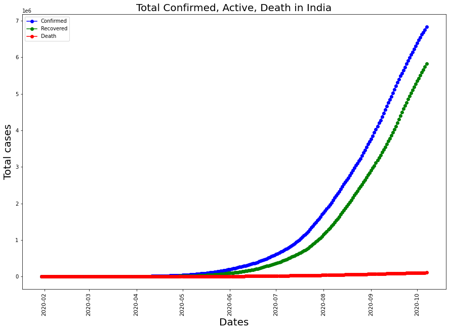


### Total Samples Tested


```python
import matplotlib.dates as mdates
ICMR_details['Percent_positive'] = round((ICMR_details['TotalPositiveCases']/ICMR_details['TotalSamplesTested'])*100,1)

fig, ax1 = plt.subplots(figsize= (15,5))
ax1.xaxis.set_major_formatter(mdates.DateFormatter('%d-%b'))
ax1.set_ylabel('Positive Cases (% of Total Samples Tested)')
ax1.bar(ICMR_details['DateTime'] , ICMR_details['Percent_positive'], color="red",label = 'Percentage of Positive Cases')
ax1.text(ICMR_details['DateTime'][0],4, 'Total Samples Tested as of Apr 23rd = 541789', style='italic',fontsize= 10,
        bbox={'facecolor': 'white' ,'alpha': 0.5, 'pad': 5})

ax2 = ax1.twinx()  
ax2.xaxis.set_major_formatter(mdates.DateFormatter('%d-%b'))
ax2.set_ylabel('Num Samples Tested')
ax2.fill_between(ICMR_details['DateTime'],ICMR_details['TotalSamplesTested'],color = 'black',alpha = 0.5,label = 'Samples Tested');

plt.legend(loc="upper left")
plt.title('Total Samples Tested')
plt.show()

```


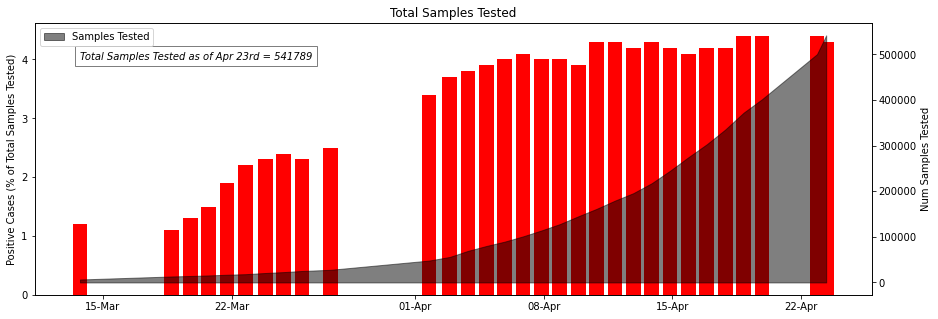


## Testing LIVE Status


```python
import json
# get response from the web page
response = requests.get('https://api.covid19india.org/state_test_data.json')

# get contents from the response
content = response.content

# parse the json file
parsed = json.loads(content)

# keys
parsed.keys()
```


    dict_keys(['states_tested_data'])


```python
# save data in a dataframe
tested = pd.DataFrame(parsed['states_tested_data'])

# first few rows
tested.tail()
```


<div>
<style scoped>
    .dataframe tbody tr th:only-of-type {
        vertical-align: middle;
    }

    .dataframe tbody tr th {
        vertical-align: top;
    }

    .dataframe thead th {
        text-align: right;
    }
</style>
<table border="1" class="dataframe">
  <thead>
    <tr style="text-align: right;">
      <th></th>
      <th>antigentests</th>
      <th>coronaenquirycalls</th>
      <th>cumulativepeopleinquarantine</th>
      <th>negative</th>
      <th>numcallsstatehelpline</th>
      <th>numicubeds</th>
      <th>numisolationbeds</th>
      <th>numventilators</th>
      <th>othertests</th>
      <th>peopleinicu</th>
      <th>...</th>
      <th>testsperpositivecase</th>
      <th>testsperthousand</th>
      <th>totaln95masks</th>
      <th>totalpeoplecurrentlyinquarantine</th>
      <th>totalpeoplereleasedfromquarantine</th>
      <th>totalppe</th>
      <th>totaltested</th>
      <th>unconfirmed</th>
      <th>updatedon</th>
      <th>_djhdx</th>
    </tr>
  </thead>
  <tbody>
    <tr>
      <th>6026</th>
      <td>1221370</td>
      <td></td>
      <td></td>
      <td></td>
      <td></td>
      <td>1243</td>
      <td>12715</td>
      <td>790</td>
      <td></td>
      <td></td>
      <td>...</td>
      <td></td>
      <td></td>
      <td>2383040</td>
      <td>2426</td>
      <td>107757</td>
      <td>2409262</td>
      <td>3397988</td>
      <td></td>
      <td>04/10/2020</td>
      <td>NaN</td>
    </tr>
    <tr>
      <th>6027</th>
      <td>1245401</td>
      <td></td>
      <td></td>
      <td></td>
      <td></td>
      <td>1243</td>
      <td>12715</td>
      <td>790</td>
      <td></td>
      <td></td>
      <td>...</td>
      <td></td>
      <td></td>
      <td>2395040</td>
      <td>2425</td>
      <td>107761</td>
      <td>2415262</td>
      <td>3438128</td>
      <td></td>
      <td>05/10/2020</td>
      <td>NaN</td>
    </tr>
    <tr>
      <th>6028</th>
      <td>1267956</td>
      <td></td>
      <td></td>
      <td></td>
      <td></td>
      <td>1243</td>
      <td>12715</td>
      <td>790</td>
      <td></td>
      <td></td>
      <td>...</td>
      <td></td>
      <td></td>
      <td>2405040</td>
      <td>2413</td>
      <td>107779</td>
      <td>2420262</td>
      <td>3480510</td>
      <td></td>
      <td>06/10/2020</td>
      <td>NaN</td>
    </tr>
    <tr>
      <th>6029</th>
      <td>1288884</td>
      <td></td>
      <td></td>
      <td></td>
      <td></td>
      <td>1243</td>
      <td>12715</td>
      <td>790</td>
      <td></td>
      <td></td>
      <td>...</td>
      <td></td>
      <td></td>
      <td>2417040</td>
      <td>2410</td>
      <td>107787</td>
      <td>2425262</td>
      <td>3523161</td>
      <td></td>
      <td>07/10/2020</td>
      <td>NaN</td>
    </tr>
    <tr>
      <th>6030</th>
      <td></td>
      <td></td>
      <td></td>
      <td></td>
      <td></td>
      <td>1243</td>
      <td>12715</td>
      <td>790</td>
      <td></td>
      <td></td>
      <td>...</td>
      <td></td>
      <td></td>
      <td>2428040</td>
      <td>2415</td>
      <td>107792</td>
      <td>2430262</td>
      <td>3565602</td>
      <td></td>
      <td>08/10/2020</td>
      <td>NaN</td>
    </tr>
  </tbody>
</table>
<p>5 rows × 32 columns</p>
</div>


```python
# fix datatype
tested['updatedon'] = pd.to_datetime(tested['updatedon'])
```


```python
# save file as a scv file
tested.to_csv('updated_tests_latest_state_level.csv', index=False)

```


```python
state_test_cases = tested.groupby(['updatedon','state'])['totaltested','populationncp2019projection','testpositivityrate',	'testsperpositivecase',	'testsperthousand','totalpeoplecurrentlyinquarantine'].max().reset_index()
```


```python
state_test_cases[:-50]
```


<div>
<style scoped>
    .dataframe tbody tr th:only-of-type {
        vertical-align: middle;
    }

    .dataframe tbody tr th {
        vertical-align: top;
    }

    .dataframe thead th {
        text-align: right;
    }
</style>
<table border="1" class="dataframe">
  <thead>
    <tr style="text-align: right;">
      <th></th>
      <th>updatedon</th>
      <th>state</th>
      <th>totaltested</th>
      <th>populationncp2019projection</th>
      <th>testpositivityrate</th>
      <th>testsperpositivecase</th>
      <th>testsperthousand</th>
      <th>totalpeoplecurrentlyinquarantine</th>
    </tr>
  </thead>
  <tbody>
    <tr>
      <th>0</th>
      <td>2020-01-04</td>
      <td>Delhi</td>
      <td>2621</td>
      <td>19814000</td>
      <td>0.00%</td>
      <td></td>
      <td>0.13</td>
      <td></td>
    </tr>
    <tr>
      <th>1</th>
      <td>2020-01-04</td>
      <td>Kerala</td>
      <td>7965</td>
      <td>35125000</td>
      <td>3.33%</td>
      <td>30</td>
      <td>0.23</td>
      <td>622</td>
    </tr>
    <tr>
      <th>2</th>
      <td>2020-01-04</td>
      <td>West Bengal</td>
      <td>659</td>
      <td>96906000</td>
      <td>5.61%</td>
      <td>18</td>
      <td>0.01</td>
      <td></td>
    </tr>
    <tr>
      <th>3</th>
      <td>2020-01-05</td>
      <td>Andaman and Nicobar Islands</td>
      <td>3754</td>
      <td>397000</td>
      <td>0.88%</td>
      <td>114</td>
      <td>9.46</td>
      <td>643</td>
    </tr>
    <tr>
      <th>4</th>
      <td>2020-01-05</td>
      <td>Andhra Pradesh</td>
      <td>102460</td>
      <td>52221000</td>
      <td>1.43%</td>
      <td>70</td>
      <td>1.96</td>
      <td></td>
    </tr>
    <tr>
      <th>...</th>
      <td>...</td>
      <td>...</td>
      <td>...</td>
      <td>...</td>
      <td>...</td>
      <td>...</td>
      <td>...</td>
      <td>...</td>
    </tr>
    <tr>
      <th>5975</th>
      <td>2020-12-08</td>
      <td>Jammu and Kashmir</td>
      <td>750847</td>
      <td>13203000</td>
      <td>3.52%</td>
      <td>28</td>
      <td>56.87</td>
      <td>42494</td>
    </tr>
    <tr>
      <th>5976</th>
      <td>2020-12-08</td>
      <td>Jharkhand</td>
      <td>402072</td>
      <td>37403000</td>
      <td>5.04%</td>
      <td>20</td>
      <td>10.75</td>
      <td></td>
    </tr>
    <tr>
      <th>5977</th>
      <td>2020-12-08</td>
      <td>Karnataka</td>
      <td>1826317</td>
      <td>65798000</td>
      <td>0.00%</td>
      <td></td>
      <td>27.76</td>
      <td>289355</td>
    </tr>
    <tr>
      <th>5978</th>
      <td>2020-12-08</td>
      <td>Kerala</td>
      <td>1056360</td>
      <td>35125000</td>
      <td>3.61%</td>
      <td>28</td>
      <td>30.07</td>
      <td>12426</td>
    </tr>
    <tr>
      <th>5979</th>
      <td>2020-12-08</td>
      <td>Ladakh</td>
      <td>23034</td>
      <td>293000</td>
      <td>7.86%</td>
      <td>13</td>
      <td>78.61</td>
      <td>363</td>
    </tr>
  </tbody>
</table>
<p>5980 rows × 8 columns</p>
</div>


```python
state_test_cases = tested.groupby('state')['totaltested','populationncp2019projection','testpositivityrate',	'testsperpositivecase',	'testsperthousand','totalpeoplecurrentlyinquarantine'].max()
state_test_cases['testpositivityrate'] = state_test_cases['testpositivityrate'].str.replace('%', '')
```


```python
state_test_cases = state_test_cases.apply(pd.to_numeric)
```


```python
state_test_cases.nunique()
```


    totaltested                         35
    populationncp2019projection         34
    testpositivityrate                  34
    testsperpositivecase                19
    testsperthousand                    25
    totalpeoplecurrentlyinquarantine    28
    dtype: int64


```python
state_test_cases.sort_values('totaltested', ascending= False).style.background_gradient(cmap='Blues',subset=["totaltested"])\
                        .background_gradient(cmap='Blues',subset=["populationncp2019projection"])\
                        .background_gradient(cmap='Blues',subset=["testpositivityrate"])\
                        .background_gradient(cmap='Blues',subset=["testsperpositivecase"])\
                        .background_gradient(cmap='Blues',subset=["testsperthousand"])\
                        .background_gradient(cmap='Blues',subset=["totalpeoplecurrentlyinquarantine"])
                       
```


<style  type="text/css" >
#T_b2be1b44_0982_11eb_8a21_81ecfe8bb601row0_col0,#T_b2be1b44_0982_11eb_8a21_81ecfe8bb601row0_col1,#T_b2be1b44_0982_11eb_8a21_81ecfe8bb601row1_col2,#T_b2be1b44_0982_11eb_8a21_81ecfe8bb601row10_col5,#T_b2be1b44_0982_11eb_8a21_81ecfe8bb601row11_col5,#T_b2be1b44_0982_11eb_8a21_81ecfe8bb601row15_col4,#T_b2be1b44_0982_11eb_8a21_81ecfe8bb601row22_col3,#T_b2be1b44_0982_11eb_8a21_81ecfe8bb601row24_col2{
            background-color:  #08306b;
            color:  #f1f1f1;
        }#T_b2be1b44_0982_11eb_8a21_81ecfe8bb601row0_col2,#T_b2be1b44_0982_11eb_8a21_81ecfe8bb601row22_col2{
            background-color:  #7fb9da;
            color:  #000000;
        }#T_b2be1b44_0982_11eb_8a21_81ecfe8bb601row0_col3,#T_b2be1b44_0982_11eb_8a21_81ecfe8bb601row26_col3{
            background-color:  #f1f7fd;
            color:  #000000;
        }#T_b2be1b44_0982_11eb_8a21_81ecfe8bb601row0_col4,#T_b2be1b44_0982_11eb_8a21_81ecfe8bb601row1_col4,#T_b2be1b44_0982_11eb_8a21_81ecfe8bb601row2_col4,#T_b2be1b44_0982_11eb_8a21_81ecfe8bb601row4_col4,#T_b2be1b44_0982_11eb_8a21_81ecfe8bb601row6_col4,#T_b2be1b44_0982_11eb_8a21_81ecfe8bb601row7_col4,#T_b2be1b44_0982_11eb_8a21_81ecfe8bb601row8_col4,#T_b2be1b44_0982_11eb_8a21_81ecfe8bb601row11_col4,#T_b2be1b44_0982_11eb_8a21_81ecfe8bb601row12_col4,#T_b2be1b44_0982_11eb_8a21_81ecfe8bb601row13_col4,#T_b2be1b44_0982_11eb_8a21_81ecfe8bb601row14_col1,#T_b2be1b44_0982_11eb_8a21_81ecfe8bb601row15_col1,#T_b2be1b44_0982_11eb_8a21_81ecfe8bb601row16_col4,#T_b2be1b44_0982_11eb_8a21_81ecfe8bb601row16_col5,#T_b2be1b44_0982_11eb_8a21_81ecfe8bb601row17_col4,#T_b2be1b44_0982_11eb_8a21_81ecfe8bb601row18_col1,#T_b2be1b44_0982_11eb_8a21_81ecfe8bb601row19_col4,#T_b2be1b44_0982_11eb_8a21_81ecfe8bb601row23_col4,#T_b2be1b44_0982_11eb_8a21_81ecfe8bb601row25_col4,#T_b2be1b44_0982_11eb_8a21_81ecfe8bb601row26_col4,#T_b2be1b44_0982_11eb_8a21_81ecfe8bb601row29_col4,#T_b2be1b44_0982_11eb_8a21_81ecfe8bb601row30_col1,#T_b2be1b44_0982_11eb_8a21_81ecfe8bb601row31_col1,#T_b2be1b44_0982_11eb_8a21_81ecfe8bb601row31_col4,#T_b2be1b44_0982_11eb_8a21_81ecfe8bb601row32_col4,#T_b2be1b44_0982_11eb_8a21_81ecfe8bb601row34_col5{
            background-color:  #f6faff;
            color:  #000000;
        }#T_b2be1b44_0982_11eb_8a21_81ecfe8bb601row0_col5,#T_b2be1b44_0982_11eb_8a21_81ecfe8bb601row1_col0,#T_b2be1b44_0982_11eb_8a21_81ecfe8bb601row2_col0,#T_b2be1b44_0982_11eb_8a21_81ecfe8bb601row3_col0,#T_b2be1b44_0982_11eb_8a21_81ecfe8bb601row4_col0,#T_b2be1b44_0982_11eb_8a21_81ecfe8bb601row5_col0,#T_b2be1b44_0982_11eb_8a21_81ecfe8bb601row6_col0,#T_b2be1b44_0982_11eb_8a21_81ecfe8bb601row7_col0,#T_b2be1b44_0982_11eb_8a21_81ecfe8bb601row8_col0,#T_b2be1b44_0982_11eb_8a21_81ecfe8bb601row12_col5,#T_b2be1b44_0982_11eb_8a21_81ecfe8bb601row14_col5,#T_b2be1b44_0982_11eb_8a21_81ecfe8bb601row24_col5,#T_b2be1b44_0982_11eb_8a21_81ecfe8bb601row25_col5,#T_b2be1b44_0982_11eb_8a21_81ecfe8bb601row30_col5{
            background-color:  #e3eef9;
            color:  #000000;
        }#T_b2be1b44_0982_11eb_8a21_81ecfe8bb601row1_col1{
            background-color:  #b9d6ea;
            color:  #000000;
        }#T_b2be1b44_0982_11eb_8a21_81ecfe8bb601row1_col3,#T_b2be1b44_0982_11eb_8a21_81ecfe8bb601row9_col3,#T_b2be1b44_0982_11eb_8a21_81ecfe8bb601row11_col3,#T_b2be1b44_0982_11eb_8a21_81ecfe8bb601row15_col3,#T_b2be1b44_0982_11eb_8a21_81ecfe8bb601row17_col3,#T_b2be1b44_0982_11eb_8a21_81ecfe8bb601row18_col3,#T_b2be1b44_0982_11eb_8a21_81ecfe8bb601row19_col3,#T_b2be1b44_0982_11eb_8a21_81ecfe8bb601row21_col3,#T_b2be1b44_0982_11eb_8a21_81ecfe8bb601row23_col3,#T_b2be1b44_0982_11eb_8a21_81ecfe8bb601row25_col3,#T_b2be1b44_0982_11eb_8a21_81ecfe8bb601row27_col3,#T_b2be1b44_0982_11eb_8a21_81ecfe8bb601row28_col3,#T_b2be1b44_0982_11eb_8a21_81ecfe8bb601row32_col3,#T_b2be1b44_0982_11eb_8a21_81ecfe8bb601row34_col3{
            background-color:  #e5eff9;
            color:  #000000;
        }#T_b2be1b44_0982_11eb_8a21_81ecfe8bb601row1_col5,#T_b2be1b44_0982_11eb_8a21_81ecfe8bb601row34_col4{
            background-color:  #083573;
            color:  #f1f1f1;
        }#T_b2be1b44_0982_11eb_8a21_81ecfe8bb601row2_col1,#T_b2be1b44_0982_11eb_8a21_81ecfe8bb601row10_col1{
            background-color:  #deebf7;
            color:  #000000;
        }#T_b2be1b44_0982_11eb_8a21_81ecfe8bb601row2_col2{
            background-color:  #b0d2e7;
            color:  #000000;
        }#T_b2be1b44_0982_11eb_8a21_81ecfe8bb601row2_col3,#T_b2be1b44_0982_11eb_8a21_81ecfe8bb601row3_col3,#T_b2be1b44_0982_11eb_8a21_81ecfe8bb601row16_col3,#T_b2be1b44_0982_11eb_8a21_81ecfe8bb601row24_col1,#T_b2be1b44_0982_11eb_8a21_81ecfe8bb601row30_col3{
            background-color:  #e6f0f9;
            color:  #000000;
        }#T_b2be1b44_0982_11eb_8a21_81ecfe8bb601row2_col5,#T_b2be1b44_0982_11eb_8a21_81ecfe8bb601row9_col5,#T_b2be1b44_0982_11eb_8a21_81ecfe8bb601row10_col0,#T_b2be1b44_0982_11eb_8a21_81ecfe8bb601row11_col0,#T_b2be1b44_0982_11eb_8a21_81ecfe8bb601row12_col0,#T_b2be1b44_0982_11eb_8a21_81ecfe8bb601row13_col0,#T_b2be1b44_0982_11eb_8a21_81ecfe8bb601row14_col0,#T_b2be1b44_0982_11eb_8a21_81ecfe8bb601row15_col0,#T_b2be1b44_0982_11eb_8a21_81ecfe8bb601row15_col5,#T_b2be1b44_0982_11eb_8a21_81ecfe8bb601row16_col0,#T_b2be1b44_0982_11eb_8a21_81ecfe8bb601row17_col0,#T_b2be1b44_0982_11eb_8a21_81ecfe8bb601row17_col5,#T_b2be1b44_0982_11eb_8a21_81ecfe8bb601row18_col0,#T_b2be1b44_0982_11eb_8a21_81ecfe8bb601row19_col0,#T_b2be1b44_0982_11eb_8a21_81ecfe8bb601row20_col0,#T_b2be1b44_0982_11eb_8a21_81ecfe8bb601row21_col0,#T_b2be1b44_0982_11eb_8a21_81ecfe8bb601row21_col5,#T_b2be1b44_0982_11eb_8a21_81ecfe8bb601row22_col0,#T_b2be1b44_0982_11eb_8a21_81ecfe8bb601row22_col5,#T_b2be1b44_0982_11eb_8a21_81ecfe8bb601row23_col1,#T_b2be1b44_0982_11eb_8a21_81ecfe8bb601row28_col5,#T_b2be1b44_0982_11eb_8a21_81ecfe8bb601row33_col5{
            background-color:  #f5fafe;
            color:  #000000;
        }#T_b2be1b44_0982_11eb_8a21_81ecfe8bb601row3_col1{
            background-color:  #caddf0;
            color:  #000000;
        }#T_b2be1b44_0982_11eb_8a21_81ecfe8bb601row3_col2,#T_b2be1b44_0982_11eb_8a21_81ecfe8bb601row24_col4{
            background-color:  #084387;
            color:  #f1f1f1;
        }#T_b2be1b44_0982_11eb_8a21_81ecfe8bb601row3_col4,#T_b2be1b44_0982_11eb_8a21_81ecfe8bb601row4_col5,#T_b2be1b44_0982_11eb_8a21_81ecfe8bb601row5_col3,#T_b2be1b44_0982_11eb_8a21_81ecfe8bb601row5_col4,#T_b2be1b44_0982_11eb_8a21_81ecfe8bb601row9_col4,#T_b2be1b44_0982_11eb_8a21_81ecfe8bb601row10_col4,#T_b2be1b44_0982_11eb_8a21_81ecfe8bb601row14_col4,#T_b2be1b44_0982_11eb_8a21_81ecfe8bb601row20_col3,#T_b2be1b44_0982_11eb_8a21_81ecfe8bb601row20_col4,#T_b2be1b44_0982_11eb_8a21_81ecfe8bb601row21_col4,#T_b2be1b44_0982_11eb_8a21_81ecfe8bb601row22_col4,#T_b2be1b44_0982_11eb_8a21_81ecfe8bb601row23_col0,#T_b2be1b44_0982_11eb_8a21_81ecfe8bb601row23_col5,#T_b2be1b44_0982_11eb_8a21_81ecfe8bb601row24_col0,#T_b2be1b44_0982_11eb_8a21_81ecfe8bb601row24_col3,#T_b2be1b44_0982_11eb_8a21_81ecfe8bb601row25_col0,#T_b2be1b44_0982_11eb_8a21_81ecfe8bb601row26_col0,#T_b2be1b44_0982_11eb_8a21_81ecfe8bb601row27_col0,#T_b2be1b44_0982_11eb_8a21_81ecfe8bb601row27_col1,#T_b2be1b44_0982_11eb_8a21_81ecfe8bb601row27_col2,#T_b2be1b44_0982_11eb_8a21_81ecfe8bb601row27_col4,#T_b2be1b44_0982_11eb_8a21_81ecfe8bb601row27_col5,#T_b2be1b44_0982_11eb_8a21_81ecfe8bb601row28_col0,#T_b2be1b44_0982_11eb_8a21_81ecfe8bb601row28_col1,#T_b2be1b44_0982_11eb_8a21_81ecfe8bb601row28_col4,#T_b2be1b44_0982_11eb_8a21_81ecfe8bb601row29_col0,#T_b2be1b44_0982_11eb_8a21_81ecfe8bb601row29_col3,#T_b2be1b44_0982_11eb_8a21_81ecfe8bb601row29_col5,#T_b2be1b44_0982_11eb_8a21_81ecfe8bb601row30_col0,#T_b2be1b44_0982_11eb_8a21_81ecfe8bb601row30_col4,#T_b2be1b44_0982_11eb_8a21_81ecfe8bb601row31_col0,#T_b2be1b44_0982_11eb_8a21_81ecfe8bb601row31_col3,#T_b2be1b44_0982_11eb_8a21_81ecfe8bb601row32_col0,#T_b2be1b44_0982_11eb_8a21_81ecfe8bb601row33_col0,#T_b2be1b44_0982_11eb_8a21_81ecfe8bb601row33_col1,#T_b2be1b44_0982_11eb_8a21_81ecfe8bb601row33_col4,#T_b2be1b44_0982_11eb_8a21_81ecfe8bb601row34_col0,#T_b2be1b44_0982_11eb_8a21_81ecfe8bb601row34_col1{
            background-color:  #f7fbff;
            color:  #000000;
        }#T_b2be1b44_0982_11eb_8a21_81ecfe8bb601row3_col5,#T_b2be1b44_0982_11eb_8a21_81ecfe8bb601row8_col5,#T_b2be1b44_0982_11eb_8a21_81ecfe8bb601row13_col5,#T_b2be1b44_0982_11eb_8a21_81ecfe8bb601row18_col5,#T_b2be1b44_0982_11eb_8a21_81ecfe8bb601row20_col5,#T_b2be1b44_0982_11eb_8a21_81ecfe8bb601row31_col5,#T_b2be1b44_0982_11eb_8a21_81ecfe8bb601row32_col5{
            background-color:  #000000;
            color:  #f1f1f1;
        }#T_b2be1b44_0982_11eb_8a21_81ecfe8bb601row4_col1,#T_b2be1b44_0982_11eb_8a21_81ecfe8bb601row6_col3{
            background-color:  #ecf4fb;
            color:  #000000;
        }#T_b2be1b44_0982_11eb_8a21_81ecfe8bb601row4_col2{
            background-color:  #3a8ac2;
            color:  #000000;
        }#T_b2be1b44_0982_11eb_8a21_81ecfe8bb601row4_col3{
            background-color:  #e9f2fa;
            color:  #000000;
        }#T_b2be1b44_0982_11eb_8a21_81ecfe8bb601row5_col1{
            background-color:  #5da5d1;
            color:  #000000;
        }#T_b2be1b44_0982_11eb_8a21_81ecfe8bb601row5_col2{
            background-color:  #084a91;
            color:  #f1f1f1;
        }#T_b2be1b44_0982_11eb_8a21_81ecfe8bb601row5_col5{
            background-color:  #95c5df;
            color:  #000000;
        }#T_b2be1b44_0982_11eb_8a21_81ecfe8bb601row6_col1{
            background-color:  #ddeaf7;
            color:  #000000;
        }#T_b2be1b44_0982_11eb_8a21_81ecfe8bb601row6_col2,#T_b2be1b44_0982_11eb_8a21_81ecfe8bb601row12_col2,#T_b2be1b44_0982_11eb_8a21_81ecfe8bb601row25_col2{
            background-color:  #97c6df;
            color:  #000000;
        }#T_b2be1b44_0982_11eb_8a21_81ecfe8bb601row6_col5,#T_b2be1b44_0982_11eb_8a21_81ecfe8bb601row22_col1{
            background-color:  #f4f9fe;
            color:  #000000;
        }#T_b2be1b44_0982_11eb_8a21_81ecfe8bb601row7_col1{
            background-color:  #b5d4e9;
            color:  #000000;
        }#T_b2be1b44_0982_11eb_8a21_81ecfe8bb601row7_col2{
            background-color:  #08478d;
            color:  #f1f1f1;
        }#T_b2be1b44_0982_11eb_8a21_81ecfe8bb601row7_col3,#T_b2be1b44_0982_11eb_8a21_81ecfe8bb601row13_col3{
            background-color:  #f3f8fe;
            color:  #000000;
        }#T_b2be1b44_0982_11eb_8a21_81ecfe8bb601row7_col5{
            background-color:  #084d96;
            color:  #f1f1f1;
        }#T_b2be1b44_0982_11eb_8a21_81ecfe8bb601row8_col1{
            background-color:  #a9cfe5;
            color:  #000000;
        }#T_b2be1b44_0982_11eb_8a21_81ecfe8bb601row8_col2{
            background-color:  #cde0f1;
            color:  #000000;
        }#T_b2be1b44_0982_11eb_8a21_81ecfe8bb601row8_col3{
            background-color:  #eff6fc;
            color:  #000000;
        }#T_b2be1b44_0982_11eb_8a21_81ecfe8bb601row9_col0,#T_b2be1b44_0982_11eb_8a21_81ecfe8bb601row26_col5{
            background-color:  #e4eff9;
            color:  #000000;
        }#T_b2be1b44_0982_11eb_8a21_81ecfe8bb601row9_col1{
            background-color:  #d9e8f5;
            color:  #000000;
        }#T_b2be1b44_0982_11eb_8a21_81ecfe8bb601row9_col2{
            background-color:  #a3cce3;
            color:  #000000;
        }#T_b2be1b44_0982_11eb_8a21_81ecfe8bb601row10_col2{
            background-color:  #63a8d3;
            color:  #000000;
        }#T_b2be1b44_0982_11eb_8a21_81ecfe8bb601row10_col3,#T_b2be1b44_0982_11eb_8a21_81ecfe8bb601row18_col2{
            background-color:  #e7f1fa;
            color:  #000000;
        }#T_b2be1b44_0982_11eb_8a21_81ecfe8bb601row11_col1,#T_b2be1b44_0982_11eb_8a21_81ecfe8bb601row20_col1{
            background-color:  #d6e6f4;
            color:  #000000;
        }#T_b2be1b44_0982_11eb_8a21_81ecfe8bb601row11_col2{
            background-color:  #89bedc;
            color:  #000000;
        }#T_b2be1b44_0982_11eb_8a21_81ecfe8bb601row12_col1{
            background-color:  #d9e7f5;
            color:  #000000;
        }#T_b2be1b44_0982_11eb_8a21_81ecfe8bb601row12_col3{
            background-color:  #e8f1fa;
            color:  #000000;
        }#T_b2be1b44_0982_11eb_8a21_81ecfe8bb601row13_col1{
            background-color:  #a1cbe2;
            color:  #000000;
        }#T_b2be1b44_0982_11eb_8a21_81ecfe8bb601row13_col2,#T_b2be1b44_0982_11eb_8a21_81ecfe8bb601row31_col2,#T_b2be1b44_0982_11eb_8a21_81ecfe8bb601row33_col3{
            background-color:  #083370;
            color:  #f1f1f1;
        }#T_b2be1b44_0982_11eb_8a21_81ecfe8bb601row14_col2{
            background-color:  #083877;
            color:  #f1f1f1;
        }#T_b2be1b44_0982_11eb_8a21_81ecfe8bb601row14_col3{
            background-color:  #e7f0fa;
            color:  #000000;
        }#T_b2be1b44_0982_11eb_8a21_81ecfe8bb601row15_col2{
            background-color:  #3282be;
            color:  #000000;
        }#T_b2be1b44_0982_11eb_8a21_81ecfe8bb601row16_col1{
            background-color:  #61a7d2;
            color:  #000000;
        }#T_b2be1b44_0982_11eb_8a21_81ecfe8bb601row16_col2{
            background-color:  #083d7f;
            color:  #f1f1f1;
        }#T_b2be1b44_0982_11eb_8a21_81ecfe8bb601row17_col1,#T_b2be1b44_0982_11eb_8a21_81ecfe8bb601row21_col1{
            background-color:  #f5f9fe;
            color:  #000000;
        }#T_b2be1b44_0982_11eb_8a21_81ecfe8bb601row17_col2{
            background-color:  #b4d3e9;
            color:  #000000;
        }#T_b2be1b44_0982_11eb_8a21_81ecfe8bb601row18_col4,#T_b2be1b44_0982_11eb_8a21_81ecfe8bb601row29_col2{
            background-color:  #08316d;
            color:  #f1f1f1;
        }#T_b2be1b44_0982_11eb_8a21_81ecfe8bb601row19_col1{
            background-color:  #f2f7fd;
            color:  #000000;
        }#T_b2be1b44_0982_11eb_8a21_81ecfe8bb601row19_col2,#T_b2be1b44_0982_11eb_8a21_81ecfe8bb601row19_col5{
            background-color:  #cddff1;
            color:  #000000;
        }#T_b2be1b44_0982_11eb_8a21_81ecfe8bb601row20_col2{
            background-color:  #083471;
            color:  #f1f1f1;
        }#T_b2be1b44_0982_11eb_8a21_81ecfe8bb601row21_col2{
            background-color:  #ccdff1;
            color:  #000000;
        }#T_b2be1b44_0982_11eb_8a21_81ecfe8bb601row23_col2{
            background-color:  #4191c6;
            color:  #000000;
        }#T_b2be1b44_0982_11eb_8a21_81ecfe8bb601row25_col1{
            background-color:  #eef5fc;
            color:  #000000;
        }#T_b2be1b44_0982_11eb_8a21_81ecfe8bb601row26_col1{
            background-color:  #87bddc;
            color:  #000000;
        }#T_b2be1b44_0982_11eb_8a21_81ecfe8bb601row26_col2{
            background-color:  #084f99;
            color:  #f1f1f1;
        }#T_b2be1b44_0982_11eb_8a21_81ecfe8bb601row28_col2{
            background-color:  #d6e5f4;
            color:  #000000;
        }#T_b2be1b44_0982_11eb_8a21_81ecfe8bb601row29_col1{
            background-color:  #abd0e6;
            color:  #000000;
        }#T_b2be1b44_0982_11eb_8a21_81ecfe8bb601row30_col2{
            background-color:  #c2d9ee;
            color:  #000000;
        }#T_b2be1b44_0982_11eb_8a21_81ecfe8bb601row32_col1{
            background-color:  #d1e2f3;
            color:  #000000;
        }#T_b2be1b44_0982_11eb_8a21_81ecfe8bb601row32_col2{
            background-color:  #3787c0;
            color:  #000000;
        }#T_b2be1b44_0982_11eb_8a21_81ecfe8bb601row33_col2{
            background-color:  #aacfe5;
            color:  #000000;
        }#T_b2be1b44_0982_11eb_8a21_81ecfe8bb601row34_col2{
            background-color:  #1f6eb3;
            color:  #f1f1f1;
        }</style><table id="T_b2be1b44_0982_11eb_8a21_81ecfe8bb601" ><thead>    <tr>        <th class="blank level0" ></th>        <th class="col_heading level0 col0" >totaltested</th>        <th class="col_heading level0 col1" >populationncp2019projection</th>        <th class="col_heading level0 col2" >testpositivityrate</th>        <th class="col_heading level0 col3" >testsperpositivecase</th>        <th class="col_heading level0 col4" >testsperthousand</th>        <th class="col_heading level0 col5" >totalpeoplecurrentlyinquarantine</th>    </tr>    <tr>        <th class="index_name level0" >state</th>        <th class="blank" ></th>        <th class="blank" ></th>        <th class="blank" ></th>        <th class="blank" ></th>        <th class="blank" ></th>        <th class="blank" ></th>    </tr></thead><tbody>
                <tr>
                        <th id="T_b2be1b44_0982_11eb_8a21_81ecfe8bb601level0_row0" class="row_heading level0 row0" >Uttar Pradesh</th>
                        <td id="T_b2be1b44_0982_11eb_8a21_81ecfe8bb601row0_col0" class="data row0 col0" >9937675</td>
                        <td id="T_b2be1b44_0982_11eb_8a21_81ecfe8bb601row0_col1" class="data row0 col1" >224979000</td>
                        <td id="T_b2be1b44_0982_11eb_8a21_81ecfe8bb601row0_col2" class="data row0 col2" >5.290000</td>
                        <td id="T_b2be1b44_0982_11eb_8a21_81ecfe8bb601row0_col3" class="data row0 col3" >41</td>
                        <td id="T_b2be1b44_0982_11eb_8a21_81ecfe8bb601row0_col4" class="data row0 col4" >9.820000</td>
                        <td id="T_b2be1b44_0982_11eb_8a21_81ecfe8bb601row0_col5" class="data row0 col5" >9911.000000</td>
            </tr>
            <tr>
                        <th id="T_b2be1b44_0982_11eb_8a21_81ecfe8bb601level0_row1" class="row_heading level0 row1" >Karnataka</th>
                        <td id="T_b2be1b44_0982_11eb_8a21_81ecfe8bb601row1_col0" class="data row1 col0" >999530</td>
                        <td id="T_b2be1b44_0982_11eb_8a21_81ecfe8bb601row1_col1" class="data row1 col1" >65798000</td>
                        <td id="T_b2be1b44_0982_11eb_8a21_81ecfe8bb601row1_col2" class="data row1 col2" >9.880000</td>
                        <td id="T_b2be1b44_0982_11eb_8a21_81ecfe8bb601row1_col3" class="data row1 col3" >99</td>
                        <td id="T_b2be1b44_0982_11eb_8a21_81ecfe8bb601row1_col4" class="data row1 col4" >9.930000</td>
                        <td id="T_b2be1b44_0982_11eb_8a21_81ecfe8bb601row1_col5" class="data row1 col5" >97821.000000</td>
            </tr>
            <tr>
                        <th id="T_b2be1b44_0982_11eb_8a21_81ecfe8bb601level0_row2" class="row_heading level0 row2" >Chhattisgarh</th>
                        <td id="T_b2be1b44_0982_11eb_8a21_81ecfe8bb601row2_col0" class="data row2 col0" >998347</td>
                        <td id="T_b2be1b44_0982_11eb_8a21_81ecfe8bb601row2_col1" class="data row2 col1" >28724000</td>
                        <td id="T_b2be1b44_0982_11eb_8a21_81ecfe8bb601row2_col2" class="data row2 col2" >4.160000</td>
                        <td id="T_b2be1b44_0982_11eb_8a21_81ecfe8bb601row2_col3" class="data row2 col3" >95</td>
                        <td id="T_b2be1b44_0982_11eb_8a21_81ecfe8bb601row2_col4" class="data row2 col4" >9.970000</td>
                        <td id="T_b2be1b44_0982_11eb_8a21_81ecfe8bb601row2_col5" class="data row2 col5" >924.000000</td>
            </tr>
            <tr>
                        <th id="T_b2be1b44_0982_11eb_8a21_81ecfe8bb601level0_row3" class="row_heading level0 row3" >Andhra Pradesh</th>
                        <td id="T_b2be1b44_0982_11eb_8a21_81ecfe8bb601row3_col0" class="data row3 col0" >996573</td>
                        <td id="T_b2be1b44_0982_11eb_8a21_81ecfe8bb601row3_col1" class="data row3 col1" >52221000</td>
                        <td id="T_b2be1b44_0982_11eb_8a21_81ecfe8bb601row3_col2" class="data row3 col2" >9.290000</td>
                        <td id="T_b2be1b44_0982_11eb_8a21_81ecfe8bb601row3_col3" class="data row3 col3" >94</td>
                        <td id="T_b2be1b44_0982_11eb_8a21_81ecfe8bb601row3_col4" class="data row3 col4" >9.770000</td>
                        <td id="T_b2be1b44_0982_11eb_8a21_81ecfe8bb601row3_col5" class="data row3 col5" >nan</td>
            </tr>
            <tr>
                        <th id="T_b2be1b44_0982_11eb_8a21_81ecfe8bb601level0_row4" class="row_heading level0 row4" >Jammu and Kashmir</th>
                        <td id="T_b2be1b44_0982_11eb_8a21_81ecfe8bb601row4_col0" class="data row4 col0" >996481</td>
                        <td id="T_b2be1b44_0982_11eb_8a21_81ecfe8bb601row4_col1" class="data row4 col1" >13203000</td>
                        <td id="T_b2be1b44_0982_11eb_8a21_81ecfe8bb601row4_col2" class="data row4 col2" >6.990000</td>
                        <td id="T_b2be1b44_0982_11eb_8a21_81ecfe8bb601row4_col3" class="data row4 col3" >80</td>
                        <td id="T_b2be1b44_0982_11eb_8a21_81ecfe8bb601row4_col4" class="data row4 col4" >9.880000</td>
                        <td id="T_b2be1b44_0982_11eb_8a21_81ecfe8bb601row4_col5" class="data row4 col5" >89.000000</td>
            </tr>
            <tr>
                        <th id="T_b2be1b44_0982_11eb_8a21_81ecfe8bb601level0_row5" class="row_heading level0 row5" >Maharashtra</th>
                        <td id="T_b2be1b44_0982_11eb_8a21_81ecfe8bb601row5_col0" class="data row5 col0" >995343</td>
                        <td id="T_b2be1b44_0982_11eb_8a21_81ecfe8bb601row5_col1" class="data row5 col1" >122153000</td>
                        <td id="T_b2be1b44_0982_11eb_8a21_81ecfe8bb601row5_col2" class="data row5 col2" >9.070000</td>
                        <td id="T_b2be1b44_0982_11eb_8a21_81ecfe8bb601row5_col3" class="data row5 col3" >9</td>
                        <td id="T_b2be1b44_0982_11eb_8a21_81ecfe8bb601row5_col4" class="data row5 col4" >9.780000</td>
                        <td id="T_b2be1b44_0982_11eb_8a21_81ecfe8bb601row5_col5" class="data row5 col5" >39831.000000</td>
            </tr>
            <tr>
                        <th id="T_b2be1b44_0982_11eb_8a21_81ecfe8bb601level0_row6" class="row_heading level0 row6" >Punjab</th>
                        <td id="T_b2be1b44_0982_11eb_8a21_81ecfe8bb601row6_col0" class="data row6 col0" >988119</td>
                        <td id="T_b2be1b44_0982_11eb_8a21_81ecfe8bb601row6_col1" class="data row6 col1" >29859000</td>
                        <td id="T_b2be1b44_0982_11eb_8a21_81ecfe8bb601row6_col2" class="data row6 col2" >4.800000</td>
                        <td id="T_b2be1b44_0982_11eb_8a21_81ecfe8bb601row6_col3" class="data row6 col3" >61</td>
                        <td id="T_b2be1b44_0982_11eb_8a21_81ecfe8bb601row6_col4" class="data row6 col4" >9.860000</td>
                        <td id="T_b2be1b44_0982_11eb_8a21_81ecfe8bb601row6_col5" class="data row6 col5" >1711.000000</td>
            </tr>
            <tr>
                        <th id="T_b2be1b44_0982_11eb_8a21_81ecfe8bb601level0_row7" class="row_heading level0 row7" >Gujarat</th>
                        <td id="T_b2be1b44_0982_11eb_8a21_81ecfe8bb601row7_col0" class="data row7 col0" >987630</td>
                        <td id="T_b2be1b44_0982_11eb_8a21_81ecfe8bb601row7_col1" class="data row7 col1" >67936000</td>
                        <td id="T_b2be1b44_0982_11eb_8a21_81ecfe8bb601row7_col2" class="data row7 col2" >9.150000</td>
                        <td id="T_b2be1b44_0982_11eb_8a21_81ecfe8bb601row7_col3" class="data row7 col3" >27</td>
                        <td id="T_b2be1b44_0982_11eb_8a21_81ecfe8bb601row7_col4" class="data row7 col4" >9.830000</td>
                        <td id="T_b2be1b44_0982_11eb_8a21_81ecfe8bb601row7_col5" class="data row7 col5" >88864.000000</td>
            </tr>
            <tr>
                        <th id="T_b2be1b44_0982_11eb_8a21_81ecfe8bb601level0_row8" class="row_heading level0 row8" >Rajasthan</th>
                        <td id="T_b2be1b44_0982_11eb_8a21_81ecfe8bb601row8_col0" class="data row8 col0" >987272</td>
                        <td id="T_b2be1b44_0982_11eb_8a21_81ecfe8bb601row8_col1" class="data row8 col1" >77264000</td>
                        <td id="T_b2be1b44_0982_11eb_8a21_81ecfe8bb601row8_col2" class="data row8 col2" >3.300000</td>
                        <td id="T_b2be1b44_0982_11eb_8a21_81ecfe8bb601row8_col3" class="data row8 col3" >49</td>
                        <td id="T_b2be1b44_0982_11eb_8a21_81ecfe8bb601row8_col4" class="data row8 col4" >9.970000</td>
                        <td id="T_b2be1b44_0982_11eb_8a21_81ecfe8bb601row8_col5" class="data row8 col5" >nan</td>
            </tr>
            <tr>
                        <th id="T_b2be1b44_0982_11eb_8a21_81ecfe8bb601level0_row9" class="row_heading level0 row9" >Assam</th>
                        <td id="T_b2be1b44_0982_11eb_8a21_81ecfe8bb601row9_col0" class="data row9 col0" >964499</td>
                        <td id="T_b2be1b44_0982_11eb_8a21_81ecfe8bb601row9_col1" class="data row9 col1" >34293000</td>
                        <td id="T_b2be1b44_0982_11eb_8a21_81ecfe8bb601row9_col2" class="data row9 col2" >4.550000</td>
                        <td id="T_b2be1b44_0982_11eb_8a21_81ecfe8bb601row9_col3" class="data row9 col3" >99</td>
                        <td id="T_b2be1b44_0982_11eb_8a21_81ecfe8bb601row9_col4" class="data row9 col4" >9.800000</td>
                        <td id="T_b2be1b44_0982_11eb_8a21_81ecfe8bb601row9_col5" class="data row9 col5" >989.000000</td>
            </tr>
            <tr>
                        <th id="T_b2be1b44_0982_11eb_8a21_81ecfe8bb601level0_row10" class="row_heading level0 row10" >Haryana</th>
                        <td id="T_b2be1b44_0982_11eb_8a21_81ecfe8bb601row10_col0" class="data row10 col0" >99987</td>
                        <td id="T_b2be1b44_0982_11eb_8a21_81ecfe8bb601row10_col1" class="data row10 col1" >28672000</td>
                        <td id="T_b2be1b44_0982_11eb_8a21_81ecfe8bb601row10_col2" class="data row10 col2" >5.910000</td>
                        <td id="T_b2be1b44_0982_11eb_8a21_81ecfe8bb601row10_col3" class="data row10 col3" >87</td>
                        <td id="T_b2be1b44_0982_11eb_8a21_81ecfe8bb601row10_col4" class="data row10 col4" >9.660000</td>
                        <td id="T_b2be1b44_0982_11eb_8a21_81ecfe8bb601row10_col5" class="data row10 col5" >99992.000000</td>
            </tr>
            <tr>
                        <th id="T_b2be1b44_0982_11eb_8a21_81ecfe8bb601level0_row11" class="row_heading level0 row11" >Jharkhand</th>
                        <td id="T_b2be1b44_0982_11eb_8a21_81ecfe8bb601row11_col0" class="data row11 col0" >99931</td>
                        <td id="T_b2be1b44_0982_11eb_8a21_81ecfe8bb601row11_col1" class="data row11 col1" >37403000</td>
                        <td id="T_b2be1b44_0982_11eb_8a21_81ecfe8bb601row11_col2" class="data row11 col2" >5.100000</td>
                        <td id="T_b2be1b44_0982_11eb_8a21_81ecfe8bb601row11_col3" class="data row11 col3" >99</td>
                        <td id="T_b2be1b44_0982_11eb_8a21_81ecfe8bb601row11_col4" class="data row11 col4" >9.830000</td>
                        <td id="T_b2be1b44_0982_11eb_8a21_81ecfe8bb601row11_col5" class="data row11 col5" >99641.000000</td>
            </tr>
            <tr>
                        <th id="T_b2be1b44_0982_11eb_8a21_81ecfe8bb601level0_row12" class="row_heading level0 row12" >Kerala</th>
                        <td id="T_b2be1b44_0982_11eb_8a21_81ecfe8bb601row12_col0" class="data row12 col0" >99692</td>
                        <td id="T_b2be1b44_0982_11eb_8a21_81ecfe8bb601row12_col1" class="data row12 col1" >35125000</td>
                        <td id="T_b2be1b44_0982_11eb_8a21_81ecfe8bb601row12_col2" class="data row12 col2" >4.790000</td>
                        <td id="T_b2be1b44_0982_11eb_8a21_81ecfe8bb601row12_col3" class="data row12 col3" >83</td>
                        <td id="T_b2be1b44_0982_11eb_8a21_81ecfe8bb601row12_col4" class="data row12 col4" >9.890000</td>
                        <td id="T_b2be1b44_0982_11eb_8a21_81ecfe8bb601row12_col5" class="data row12 col5" >9946.000000</td>
            </tr>
            <tr>
                        <th id="T_b2be1b44_0982_11eb_8a21_81ecfe8bb601level0_row13" class="row_heading level0 row13" >Madhya Pradesh</th>
                        <td id="T_b2be1b44_0982_11eb_8a21_81ecfe8bb601row13_col0" class="data row13 col0" >99677</td>
                        <td id="T_b2be1b44_0982_11eb_8a21_81ecfe8bb601row13_col1" class="data row13 col1" >82232000</td>
                        <td id="T_b2be1b44_0982_11eb_8a21_81ecfe8bb601row13_col2" class="data row13 col2" >9.770000</td>
                        <td id="T_b2be1b44_0982_11eb_8a21_81ecfe8bb601row13_col3" class="data row13 col3" >28</td>
                        <td id="T_b2be1b44_0982_11eb_8a21_81ecfe8bb601row13_col4" class="data row13 col4" >9.880000</td>
                        <td id="T_b2be1b44_0982_11eb_8a21_81ecfe8bb601row13_col5" class="data row13 col5" >nan</td>
            </tr>
            <tr>
                        <th id="T_b2be1b44_0982_11eb_8a21_81ecfe8bb601level0_row14" class="row_heading level0 row14" >Puducherry</th>
                        <td id="T_b2be1b44_0982_11eb_8a21_81ecfe8bb601row14_col0" class="data row14 col0" >99480</td>
                        <td id="T_b2be1b44_0982_11eb_8a21_81ecfe8bb601row14_col1" class="data row14 col1" >1504000</td>
                        <td id="T_b2be1b44_0982_11eb_8a21_81ecfe8bb601row14_col2" class="data row14 col2" >9.610000</td>
                        <td id="T_b2be1b44_0982_11eb_8a21_81ecfe8bb601row14_col3" class="data row14 col3" >91</td>
                        <td id="T_b2be1b44_0982_11eb_8a21_81ecfe8bb601row14_col4" class="data row14 col4" >9.770000</td>
                        <td id="T_b2be1b44_0982_11eb_8a21_81ecfe8bb601row14_col5" class="data row14 col5" >9860.000000</td>
            </tr>
            <tr>
                        <th id="T_b2be1b44_0982_11eb_8a21_81ecfe8bb601level0_row15" class="row_heading level0 row15" >Goa</th>
                        <td id="T_b2be1b44_0982_11eb_8a21_81ecfe8bb601row15_col0" class="data row15 col0" >99234</td>
                        <td id="T_b2be1b44_0982_11eb_8a21_81ecfe8bb601row15_col1" class="data row15 col1" >1540000</td>
                        <td id="T_b2be1b44_0982_11eb_8a21_81ecfe8bb601row15_col2" class="data row15 col2" >7.250000</td>
                        <td id="T_b2be1b44_0982_11eb_8a21_81ecfe8bb601row15_col3" class="data row15 col3" >99</td>
                        <td id="T_b2be1b44_0982_11eb_8a21_81ecfe8bb601row15_col4" class="data row15 col4" >99.860000</td>
                        <td id="T_b2be1b44_0982_11eb_8a21_81ecfe8bb601row15_col5" class="data row15 col5" >981.000000</td>
            </tr>
            <tr>
                        <th id="T_b2be1b44_0982_11eb_8a21_81ecfe8bb601level0_row16" class="row_heading level0 row16" >Bihar</th>
                        <td id="T_b2be1b44_0982_11eb_8a21_81ecfe8bb601row16_col0" class="data row16 col0" >99108</td>
                        <td id="T_b2be1b44_0982_11eb_8a21_81ecfe8bb601row16_col1" class="data row16 col1" >119520000</td>
                        <td id="T_b2be1b44_0982_11eb_8a21_81ecfe8bb601row16_col2" class="data row16 col2" >9.450000</td>
                        <td id="T_b2be1b44_0982_11eb_8a21_81ecfe8bb601row16_col3" class="data row16 col3" >95</td>
                        <td id="T_b2be1b44_0982_11eb_8a21_81ecfe8bb601row16_col4" class="data row16 col4" >9.880000</td>
                        <td id="T_b2be1b44_0982_11eb_8a21_81ecfe8bb601row16_col5" class="data row16 col5" >802.000000</td>
            </tr>
            <tr>
                        <th id="T_b2be1b44_0982_11eb_8a21_81ecfe8bb601level0_row17" class="row_heading level0 row17" >Manipur</th>
                        <td id="T_b2be1b44_0982_11eb_8a21_81ecfe8bb601row17_col0" class="data row17 col0" >98819</td>
                        <td id="T_b2be1b44_0982_11eb_8a21_81ecfe8bb601row17_col1" class="data row17 col1" >3103000</td>
                        <td id="T_b2be1b44_0982_11eb_8a21_81ecfe8bb601row17_col2" class="data row17 col2" >4.060000</td>
                        <td id="T_b2be1b44_0982_11eb_8a21_81ecfe8bb601row17_col3" class="data row17 col3" >99</td>
                        <td id="T_b2be1b44_0982_11eb_8a21_81ecfe8bb601row17_col4" class="data row17 col4" >9.820000</td>
                        <td id="T_b2be1b44_0982_11eb_8a21_81ecfe8bb601row17_col5" class="data row17 col5" >999.000000</td>
            </tr>
            <tr>
                        <th id="T_b2be1b44_0982_11eb_8a21_81ecfe8bb601level0_row18" class="row_heading level0 row18" >Arunachal Pradesh</th>
                        <td id="T_b2be1b44_0982_11eb_8a21_81ecfe8bb601row18_col0" class="data row18 col0" >98733</td>
                        <td id="T_b2be1b44_0982_11eb_8a21_81ecfe8bb601row18_col1" class="data row18 col1" >1504000</td>
                        <td id="T_b2be1b44_0982_11eb_8a21_81ecfe8bb601row18_col2" class="data row18 col2" >2.160000</td>
                        <td id="T_b2be1b44_0982_11eb_8a21_81ecfe8bb601row18_col3" class="data row18 col3" >97</td>
                        <td id="T_b2be1b44_0982_11eb_8a21_81ecfe8bb601row18_col4" class="data row18 col4" >99.250000</td>
                        <td id="T_b2be1b44_0982_11eb_8a21_81ecfe8bb601row18_col5" class="data row18 col5" >nan</td>
            </tr>
            <tr>
                        <th id="T_b2be1b44_0982_11eb_8a21_81ecfe8bb601level0_row19" class="row_heading level0 row19" >Himachal Pradesh</th>
                        <td id="T_b2be1b44_0982_11eb_8a21_81ecfe8bb601row19_col0" class="data row19 col0" >98367</td>
                        <td id="T_b2be1b44_0982_11eb_8a21_81ecfe8bb601row19_col1" class="data row19 col1" >7300000</td>
                        <td id="T_b2be1b44_0982_11eb_8a21_81ecfe8bb601row19_col2" class="data row19 col2" >3.330000</td>
                        <td id="T_b2be1b44_0982_11eb_8a21_81ecfe8bb601row19_col3" class="data row19 col3" >98</td>
                        <td id="T_b2be1b44_0982_11eb_8a21_81ecfe8bb601row19_col4" class="data row19 col4" >9.960000</td>
                        <td id="T_b2be1b44_0982_11eb_8a21_81ecfe8bb601row19_col5" class="data row19 col5" >21766.000000</td>
            </tr>
            <tr>
                        <th id="T_b2be1b44_0982_11eb_8a21_81ecfe8bb601level0_row20" class="row_heading level0 row20" >Telangana</th>
                        <td id="T_b2be1b44_0982_11eb_8a21_81ecfe8bb601row20_col0" class="data row20 col0" >98153</td>
                        <td id="T_b2be1b44_0982_11eb_8a21_81ecfe8bb601row20_col1" class="data row20 col1" >37220000</td>
                        <td id="T_b2be1b44_0982_11eb_8a21_81ecfe8bb601row20_col2" class="data row20 col2" >9.750000</td>
                        <td id="T_b2be1b44_0982_11eb_8a21_81ecfe8bb601row20_col3" class="data row20 col3" >9</td>
                        <td id="T_b2be1b44_0982_11eb_8a21_81ecfe8bb601row20_col4" class="data row20 col4" >9.760000</td>
                        <td id="T_b2be1b44_0982_11eb_8a21_81ecfe8bb601row20_col5" class="data row20 col5" >nan</td>
            </tr>
            <tr>
                        <th id="T_b2be1b44_0982_11eb_8a21_81ecfe8bb601level0_row21" class="row_heading level0 row21" >Meghalaya</th>
                        <td id="T_b2be1b44_0982_11eb_8a21_81ecfe8bb601row21_col0" class="data row21 col0" >97550</td>
                        <td id="T_b2be1b44_0982_11eb_8a21_81ecfe8bb601row21_col1" class="data row21 col1" >3224000</td>
                        <td id="T_b2be1b44_0982_11eb_8a21_81ecfe8bb601row21_col2" class="data row21 col2" >3.370000</td>
                        <td id="T_b2be1b44_0982_11eb_8a21_81ecfe8bb601row21_col3" class="data row21 col3" >97</td>
                        <td id="T_b2be1b44_0982_11eb_8a21_81ecfe8bb601row21_col4" class="data row21 col4" >9.730000</td>
                        <td id="T_b2be1b44_0982_11eb_8a21_81ecfe8bb601row21_col5" class="data row21 col5" >1103.000000</td>
            </tr>
            <tr>
                        <th id="T_b2be1b44_0982_11eb_8a21_81ecfe8bb601level0_row22" class="row_heading level0 row22" >Tripura</th>
                        <td id="T_b2be1b44_0982_11eb_8a21_81ecfe8bb601row22_col0" class="data row22 col0" >97471</td>
                        <td id="T_b2be1b44_0982_11eb_8a21_81ecfe8bb601row22_col1" class="data row22 col1" >3992000</td>
                        <td id="T_b2be1b44_0982_11eb_8a21_81ecfe8bb601row22_col2" class="data row22 col2" >5.300000</td>
                        <td id="T_b2be1b44_0982_11eb_8a21_81ecfe8bb601row22_col3" class="data row22 col3" >991</td>
                        <td id="T_b2be1b44_0982_11eb_8a21_81ecfe8bb601row22_col4" class="data row22 col4" >9.660000</td>
                        <td id="T_b2be1b44_0982_11eb_8a21_81ecfe8bb601row22_col5" class="data row22 col5" >829.000000</td>
            </tr>
            <tr>
                        <th id="T_b2be1b44_0982_11eb_8a21_81ecfe8bb601level0_row23" class="row_heading level0 row23" >Nagaland</th>
                        <td id="T_b2be1b44_0982_11eb_8a21_81ecfe8bb601row23_col0" class="data row23 col0" >9971</td>
                        <td id="T_b2be1b44_0982_11eb_8a21_81ecfe8bb601row23_col1" class="data row23 col1" >2150000</td>
                        <td id="T_b2be1b44_0982_11eb_8a21_81ecfe8bb601row23_col2" class="data row23 col2" >6.750000</td>
                        <td id="T_b2be1b44_0982_11eb_8a21_81ecfe8bb601row23_col3" class="data row23 col3" >98</td>
                        <td id="T_b2be1b44_0982_11eb_8a21_81ecfe8bb601row23_col4" class="data row23 col4" >9.860000</td>
                        <td id="T_b2be1b44_0982_11eb_8a21_81ecfe8bb601row23_col5" class="data row23 col5" >98.000000</td>
            </tr>
            <tr>
                        <th id="T_b2be1b44_0982_11eb_8a21_81ecfe8bb601level0_row24" class="row_heading level0 row24" >Delhi</th>
                        <td id="T_b2be1b44_0982_11eb_8a21_81ecfe8bb601row24_col0" class="data row24 col0" >9968</td>
                        <td id="T_b2be1b44_0982_11eb_8a21_81ecfe8bb601row24_col1" class="data row24 col1" >19814000</td>
                        <td id="T_b2be1b44_0982_11eb_8a21_81ecfe8bb601row24_col2" class="data row24 col2" >9.900000</td>
                        <td id="T_b2be1b44_0982_11eb_8a21_81ecfe8bb601row24_col3" class="data row24 col3" >9</td>
                        <td id="T_b2be1b44_0982_11eb_8a21_81ecfe8bb601row24_col4" class="data row24 col4" >93.330000</td>
                        <td id="T_b2be1b44_0982_11eb_8a21_81ecfe8bb601row24_col5" class="data row24 col5" >9943.000000</td>
            </tr>
            <tr>
                        <th id="T_b2be1b44_0982_11eb_8a21_81ecfe8bb601level0_row25" class="row_heading level0 row25" >Uttarakhand</th>
                        <td id="T_b2be1b44_0982_11eb_8a21_81ecfe8bb601row25_col0" class="data row25 col0" >9915</td>
                        <td id="T_b2be1b44_0982_11eb_8a21_81ecfe8bb601row25_col1" class="data row25 col1" >11141000</td>
                        <td id="T_b2be1b44_0982_11eb_8a21_81ecfe8bb601row25_col2" class="data row25 col2" >4.790000</td>
                        <td id="T_b2be1b44_0982_11eb_8a21_81ecfe8bb601row25_col3" class="data row25 col3" >99</td>
                        <td id="T_b2be1b44_0982_11eb_8a21_81ecfe8bb601row25_col4" class="data row25 col4" >9.850000</td>
                        <td id="T_b2be1b44_0982_11eb_8a21_81ecfe8bb601row25_col5" class="data row25 col5" >9996.000000</td>
            </tr>
            <tr>
                        <th id="T_b2be1b44_0982_11eb_8a21_81ecfe8bb601level0_row26" class="row_heading level0 row26" >West Bengal</th>
                        <td id="T_b2be1b44_0982_11eb_8a21_81ecfe8bb601row26_col0" class="data row26 col0" >9880</td>
                        <td id="T_b2be1b44_0982_11eb_8a21_81ecfe8bb601row26_col1" class="data row26 col1" >96906000</td>
                        <td id="T_b2be1b44_0982_11eb_8a21_81ecfe8bb601row26_col2" class="data row26 col2" >8.900000</td>
                        <td id="T_b2be1b44_0982_11eb_8a21_81ecfe8bb601row26_col3" class="data row26 col3" >40</td>
                        <td id="T_b2be1b44_0982_11eb_8a21_81ecfe8bb601row26_col4" class="data row26 col4" >9.870000</td>
                        <td id="T_b2be1b44_0982_11eb_8a21_81ecfe8bb601row26_col5" class="data row26 col5" >9667.000000</td>
            </tr>
            <tr>
                        <th id="T_b2be1b44_0982_11eb_8a21_81ecfe8bb601level0_row27" class="row_heading level0 row27" >Andaman and Nicobar Islands</th>
                        <td id="T_b2be1b44_0982_11eb_8a21_81ecfe8bb601row27_col0" class="data row27 col0" >9859</td>
                        <td id="T_b2be1b44_0982_11eb_8a21_81ecfe8bb601row27_col1" class="data row27 col1" >397000</td>
                        <td id="T_b2be1b44_0982_11eb_8a21_81ecfe8bb601row27_col2" class="data row27 col2" >1.500000</td>
                        <td id="T_b2be1b44_0982_11eb_8a21_81ecfe8bb601row27_col3" class="data row27 col3" >99</td>
                        <td id="T_b2be1b44_0982_11eb_8a21_81ecfe8bb601row27_col4" class="data row27 col4" >9.460000</td>
                        <td id="T_b2be1b44_0982_11eb_8a21_81ecfe8bb601row27_col5" class="data row27 col5" >94.000000</td>
            </tr>
            <tr>
                        <th id="T_b2be1b44_0982_11eb_8a21_81ecfe8bb601level0_row28" class="row_heading level0 row28" >Sikkim</th>
                        <td id="T_b2be1b44_0982_11eb_8a21_81ecfe8bb601row28_col0" class="data row28 col0" >9849</td>
                        <td id="T_b2be1b44_0982_11eb_8a21_81ecfe8bb601row28_col1" class="data row28 col1" >664000</td>
                        <td id="T_b2be1b44_0982_11eb_8a21_81ecfe8bb601row28_col2" class="data row28 col2" >2.920000</td>
                        <td id="T_b2be1b44_0982_11eb_8a21_81ecfe8bb601row28_col3" class="data row28 col3" >98</td>
                        <td id="T_b2be1b44_0982_11eb_8a21_81ecfe8bb601row28_col4" class="data row28 col4" >9.560000</td>
                        <td id="T_b2be1b44_0982_11eb_8a21_81ecfe8bb601row28_col5" class="data row28 col5" >944.000000</td>
            </tr>
            <tr>
                        <th id="T_b2be1b44_0982_11eb_8a21_81ecfe8bb601level0_row29" class="row_heading level0 row29" >Tamil Nadu</th>
                        <td id="T_b2be1b44_0982_11eb_8a21_81ecfe8bb601row29_col0" class="data row29 col0" >9842</td>
                        <td id="T_b2be1b44_0982_11eb_8a21_81ecfe8bb601row29_col1" class="data row29 col1" >75695000</td>
                        <td id="T_b2be1b44_0982_11eb_8a21_81ecfe8bb601row29_col2" class="data row29 col2" >9.850000</td>
                        <td id="T_b2be1b44_0982_11eb_8a21_81ecfe8bb601row29_col3" class="data row29 col3" >9</td>
                        <td id="T_b2be1b44_0982_11eb_8a21_81ecfe8bb601row29_col4" class="data row29 col4" >9.880000</td>
                        <td id="T_b2be1b44_0982_11eb_8a21_81ecfe8bb601row29_col5" class="data row29 col5" >48.000000</td>
            </tr>
            <tr>
                        <th id="T_b2be1b44_0982_11eb_8a21_81ecfe8bb601level0_row30" class="row_heading level0 row30" >Mizoram</th>
                        <td id="T_b2be1b44_0982_11eb_8a21_81ecfe8bb601row30_col0" class="data row30 col0" >9840</td>
                        <td id="T_b2be1b44_0982_11eb_8a21_81ecfe8bb601row30_col1" class="data row30 col1" >1192000</td>
                        <td id="T_b2be1b44_0982_11eb_8a21_81ecfe8bb601row30_col2" class="data row30 col2" >3.710000</td>
                        <td id="T_b2be1b44_0982_11eb_8a21_81ecfe8bb601row30_col3" class="data row30 col3" >94</td>
                        <td id="T_b2be1b44_0982_11eb_8a21_81ecfe8bb601row30_col4" class="data row30 col4" >9.790000</td>
                        <td id="T_b2be1b44_0982_11eb_8a21_81ecfe8bb601row30_col5" class="data row30 col5" >9989.000000</td>
            </tr>
            <tr>
                        <th id="T_b2be1b44_0982_11eb_8a21_81ecfe8bb601level0_row31" class="row_heading level0 row31" >Chandigarh</th>
                        <td id="T_b2be1b44_0982_11eb_8a21_81ecfe8bb601row31_col0" class="data row31 col0" >9834</td>
                        <td id="T_b2be1b44_0982_11eb_8a21_81ecfe8bb601row31_col1" class="data row31 col1" >1179000</td>
                        <td id="T_b2be1b44_0982_11eb_8a21_81ecfe8bb601row31_col2" class="data row31 col2" >9.790000</td>
                        <td id="T_b2be1b44_0982_11eb_8a21_81ecfe8bb601row31_col3" class="data row31 col3" >7</td>
                        <td id="T_b2be1b44_0982_11eb_8a21_81ecfe8bb601row31_col4" class="data row31 col4" >9.990000</td>
                        <td id="T_b2be1b44_0982_11eb_8a21_81ecfe8bb601row31_col5" class="data row31 col5" >nan</td>
            </tr>
            <tr>
                        <th id="T_b2be1b44_0982_11eb_8a21_81ecfe8bb601level0_row32" class="row_heading level0 row32" >Odisha</th>
                        <td id="T_b2be1b44_0982_11eb_8a21_81ecfe8bb601row32_col0" class="data row32 col0" >9690</td>
                        <td id="T_b2be1b44_0982_11eb_8a21_81ecfe8bb601row32_col1" class="data row32 col1" >43671000</td>
                        <td id="T_b2be1b44_0982_11eb_8a21_81ecfe8bb601row32_col2" class="data row32 col2" >7.090000</td>
                        <td id="T_b2be1b44_0982_11eb_8a21_81ecfe8bb601row32_col3" class="data row32 col3" >98</td>
                        <td id="T_b2be1b44_0982_11eb_8a21_81ecfe8bb601row32_col4" class="data row32 col4" >9.930000</td>
                        <td id="T_b2be1b44_0982_11eb_8a21_81ecfe8bb601row32_col5" class="data row32 col5" >nan</td>
            </tr>
            <tr>
                        <th id="T_b2be1b44_0982_11eb_8a21_81ecfe8bb601level0_row33" class="row_heading level0 row33" >Dadra and Nagar Haveli and Daman and Diu</th>
                        <td id="T_b2be1b44_0982_11eb_8a21_81ecfe8bb601row33_col0" class="data row33 col0" >9678</td>
                        <td id="T_b2be1b44_0982_11eb_8a21_81ecfe8bb601row33_col1" class="data row33 col1" >959000</td>
                        <td id="T_b2be1b44_0982_11eb_8a21_81ecfe8bb601row33_col2" class="data row33 col2" >4.350000</td>
                        <td id="T_b2be1b44_0982_11eb_8a21_81ecfe8bb601row33_col3" class="data row33 col3" >976</td>
                        <td id="T_b2be1b44_0982_11eb_8a21_81ecfe8bb601row33_col4" class="data row33 col4" >9.700000</td>
                        <td id="T_b2be1b44_0982_11eb_8a21_81ecfe8bb601row33_col5" class="data row33 col5" >964.000000</td>
            </tr>
            <tr>
                        <th id="T_b2be1b44_0982_11eb_8a21_81ecfe8bb601level0_row34" class="row_heading level0 row34" >Ladakh</th>
                        <td id="T_b2be1b44_0982_11eb_8a21_81ecfe8bb601row34_col0" class="data row34 col0" >991</td>
                        <td id="T_b2be1b44_0982_11eb_8a21_81ecfe8bb601row34_col1" class="data row34 col1" >293000</td>
                        <td id="T_b2be1b44_0982_11eb_8a21_81ecfe8bb601row34_col2" class="data row34 col2" >7.890000</td>
                        <td id="T_b2be1b44_0982_11eb_8a21_81ecfe8bb601row34_col3" class="data row34 col3" >99</td>
                        <td id="T_b2be1b44_0982_11eb_8a21_81ecfe8bb601row34_col4" class="data row34 col4" >98.020000</td>
                        <td id="T_b2be1b44_0982_11eb_8a21_81ecfe8bb601row34_col5" class="data row34 col5" >739.000000</td>
            </tr>
    </tbody></table>


### Day-by-Day Confirmed Cases in Top 15 States in India


```python
all_state = list(df_India['State/UnionTerritory'].unique())

latest = india_covid_19[india_covid_19['Date'] > '24-03-20']
state_cases = latest.groupby('State/UnionTerritory')['Confirmed','Deaths','Cured'].max().reset_index()
latest['Active'] = latest['Confirmed'] - (latest['Deaths']- latest['Cured'])
state_cases = state_cases.sort_values('Confirmed', ascending= False).fillna(0)
states =list(state_cases['State/UnionTerritory'][0:15])

states_confirmed = {}
states_deaths = {}
states_recovered = {}
states_dates = {}

for state in states:
    df = latest[latest['State/UnionTerritory'] == state].reset_index()
    k = []
    l = []
    m = []
    n = []
    for i in range(1,len(df)):
        k.append(df['Confirmed'][i]-df['Confirmed'][i-1])
        l.append(df['Deaths'][i]-df['Deaths'][i-1])
        m.append(df['Cured'][i]-df['Cured'][i-1])
        n.append(df['Active'][i]-df['Active'][i-1])
    states_confirmed[state] = k
    states_deaths[state] = l
    states_recovered[state] = m
#     states_active[state] = n
    date = list(df['Date'])
    states_dates[state] = date[1:]
    
fig = plt.figure(figsize= (25,17))
plt.suptitle('Day-by-Day Confirmed Cases in Top 15 States in India',fontsize = 20,y=1.0)
k=0
for i in range(1,15):
    ax = fig.add_subplot(5,3,i)
    ax.xaxis.set_major_formatter(mdates.DateFormatter('%d-%b'))
    ax.bar(states_dates[states[k]],states_confirmed[states[k]],label = 'Day wise Confirmed Cases ') 
    plt.title(states[k],fontsize = 20)
    handles, labels = ax.get_legend_handles_labels()
    fig.legend(handles, labels, loc='upper left')
    k=k+1
plt.tight_layout(pad=5.0)
```


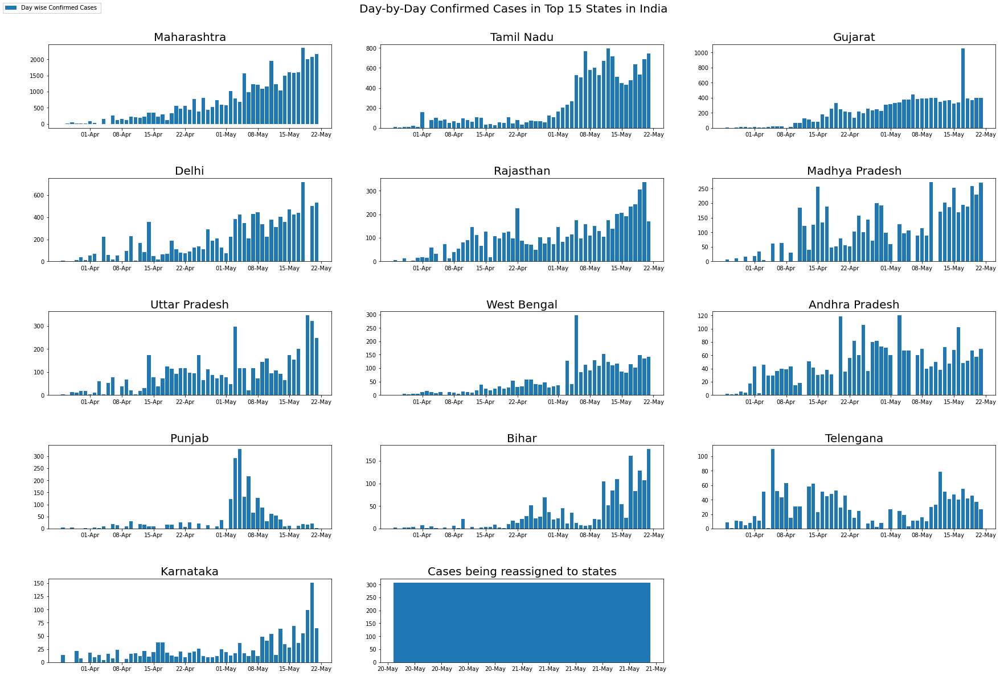


### Growth Rate in top 15 States in India


```python
def calc_growthRate(values):
    k = []
    for i in range(1,len(values)):
        summ = 0
        for j in range(i):
            summ = summ + values[j]
        rate = (values[i]/summ)*100
        k.append(int(rate))
    return k

fig = plt.figure(figsize= (25,17))
plt.suptitle('Growth Rate in Top 15 States',fontsize = 20,y=1.0)
k=0
for i in range(1,15):
    ax = fig.add_subplot(5,3,i)
    ax.xaxis.set_major_formatter(mdates.DateFormatter('%d-%b'))
    #ax.bar(states_dates[states[k]],states_confirmed[states[k]],label = 'Day wise Confirmed Cases ') 
    growth_rate = calc_growthRate(states_confirmed[states[k]])
    ax.plot_date(states_dates[states[k]][21:],growth_rate[20:],color = '#9370db',label = 'Growth Rate',linewidth =3,linestyle='-')  
    plt.title(states[k],fontsize = 20)
    handles, labels = ax.get_legend_handles_labels()
    fig.legend(handles, labels, loc='upper left')
    k=k+1
plt.tight_layout(pad=3.0)
```


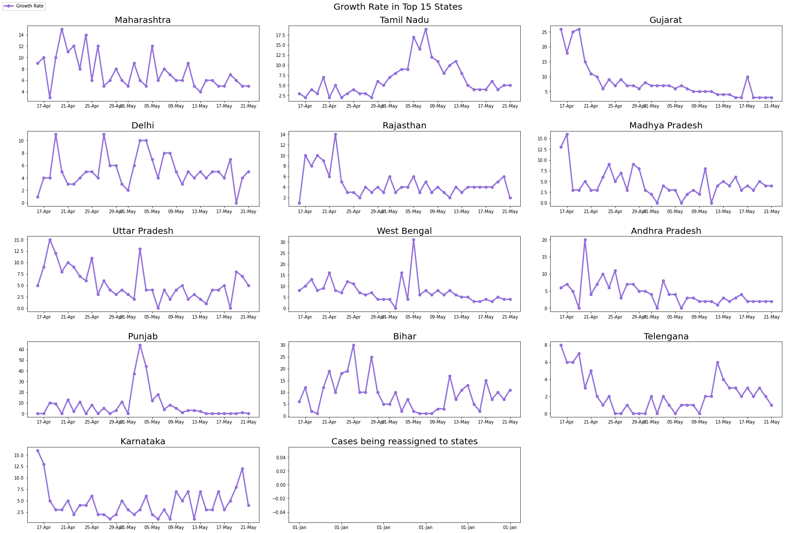


Though being highly populated the relative confimred cases of India is low compared to other countries. This could be because of two reasons:
- 67 days lockdown imposed by prime minister Narendra Modi in several stages (Source : [Health Ministry](http://www.indiatoday.in/india/story/without-lockdown-india-would-have-2-lakh-covid-19-cases-by-now-health-ministry-1665903-2020-04-11))
- Low testing rate (Source: [news18](https://www.news18.com/news/india/with-just-18-tests-per-million-of-population-why-indias-low-testing-rate-for-coronavirus-is-worrying-2552845.html))

## Exploring different types of hospital beds available in India during lockdown


```python
cols_object = list(hospital_beds.columns[2:8])

for cols in cols_object:
    hospital_beds[cols] = hospital_beds[cols].astype(int,errors = 'ignore')

hospital_beds = hospital_beds.drop('Sno',axis=1)
```


```python
hospital_beds.head(36)
```


<div>
<style scoped>
    .dataframe tbody tr th:only-of-type {
        vertical-align: middle;
    }

    .dataframe tbody tr th {
        vertical-align: top;
    }

    .dataframe thead th {
        text-align: right;
    }
</style>
<table border="1" class="dataframe">
  <thead>
    <tr style="text-align: right;">
      <th></th>
      <th>State/UT</th>
      <th>NumPrimaryHealthCenters_HMIS</th>
      <th>NumCommunityHealthCenters_HMIS</th>
      <th>NumSubDistrictHospitals_HMIS</th>
      <th>NumDistrictHospitals_HMIS</th>
      <th>TotalPublicHealthFacilities_HMIS</th>
      <th>NumPublicBeds_HMIS</th>
      <th>NumRuralHospitals_NHP18</th>
      <th>NumRuralBeds_NHP18</th>
      <th>NumUrbanHospitals_NHP18</th>
      <th>NumUrbanBeds_NHP18</th>
    </tr>
  </thead>
  <tbody>
    <tr>
      <th>0</th>
      <td>Andaman &amp; Nicobar Islands</td>
      <td>27</td>
      <td>4</td>
      <td>NaN</td>
      <td>3</td>
      <td>34</td>
      <td>1246</td>
      <td>27</td>
      <td>575</td>
      <td>3</td>
      <td>500</td>
    </tr>
    <tr>
      <th>1</th>
      <td>Andhra Pradesh</td>
      <td>1417</td>
      <td>198</td>
      <td>31.0</td>
      <td>20</td>
      <td>1666</td>
      <td>60799</td>
      <td>193</td>
      <td>6480</td>
      <td>65</td>
      <td>16658</td>
    </tr>
    <tr>
      <th>2</th>
      <td>Arunachal Pradesh</td>
      <td>122</td>
      <td>62</td>
      <td>NaN</td>
      <td>15</td>
      <td>199</td>
      <td>2320</td>
      <td>208</td>
      <td>2136</td>
      <td>10</td>
      <td>268</td>
    </tr>
    <tr>
      <th>3</th>
      <td>Assam</td>
      <td>1007</td>
      <td>166</td>
      <td>14.0</td>
      <td>33</td>
      <td>1220</td>
      <td>19115</td>
      <td>1176</td>
      <td>10944</td>
      <td>50</td>
      <td>6198</td>
    </tr>
    <tr>
      <th>4</th>
      <td>Bihar</td>
      <td>2007</td>
      <td>63</td>
      <td>33.0</td>
      <td>43</td>
      <td>2146</td>
      <td>17796</td>
      <td>930</td>
      <td>6083</td>
      <td>103</td>
      <td>5936</td>
    </tr>
    <tr>
      <th>5</th>
      <td>Chandigarh</td>
      <td>40</td>
      <td>2</td>
      <td>1.0</td>
      <td>4</td>
      <td>47</td>
      <td>3756</td>
      <td>0</td>
      <td>0</td>
      <td>4</td>
      <td>778</td>
    </tr>
    <tr>
      <th>6</th>
      <td>Chhattisgarh</td>
      <td>813</td>
      <td>166</td>
      <td>12.0</td>
      <td>32</td>
      <td>1023</td>
      <td>14354</td>
      <td>169</td>
      <td>5070</td>
      <td>45</td>
      <td>4342</td>
    </tr>
    <tr>
      <th>7</th>
      <td>Dadra &amp; Nagar Haveli</td>
      <td>9</td>
      <td>2</td>
      <td>1.0</td>
      <td>1</td>
      <td>13</td>
      <td>568</td>
      <td>10</td>
      <td>273</td>
      <td>1</td>
      <td>316</td>
    </tr>
    <tr>
      <th>8</th>
      <td>Daman &amp; Diu</td>
      <td>4</td>
      <td>2</td>
      <td>NaN</td>
      <td>2</td>
      <td>8</td>
      <td>298</td>
      <td>5</td>
      <td>240</td>
      <td>0</td>
      <td>0</td>
    </tr>
    <tr>
      <th>9</th>
      <td>Delhi</td>
      <td>534</td>
      <td>25</td>
      <td>9.0</td>
      <td>47</td>
      <td>615</td>
      <td>20572</td>
      <td>0</td>
      <td>0</td>
      <td>109</td>
      <td>24383</td>
    </tr>
    <tr>
      <th>10</th>
      <td>Goa</td>
      <td>31</td>
      <td>4</td>
      <td>2.0</td>
      <td>3</td>
      <td>40</td>
      <td>2666</td>
      <td>17</td>
      <td>1405</td>
      <td>25</td>
      <td>1608</td>
    </tr>
    <tr>
      <th>11</th>
      <td>Gujarat</td>
      <td>1770</td>
      <td>385</td>
      <td>44.0</td>
      <td>37</td>
      <td>2236</td>
      <td>41129</td>
      <td>364</td>
      <td>11715</td>
      <td>122</td>
      <td>20565</td>
    </tr>
    <tr>
      <th>12</th>
      <td>Haryana</td>
      <td>500</td>
      <td>131</td>
      <td>24.0</td>
      <td>28</td>
      <td>683</td>
      <td>13841</td>
      <td>609</td>
      <td>6690</td>
      <td>59</td>
      <td>4550</td>
    </tr>
    <tr>
      <th>13</th>
      <td>Himachal Pradesh</td>
      <td>516</td>
      <td>79</td>
      <td>61.0</td>
      <td>15</td>
      <td>671</td>
      <td>8706</td>
      <td>705</td>
      <td>5665</td>
      <td>96</td>
      <td>6734</td>
    </tr>
    <tr>
      <th>14</th>
      <td>Jammu &amp; Kashmir</td>
      <td>702</td>
      <td>87</td>
      <td>NaN</td>
      <td>29</td>
      <td>818</td>
      <td>11342</td>
      <td>56</td>
      <td>7234</td>
      <td>76</td>
      <td>4417</td>
    </tr>
    <tr>
      <th>15</th>
      <td>Jharkhand</td>
      <td>343</td>
      <td>179</td>
      <td>13.0</td>
      <td>23</td>
      <td>558</td>
      <td>7404</td>
      <td>519</td>
      <td>5842</td>
      <td>36</td>
      <td>4942</td>
    </tr>
    <tr>
      <th>16</th>
      <td>Karnataka</td>
      <td>2547</td>
      <td>207</td>
      <td>147.0</td>
      <td>42</td>
      <td>2943</td>
      <td>56333</td>
      <td>2471</td>
      <td>21072</td>
      <td>374</td>
      <td>49093</td>
    </tr>
    <tr>
      <th>17</th>
      <td>Kerala</td>
      <td>933</td>
      <td>229</td>
      <td>82.0</td>
      <td>53</td>
      <td>1297</td>
      <td>39511</td>
      <td>981</td>
      <td>16865</td>
      <td>299</td>
      <td>21139</td>
    </tr>
    <tr>
      <th>18</th>
      <td>Lakshadweep</td>
      <td>4</td>
      <td>3</td>
      <td>2.0</td>
      <td>1</td>
      <td>10</td>
      <td>250</td>
      <td>9</td>
      <td>300</td>
      <td>0</td>
      <td>0</td>
    </tr>
    <tr>
      <th>19</th>
      <td>Madhya Pradesh</td>
      <td>1420</td>
      <td>324</td>
      <td>72.0</td>
      <td>51</td>
      <td>1867</td>
      <td>38140</td>
      <td>334</td>
      <td>10020</td>
      <td>117</td>
      <td>18819</td>
    </tr>
    <tr>
      <th>20</th>
      <td>Maharashtra</td>
      <td>2638</td>
      <td>430</td>
      <td>101.0</td>
      <td>70</td>
      <td>3239</td>
      <td>68998</td>
      <td>273</td>
      <td>12398</td>
      <td>438</td>
      <td>39048</td>
    </tr>
    <tr>
      <th>21</th>
      <td>Manipur</td>
      <td>87</td>
      <td>17</td>
      <td>1.0</td>
      <td>9</td>
      <td>114</td>
      <td>2562</td>
      <td>23</td>
      <td>730</td>
      <td>7</td>
      <td>697</td>
    </tr>
    <tr>
      <th>22</th>
      <td>Meghalaya</td>
      <td>138</td>
      <td>29</td>
      <td>NaN</td>
      <td>13</td>
      <td>180</td>
      <td>4585</td>
      <td>143</td>
      <td>1970</td>
      <td>14</td>
      <td>2487</td>
    </tr>
    <tr>
      <th>23</th>
      <td>Mizoram</td>
      <td>65</td>
      <td>10</td>
      <td>3.0</td>
      <td>9</td>
      <td>87</td>
      <td>2312</td>
      <td>56</td>
      <td>604</td>
      <td>34</td>
      <td>1393</td>
    </tr>
    <tr>
      <th>24</th>
      <td>Nagaland</td>
      <td>134</td>
      <td>21</td>
      <td>NaN</td>
      <td>11</td>
      <td>166</td>
      <td>1944</td>
      <td>21</td>
      <td>630</td>
      <td>15</td>
      <td>1250</td>
    </tr>
    <tr>
      <th>25</th>
      <td>Odisha</td>
      <td>1360</td>
      <td>377</td>
      <td>27.0</td>
      <td>35</td>
      <td>1799</td>
      <td>16497</td>
      <td>1655</td>
      <td>6339</td>
      <td>149</td>
      <td>12180</td>
    </tr>
    <tr>
      <th>26</th>
      <td>Puducherry</td>
      <td>40</td>
      <td>4</td>
      <td>5.0</td>
      <td>4</td>
      <td>53</td>
      <td>4462</td>
      <td>3</td>
      <td>96</td>
      <td>11</td>
      <td>3473</td>
    </tr>
    <tr>
      <th>27</th>
      <td>Punjab</td>
      <td>521</td>
      <td>146</td>
      <td>47.0</td>
      <td>28</td>
      <td>742</td>
      <td>13527</td>
      <td>510</td>
      <td>5805</td>
      <td>172</td>
      <td>12128</td>
    </tr>
    <tr>
      <th>28</th>
      <td>Rajasthan</td>
      <td>2463</td>
      <td>579</td>
      <td>64.0</td>
      <td>33</td>
      <td>3139</td>
      <td>51844</td>
      <td>602</td>
      <td>21088</td>
      <td>150</td>
      <td>10760</td>
    </tr>
    <tr>
      <th>29</th>
      <td>Sikkim</td>
      <td>25</td>
      <td>2</td>
      <td>1.0</td>
      <td>4</td>
      <td>32</td>
      <td>1145</td>
      <td>24</td>
      <td>260</td>
      <td>9</td>
      <td>1300</td>
    </tr>
    <tr>
      <th>30</th>
      <td>Tamil Nadu</td>
      <td>1854</td>
      <td>385</td>
      <td>310.0</td>
      <td>32</td>
      <td>2581</td>
      <td>72616</td>
      <td>692</td>
      <td>40179</td>
      <td>525</td>
      <td>37353</td>
    </tr>
    <tr>
      <th>31</th>
      <td>Telangana</td>
      <td>788</td>
      <td>82</td>
      <td>47.0</td>
      <td>15</td>
      <td>932</td>
      <td>17358</td>
      <td>802</td>
      <td>7668</td>
      <td>61</td>
      <td>13315</td>
    </tr>
    <tr>
      <th>32</th>
      <td>Tripura</td>
      <td>114</td>
      <td>22</td>
      <td>12.0</td>
      <td>9</td>
      <td>157</td>
      <td>4895</td>
      <td>99</td>
      <td>1140</td>
      <td>56</td>
      <td>3277</td>
    </tr>
    <tr>
      <th>33</th>
      <td>Uttar Pradesh</td>
      <td>3277</td>
      <td>671</td>
      <td>NaN</td>
      <td>174</td>
      <td>4122</td>
      <td>58310</td>
      <td>4442</td>
      <td>39104</td>
      <td>193</td>
      <td>37156</td>
    </tr>
    <tr>
      <th>34</th>
      <td>Uttarakhand</td>
      <td>275</td>
      <td>69</td>
      <td>19.0</td>
      <td>20</td>
      <td>383</td>
      <td>6660</td>
      <td>410</td>
      <td>3284</td>
      <td>50</td>
      <td>5228</td>
    </tr>
    <tr>
      <th>35</th>
      <td>West Bengal</td>
      <td>1374</td>
      <td>406</td>
      <td>70.0</td>
      <td>55</td>
      <td>1905</td>
      <td>51163</td>
      <td>1272</td>
      <td>19684</td>
      <td>294</td>
      <td>58882</td>
    </tr>
  </tbody>
</table>
</div>


## Exploring top 10 States in each health facilities


```python
# top_10_primary = hospital_beds.nlargest(10,'NumPrimaryHealthCenters_HMIS')
top_10_community = hospital_beds.nlargest(10,'NumCommunityHealthCenters_HMIS')
top_10_district_hospitals = hospital_beds.nlargest(10,'NumDistrictHospitals_HMIS')
top_10_public_facility = hospital_beds.nlargest(10,'TotalPublicHealthFacilities_HMIS')
top_10_public_beds = hospital_beds.nlargest(10,'NumPublicBeds_HMIS')

plt.subplot(222)
plt.title('Community Health Centers')
plt.barh(top_10_community['State/UT'],top_10_community['NumCommunityHealthCenters_HMIS'],color = '#9370db');

plt.subplot(224)
plt.title('Total Public Health Facilities')
plt.barh(top_10_community['State/UT'],top_10_public_facility['TotalPublicHealthFacilities_HMIS'],color='#9370db');

plt.subplot(223)
plt.title('District Hospitals')
plt.barh(top_10_community['State/UT'],top_10_district_hospitals['NumDistrictHospitals_HMIS'],color = '#87479d');
```


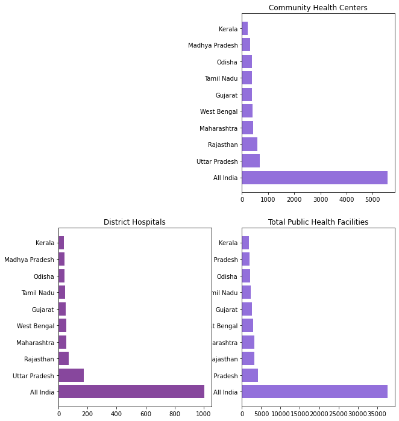


## Exploring Urban and Rural Healthcare Facility


```python
top_rural_hos = hospital_beds.nlargest(10,'NumRuralHospitals_NHP18')
top_rural_beds = hospital_beds.nlargest(10,'NumRuralBeds_NHP18')
top_urban_hos = hospital_beds.nlargest(10,'NumUrbanHospitals_NHP18')
top_urban_beds = hospital_beds.nlargest(10,'NumUrbanBeds_NHP18')

plt.figure(figsize=(15,10))
plt.suptitle('Urban and Rural Health Facility',fontsize=20)
plt.subplot(221)
plt.title('Rural Hospitals')
plt.barh(top_rural_hos['State/UT'],top_rural_hos['NumRuralHospitals_NHP18'],color = '#87479d');

plt.subplot(222)
plt.title('Urban Hospitals')
plt.barh(top_urban_hos['State/UT'],top_urban_hos['NumUrbanHospitals_NHP18'],color = '#9370db');

plt.subplot(223)
plt.title('Rural Beds')
plt.barh(top_rural_beds['State/UT'],top_rural_beds['NumRuralBeds_NHP18'],color = '#87479d');

plt.subplot(224)
plt.title('Urban Beds')
plt.barh(top_urban_beds['State/UT'],top_urban_beds['NumUrbanBeds_NHP18'],color = '#9370db');
```


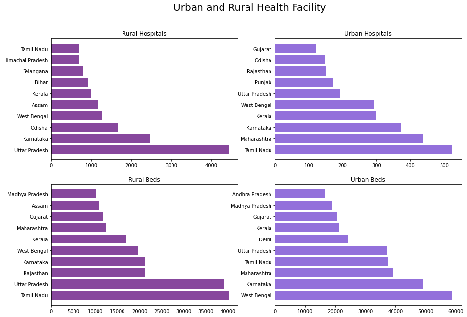


## Exploring Statewise Testing Insights


```python
state_test = pd.pivot_table(state_testing, values=['TotalSamples','Negative','Positive'], index='State', aggfunc='max')
state_names = list(state_test.index)
state_test['State'] = state_names

plt.figure(figsize=(25,20))
sns.set_color_codes("pastel")
sns.barplot(x="TotalSamples", y= state_names, data=state_test,label="Total Samples", color = '#7370db')
sns.barplot(x='Negative', y=state_names, data=state_test,label='Negative', color= '#af8887')
sns.barplot(x='Positive', y=state_names, data=state_test,label='Positive', color='#6ff79d')
plt.title('Testing statewise insight',fontsize = 20)
plt.legend(ncol=2, loc="lower right", frameon=True);
```


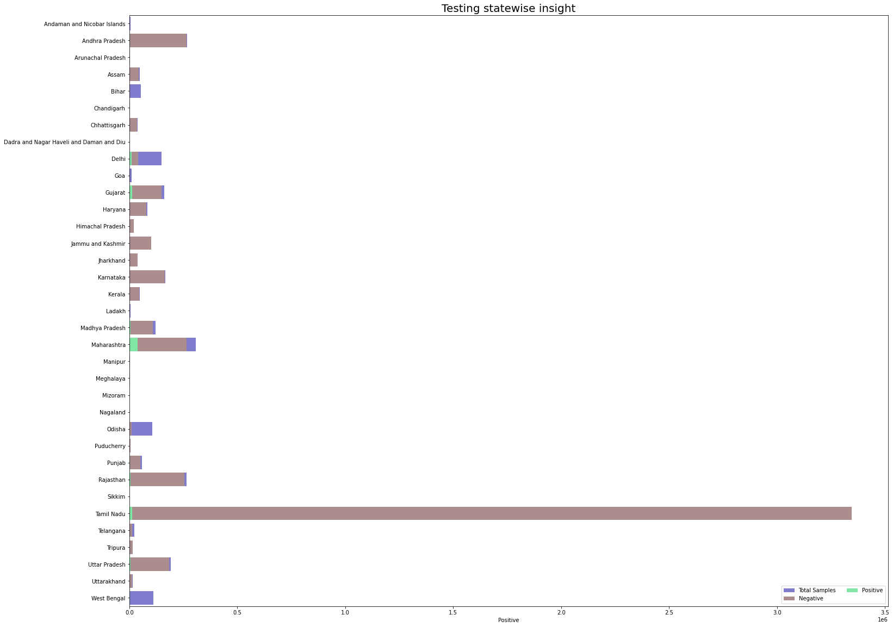


## Number of ICMR Testing Centres in each state


```python
values = list(ICMR_labs['state'].value_counts())
names = list(ICMR_labs['state'].value_counts().index)

plt.figure(figsize=(15,10))
sns.set_color_codes("pastel")
plt.title('ICMR Testing Centers in each State', fontsize = 20)
sns.barplot(x= values, y= names,color = '#ff2345');
```


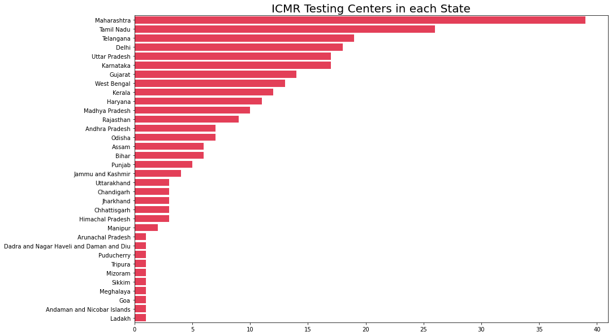


## Let's Start with the predictions


```python
train = pd.read_csv('/content/train.csv')
test = pd.read_csv('/content/test.csv')
train['Date'] = pd.to_datetime(train['Date'])
test['Date'] = pd.to_datetime(test['Date'])
```


## Prophet
Prophet is open source software released by Facebook’s Core Data Science team. It is available for download on CRAN and PyPI.

We use Prophet, a procedure for forecasting time series data based on an additive model where non-linear trends are fit with yearly, weekly, and daily seasonality, plus holiday effects. It works best with time series that have strong seasonal effects and several seasons of historical data. Prophet is robust to missing data and shifts in the trend, and typically handles outliers well. 

## Why Prophet?

* **Accurate and fast:**  Prophet is used in many applications across Facebook for producing reliable forecasts for planning and goal setting. Facebook finds it to perform better than any other approach in the majority of cases. It fit models in [Stan](https://mc-stan.org/) so that you get forecasts in just a few seconds.

* **Fully automatic:** Get a reasonable forecast on messy data with no manual effort. Prophet is robust to outliers, missing data, and dramatic changes in your time series.

* **Tunable forecasts:** The Prophet procedure includes many possibilities for users to tweak and adjust forecasts. You can use human-interpretable parameters to improve your forecast by adding your domain knowledge

* **Available in R or Python:** Facebook has implemented the Prophet procedure in R and Python. Both of them share the same underlying Stan code for fitting. You can use whatever language you’re comfortable with to get forecasts. 


## References 
- https://facebook.github.io/prophet/
- https://facebook.github.io/prophet/docs/
- https://github.com/facebook/prophet
- https://facebook.github.io/prophet/docs/quick_start.html


```python
!pip install Prophet
```

    Collecting Prophet
      Downloading prophet-0.1.1.post1.tar.gz (90 kB)
    Requirement already satisfied: pytz>=2014.9 in c:\users\raghav\anaconda3\lib\site-packages (from Prophet) (2020.1)
    Requirement already satisfied: pandas>=0.15.1 in c:\users\raghav\anaconda3\lib\site-packages (from Prophet) (1.0.4)
    Requirement already satisfied: six>=1.8.0 in c:\users\raghav\anaconda3\lib\site-packages (from Prophet) (1.15.0)
    Requirement already satisfied: python-dateutil>=2.6.1 in c:\users\raghav\anaconda3\lib\site-packages (from pandas>=0.15.1->Prophet) (2.8.1)
    Requirement already satisfied: numpy>=1.13.3 in c:\users\raghav\anaconda3\lib\site-packages (from pandas>=0.15.1->Prophet) (1.19.1)
    Building wheels for collected packages: Prophet
      Building wheel for Prophet (setup.py): started
      Building wheel for Prophet (setup.py): finished with status 'done'
      Created wheel for Prophet: filename=prophet-0.1.1.post1-py3-none-any.whl size=13254 sha256=ba625745471e8c2acffc86c1c928c450f8274af8233d264d6f65a0cd31fff95f
      Stored in directory: c:\users\raghav\appdata\local\pip\cache\wheels\98\36\19\702df5440d2cf01c8221d08fb26bfe66e872100e7bfd75bb8f
    Successfully built Prophet
    Installing collected packages: Prophet
    Successfully installed Prophet-0.1.1.post1
    


```python
# !pip install pystan
# !pip install fbprophet

!conda install -c conda-forge fbprophet
```


```python
from fbprophet import Prophet
from fbprophet.plot import plot_plotly, add_changepoints_to_plot

k = df1[df1['Country/Region']=='India'].loc[:,'1/22/20':]
india_confirmed = k.values.tolist()[0] 
data = pd.DataFrame(columns = ['ds','y'])
data['ds'] = dates
data['y'] = india_confirmed
```

The input to Prophet is always a dataframe with two columns: **ds** and **y**. The **ds (datestamp)** column should be of a format expected by Pandas, ideally YYYY-MM-DD for a date or YYYY-MM-DD HH:MM:SS for a timestamp. The y column must be numeric, and represents the measurement we wish to forecast.


## 4.1 Forecasting Confirmed NCOVID-19 Cases Worldwide with Prophet (Base model)

Generating a week ahead forecast of confirmed cases of NCOVID-19 using Prophet, with 95% prediction interval by creating a base model with no tweaking of seasonality-related parameters and additional regressors.


```python
prop = Prophet(interval_width=0.95)
prop.fit(data)
future = prop.make_future_dataframe(periods=15)
future.tail(15)
```

    INFO:fbprophet:Disabling yearly seasonality. Run prophet with yearly_seasonality=True to override this.
    INFO:fbprophet:Disabling daily seasonality. Run prophet with daily_seasonality=True to override this.
    


<div>
<style scoped>
    .dataframe tbody tr th:only-of-type {
        vertical-align: middle;
    }

    .dataframe tbody tr th {
        vertical-align: top;
    }

    .dataframe thead th {
        text-align: right;
    }
</style>
<table border="1" class="dataframe">
  <thead>
    <tr style="text-align: right;">
      <th></th>
      <th>ds</th>
    </tr>
  </thead>
  <tbody>
    <tr>
      <th>253</th>
      <td>2020-10-01</td>
    </tr>
    <tr>
      <th>254</th>
      <td>2020-10-02</td>
    </tr>
    <tr>
      <th>255</th>
      <td>2020-10-03</td>
    </tr>
    <tr>
      <th>256</th>
      <td>2020-10-04</td>
    </tr>
    <tr>
      <th>257</th>
      <td>2020-10-05</td>
    </tr>
    <tr>
      <th>258</th>
      <td>2020-10-06</td>
    </tr>
    <tr>
      <th>259</th>
      <td>2020-10-07</td>
    </tr>
    <tr>
      <th>260</th>
      <td>2020-10-08</td>
    </tr>
    <tr>
      <th>261</th>
      <td>2020-10-09</td>
    </tr>
    <tr>
      <th>262</th>
      <td>2020-10-10</td>
    </tr>
    <tr>
      <th>263</th>
      <td>2020-10-11</td>
    </tr>
    <tr>
      <th>264</th>
      <td>2020-10-12</td>
    </tr>
    <tr>
      <th>265</th>
      <td>2020-10-13</td>
    </tr>
    <tr>
      <th>266</th>
      <td>2020-10-14</td>
    </tr>
    <tr>
      <th>267</th>
      <td>2020-10-15</td>
    </tr>
  </tbody>
</table>
</div>


The **predict** method will assign each row in future a predicted value which it names **yhat**. If you pass in historical dates, it will provide an in-sample fit. The **forecast object** here is a new dataframe that includes a column yhat with the forecast, as well as columns for components and uncertainty intervals.


```python
#predicting the future with date, and upper and lower limit of y value
forecast = prop.predict(future)
forecast[['ds', 'yhat', 'yhat_lower', 'yhat_upper']].tail()
```


<div>
<style scoped>
    .dataframe tbody tr th:only-of-type {
        vertical-align: middle;
    }

    .dataframe tbody tr th {
        vertical-align: top;
    }

    .dataframe thead th {
        text-align: right;
    }
</style>
<table border="1" class="dataframe">
  <thead>
    <tr style="text-align: right;">
      <th></th>
      <th>ds</th>
      <th>yhat</th>
      <th>yhat_lower</th>
      <th>yhat_upper</th>
    </tr>
  </thead>
  <tbody>
    <tr>
      <th>263</th>
      <td>2020-10-11</td>
      <td>7.100590e+06</td>
      <td>7.006306e+06</td>
      <td>7.195882e+06</td>
    </tr>
    <tr>
      <th>264</th>
      <td>2020-10-12</td>
      <td>7.178642e+06</td>
      <td>7.074952e+06</td>
      <td>7.289030e+06</td>
    </tr>
    <tr>
      <th>265</th>
      <td>2020-10-13</td>
      <td>7.257725e+06</td>
      <td>7.147775e+06</td>
      <td>7.366396e+06</td>
    </tr>
    <tr>
      <th>266</th>
      <td>2020-10-14</td>
      <td>7.336894e+06</td>
      <td>7.217428e+06</td>
      <td>7.455318e+06</td>
    </tr>
    <tr>
      <th>267</th>
      <td>2020-10-15</td>
      <td>7.417946e+06</td>
      <td>7.301104e+06</td>
      <td>7.551448e+06</td>
    </tr>
  </tbody>
</table>
</div>


You can plot the forecast by calling the Prophet.plot method and passing in your forecast dataframe.


```python
confirmed_forecast_plot = prop.plot(forecast)
```


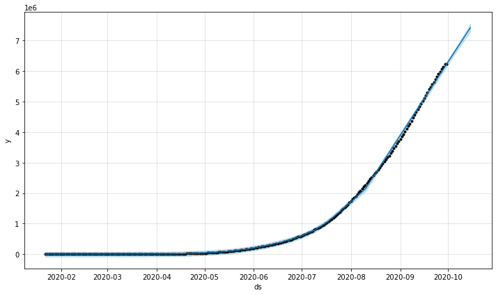


```python
confirmed_forecast_plot =prop.plot_components(forecast)
```


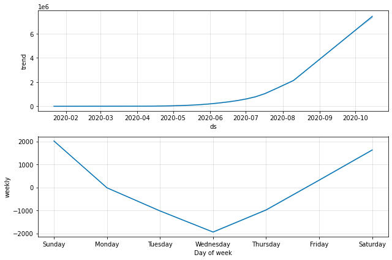


## ARIMA Model


```python
from statsmodels.tsa.arima_model import ARIMA

from datetime import timedelta 

arima = ARIMA(data['y'], order=(5, 1, 0))
arima = arima.fit(trend='c', full_output=True, disp=True)
forecast = arima.forecast(steps= 30)
pred = list(forecast[0])

start_date = data['ds'].max()
prediction_dates = []
for i in range(30):
    date = start_date + timedelta(days=1)
    prediction_dates.append(date)
    start_date = date
plt.figure(figsize= (15,10))
plt.xlabel("Dates",fontsize = 20)
plt.ylabel('Total cases',fontsize = 20)
plt.title("Predicted Values for the next 15 Days" , fontsize = 20)

plt.plot_date(y= pred,x= prediction_dates,linestyle ='dashed',color = '#ff9999',label = 'Predicted');
plt.plot_date(y=data['y'],x=data['ds'],linestyle = '-',color = 'blue',label = 'Actual');
plt.legend();
```


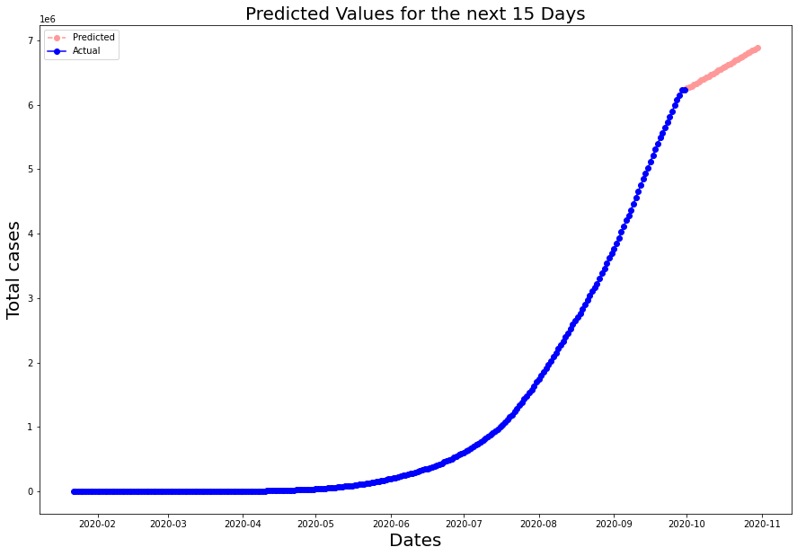


## 1.4 Visualising the spread geographically


```python
# df_India.head()
df = df_India.dropna(subset = ["Latitude","Longitude"], inplace=True)
```


```python
# Learn how to use folium to create a zoomable map
map = folium.Map(location=[20, 70], zoom_start=4,tiles='Stamenterrain')

for lat, lon, value, name in zip(df_India['Latitude'], df_India['Longitude'], df_India['Confirmed'], df_India['State/UnionTerritory']):
    folium.CircleMarker([lat, lon], radius=value*0.002, popup = ('<strong>State</strong>: ' + str(name).capitalize() + '<br>''<strong>Total Cases</strong>: ' + str(value) + '<br>'),color='red',fill_color='red',fill_opacity=0.09 ).add_to(map)
map
```


<div style="width:100%;"><div style="position:relative;width:100%;height:0;padding-bottom:60%;"><span style="color:#565656">Make this Notebook Trusted to load map: File -> Trust Notebook</span><iframe src="about:blank" style="position:absolute;width:100%;height:100%;left:0;top:0;border:none !important;" data-html=PCFET0NUWVBFIGh0bWw+CjxoZWFkPiAgICAKICAgIDxtZXRhIGh0dHAtZXF1aXY9ImNvbnRlbnQtdHlwZSIgY29udGVudD0idGV4dC9odG1sOyBjaGFyc2V0PVVURi04IiAvPgogICAgCiAgICAgICAgPHNjcmlwdD4KICAgICAgICAgICAgTF9OT19UT1VDSCA9IGZhbHNlOwogICAgICAgICAgICBMX0RJU0FCTEVfM0QgPSBmYWxzZTsKICAgICAgICA8L3NjcmlwdD4KICAgIAogICAgPHNjcmlwdCBzcmM9Imh0dHBzOi8vY2RuLmpzZGVsaXZyLm5ldC9ucG0vbGVhZmxldEAxLjYuMC9kaXN0L2xlYWZsZXQuanMiPjwvc2NyaXB0PgogICAgPHNjcmlwdCBzcmM9Imh0dHBzOi8vY29kZS5qcXVlcnkuY29tL2pxdWVyeS0xLjEyLjQubWluLmpzIj48L3NjcmlwdD4KICAgIDxzY3JpcHQgc3JjPSJodHRwczovL21heGNkbi5ib290c3RyYXBjZG4uY29tL2Jvb3RzdHJhcC8zLjIuMC9qcy9ib290c3RyYXAubWluLmpzIj48L3NjcmlwdD4KICAgIDxzY3JpcHQgc3JjPSJodHRwczovL2NkbmpzLmNsb3VkZmxhcmUuY29tL2FqYXgvbGlicy9MZWFmbGV0LmF3ZXNvbWUtbWFya2Vycy8yLjAuMi9sZWFmbGV0LmF3ZXNvbWUtbWFya2Vycy5qcyI+PC9zY3JpcHQ+CiAgICA8bGluayByZWw9InN0eWxlc2hlZXQiIGhyZWY9Imh0dHBzOi8vY2RuLmpzZGVsaXZyLm5ldC9ucG0vbGVhZmxldEAxLjYuMC9kaXN0L2xlYWZsZXQuY3NzIi8+CiAgICA8bGluayByZWw9InN0eWxlc2hlZXQiIGhyZWY9Imh0dHBzOi8vbWF4Y2RuLmJvb3RzdHJhcGNkbi5jb20vYm9vdHN0cmFwLzMuMi4wL2Nzcy9ib290c3RyYXAubWluLmNzcyIvPgogICAgPGxpbmsgcmVsPSJzdHlsZXNoZWV0IiBocmVmPSJodHRwczovL21heGNkbi5ib290c3RyYXBjZG4uY29tL2Jvb3RzdHJhcC8zLjIuMC9jc3MvYm9vdHN0cmFwLXRoZW1lLm1pbi5jc3MiLz4KICAgIDxsaW5rIHJlbD0ic3R5bGVzaGVldCIgaHJlZj0iaHR0cHM6Ly9tYXhjZG4uYm9vdHN0cmFwY2RuLmNvbS9mb250LWF3ZXNvbWUvNC42LjMvY3NzL2ZvbnQtYXdlc29tZS5taW4uY3NzIi8+CiAgICA8bGluayByZWw9InN0eWxlc2hlZXQiIGhyZWY9Imh0dHBzOi8vY2RuanMuY2xvdWRmbGFyZS5jb20vYWpheC9saWJzL0xlYWZsZXQuYXdlc29tZS1tYXJrZXJzLzIuMC4yL2xlYWZsZXQuYXdlc29tZS1tYXJrZXJzLmNzcyIvPgogICAgPGxpbmsgcmVsPSJzdHlsZXNoZWV0IiBocmVmPSJodHRwczovL3Jhd2Nkbi5naXRoYWNrLmNvbS9weXRob24tdmlzdWFsaXphdGlvbi9mb2xpdW0vbWFzdGVyL2ZvbGl1bS90ZW1wbGF0ZXMvbGVhZmxldC5hd2Vzb21lLnJvdGF0ZS5jc3MiLz4KICAgIDxzdHlsZT5odG1sLCBib2R5IHt3aWR0aDogMTAwJTtoZWlnaHQ6IDEwMCU7bWFyZ2luOiAwO3BhZGRpbmc6IDA7fTwvc3R5bGU+CiAgICA8c3R5bGU+I21hcCB7cG9zaXRpb246YWJzb2x1dGU7dG9wOjA7Ym90dG9tOjA7cmlnaHQ6MDtsZWZ0OjA7fTwvc3R5bGU+CiAgICAKICAgICAgICAgICAgPG1ldGEgbmFtZT0idmlld3BvcnQiIGNvbnRlbnQ9IndpZHRoPWRldmljZS13aWR0aCwKICAgICAgICAgICAgICAgIGluaXRpYWwtc2NhbGU9MS4wLCBtYXhpbXVtLXNjYWxlPTEuMCwgdXNlci1zY2FsYWJsZT1ubyIgLz4KICAgICAgICAgICAgPHN0eWxlPgogICAgICAgICAgICAgICAgI21hcF9kYzA4MmUyOGM1NGQ0N2FiYjQ1ZDNiNDE4NTM0Njg0YSB7CiAgICAgICAgICAgICAgICAgICAgcG9zaXRpb246IHJlbGF0aXZlOwogICAgICAgICAgICAgICAgICAgIHdpZHRoOiAxMDAuMCU7CiAgICAgICAgICAgICAgICAgICAgaGVpZ2h0OiAxMDAuMCU7CiAgICAgICAgICAgICAgICAgICAgbGVmdDogMC4wJTsKICAgICAgICAgICAgICAgICAgICB0b3A6IDAuMCU7CiAgICAgICAgICAgICAgICB9CiAgICAgICAgICAgIDwvc3R5bGU+CiAgICAgICAgCjwvaGVhZD4KPGJvZHk+ICAgIAogICAgCiAgICAgICAgICAgIDxkaXYgY2xhc3M9ImZvbGl1bS1tYXAiIGlkPSJtYXBfZGMwODJlMjhjNTRkNDdhYmI0NWQzYjQxODUzNDY4NGEiID48L2Rpdj4KICAgICAgICAKPC9ib2R5Pgo8c2NyaXB0PiAgICAKICAgIAogICAgICAgICAgICB2YXIgbWFwX2RjMDgyZTI4YzU0ZDQ3YWJiNDVkM2I0MTg1MzQ2ODRhID0gTC5tYXAoCiAgICAgICAgICAgICAgICAibWFwX2RjMDgyZTI4YzU0ZDQ3YWJiNDVkM2I0MTg1MzQ2ODRhIiwKICAgICAgICAgICAgICAgIHsKICAgICAgICAgICAgICAgICAgICBjZW50ZXI6IFsyMC4wLCA3MC4wXSwKICAgICAgICAgICAgICAgICAgICBjcnM6IEwuQ1JTLkVQU0czODU3LAogICAgICAgICAgICAgICAgICAgIHpvb206IDQsCiAgICAgICAgICAgICAgICAgICAgem9vbUNvbnRyb2w6IHRydWUsCiAgICAgICAgICAgICAgICAgICAgcHJlZmVyQ2FudmFzOiBmYWxzZSwKICAgICAgICAgICAgICAgIH0KICAgICAgICAgICAgKTsKCiAgICAgICAgICAgIAoKICAgICAgICAKICAgIAogICAgICAgICAgICB2YXIgdGlsZV9sYXllcl84MTE5ZmNiNDA1MDM0YTc1YmEyOGE0MjY0MDFjZTkwNyA9IEwudGlsZUxheWVyKAogICAgICAgICAgICAgICAgImh0dHBzOi8vc3RhbWVuLXRpbGVzLXtzfS5hLnNzbC5mYXN0bHkubmV0L3RlcnJhaW4ve3p9L3t4fS97eX0uanBnIiwKICAgICAgICAgICAgICAgIHsiYXR0cmlidXRpb24iOiAiTWFwIHRpbGVzIGJ5IFx1MDAzY2EgaHJlZj1cImh0dHA6Ly9zdGFtZW4uY29tXCJcdTAwM2VTdGFtZW4gRGVzaWduXHUwMDNjL2FcdTAwM2UsIHVuZGVyIFx1MDAzY2EgaHJlZj1cImh0dHA6Ly9jcmVhdGl2ZWNvbW1vbnMub3JnL2xpY2Vuc2VzL2J5LzMuMFwiXHUwMDNlQ0MgQlkgMy4wXHUwMDNjL2FcdTAwM2UuIERhdGEgYnkgXHUwMDI2Y29weTsgXHUwMDNjYSBocmVmPVwiaHR0cDovL29wZW5zdHJlZXRtYXAub3JnXCJcdTAwM2VPcGVuU3RyZWV0TWFwXHUwMDNjL2FcdTAwM2UsIHVuZGVyIFx1MDAzY2EgaHJlZj1cImh0dHA6Ly9jcmVhdGl2ZWNvbW1vbnMub3JnL2xpY2Vuc2VzL2J5LXNhLzMuMFwiXHUwMDNlQ0MgQlkgU0FcdTAwM2MvYVx1MDAzZS4iLCAiZGV0ZWN0UmV0aW5hIjogZmFsc2UsICJtYXhOYXRpdmVab29tIjogMTgsICJtYXhab29tIjogMTgsICJtaW5ab29tIjogMCwgIm5vV3JhcCI6IGZhbHNlLCAib3BhY2l0eSI6IDEsICJzdWJkb21haW5zIjogImFiYyIsICJ0bXMiOiBmYWxzZX0KICAgICAgICAgICAgKS5hZGRUbyhtYXBfZGMwODJlMjhjNTRkNDdhYmI0NWQzYjQxODUzNDY4NGEpOwogICAgICAgIAogICAgCiAgICAgICAgICAgIHZhciBjaXJjbGVfbWFya2VyXzhiNTExNWU2YTczYzQ5MTg5NmZiYTQwYjU3NGVjOTEyID0gTC5jaXJjbGVNYXJrZXIoCiAgICAgICAgICAgICAgICBbMTkuNzUxNSwgNzUuNzEzOV0sCiAgICAgICAgICAgICAgICB7ImJ1YmJsaW5nTW91c2VFdmVudHMiOiB0cnVlLCAiY29sb3IiOiAicmVkIiwgImRhc2hBcnJheSI6IG51bGwsICJkYXNoT2Zmc2V0IjogbnVsbCwgImZpbGwiOiB0cnVlLCAiZmlsbENvbG9yIjogInJlZCIsICJmaWxsT3BhY2l0eSI6IDAuMDksICJmaWxsUnVsZSI6ICJldmVub2RkIiwgImxpbmVDYXAiOiAicm91bmQiLCAibGluZUpvaW4iOiAicm91bmQiLCAib3BhY2l0eSI6IDEuMCwgInJhZGl1cyI6IDI3NjguODkyMDAwMDAwMDAwMywgInN0cm9rZSI6IHRydWUsICJ3ZWlnaHQiOiAzfQogICAgICAgICAgICApLmFkZFRvKG1hcF9kYzA4MmUyOGM1NGQ0N2FiYjQ1ZDNiNDE4NTM0Njg0YSk7CiAgICAgICAgCiAgICAKICAgICAgICB2YXIgcG9wdXBfMDBiNWE2NTY3YTBhNGYyYzk0ZThiZWNkN2MxMWRhNmIgPSBMLnBvcHVwKHsibWF4V2lkdGgiOiAiMTAwJSJ9KTsKCiAgICAgICAgCiAgICAgICAgICAgIHZhciBodG1sX2NhZjQzMmYyNzY2YjRiNzU4MDQ2MjY3MmIxMjExMTI5ID0gJChgPGRpdiBpZD0iaHRtbF9jYWY0MzJmMjc2NmI0Yjc1ODA0NjI2NzJiMTIxMTEyOSIgc3R5bGU9IndpZHRoOiAxMDAuMCU7IGhlaWdodDogMTAwLjAlOyI+PHN0cm9uZz5TdGF0ZTwvc3Ryb25nPjogTWFoYXJhc2h0cmE8YnI+PHN0cm9uZz5Ub3RhbCBDYXNlczwvc3Ryb25nPjogMTM4NDQ0Njxicj48L2Rpdj5gKVswXTsKICAgICAgICAgICAgcG9wdXBfMDBiNWE2NTY3YTBhNGYyYzk0ZThiZWNkN2MxMWRhNmIuc2V0Q29udGVudChodG1sX2NhZjQzMmYyNzY2YjRiNzU4MDQ2MjY3MmIxMjExMTI5KTsKICAgICAgICAKCiAgICAgICAgY2lyY2xlX21hcmtlcl84YjUxMTVlNmE3M2M0OTE4OTZmYmE0MGI1NzRlYzkxMi5iaW5kUG9wdXAocG9wdXBfMDBiNWE2NTY3YTBhNGYyYzk0ZThiZWNkN2MxMWRhNmIpCiAgICAgICAgOwoKICAgICAgICAKICAgIAogICAgCiAgICAgICAgICAgIHZhciBjaXJjbGVfbWFya2VyX2NkMjQ2OTVhMGZlODQyZWE4NDY5NTExMzIyYjZlN2MxID0gTC5jaXJjbGVNYXJrZXIoCiAgICAgICAgICAgICAgICBbMTUuOTEyOSwgNzkuNzRdLAogICAgICAgICAgICAgICAgeyJidWJibGluZ01vdXNlRXZlbnRzIjogdHJ1ZSwgImNvbG9yIjogInJlZCIsICJkYXNoQXJyYXkiOiBudWxsLCAiZGFzaE9mZnNldCI6IG51bGwsICJmaWxsIjogdHJ1ZSwgImZpbGxDb2xvciI6ICJyZWQiLCAiZmlsbE9wYWNpdHkiOiAwLjA5LCAiZmlsbFJ1bGUiOiAiZXZlbm9kZCIsICJsaW5lQ2FwIjogInJvdW5kIiwgImxpbmVKb2luIjogInJvdW5kIiwgIm9wYWNpdHkiOiAxLjAsICJyYWRpdXMiOiAxMzg2Ljk2OCwgInN0cm9rZSI6IHRydWUsICJ3ZWlnaHQiOiAzfQogICAgICAgICAgICApLmFkZFRvKG1hcF9kYzA4MmUyOGM1NGQ0N2FiYjQ1ZDNiNDE4NTM0Njg0YSk7CiAgICAgICAgCiAgICAKICAgICAgICB2YXIgcG9wdXBfNzUwYzExODY5Njg1NDY3YmEyMmVkYjRhZmI5NmUzZWYgPSBMLnBvcHVwKHsibWF4V2lkdGgiOiAiMTAwJSJ9KTsKCiAgICAgICAgCiAgICAgICAgICAgIHZhciBodG1sX2I4NWE0YzMwZmU1NTQ4N2U4NGVlZmM1MWRlZGJlMGFiID0gJChgPGRpdiBpZD0iaHRtbF9iODVhNGMzMGZlNTU0ODdlODRlZWZjNTFkZWRiZTBhYiIgc3R5bGU9IndpZHRoOiAxMDAuMCU7IGhlaWdodDogMTAwLjAlOyI+PHN0cm9uZz5TdGF0ZTwvc3Ryb25nPjogQW5kaHJhIHByYWRlc2g8YnI+PHN0cm9uZz5Ub3RhbCBDYXNlczwvc3Ryb25nPjogNjkzNDg0PGJyPjwvZGl2PmApWzBdOwogICAgICAgICAgICBwb3B1cF83NTBjMTE4Njk2ODU0NjdiYTIyZWRiNGFmYjk2ZTNlZi5zZXRDb250ZW50KGh0bWxfYjg1YTRjMzBmZTU1NDg3ZTg0ZWVmYzUxZGVkYmUwYWIpOwogICAgICAgIAoKICAgICAgICBjaXJjbGVfbWFya2VyX2NkMjQ2OTVhMGZlODQyZWE4NDY5NTExMzIyYjZlN2MxLmJpbmRQb3B1cChwb3B1cF83NTBjMTE4Njk2ODU0NjdiYTIyZWRiNGFmYjk2ZTNlZikKICAgICAgICA7CgogICAgICAgIAogICAgCiAgICAKICAgICAgICAgICAgdmFyIGNpcmNsZV9tYXJrZXJfZjVlNTk2MTU0MzExNDkxMmI4YmViZDMzMDc2OTg1ODEgPSBMLmNpcmNsZU1hcmtlcigKICAgICAgICAgICAgICAgIFsxMS4xMjcxLCA3OC42NTY5XSwKICAgICAgICAgICAgICAgIHsiYnViYmxpbmdNb3VzZUV2ZW50cyI6IHRydWUsICJjb2xvciI6ICJyZWQiLCAiZGFzaEFycmF5IjogbnVsbCwgImRhc2hPZmZzZXQiOiBudWxsLCAiZmlsbCI6IHRydWUsICJmaWxsQ29sb3IiOiAicmVkIiwgImZpbGxPcGFjaXR5IjogMC4wOSwgImZpbGxSdWxlIjogImV2ZW5vZGQiLCAibGluZUNhcCI6ICJyb3VuZCIsICJsaW5lSm9pbiI6ICJyb3VuZCIsICJvcGFjaXR5IjogMS4wLCAicmFkaXVzIjogMTE5NS4yMDQsICJzdHJva2UiOiB0cnVlLCAid2VpZ2h0IjogM30KICAgICAgICAgICAgKS5hZGRUbyhtYXBfZGMwODJlMjhjNTRkNDdhYmI0NWQzYjQxODUzNDY4NGEpOwogICAgICAgIAogICAgCiAgICAgICAgdmFyIHBvcHVwXzNkNGJhZDVjMTJmODQ2Mzg5NjBhMDE5YmVhYzA3N2E0ID0gTC5wb3B1cCh7Im1heFdpZHRoIjogIjEwMCUifSk7CgogICAgICAgIAogICAgICAgICAgICB2YXIgaHRtbF84M2YxNTllOTA1YzU0MDU0YWVmZWViZjRhMzE0OGU0MyA9ICQoYDxkaXYgaWQ9Imh0bWxfODNmMTU5ZTkwNWM1NDA1NGFlZmVlYmY0YTMxNDhlNDMiIHN0eWxlPSJ3aWR0aDogMTAwLjAlOyBoZWlnaHQ6IDEwMC4wJTsiPjxzdHJvbmc+U3RhdGU8L3N0cm9uZz46IFRhbWlsIG5hZHU8YnI+PHN0cm9uZz5Ub3RhbCBDYXNlczwvc3Ryb25nPjogNTk3NjAyPGJyPjwvZGl2PmApWzBdOwogICAgICAgICAgICBwb3B1cF8zZDRiYWQ1YzEyZjg0NjM4OTYwYTAxOWJlYWMwNzdhNC5zZXRDb250ZW50KGh0bWxfODNmMTU5ZTkwNWM1NDA1NGFlZmVlYmY0YTMxNDhlNDMpOwogICAgICAgIAoKICAgICAgICBjaXJjbGVfbWFya2VyX2Y1ZTU5NjE1NDMxMTQ5MTJiOGJlYmQzMzA3Njk4NTgxLmJpbmRQb3B1cChwb3B1cF8zZDRiYWQ1YzEyZjg0NjM4OTYwYTAxOWJlYWMwNzdhNCkKICAgICAgICA7CgogICAgICAgIAogICAgCiAgICAKICAgICAgICAgICAgdmFyIGNpcmNsZV9tYXJrZXJfNThjMmUxODZlMmZlNGUwMTg2NmQyODc1YjQ2MjE2ZmUgPSBMLmNpcmNsZU1hcmtlcigKICAgICAgICAgICAgICAgIFsxNS4zMTczLCA3NS43MTM5XSwKICAgICAgICAgICAgICAgIHsiYnViYmxpbmdNb3VzZUV2ZW50cyI6IHRydWUsICJjb2xvciI6ICJyZWQiLCAiZGFzaEFycmF5IjogbnVsbCwgImRhc2hPZmZzZXQiOiBudWxsLCAiZmlsbCI6IHRydWUsICJmaWxsQ29sb3IiOiAicmVkIiwgImZpbGxPcGFjaXR5IjogMC4wOSwgImZpbGxSdWxlIjogImV2ZW5vZGQiLCAibGluZUNhcCI6ICJyb3VuZCIsICJsaW5lSm9pbiI6ICJyb3VuZCIsICJvcGFjaXR5IjogMS4wLCAicmFkaXVzIjogMTIwMy41MzQsICJzdHJva2UiOiB0cnVlLCAid2VpZ2h0IjogM30KICAgICAgICAgICAgKS5hZGRUbyhtYXBfZGMwODJlMjhjNTRkNDdhYmI0NWQzYjQxODUzNDY4NGEpOwogICAgICAgIAogICAgCiAgICAgICAgdmFyIHBvcHVwX2YwN2U3YmQ1NTE1OTRjNjU4YzZjY2I4MjQ1MmRlYTRkID0gTC5wb3B1cCh7Im1heFdpZHRoIjogIjEwMCUifSk7CgogICAgICAgIAogICAgICAgICAgICB2YXIgaHRtbF82ZTEwZmQ4YzUzZTk0NzNiYmMwZTJmM2VjYzhhNmRjYSA9ICQoYDxkaXYgaWQ9Imh0bWxfNmUxMGZkOGM1M2U5NDczYmJjMGUyZjNlY2M4YTZkY2EiIHN0eWxlPSJ3aWR0aDogMTAwLjAlOyBoZWlnaHQ6IDEwMC4wJTsiPjxzdHJvbmc+U3RhdGU8L3N0cm9uZz46IEthcm5hdGFrYTxicj48c3Ryb25nPlRvdGFsIENhc2VzPC9zdHJvbmc+OiA2MDE3Njc8YnI+PC9kaXY+YClbMF07CiAgICAgICAgICAgIHBvcHVwX2YwN2U3YmQ1NTE1OTRjNjU4YzZjY2I4MjQ1MmRlYTRkLnNldENvbnRlbnQoaHRtbF82ZTEwZmQ4YzUzZTk0NzNiYmMwZTJmM2VjYzhhNmRjYSk7CiAgICAgICAgCgogICAgICAgIGNpcmNsZV9tYXJrZXJfNThjMmUxODZlMmZlNGUwMTg2NmQyODc1YjQ2MjE2ZmUuYmluZFBvcHVwKHBvcHVwX2YwN2U3YmQ1NTE1OTRjNjU4YzZjY2I4MjQ1MmRlYTRkKQogICAgICAgIDsKCiAgICAgICAgCiAgICAKICAgIAogICAgICAgICAgICB2YXIgY2lyY2xlX21hcmtlcl84MjRhYjYxMWE5ODk0MjNiYWViNzA2YjEyYzczMWJhMyA9IEwuY2lyY2xlTWFya2VyKAogICAgICAgICAgICAgICAgWzI2Ljg0NjcsIDgwLjk0NjJdLAogICAgICAgICAgICAgICAgeyJidWJibGluZ01vdXNlRXZlbnRzIjogdHJ1ZSwgImNvbG9yIjogInJlZCIsICJkYXNoQXJyYXkiOiBudWxsLCAiZGFzaE9mZnNldCI6IG51bGwsICJmaWxsIjogdHJ1ZSwgImZpbGxDb2xvciI6ICJyZWQiLCAiZmlsbE9wYWNpdHkiOiAwLjA5LCAiZmlsbFJ1bGUiOiAiZXZlbm9kZCIsICJsaW5lQ2FwIjogInJvdW5kIiwgImxpbmVKb2luIjogInJvdW5kIiwgIm9wYWNpdHkiOiAxLjAsICJyYWRpdXMiOiA3OTguMTY0LCAic3Ryb2tlIjogdHJ1ZSwgIndlaWdodCI6IDN9CiAgICAgICAgICAgICkuYWRkVG8obWFwX2RjMDgyZTI4YzU0ZDQ3YWJiNDVkM2I0MTg1MzQ2ODRhKTsKICAgICAgICAKICAgIAogICAgICAgIHZhciBwb3B1cF8xZjFkYjdmMDViYTE0NTkxOGFmOTYwNGNjZGMxZTg3NyA9IEwucG9wdXAoeyJtYXhXaWR0aCI6ICIxMDAlIn0pOwoKICAgICAgICAKICAgICAgICAgICAgdmFyIGh0bWxfOTYzZGM5YmRjYjhkNGFiYzlmYTg5MTU2ZDQxYWUyMjUgPSAkKGA8ZGl2IGlkPSJodG1sXzk2M2RjOWJkY2I4ZDRhYmM5ZmE4OTE1NmQ0MWFlMjI1IiBzdHlsZT0id2lkdGg6IDEwMC4wJTsgaGVpZ2h0OiAxMDAuMCU7Ij48c3Ryb25nPlN0YXRlPC9zdHJvbmc+OiBVdHRhciBwcmFkZXNoPGJyPjxzdHJvbmc+VG90YWwgQ2FzZXM8L3N0cm9uZz46IDM5OTA4Mjxicj48L2Rpdj5gKVswXTsKICAgICAgICAgICAgcG9wdXBfMWYxZGI3ZjA1YmExNDU5MThhZjk2MDRjY2RjMWU4Nzcuc2V0Q29udGVudChodG1sXzk2M2RjOWJkY2I4ZDRhYmM5ZmE4OTE1NmQ0MWFlMjI1KTsKICAgICAgICAKCiAgICAgICAgY2lyY2xlX21hcmtlcl84MjRhYjYxMWE5ODk0MjNiYWViNzA2YjEyYzczMWJhMy5iaW5kUG9wdXAocG9wdXBfMWYxZGI3ZjA1YmExNDU5MThhZjk2MDRjY2RjMWU4NzcpCiAgICAgICAgOwoKICAgICAgICAKICAgIAogICAgCiAgICAgICAgICAgIHZhciBjaXJjbGVfbWFya2VyX2ZhZDIxNTM0NTNiOTQ5ZDI4YzUxOTk3NmEzOGMxZTYwID0gTC5jaXJjbGVNYXJrZXIoCiAgICAgICAgICAgICAgICBbMjguNzA0MSwgNzcuMTAyNV0sCiAgICAgICAgICAgICAgICB7ImJ1YmJsaW5nTW91c2VFdmVudHMiOiB0cnVlLCAiY29sb3IiOiAicmVkIiwgImRhc2hBcnJheSI6IG51bGwsICJkYXNoT2Zmc2V0IjogbnVsbCwgImZpbGwiOiB0cnVlLCAiZmlsbENvbG9yIjogInJlZCIsICJmaWxsT3BhY2l0eSI6IDAuMDksICJmaWxsUnVsZSI6ICJldmVub2RkIiwgImxpbmVDYXAiOiAicm91bmQiLCAibGluZUpvaW4iOiAicm91bmQiLCAib3BhY2l0eSI6IDEuMCwgInJhZGl1cyI6IDU1OS40MzAwMDAwMDAwMDAxLCAic3Ryb2tlIjogdHJ1ZSwgIndlaWdodCI6IDN9CiAgICAgICAgICAgICkuYWRkVG8obWFwX2RjMDgyZTI4YzU0ZDQ3YWJiNDVkM2I0MTg1MzQ2ODRhKTsKICAgICAgICAKICAgIAogICAgICAgIHZhciBwb3B1cF83MTA3NTEyNzdhZDE0N2FjYTJkMTRmYWU1MjRkNzU4ZCA9IEwucG9wdXAoeyJtYXhXaWR0aCI6ICIxMDAlIn0pOwoKICAgICAgICAKICAgICAgICAgICAgdmFyIGh0bWxfNjMxMTM3Y2U5NTM3NDI1OWI1MTU5MWFlYTkwNWQyMzIgPSAkKGA8ZGl2IGlkPSJodG1sXzYzMTEzN2NlOTUzNzQyNTliNTE1OTFhZWE5MDVkMjMyIiBzdHlsZT0id2lkdGg6IDEwMC4wJTsgaGVpZ2h0OiAxMDAuMCU7Ij48c3Ryb25nPlN0YXRlPC9zdHJvbmc+OiBEZWxoaTxicj48c3Ryb25nPlRvdGFsIENhc2VzPC9zdHJvbmc+OiAyNzk3MTU8YnI+PC9kaXY+YClbMF07CiAgICAgICAgICAgIHBvcHVwXzcxMDc1MTI3N2FkMTQ3YWNhMmQxNGZhZTUyNGQ3NThkLnNldENvbnRlbnQoaHRtbF82MzExMzdjZTk1Mzc0MjU5YjUxNTkxYWVhOTA1ZDIzMik7CiAgICAgICAgCgogICAgICAgIGNpcmNsZV9tYXJrZXJfZmFkMjE1MzQ1M2I5NDlkMjhjNTE5OTc2YTM4YzFlNjAuYmluZFBvcHVwKHBvcHVwXzcxMDc1MTI3N2FkMTQ3YWNhMmQxNGZhZTUyNGQ3NThkKQogICAgICAgIDsKCiAgICAgICAgCiAgICAKICAgIAogICAgICAgICAgICB2YXIgY2lyY2xlX21hcmtlcl85YjZjOTAyZmNjY2U0OTNhOGVjNjU0MmI4OGUzZDliNiA9IEwuY2lyY2xlTWFya2VyKAogICAgICAgICAgICAgICAgWzIyLjk4NjgsIDg3Ljg1NV0sCiAgICAgICAgICAgICAgICB7ImJ1YmJsaW5nTW91c2VFdmVudHMiOiB0cnVlLCAiY29sb3IiOiAicmVkIiwgImRhc2hBcnJheSI6IG51bGwsICJkYXNoT2Zmc2V0IjogbnVsbCwgImZpbGwiOiB0cnVlLCAiZmlsbENvbG9yIjogInJlZCIsICJmaWxsT3BhY2l0eSI6IDAuMDksICJmaWxsUnVsZSI6ICJldmVub2RkIiwgImxpbmVDYXAiOiAicm91bmQiLCAibGluZUpvaW4iOiAicm91bmQiLCAib3BhY2l0eSI6IDEuMCwgInJhZGl1cyI6IDUxNC4wOTgsICJzdHJva2UiOiB0cnVlLCAid2VpZ2h0IjogM30KICAgICAgICAgICAgKS5hZGRUbyhtYXBfZGMwODJlMjhjNTRkNDdhYmI0NWQzYjQxODUzNDY4NGEpOwogICAgICAgIAogICAgCiAgICAgICAgdmFyIHBvcHVwXzFjY2Q5MTY0OGRkNzRlNDRiZjliOThmZDZhNGM4MDNjID0gTC5wb3B1cCh7Im1heFdpZHRoIjogIjEwMCUifSk7CgogICAgICAgIAogICAgICAgICAgICB2YXIgaHRtbF9hN2ZmMmEyOTVlNmU0YWFmODFkODE0NTllYjJlMDUwNCA9ICQoYDxkaXYgaWQ9Imh0bWxfYTdmZjJhMjk1ZTZlNGFhZjgxZDgxNDU5ZWIyZTA1MDQiIHN0eWxlPSJ3aWR0aDogMTAwLjAlOyBoZWlnaHQ6IDEwMC4wJTsiPjxzdHJvbmc+U3RhdGU8L3N0cm9uZz46IFdlc3QgYmVuZ2FsPGJyPjxzdHJvbmc+VG90YWwgQ2FzZXM8L3N0cm9uZz46IDI1NzA0OTxicj48L2Rpdj5gKVswXTsKICAgICAgICAgICAgcG9wdXBfMWNjZDkxNjQ4ZGQ3NGU0NGJmOWI5OGZkNmE0YzgwM2Muc2V0Q29udGVudChodG1sX2E3ZmYyYTI5NWU2ZTRhYWY4MWQ4MTQ1OWViMmUwNTA0KTsKICAgICAgICAKCiAgICAgICAgY2lyY2xlX21hcmtlcl85YjZjOTAyZmNjY2U0OTNhOGVjNjU0MmI4OGUzZDliNi5iaW5kUG9wdXAocG9wdXBfMWNjZDkxNjQ4ZGQ3NGU0NGJmOWI5OGZkNmE0YzgwM2MpCiAgICAgICAgOwoKICAgICAgICAKICAgIAogICAgCiAgICAgICAgICAgIHZhciBjaXJjbGVfbWFya2VyXzFjNTUwZGZlMGU2YTQ2ZGE4MmZlMjVjNDdmNjI5MTg3ID0gTC5jaXJjbGVNYXJrZXIoCiAgICAgICAgICAgICAgICBbMjAuOTUxNywgODUuMDk4NV0sCiAgICAgICAgICAgICAgICB7ImJ1YmJsaW5nTW91c2VFdmVudHMiOiB0cnVlLCAiY29sb3IiOiAicmVkIiwgImRhc2hBcnJheSI6IG51bGwsICJkYXNoT2Zmc2V0IjogbnVsbCwgImZpbGwiOiB0cnVlLCAiZmlsbENvbG9yIjogInJlZCIsICJmaWxsT3BhY2l0eSI6IDAuMDksICJmaWxsUnVsZSI6ICJldmVub2RkIiwgImxpbmVDYXAiOiAicm91bmQiLCAibGluZUpvaW4iOiAicm91bmQiLCAib3BhY2l0eSI6IDEuMCwgInJhZGl1cyI6IDQzOC4yMzgsICJzdHJva2UiOiB0cnVlLCAid2VpZ2h0IjogM30KICAgICAgICAgICAgKS5hZGRUbyhtYXBfZGMwODJlMjhjNTRkNDdhYmI0NWQzYjQxODUzNDY4NGEpOwogICAgICAgIAogICAgCiAgICAgICAgdmFyIHBvcHVwX2E5N2Y1ZGI5ZmE1NTQyOWU4N2UyYmZiNmVmMzU1Yzc0ID0gTC5wb3B1cCh7Im1heFdpZHRoIjogIjEwMCUifSk7CgogICAgICAgIAogICAgICAgICAgICB2YXIgaHRtbF8xYTE5NGY4YTQ2YmE0ZmQyYjI1NTkzMDhlMTEwNjRkNCA9ICQoYDxkaXYgaWQ9Imh0bWxfMWExOTRmOGE0NmJhNGZkMmIyNTU5MzA4ZTExMDY0ZDQiIHN0eWxlPSJ3aWR0aDogMTAwLjAlOyBoZWlnaHQ6IDEwMC4wJTsiPjxzdHJvbmc+U3RhdGU8L3N0cm9uZz46IE9kaXNoYTxicj48c3Ryb25nPlRvdGFsIENhc2VzPC9zdHJvbmc+OiAyMTkxMTk8YnI+PC9kaXY+YClbMF07CiAgICAgICAgICAgIHBvcHVwX2E5N2Y1ZGI5ZmE1NTQyOWU4N2UyYmZiNmVmMzU1Yzc0LnNldENvbnRlbnQoaHRtbF8xYTE5NGY4YTQ2YmE0ZmQyYjI1NTkzMDhlMTEwNjRkNCk7CiAgICAgICAgCgogICAgICAgIGNpcmNsZV9tYXJrZXJfMWM1NTBkZmUwZTZhNDZkYTgyZmUyNWM0N2Y2MjkxODcuYmluZFBvcHVwKHBvcHVwX2E5N2Y1ZGI5ZmE1NTQyOWU4N2UyYmZiNmVmMzU1Yzc0KQogICAgICAgIDsKCiAgICAgICAgCiAgICAKICAgIAogICAgICAgICAgICB2YXIgY2lyY2xlX21hcmtlcl8xYzRmNzhiZDZhNWY0Njk1OWU2YzA0MjQ5ZWE4M2MwZiA9IEwuY2lyY2xlTWFya2VyKAogICAgICAgICAgICAgICAgWzI1LjA5NjEsIDg1LjMxMzFdLAogICAgICAgICAgICAgICAgeyJidWJibGluZ01vdXNlRXZlbnRzIjogdHJ1ZSwgImNvbG9yIjogInJlZCIsICJkYXNoQXJyYXkiOiBudWxsLCAiZGFzaE9mZnNldCI6IG51bGwsICJmaWxsIjogdHJ1ZSwgImZpbGxDb2xvciI6ICJyZWQiLCAiZmlsbE9wYWNpdHkiOiAwLjA5LCAiZmlsbFJ1bGUiOiAiZXZlbm9kZCIsICJsaW5lQ2FwIjogInJvdW5kIiwgImxpbmVKb2luIjogInJvdW5kIiwgIm9wYWNpdHkiOiAxLjAsICJyYWRpdXMiOiAzNjUuODEyLCAic3Ryb2tlIjogdHJ1ZSwgIndlaWdodCI6IDN9CiAgICAgICAgICAgICkuYWRkVG8obWFwX2RjMDgyZTI4YzU0ZDQ3YWJiNDVkM2I0MTg1MzQ2ODRhKTsKICAgICAgICAKICAgIAogICAgICAgIHZhciBwb3B1cF80ZjA0YWFjYTkwZGM0ZmJjYjRiMGUxOWM5Y2EyOWE1MyA9IEwucG9wdXAoeyJtYXhXaWR0aCI6ICIxMDAlIn0pOwoKICAgICAgICAKICAgICAgICAgICAgdmFyIGh0bWxfOTIxNWVhZDdlMTQzNDFhNjgwNDlkNTYyNjgyNGU5MDMgPSAkKGA8ZGl2IGlkPSJodG1sXzkyMTVlYWQ3ZTE0MzQxYTY4MDQ5ZDU2MjY4MjRlOTAzIiBzdHlsZT0id2lkdGg6IDEwMC4wJTsgaGVpZ2h0OiAxMDAuMCU7Ij48c3Ryb25nPlN0YXRlPC9zdHJvbmc+OiBCaWhhcjxicj48c3Ryb25nPlRvdGFsIENhc2VzPC9zdHJvbmc+OiAxODI5MDY8YnI+PC9kaXY+YClbMF07CiAgICAgICAgICAgIHBvcHVwXzRmMDRhYWNhOTBkYzRmYmNiNGIwZTE5YzljYTI5YTUzLnNldENvbnRlbnQoaHRtbF85MjE1ZWFkN2UxNDM0MWE2ODA0OWQ1NjI2ODI0ZTkwMyk7CiAgICAgICAgCgogICAgICAgIGNpcmNsZV9tYXJrZXJfMWM0Zjc4YmQ2YTVmNDY5NTllNmMwNDI0OWVhODNjMGYuYmluZFBvcHVwKHBvcHVwXzRmMDRhYWNhOTBkYzRmYmNiNGIwZTE5YzljYTI5YTUzKQogICAgICAgIDsKCiAgICAgICAgCiAgICAKICAgIAogICAgICAgICAgICB2YXIgY2lyY2xlX21hcmtlcl9kNDU0ODBkMTcxYmU0ZWJkOWIwNjA4NDE4ZWRmZDEzNCA9IEwuY2lyY2xlTWFya2VyKAogICAgICAgICAgICAgICAgWzI2LjIwMDYsIDkyLjkzNzZdLAogICAgICAgICAgICAgICAgeyJidWJibGluZ01vdXNlRXZlbnRzIjogdHJ1ZSwgImNvbG9yIjogInJlZCIsICJkYXNoQXJyYXkiOiBudWxsLCAiZGFzaE9mZnNldCI6IG51bGwsICJmaWxsIjogdHJ1ZSwgImZpbGxDb2xvciI6ICJyZWQiLCAiZmlsbE9wYWNpdHkiOiAwLjA5LCAiZmlsbFJ1bGUiOiAiZXZlbm9kZCIsICJsaW5lQ2FwIjogInJvdW5kIiwgImxpbmVKb2luIjogInJvdW5kIiwgIm9wYWNpdHkiOiAxLjAsICJyYWRpdXMiOiAzNjEuNjIyLCAic3Ryb2tlIjogdHJ1ZSwgIndlaWdodCI6IDN9CiAgICAgICAgICAgICkuYWRkVG8obWFwX2RjMDgyZTI4YzU0ZDQ3YWJiNDVkM2I0MTg1MzQ2ODRhKTsKICAgICAgICAKICAgIAogICAgICAgIHZhciBwb3B1cF8yOGJkMmE3MzVjNjM0YjU5OTlkZjU2MGRiMjQwMjYzOCA9IEwucG9wdXAoeyJtYXhXaWR0aCI6ICIxMDAlIn0pOwoKICAgICAgICAKICAgICAgICAgICAgdmFyIGh0bWxfMjc3N2I5ODQzNzY5NDFhMTg0NWIyYWY0NWQ2NzExODkgPSAkKGA8ZGl2IGlkPSJodG1sXzI3NzdiOTg0Mzc2OTQxYTE4NDViMmFmNDVkNjcxMTg5IiBzdHlsZT0id2lkdGg6IDEwMC4wJTsgaGVpZ2h0OiAxMDAuMCU7Ij48c3Ryb25nPlN0YXRlPC9zdHJvbmc+OiBBc3NhbTxicj48c3Ryb25nPlRvdGFsIENhc2VzPC9zdHJvbmc+OiAxODA4MTE8YnI+PC9kaXY+YClbMF07CiAgICAgICAgICAgIHBvcHVwXzI4YmQyYTczNWM2MzRiNTk5OWRmNTYwZGIyNDAyNjM4LnNldENvbnRlbnQoaHRtbF8yNzc3Yjk4NDM3Njk0MWExODQ1YjJhZjQ1ZDY3MTE4OSk7CiAgICAgICAgCgogICAgICAgIGNpcmNsZV9tYXJrZXJfZDQ1NDgwZDE3MWJlNGViZDliMDYwODQxOGVkZmQxMzQuYmluZFBvcHVwKHBvcHVwXzI4YmQyYTczNWM2MzRiNTk5OWRmNTYwZGIyNDAyNjM4KQogICAgICAgIDsKCiAgICAgICAgCiAgICAKICAgIAogICAgICAgICAgICB2YXIgY2lyY2xlX21hcmtlcl81NzQwYjE1Y2FjMDk0OWJjYmYxYWE3OGM3YzNjZDhmNiA9IEwuY2lyY2xlTWFya2VyKAogICAgICAgICAgICAgICAgWzEwLjg1MDUsIDc2LjI3MTFdLAogICAgICAgICAgICAgICAgeyJidWJibGluZ01vdXNlRXZlbnRzIjogdHJ1ZSwgImNvbG9yIjogInJlZCIsICJkYXNoQXJyYXkiOiBudWxsLCAiZGFzaE9mZnNldCI6IG51bGwsICJmaWxsIjogdHJ1ZSwgImZpbGxDb2xvciI6ICJyZWQiLCAiZmlsbE9wYWNpdHkiOiAwLjA5LCAiZmlsbFJ1bGUiOiAiZXZlbm9kZCIsICJsaW5lQ2FwIjogInJvdW5kIiwgImxpbmVKb2luIjogInJvdW5kIiwgIm9wYWNpdHkiOiAxLjAsICJyYWRpdXMiOiAzOTIuMjE0LCAic3Ryb2tlIjogdHJ1ZSwgIndlaWdodCI6IDN9CiAgICAgICAgICAgICkuYWRkVG8obWFwX2RjMDgyZTI4YzU0ZDQ3YWJiNDVkM2I0MTg1MzQ2ODRhKTsKICAgICAgICAKICAgIAogICAgICAgIHZhciBwb3B1cF81MzNmYTRhMGIxZTI0YWNkOTY0Mzg0ZTQ5OGQ3ODI3NyA9IEwucG9wdXAoeyJtYXhXaWR0aCI6ICIxMDAlIn0pOwoKICAgICAgICAKICAgICAgICAgICAgdmFyIGh0bWxfOTg2M2RjYWE2MzEzNGY4NTlkY2NhZjIyMjA5N2E2ZDAgPSAkKGA8ZGl2IGlkPSJodG1sXzk4NjNkY2FhNjMxMzRmODU5ZGNjYWYyMjIwOTdhNmQwIiBzdHlsZT0id2lkdGg6IDEwMC4wJTsgaGVpZ2h0OiAxMDAuMCU7Ij48c3Ryb25nPlN0YXRlPC9zdHJvbmc+OiBLZXJhbGE8YnI+PHN0cm9uZz5Ub3RhbCBDYXNlczwvc3Ryb25nPjogMTk2MTA3PGJyPjwvZGl2PmApWzBdOwogICAgICAgICAgICBwb3B1cF81MzNmYTRhMGIxZTI0YWNkOTY0Mzg0ZTQ5OGQ3ODI3Ny5zZXRDb250ZW50KGh0bWxfOTg2M2RjYWE2MzEzNGY4NTlkY2NhZjIyMjA5N2E2ZDApOwogICAgICAgIAoKICAgICAgICBjaXJjbGVfbWFya2VyXzU3NDBiMTVjYWMwOTQ5YmNiZjFhYTc4YzdjM2NkOGY2LmJpbmRQb3B1cChwb3B1cF81MzNmYTRhMGIxZTI0YWNkOTY0Mzg0ZTQ5OGQ3ODI3NykKICAgICAgICA7CgogICAgICAgIAogICAgCiAgICAKICAgICAgICAgICAgdmFyIGNpcmNsZV9tYXJrZXJfYjE1ZDAyZTMyMzJiNGU3NmI4MTAwMDVmODA0NDFlZGUgPSBMLmNpcmNsZU1hcmtlcigKICAgICAgICAgICAgICAgIFsyMi4yNTg3LCA3MS4xOTI0XSwKICAgICAgICAgICAgICAgIHsiYnViYmxpbmdNb3VzZUV2ZW50cyI6IHRydWUsICJjb2xvciI6ICJyZWQiLCAiZGFzaEFycmF5IjogbnVsbCwgImRhc2hPZmZzZXQiOiBudWxsLCAiZmlsbCI6IHRydWUsICJmaWxsQ29sb3IiOiAicmVkIiwgImZpbGxPcGFjaXR5IjogMC4wOSwgImZpbGxSdWxlIjogImV2ZW5vZGQiLCAibGluZUNhcCI6ICJyb3VuZCIsICJsaW5lSm9pbiI6ICJyb3VuZCIsICJvcGFjaXR5IjogMS4wLCAicmFkaXVzIjogMjc0Ljc4OCwgInN0cm9rZSI6IHRydWUsICJ3ZWlnaHQiOiAzfQogICAgICAgICAgICApLmFkZFRvKG1hcF9kYzA4MmUyOGM1NGQ0N2FiYjQ1ZDNiNDE4NTM0Njg0YSk7CiAgICAgICAgCiAgICAKICAgICAgICB2YXIgcG9wdXBfYmY2N2MyODA5NWMwNDdlZGFkZGY2ZDY2NDQ1MDQ4ZjEgPSBMLnBvcHVwKHsibWF4V2lkdGgiOiAiMTAwJSJ9KTsKCiAgICAgICAgCiAgICAgICAgICAgIHZhciBodG1sX2ZjODZkNWJlNWU2OTRmYzZhY2I3NTU4ODQ5N2Y4YWY2ID0gJChgPGRpdiBpZD0iaHRtbF9mYzg2ZDViZTVlNjk0ZmM2YWNiNzU1ODg0OTdmOGFmNiIgc3R5bGU9IndpZHRoOiAxMDAuMCU7IGhlaWdodDogMTAwLjAlOyI+PHN0cm9uZz5TdGF0ZTwvc3Ryb25nPjogR3VqYXJhdDxicj48c3Ryb25nPlRvdGFsIENhc2VzPC9zdHJvbmc+OiAxMzczOTQ8YnI+PC9kaXY+YClbMF07CiAgICAgICAgICAgIHBvcHVwX2JmNjdjMjgwOTVjMDQ3ZWRhZGRmNmQ2NjQ0NTA0OGYxLnNldENvbnRlbnQoaHRtbF9mYzg2ZDViZTVlNjk0ZmM2YWNiNzU1ODg0OTdmOGFmNik7CiAgICAgICAgCgogICAgICAgIGNpcmNsZV9tYXJrZXJfYjE1ZDAyZTMyMzJiNGU3NmI4MTAwMDVmODA0NDFlZGUuYmluZFBvcHVwKHBvcHVwX2JmNjdjMjgwOTVjMDQ3ZWRhZGRmNmQ2NjQ0NTA0OGYxKQogICAgICAgIDsKCiAgICAgICAgCiAgICAKICAgIAogICAgICAgICAgICB2YXIgY2lyY2xlX21hcmtlcl9hYTZlN2FiMzY4YWI0NzEyYjYwZGU1N2FiM2NhYzk4OCA9IEwuY2lyY2xlTWFya2VyKAogICAgICAgICAgICAgICAgWzI3LjAyMzgsIDc0LjIxNzldLAogICAgICAgICAgICAgICAgeyJidWJibGluZ01vdXNlRXZlbnRzIjogdHJ1ZSwgImNvbG9yIjogInJlZCIsICJkYXNoQXJyYXkiOiBudWxsLCAiZGFzaE9mZnNldCI6IG51bGwsICJmaWxsIjogdHJ1ZSwgImZpbGxDb2xvciI6ICJyZWQiLCAiZmlsbE9wYWNpdHkiOiAwLjA5LCAiZmlsbFJ1bGUiOiAiZXZlbm9kZCIsICJsaW5lQ2FwIjogInJvdW5kIiwgImxpbmVKb2luIjogInJvdW5kIiwgIm9wYWNpdHkiOiAxLjAsICJyYWRpdXMiOiAyNzAuNTg0LCAic3Ryb2tlIjogdHJ1ZSwgIndlaWdodCI6IDN9CiAgICAgICAgICAgICkuYWRkVG8obWFwX2RjMDgyZTI4YzU0ZDQ3YWJiNDVkM2I0MTg1MzQ2ODRhKTsKICAgICAgICAKICAgIAogICAgICAgIHZhciBwb3B1cF83NWU5YTU5OWNlYWE0ZGQzOTc0MWI1ODRhNGM3ZTQzNCA9IEwucG9wdXAoeyJtYXhXaWR0aCI6ICIxMDAlIn0pOwoKICAgICAgICAKICAgICAgICAgICAgdmFyIGh0bWxfODc0MThkYzkwYWIwNGJiMGI1MjM5YTE1OWU2ODQxZGMgPSAkKGA8ZGl2IGlkPSJodG1sXzg3NDE4ZGM5MGFiMDRiYjBiNTIzOWExNTllNjg0MWRjIiBzdHlsZT0id2lkdGg6IDEwMC4wJTsgaGVpZ2h0OiAxMDAuMCU7Ij48c3Ryb25nPlN0YXRlPC9zdHJvbmc+OiBSYWphc3RoYW48YnI+PHN0cm9uZz5Ub3RhbCBDYXNlczwvc3Ryb25nPjogMTM1MjkyPGJyPjwvZGl2PmApWzBdOwogICAgICAgICAgICBwb3B1cF83NWU5YTU5OWNlYWE0ZGQzOTc0MWI1ODRhNGM3ZTQzNC5zZXRDb250ZW50KGh0bWxfODc0MThkYzkwYWIwNGJiMGI1MjM5YTE1OWU2ODQxZGMpOwogICAgICAgIAoKICAgICAgICBjaXJjbGVfbWFya2VyX2FhNmU3YWIzNjhhYjQ3MTJiNjBkZTU3YWIzY2FjOTg4LmJpbmRQb3B1cChwb3B1cF83NWU5YTU5OWNlYWE0ZGQzOTc0MWI1ODRhNGM3ZTQzNCkKICAgICAgICA7CgogICAgICAgIAogICAgCiAgICAKICAgICAgICAgICAgdmFyIGNpcmNsZV9tYXJrZXJfNzI1ZWZhODQ1OGZkNDEwZTk4OTM3YTBlZWYyODU4YjEgPSBMLmNpcmNsZU1hcmtlcigKICAgICAgICAgICAgICAgIFsyOS4wNTg4LCA3Ni4wODU2XSwKICAgICAgICAgICAgICAgIHsiYnViYmxpbmdNb3VzZUV2ZW50cyI6IHRydWUsICJjb2xvciI6ICJyZWQiLCAiZGFzaEFycmF5IjogbnVsbCwgImRhc2hPZmZzZXQiOiBudWxsLCAiZmlsbCI6IHRydWUsICJmaWxsQ29sb3IiOiAicmVkIiwgImZpbGxPcGFjaXR5IjogMC4wOSwgImZpbGxSdWxlIjogImV2ZW5vZGQiLCAibGluZUNhcCI6ICJyb3VuZCIsICJsaW5lSm9pbiI6ICJyb3VuZCIsICJvcGFjaXR5IjogMS4wLCAicmFkaXVzIjogMjU3LjE5OCwgInN0cm9rZSI6IHRydWUsICJ3ZWlnaHQiOiAzfQogICAgICAgICAgICApLmFkZFRvKG1hcF9kYzA4MmUyOGM1NGQ0N2FiYjQ1ZDNiNDE4NTM0Njg0YSk7CiAgICAgICAgCiAgICAKICAgICAgICB2YXIgcG9wdXBfOTY4ZDQ4ODljNDg0NDIwZmIwNmIwNGI0YWFlZjFiOTEgPSBMLnBvcHVwKHsibWF4V2lkdGgiOiAiMTAwJSJ9KTsKCiAgICAgICAgCiAgICAgICAgICAgIHZhciBodG1sX2QwMjVhOTkwMWExNTRkYzdhYmJlZDI2MjY1YmY4YzUxID0gJChgPGRpdiBpZD0iaHRtbF9kMDI1YTk5MDFhMTU0ZGM3YWJiZWQyNjI2NWJmOGM1MSIgc3R5bGU9IndpZHRoOiAxMDAuMCU7IGhlaWdodDogMTAwLjAlOyI+PHN0cm9uZz5TdGF0ZTwvc3Ryb25nPjogSGFyeWFuYTxicj48c3Ryb25nPlRvdGFsIENhc2VzPC9zdHJvbmc+OiAxMjg1OTk8YnI+PC9kaXY+YClbMF07CiAgICAgICAgICAgIHBvcHVwXzk2OGQ0ODg5YzQ4NDQyMGZiMDZiMDRiNGFhZWYxYjkxLnNldENvbnRlbnQoaHRtbF9kMDI1YTk5MDFhMTU0ZGM3YWJiZWQyNjI2NWJmOGM1MSk7CiAgICAgICAgCgogICAgICAgIGNpcmNsZV9tYXJrZXJfNzI1ZWZhODQ1OGZkNDEwZTk4OTM3YTBlZWYyODU4YjEuYmluZFBvcHVwKHBvcHVwXzk2OGQ0ODg5YzQ4NDQyMGZiMDZiMDRiNGFhZWYxYjkxKQogICAgICAgIDsKCiAgICAgICAgCiAgICAKICAgIAogICAgICAgICAgICB2YXIgY2lyY2xlX21hcmtlcl8zOWU2MGEzYzI3Njk0NjNlOTU1OTg0MzM2NTc2Mjg4ZSA9IEwuY2lyY2xlTWFya2VyKAogICAgICAgICAgICAgICAgWzIyLjk3MzQsIDc4LjY1NjldLAogICAgICAgICAgICAgICAgeyJidWJibGluZ01vdXNlRXZlbnRzIjogdHJ1ZSwgImNvbG9yIjogInJlZCIsICJkYXNoQXJyYXkiOiBudWxsLCAiZGFzaE9mZnNldCI6IG51bGwsICJmaWxsIjogdHJ1ZSwgImZpbGxDb2xvciI6ICJyZWQiLCAiZmlsbE9wYWNpdHkiOiAwLjA5LCAiZmlsbFJ1bGUiOiAiZXZlbm9kZCIsICJsaW5lQ2FwIjogInJvdW5kIiwgImxpbmVKb2luIjogInJvdW5kIiwgIm9wYWNpdHkiOiAxLjAsICJyYWRpdXMiOiAyNTYuMDk0LCAic3Ryb2tlIjogdHJ1ZSwgIndlaWdodCI6IDN9CiAgICAgICAgICAgICkuYWRkVG8obWFwX2RjMDgyZTI4YzU0ZDQ3YWJiNDVkM2I0MTg1MzQ2ODRhKTsKICAgICAgICAKICAgIAogICAgICAgIHZhciBwb3B1cF9jZDQ4ZGFmYTA1NDM0MjcwOWVjMzMwZWI0Y2UwNTg1MyA9IEwucG9wdXAoeyJtYXhXaWR0aCI6ICIxMDAlIn0pOwoKICAgICAgICAKICAgICAgICAgICAgdmFyIGh0bWxfOTNhOGQ1NTc0NWI0NDZlY2IyMmU5MDU0YmMwMzJlZDMgPSAkKGA8ZGl2IGlkPSJodG1sXzkzYThkNTU3NDViNDQ2ZWNiMjJlOTA1NGJjMDMyZWQzIiBzdHlsZT0id2lkdGg6IDEwMC4wJTsgaGVpZ2h0OiAxMDAuMCU7Ij48c3Ryb25nPlN0YXRlPC9zdHJvbmc+OiBNYWRoeWEgcHJhZGVzaDxicj48c3Ryb25nPlRvdGFsIENhc2VzPC9zdHJvbmc+OiAxMjgwNDc8YnI+PC9kaXY+YClbMF07CiAgICAgICAgICAgIHBvcHVwX2NkNDhkYWZhMDU0MzQyNzA5ZWMzMzBlYjRjZTA1ODUzLnNldENvbnRlbnQoaHRtbF85M2E4ZDU1NzQ1YjQ0NmVjYjIyZTkwNTRiYzAzMmVkMyk7CiAgICAgICAgCgogICAgICAgIGNpcmNsZV9tYXJrZXJfMzllNjBhM2MyNzY5NDYzZTk1NTk4NDMzNjU3NjI4OGUuYmluZFBvcHVwKHBvcHVwX2NkNDhkYWZhMDU0MzQyNzA5ZWMzMzBlYjRjZTA1ODUzKQogICAgICAgIDsKCiAgICAgICAgCiAgICAKICAgIAogICAgICAgICAgICB2YXIgY2lyY2xlX21hcmtlcl9iMzk2ZjE1NDdjOGY0MTNlYTdlNjNmZDkxMDY4ODI1MSA9IEwuY2lyY2xlTWFya2VyKAogICAgICAgICAgICAgICAgWzMxLjE0NzEsIDc1LjM0MTJdLAogICAgICAgICAgICAgICAgeyJidWJibGluZ01vdXNlRXZlbnRzIjogdHJ1ZSwgImNvbG9yIjogInJlZCIsICJkYXNoQXJyYXkiOiBudWxsLCAiZGFzaE9mZnNldCI6IG51bGwsICJmaWxsIjogdHJ1ZSwgImZpbGxDb2xvciI6ICJyZWQiLCAiZmlsbE9wYWNpdHkiOiAwLjA5LCAiZmlsbFJ1bGUiOiAiZXZlbm9kZCIsICJsaW5lQ2FwIjogInJvdW5kIiwgImxpbmVKb2luIjogInJvdW5kIiwgIm9wYWNpdHkiOiAxLjAsICJyYWRpdXMiOiAyMjcuNzcyLCAic3Ryb2tlIjogdHJ1ZSwgIndlaWdodCI6IDN9CiAgICAgICAgICAgICkuYWRkVG8obWFwX2RjMDgyZTI4YzU0ZDQ3YWJiNDVkM2I0MTg1MzQ2ODRhKTsKICAgICAgICAKICAgIAogICAgICAgIHZhciBwb3B1cF9jOWQzZWIyYmI4NGM0OGY0OGMxOGRhMzFkZTkwODZmZSA9IEwucG9wdXAoeyJtYXhXaWR0aCI6ICIxMDAlIn0pOwoKICAgICAgICAKICAgICAgICAgICAgdmFyIGh0bWxfOTdmOTA3NGZlM2I0NGRmY2E0MDIxN2M0YWFjNjZlYTAgPSAkKGA8ZGl2IGlkPSJodG1sXzk3ZjkwNzRmZTNiNDRkZmNhNDAyMTdjNGFhYzY2ZWEwIiBzdHlsZT0id2lkdGg6IDEwMC4wJTsgaGVpZ2h0OiAxMDAuMCU7Ij48c3Ryb25nPlN0YXRlPC9zdHJvbmc+OiBQdW5qYWI8YnI+PHN0cm9uZz5Ub3RhbCBDYXNlczwvc3Ryb25nPjogMTEzODg2PGJyPjwvZGl2PmApWzBdOwogICAgICAgICAgICBwb3B1cF9jOWQzZWIyYmI4NGM0OGY0OGMxOGRhMzFkZTkwODZmZS5zZXRDb250ZW50KGh0bWxfOTdmOTA3NGZlM2I0NGRmY2E0MDIxN2M0YWFjNjZlYTApOwogICAgICAgIAoKICAgICAgICBjaXJjbGVfbWFya2VyX2IzOTZmMTU0N2M4ZjQxM2VhN2U2M2ZkOTEwNjg4MjUxLmJpbmRQb3B1cChwb3B1cF9jOWQzZWIyYmI4NGM0OGY0OGMxOGRhMzFkZTkwODZmZSkKICAgICAgICA7CgogICAgICAgIAogICAgCiAgICAKICAgICAgICAgICAgdmFyIGNpcmNsZV9tYXJrZXJfNDI1YTdjYTJiYjUzNGYzMDgzM2Y5MGViYmU5YWJkYjAgPSBMLmNpcmNsZU1hcmtlcigKICAgICAgICAgICAgICAgIFsyMS4yNzg3LCA4MS44NjYxXSwKICAgICAgICAgICAgICAgIHsiYnViYmxpbmdNb3VzZUV2ZW50cyI6IHRydWUsICJjb2xvciI6ICJyZWQiLCAiZGFzaEFycmF5IjogbnVsbCwgImRhc2hPZmZzZXQiOiBudWxsLCAiZmlsbCI6IHRydWUsICJmaWxsQ29sb3IiOiAicmVkIiwgImZpbGxPcGFjaXR5IjogMC4wOSwgImZpbGxSdWxlIjogImV2ZW5vZGQiLCAibGluZUNhcCI6ICJyb3VuZCIsICJsaW5lSm9pbiI6ICJyb3VuZCIsICJvcGFjaXR5IjogMS4wLCAicmFkaXVzIjogMjI3LjIwNCwgInN0cm9rZSI6IHRydWUsICJ3ZWlnaHQiOiAzfQogICAgICAgICAgICApLmFkZFRvKG1hcF9kYzA4MmUyOGM1NGQ0N2FiYjQ1ZDNiNDE4NTM0Njg0YSk7CiAgICAgICAgCiAgICAKICAgICAgICB2YXIgcG9wdXBfNTNlZDQzMWViMDk2NDQ5NWI5NjY0YmJhNDJkMDViOWUgPSBMLnBvcHVwKHsibWF4V2lkdGgiOiAiMTAwJSJ9KTsKCiAgICAgICAgCiAgICAgICAgICAgIHZhciBodG1sX2U1MmQ2Y2U5NjQ0ZTQ3ZGM4ZDk3ZjYxNjI5Y2VkYzIwID0gJChgPGRpdiBpZD0iaHRtbF9lNTJkNmNlOTY0NGU0N2RjOGQ5N2Y2MTYyOWNlZGMyMCIgc3R5bGU9IndpZHRoOiAxMDAuMCU7IGhlaWdodDogMTAwLjAlOyI+PHN0cm9uZz5TdGF0ZTwvc3Ryb25nPjogQ2hoYXR0aXNnYXJoPGJyPjxzdHJvbmc+VG90YWwgQ2FzZXM8L3N0cm9uZz46IDExMzYwMjxicj48L2Rpdj5gKVswXTsKICAgICAgICAgICAgcG9wdXBfNTNlZDQzMWViMDk2NDQ5NWI5NjY0YmJhNDJkMDViOWUuc2V0Q29udGVudChodG1sX2U1MmQ2Y2U5NjQ0ZTQ3ZGM4ZDk3ZjYxNjI5Y2VkYzIwKTsKICAgICAgICAKCiAgICAgICAgY2lyY2xlX21hcmtlcl80MjVhN2NhMmJiNTM0ZjMwODMzZjkwZWJiZTlhYmRiMC5iaW5kUG9wdXAocG9wdXBfNTNlZDQzMWViMDk2NDQ5NWI5NjY0YmJhNDJkMDViOWUpCiAgICAgICAgOwoKICAgICAgICAKICAgIAogICAgCiAgICAgICAgICAgIHZhciBjaXJjbGVfbWFya2VyXzhlMGQyYjQ5YTdlZTQwMzY4ZjMwNzFiNjAwZGY1YjJkID0gTC5jaXJjbGVNYXJrZXIoCiAgICAgICAgICAgICAgICBbMjMuNjEwMiwgODUuMjc5OV0sCiAgICAgICAgICAgICAgICB7ImJ1YmJsaW5nTW91c2VFdmVudHMiOiB0cnVlLCAiY29sb3IiOiAicmVkIiwgImRhc2hBcnJheSI6IG51bGwsICJkYXNoT2Zmc2V0IjogbnVsbCwgImZpbGwiOiB0cnVlLCAiZmlsbENvbG9yIjogInJlZCIsICJmaWxsT3BhY2l0eSI6IDAuMDksICJmaWxsUnVsZSI6ICJldmVub2RkIiwgImxpbmVDYXAiOiAicm91bmQiLCAibGluZUpvaW4iOiAicm91bmQiLCAib3BhY2l0eSI6IDEuMCwgInJhZGl1cyI6IDE2Ny4zMDIsICJzdHJva2UiOiB0cnVlLCAid2VpZ2h0IjogM30KICAgICAgICAgICAgKS5hZGRUbyhtYXBfZGMwODJlMjhjNTRkNDdhYmI0NWQzYjQxODUzNDY4NGEpOwogICAgICAgIAogICAgCiAgICAgICAgdmFyIHBvcHVwXzA5M2JlZTNmZTAxOTQ4MjFhZDQ4YTU1NjYwNDAyYTQ0ID0gTC5wb3B1cCh7Im1heFdpZHRoIjogIjEwMCUifSk7CgogICAgICAgIAogICAgICAgICAgICB2YXIgaHRtbF8yMjgxMmU2MGYzZDI0N2I2ODg1Yjc3NDk5NzQ3ZTRhZCA9ICQoYDxkaXYgaWQ9Imh0bWxfMjI4MTJlNjBmM2QyNDdiNjg4NWI3NzQ5OTc0N2U0YWQiIHN0eWxlPSJ3aWR0aDogMTAwLjAlOyBoZWlnaHQ6IDEwMC4wJTsiPjxzdHJvbmc+U3RhdGU8L3N0cm9uZz46IEpoYXJraGFuZDxicj48c3Ryb25nPlRvdGFsIENhc2VzPC9zdHJvbmc+OiA4MzY1MTxicj48L2Rpdj5gKVswXTsKICAgICAgICAgICAgcG9wdXBfMDkzYmVlM2ZlMDE5NDgyMWFkNDhhNTU2NjA0MDJhNDQuc2V0Q29udGVudChodG1sXzIyODEyZTYwZjNkMjQ3YjY4ODViNzc0OTk3NDdlNGFkKTsKICAgICAgICAKCiAgICAgICAgY2lyY2xlX21hcmtlcl84ZTBkMmI0OWE3ZWU0MDM2OGYzMDcxYjYwMGRmNWIyZC5iaW5kUG9wdXAocG9wdXBfMDkzYmVlM2ZlMDE5NDgyMWFkNDhhNTU2NjA0MDJhNDQpCiAgICAgICAgOwoKICAgICAgICAKICAgIAogICAgCiAgICAgICAgICAgIHZhciBjaXJjbGVfbWFya2VyXzY5Y2ExNTg3NjBhYTRjODE5M2RjMzQyNmE2ODdmZDg2ID0gTC5jaXJjbGVNYXJrZXIoCiAgICAgICAgICAgICAgICBbMzMuNzc4MiwgNzYuNTc2Ml0sCiAgICAgICAgICAgICAgICB7ImJ1YmJsaW5nTW91c2VFdmVudHMiOiB0cnVlLCAiY29sb3IiOiAicmVkIiwgImRhc2hBcnJheSI6IG51bGwsICJkYXNoT2Zmc2V0IjogbnVsbCwgImZpbGwiOiB0cnVlLCAiZmlsbENvbG9yIjogInJlZCIsICJmaWxsT3BhY2l0eSI6IDAuMDksICJmaWxsUnVsZSI6ICJldmVub2RkIiwgImxpbmVDYXAiOiAicm91bmQiLCAibGluZUpvaW4iOiAicm91bmQiLCAib3BhY2l0eSI6IDEuMCwgInJhZGl1cyI6IDE1MC4xNDAwMDAwMDAwMDAwMSwgInN0cm9rZSI6IHRydWUsICJ3ZWlnaHQiOiAzfQogICAgICAgICAgICApLmFkZFRvKG1hcF9kYzA4MmUyOGM1NGQ0N2FiYjQ1ZDNiNDE4NTM0Njg0YSk7CiAgICAgICAgCiAgICAKICAgICAgICB2YXIgcG9wdXBfN2NlNTZiZTY3YTFmNDU3MWE1NWViOWY4NTcyZDM0NGEgPSBMLnBvcHVwKHsibWF4V2lkdGgiOiAiMTAwJSJ9KTsKCiAgICAgICAgCiAgICAgICAgICAgIHZhciBodG1sXzc4NzMxZThhNzY4YjQ2ODA4MDY0M2QyYjQ1MThlYjI0ID0gJChgPGRpdiBpZD0iaHRtbF83ODczMWU4YTc2OGI0NjgwODA2NDNkMmI0NTE4ZWIyNCIgc3R5bGU9IndpZHRoOiAxMDAuMCU7IGhlaWdodDogMTAwLjAlOyI+PHN0cm9uZz5TdGF0ZTwvc3Ryb25nPjogSmFtbXUgYW5kIGthc2htaXI8YnI+PHN0cm9uZz5Ub3RhbCBDYXNlczwvc3Ryb25nPjogNzUwNzA8YnI+PC9kaXY+YClbMF07CiAgICAgICAgICAgIHBvcHVwXzdjZTU2YmU2N2ExZjQ1NzFhNTVlYjlmODU3MmQzNDRhLnNldENvbnRlbnQoaHRtbF83ODczMWU4YTc2OGI0NjgwODA2NDNkMmI0NTE4ZWIyNCk7CiAgICAgICAgCgogICAgICAgIGNpcmNsZV9tYXJrZXJfNjljYTE1ODc2MGFhNGM4MTkzZGMzNDI2YTY4N2ZkODYuYmluZFBvcHVwKHBvcHVwXzdjZTU2YmU2N2ExZjQ1NzFhNTVlYjlmODU3MmQzNDRhKQogICAgICAgIDsKCiAgICAgICAgCiAgICAKICAgIAogICAgICAgICAgICB2YXIgY2lyY2xlX21hcmtlcl9jMjRjOGZjOTcxYWQ0N2JjYjZhNmI2MjQ1NWU0NzM4YSA9IEwuY2lyY2xlTWFya2VyKAogICAgICAgICAgICAgICAgWzMwLjA2NjgsIDc5LjAxOTNdLAogICAgICAgICAgICAgICAgeyJidWJibGluZ01vdXNlRXZlbnRzIjogdHJ1ZSwgImNvbG9yIjogInJlZCIsICJkYXNoQXJyYXkiOiBudWxsLCAiZGFzaE9mZnNldCI6IG51bGwsICJmaWxsIjogdHJ1ZSwgImZpbGxDb2xvciI6ICJyZWQiLCAiZmlsbE9wYWNpdHkiOiAwLjA5LCAiZmlsbFJ1bGUiOiAiZXZlbm9kZCIsICJsaW5lQ2FwIjogInJvdW5kIiwgImxpbmVKb2luIjogInJvdW5kIiwgIm9wYWNpdHkiOiAxLjAsICJyYWRpdXMiOiA5OC4wLCAic3Ryb2tlIjogdHJ1ZSwgIndlaWdodCI6IDN9CiAgICAgICAgICAgICkuYWRkVG8obWFwX2RjMDgyZTI4YzU0ZDQ3YWJiNDVkM2I0MTg1MzQ2ODRhKTsKICAgICAgICAKICAgIAogICAgICAgIHZhciBwb3B1cF81MzJhZTZkMTU2YTk0MTVhOGQ5OWRiODJhZjk5MjE2NSA9IEwucG9wdXAoeyJtYXhXaWR0aCI6ICIxMDAlIn0pOwoKICAgICAgICAKICAgICAgICAgICAgdmFyIGh0bWxfNzQ0MGNhZTM2NzYzNDhkZGJlODgxMTg3ZjVhYmJjZDAgPSAkKGA8ZGl2IGlkPSJodG1sXzc0NDBjYWUzNjc2MzQ4ZGRiZTg4MTE4N2Y1YWJiY2QwIiBzdHlsZT0id2lkdGg6IDEwMC4wJTsgaGVpZ2h0OiAxMDAuMCU7Ij48c3Ryb25nPlN0YXRlPC9zdHJvbmc+OiBVdHRhcmFraGFuZDxicj48c3Ryb25nPlRvdGFsIENhc2VzPC9zdHJvbmc+OiA0OTAwMDxicj48L2Rpdj5gKVswXTsKICAgICAgICAgICAgcG9wdXBfNTMyYWU2ZDE1NmE5NDE1YThkOTlkYjgyYWY5OTIxNjUuc2V0Q29udGVudChodG1sXzc0NDBjYWUzNjc2MzQ4ZGRiZTg4MTE4N2Y1YWJiY2QwKTsKICAgICAgICAKCiAgICAgICAgY2lyY2xlX21hcmtlcl9jMjRjOGZjOTcxYWQ0N2JjYjZhNmI2MjQ1NWU0NzM4YS5iaW5kUG9wdXAocG9wdXBfNTMyYWU2ZDE1NmE5NDE1YThkOTlkYjgyYWY5OTIxNjUpCiAgICAgICAgOwoKICAgICAgICAKICAgIAogICAgCiAgICAgICAgICAgIHZhciBjaXJjbGVfbWFya2VyX2NmZjgyYTZiMGIyNzQ3YzU4MWM4MDU2MjQxNjE2YmVmID0gTC5jaXJjbGVNYXJrZXIoCiAgICAgICAgICAgICAgICBbMTUuMjk5MywgNzQuMTI0XSwKICAgICAgICAgICAgICAgIHsiYnViYmxpbmdNb3VzZUV2ZW50cyI6IHRydWUsICJjb2xvciI6ICJyZWQiLCAiZGFzaEFycmF5IjogbnVsbCwgImRhc2hPZmZzZXQiOiBudWxsLCAiZmlsbCI6IHRydWUsICJmaWxsQ29sb3IiOiAicmVkIiwgImZpbGxPcGFjaXR5IjogMC4wOSwgImZpbGxSdWxlIjogImV2ZW5vZGQiLCAibGluZUNhcCI6ICJyb3VuZCIsICJsaW5lSm9pbiI6ICJyb3VuZCIsICJvcGFjaXR5IjogMS4wLCAicmFkaXVzIjogNjYuODM2LCAic3Ryb2tlIjogdHJ1ZSwgIndlaWdodCI6IDN9CiAgICAgICAgICAgICkuYWRkVG8obWFwX2RjMDgyZTI4YzU0ZDQ3YWJiNDVkM2I0MTg1MzQ2ODRhKTsKICAgICAgICAKICAgIAogICAgICAgIHZhciBwb3B1cF8yYzk5Y2ZlZDcyMTA0NzRkODBhN2FkNDEyNWFjMTI3NSA9IEwucG9wdXAoeyJtYXhXaWR0aCI6ICIxMDAlIn0pOwoKICAgICAgICAKICAgICAgICAgICAgdmFyIGh0bWxfOGExYTMxMmFmYWY4NGUzZjgwYTNmZGNjYTBjY2U5OTggPSAkKGA8ZGl2IGlkPSJodG1sXzhhMWEzMTJhZmFmODRlM2Y4MGEzZmRjY2EwY2NlOTk4IiBzdHlsZT0id2lkdGg6IDEwMC4wJTsgaGVpZ2h0OiAxMDAuMCU7Ij48c3Ryb25nPlN0YXRlPC9zdHJvbmc+OiBHb2E8YnI+PHN0cm9uZz5Ub3RhbCBDYXNlczwvc3Ryb25nPjogMzM0MTg8YnI+PC9kaXY+YClbMF07CiAgICAgICAgICAgIHBvcHVwXzJjOTljZmVkNzIxMDQ3NGQ4MGE3YWQ0MTI1YWMxMjc1LnNldENvbnRlbnQoaHRtbF84YTFhMzEyYWZhZjg0ZTNmODBhM2ZkY2NhMGNjZTk5OCk7CiAgICAgICAgCgogICAgICAgIGNpcmNsZV9tYXJrZXJfY2ZmODJhNmIwYjI3NDdjNTgxYzgwNTYyNDE2MTZiZWYuYmluZFBvcHVwKHBvcHVwXzJjOTljZmVkNzIxMDQ3NGQ4MGE3YWQ0MTI1YWMxMjc1KQogICAgICAgIDsKCiAgICAgICAgCiAgICAKICAgIAogICAgICAgICAgICB2YXIgY2lyY2xlX21hcmtlcl8zMDQ3NjQ4NzAwNjk0Mjc2YmQ2ZDRiNDU5OTQyMjFiOSA9IEwuY2lyY2xlTWFya2VyKAogICAgICAgICAgICAgICAgWzExLjk0MTYsIDc5LjgwODNdLAogICAgICAgICAgICAgICAgeyJidWJibGluZ01vdXNlRXZlbnRzIjogdHJ1ZSwgImNvbG9yIjogInJlZCIsICJkYXNoQXJyYXkiOiBudWxsLCAiZGFzaE9mZnNldCI6IG51bGwsICJmaWxsIjogdHJ1ZSwgImZpbGxDb2xvciI6ICJyZWQiLCAiZmlsbE9wYWNpdHkiOiAwLjA5LCAiZmlsbFJ1bGUiOiAiZXZlbm9kZCIsICJsaW5lQ2FwIjogInJvdW5kIiwgImxpbmVKb2luIjogInJvdW5kIiwgIm9wYWNpdHkiOiAxLjAsICJyYWRpdXMiOiA1NS4wODgsICJzdHJva2UiOiB0cnVlLCAid2VpZ2h0IjogM30KICAgICAgICAgICAgKS5hZGRUbyhtYXBfZGMwODJlMjhjNTRkNDdhYmI0NWQzYjQxODUzNDY4NGEpOwogICAgICAgIAogICAgCiAgICAgICAgdmFyIHBvcHVwX2NhYTUzMjNkMGE0YzRjNjJhNTMyMDg2MzViNGMyZWZhID0gTC5wb3B1cCh7Im1heFdpZHRoIjogIjEwMCUifSk7CgogICAgICAgIAogICAgICAgICAgICB2YXIgaHRtbF85NGEyNDJiMzY5ZGQ0YjBjYjE3ODA0Y2YzNGYzODIxYiA9ICQoYDxkaXYgaWQ9Imh0bWxfOTRhMjQyYjM2OWRkNGIwY2IxNzgwNGNmMzRmMzgyMWIiIHN0eWxlPSJ3aWR0aDogMTAwLjAlOyBoZWlnaHQ6IDEwMC4wJTsiPjxzdHJvbmc+U3RhdGU8L3N0cm9uZz46IFB1ZHVjaGVycnk8YnI+PHN0cm9uZz5Ub3RhbCBDYXNlczwvc3Ryb25nPjogMjc1NDQ8YnI+PC9kaXY+YClbMF07CiAgICAgICAgICAgIHBvcHVwX2NhYTUzMjNkMGE0YzRjNjJhNTMyMDg2MzViNGMyZWZhLnNldENvbnRlbnQoaHRtbF85NGEyNDJiMzY5ZGQ0YjBjYjE3ODA0Y2YzNGYzODIxYik7CiAgICAgICAgCgogICAgICAgIGNpcmNsZV9tYXJrZXJfMzA0NzY0ODcwMDY5NDI3NmJkNmQ0YjQ1OTk0MjIxYjkuYmluZFBvcHVwKHBvcHVwX2NhYTUzMjNkMGE0YzRjNjJhNTMyMDg2MzViNGMyZWZhKQogICAgICAgIDsKCiAgICAgICAgCiAgICAKICAgIAogICAgICAgICAgICB2YXIgY2lyY2xlX21hcmtlcl83MWE1NjBjNWU0Zjg0NTAyODc1YTRjOWZlN2MyYzQ2ZiA9IEwuY2lyY2xlTWFya2VyKAogICAgICAgICAgICAgICAgWzIzLjk0MDgsIDkxLjk4ODJdLAogICAgICAgICAgICAgICAgeyJidWJibGluZ01vdXNlRXZlbnRzIjogdHJ1ZSwgImNvbG9yIjogInJlZCIsICJkYXNoQXJyYXkiOiBudWxsLCAiZGFzaE9mZnNldCI6IG51bGwsICJmaWxsIjogdHJ1ZSwgImZpbGxDb2xvciI6ICJyZWQiLCAiZmlsbE9wYWNpdHkiOiAwLjA5LCAiZmlsbFJ1bGUiOiAiZXZlbm9kZCIsICJsaW5lQ2FwIjogInJvdW5kIiwgImxpbmVKb2luIjogInJvdW5kIiwgIm9wYWNpdHkiOiAxLjAsICJyYWRpdXMiOiA1MS40NjIsICJzdHJva2UiOiB0cnVlLCAid2VpZ2h0IjogM30KICAgICAgICAgICAgKS5hZGRUbyhtYXBfZGMwODJlMjhjNTRkNDdhYmI0NWQzYjQxODUzNDY4NGEpOwogICAgICAgIAogICAgCiAgICAgICAgdmFyIHBvcHVwX2MwNWJlMTAxZjBlYjQxYzBhNWQyZjE0OTBjMGU3NWZlID0gTC5wb3B1cCh7Im1heFdpZHRoIjogIjEwMCUifSk7CgogICAgICAgIAogICAgICAgICAgICB2YXIgaHRtbF84MGUxODYyZDZmOGE0NjI1YWU3NTUxNzM0M2VkNWVmMCA9ICQoYDxkaXYgaWQ9Imh0bWxfODBlMTg2MmQ2ZjhhNDYyNWFlNzU1MTczNDNlZDVlZjAiIHN0eWxlPSJ3aWR0aDogMTAwLjAlOyBoZWlnaHQ6IDEwMC4wJTsiPjxzdHJvbmc+U3RhdGU8L3N0cm9uZz46IFRyaXB1cmE8YnI+PHN0cm9uZz5Ub3RhbCBDYXNlczwvc3Ryb25nPjogMjU3MzE8YnI+PC9kaXY+YClbMF07CiAgICAgICAgICAgIHBvcHVwX2MwNWJlMTAxZjBlYjQxYzBhNWQyZjE0OTBjMGU3NWZlLnNldENvbnRlbnQoaHRtbF84MGUxODYyZDZmOGE0NjI1YWU3NTUxNzM0M2VkNWVmMCk7CiAgICAgICAgCgogICAgICAgIGNpcmNsZV9tYXJrZXJfNzFhNTYwYzVlNGY4NDUwMjg3NWE0YzlmZTdjMmM0NmYuYmluZFBvcHVwKHBvcHVwX2MwNWJlMTAxZjBlYjQxYzBhNWQyZjE0OTBjMGU3NWZlKQogICAgICAgIDsKCiAgICAgICAgCiAgICAKICAgIAogICAgICAgICAgICB2YXIgY2lyY2xlX21hcmtlcl85MGI0NGQ1MzJlM2I0ZGNlOTJhYjUwMDBhZmMzMTMyMiA9IEwuY2lyY2xlTWFya2VyKAogICAgICAgICAgICAgICAgWzMxLjEwNDgsIDc3LjE3MzRdLAogICAgICAgICAgICAgICAgeyJidWJibGluZ01vdXNlRXZlbnRzIjogdHJ1ZSwgImNvbG9yIjogInJlZCIsICJkYXNoQXJyYXkiOiBudWxsLCAiZGFzaE9mZnNldCI6IG51bGwsICJmaWxsIjogdHJ1ZSwgImZpbGxDb2xvciI6ICJyZWQiLCAiZmlsbE9wYWNpdHkiOiAwLjA5LCAiZmlsbFJ1bGUiOiAiZXZlbm9kZCIsICJsaW5lQ2FwIjogInJvdW5kIiwgImxpbmVKb2luIjogInJvdW5kIiwgIm9wYWNpdHkiOiAxLjAsICJyYWRpdXMiOiAyOS45NTIsICJzdHJva2UiOiB0cnVlLCAid2VpZ2h0IjogM30KICAgICAgICAgICAgKS5hZGRUbyhtYXBfZGMwODJlMjhjNTRkNDdhYmI0NWQzYjQxODUzNDY4NGEpOwogICAgICAgIAogICAgCiAgICAgICAgdmFyIHBvcHVwXzE1ZTc4YTUxODVhNjQzODdhNjgwODc5NWIyZTA0MjljID0gTC5wb3B1cCh7Im1heFdpZHRoIjogIjEwMCUifSk7CgogICAgICAgIAogICAgICAgICAgICB2YXIgaHRtbF82MjIxY2JkYmY3MzY0MWYwYTJmYjZhMTk3NzA4ZGM1MiA9ICQoYDxkaXYgaWQ9Imh0bWxfNjIyMWNiZGJmNzM2NDFmMGEyZmI2YTE5NzcwOGRjNTIiIHN0eWxlPSJ3aWR0aDogMTAwLjAlOyBoZWlnaHQ6IDEwMC4wJTsiPjxzdHJvbmc+U3RhdGU8L3N0cm9uZz46IEhpbWFjaGFsIHByYWRlc2g8YnI+PHN0cm9uZz5Ub3RhbCBDYXNlczwvc3Ryb25nPjogMTQ5NzY8YnI+PC9kaXY+YClbMF07CiAgICAgICAgICAgIHBvcHVwXzE1ZTc4YTUxODVhNjQzODdhNjgwODc5NWIyZTA0MjljLnNldENvbnRlbnQoaHRtbF82MjIxY2JkYmY3MzY0MWYwYTJmYjZhMTk3NzA4ZGM1Mik7CiAgICAgICAgCgogICAgICAgIGNpcmNsZV9tYXJrZXJfOTBiNDRkNTMyZTNiNGRjZTkyYWI1MDAwYWZjMzEzMjIuYmluZFBvcHVwKHBvcHVwXzE1ZTc4YTUxODVhNjQzODdhNjgwODc5NWIyZTA0MjljKQogICAgICAgIDsKCiAgICAgICAgCiAgICAKICAgIAogICAgICAgICAgICB2YXIgY2lyY2xlX21hcmtlcl9iZjc3NGZjNmUwYjU0YWExYWE3MGZjZTdmYjliOGNlNyA9IEwuY2lyY2xlTWFya2VyKAogICAgICAgICAgICAgICAgWzMwLjczMzMsIDc2Ljc3OTRdLAogICAgICAgICAgICAgICAgeyJidWJibGluZ01vdXNlRXZlbnRzIjogdHJ1ZSwgImNvbG9yIjogInJlZCIsICJkYXNoQXJyYXkiOiBudWxsLCAiZGFzaE9mZnNldCI6IG51bGwsICJmaWxsIjogdHJ1ZSwgImZpbGxDb2xvciI6ICJyZWQiLCAiZmlsbE9wYWNpdHkiOiAwLjA5LCAiZmlsbFJ1bGUiOiAiZXZlbm9kZCIsICJsaW5lQ2FwIjogInJvdW5kIiwgImxpbmVKb2luIjogInJvdW5kIiwgIm9wYWNpdHkiOiAxLjAsICJyYWRpdXMiOiAyMy44NzYsICJzdHJva2UiOiB0cnVlLCAid2VpZ2h0IjogM30KICAgICAgICAgICAgKS5hZGRUbyhtYXBfZGMwODJlMjhjNTRkNDdhYmI0NWQzYjQxODUzNDY4NGEpOwogICAgICAgIAogICAgCiAgICAgICAgdmFyIHBvcHVwX2NkNDU3ZTcwMzJlMDRhZDE5OThjYWRhMWYyYzNlZGM5ID0gTC5wb3B1cCh7Im1heFdpZHRoIjogIjEwMCUifSk7CgogICAgICAgIAogICAgICAgICAgICB2YXIgaHRtbF9lYmMzN2I1MGE5NTA0M2MyYTkzZWFlODAwNjBjYjlkNyA9ICQoYDxkaXYgaWQ9Imh0bWxfZWJjMzdiNTBhOTUwNDNjMmE5M2VhZTgwMDYwY2I5ZDciIHN0eWxlPSJ3aWR0aDogMTAwLjAlOyBoZWlnaHQ6IDEwMC4wJTsiPjxzdHJvbmc+U3RhdGU8L3N0cm9uZz46IENoYW5kaWdhcmg8YnI+PHN0cm9uZz5Ub3RhbCBDYXNlczwvc3Ryb25nPjogMTE5Mzg8YnI+PC9kaXY+YClbMF07CiAgICAgICAgICAgIHBvcHVwX2NkNDU3ZTcwMzJlMDRhZDE5OThjYWRhMWYyYzNlZGM5LnNldENvbnRlbnQoaHRtbF9lYmMzN2I1MGE5NTA0M2MyYTkzZWFlODAwNjBjYjlkNyk7CiAgICAgICAgCgogICAgICAgIGNpcmNsZV9tYXJrZXJfYmY3NzRmYzZlMGI1NGFhMWFhNzBmY2U3ZmI5YjhjZTcuYmluZFBvcHVwKHBvcHVwX2NkNDU3ZTcwMzJlMDRhZDE5OThjYWRhMWYyYzNlZGM5KQogICAgICAgIDsKCiAgICAgICAgCiAgICAKICAgIAogICAgICAgICAgICB2YXIgY2lyY2xlX21hcmtlcl82Mzg5NTdlNGYwM2M0NTI4YTRjYTJhNmVjNzNjNWU3OSA9IEwuY2lyY2xlTWFya2VyKAogICAgICAgICAgICAgICAgWzI0LjY2MzcsIDkzLjkwNjNdLAogICAgICAgICAgICAgICAgeyJidWJibGluZ01vdXNlRXZlbnRzIjogdHJ1ZSwgImNvbG9yIjogInJlZCIsICJkYXNoQXJyYXkiOiBudWxsLCAiZGFzaE9mZnNldCI6IG51bGwsICJmaWxsIjogdHJ1ZSwgImZpbGxDb2xvciI6ICJyZWQiLCAiZmlsbE9wYWNpdHkiOiAwLjA5LCAiZmlsbFJ1bGUiOiAiZXZlbm9kZCIsICJsaW5lQ2FwIjogInJvdW5kIiwgImxpbmVKb2luIjogInJvdW5kIiwgIm9wYWNpdHkiOiAxLjAsICJyYWRpdXMiOiAyMS45NjYsICJzdHJva2UiOiB0cnVlLCAid2VpZ2h0IjogM30KICAgICAgICAgICAgKS5hZGRUbyhtYXBfZGMwODJlMjhjNTRkNDdhYmI0NWQzYjQxODUzNDY4NGEpOwogICAgICAgIAogICAgCiAgICAgICAgdmFyIHBvcHVwX2IyNTA3ODkwZmE5NzRiYzU5NjkwOTkzYmY5MzNjMWM2ID0gTC5wb3B1cCh7Im1heFdpZHRoIjogIjEwMCUifSk7CgogICAgICAgIAogICAgICAgICAgICB2YXIgaHRtbF8yNTlkNDg5YzYxZDM0OWJhODZkNTRmNWNjNDk3ZWRlYyA9ICQoYDxkaXYgaWQ9Imh0bWxfMjU5ZDQ4OWM2MWQzNDliYTg2ZDU0ZjVjYzQ5N2VkZWMiIHN0eWxlPSJ3aWR0aDogMTAwLjAlOyBoZWlnaHQ6IDEwMC4wJTsiPjxzdHJvbmc+U3RhdGU8L3N0cm9uZz46IE1hbmlwdXI8YnI+PHN0cm9uZz5Ub3RhbCBDYXNlczwvc3Ryb25nPjogMTA5ODM8YnI+PC9kaXY+YClbMF07CiAgICAgICAgICAgIHBvcHVwX2IyNTA3ODkwZmE5NzRiYzU5NjkwOTkzYmY5MzNjMWM2LnNldENvbnRlbnQoaHRtbF8yNTlkNDg5YzYxZDM0OWJhODZkNTRmNWNjNDk3ZWRlYyk7CiAgICAgICAgCgogICAgICAgIGNpcmNsZV9tYXJrZXJfNjM4OTU3ZTRmMDNjNDUyOGE0Y2EyYTZlYzczYzVlNzkuYmluZFBvcHVwKHBvcHVwX2IyNTA3ODkwZmE5NzRiYzU5NjkwOTkzYmY5MzNjMWM2KQogICAgICAgIDsKCiAgICAgICAgCiAgICAKICAgIAogICAgICAgICAgICB2YXIgY2lyY2xlX21hcmtlcl8zNjhkYWJiMzczZjg0ZDAwOGI4MTRlNTBiZjc2NTEzNCA9IEwuY2lyY2xlTWFya2VyKAogICAgICAgICAgICAgICAgWzI4LjIxOCwgOTQuNzI3OF0sCiAgICAgICAgICAgICAgICB7ImJ1YmJsaW5nTW91c2VFdmVudHMiOiB0cnVlLCAiY29sb3IiOiAicmVkIiwgImRhc2hBcnJheSI6IG51bGwsICJkYXNoT2Zmc2V0IjogbnVsbCwgImZpbGwiOiB0cnVlLCAiZmlsbENvbG9yIjogInJlZCIsICJmaWxsT3BhY2l0eSI6IDAuMDksICJmaWxsUnVsZSI6ICJldmVub2RkIiwgImxpbmVDYXAiOiAicm91bmQiLCAibGluZUpvaW4iOiAicm91bmQiLCAib3BhY2l0eSI6IDEuMCwgInJhZGl1cyI6IDE5LjU5MiwgInN0cm9rZSI6IHRydWUsICJ3ZWlnaHQiOiAzfQogICAgICAgICAgICApLmFkZFRvKG1hcF9kYzA4MmUyOGM1NGQ0N2FiYjQ1ZDNiNDE4NTM0Njg0YSk7CiAgICAgICAgCiAgICAKICAgICAgICB2YXIgcG9wdXBfZGRiODkwOWM0ZjMyNGZmZTg5MDc5NDY3OGEyZmUxMTcgPSBMLnBvcHVwKHsibWF4V2lkdGgiOiAiMTAwJSJ9KTsKCiAgICAgICAgCiAgICAgICAgICAgIHZhciBodG1sX2FjZGRjMTUzNDY2YzQwZjM4M2MxOTY0YTBiZjk5MjM0ID0gJChgPGRpdiBpZD0iaHRtbF9hY2RkYzE1MzQ2NmM0MGYzODNjMTk2NGEwYmY5OTIzNCIgc3R5bGU9IndpZHRoOiAxMDAuMCU7IGhlaWdodDogMTAwLjAlOyI+PHN0cm9uZz5TdGF0ZTwvc3Ryb25nPjogQXJ1bmFjaGFsIHByYWRlc2g8YnI+PHN0cm9uZz5Ub3RhbCBDYXNlczwvc3Ryb25nPjogOTc5Njxicj48L2Rpdj5gKVswXTsKICAgICAgICAgICAgcG9wdXBfZGRiODkwOWM0ZjMyNGZmZTg5MDc5NDY3OGEyZmUxMTcuc2V0Q29udGVudChodG1sX2FjZGRjMTUzNDY2YzQwZjM4M2MxOTY0YTBiZjk5MjM0KTsKICAgICAgICAKCiAgICAgICAgY2lyY2xlX21hcmtlcl8zNjhkYWJiMzczZjg0ZDAwOGI4MTRlNTBiZjc2NTEzNC5iaW5kUG9wdXAocG9wdXBfZGRiODkwOWM0ZjMyNGZmZTg5MDc5NDY3OGEyZmUxMTcpCiAgICAgICAgOwoKICAgICAgICAKICAgIAogICAgCiAgICAgICAgICAgIHZhciBjaXJjbGVfbWFya2VyX2I0N2Y4OTIwMDNjNDQ1NDQ4MTY5NzI1ZTAxMzg0ZjdhID0gTC5jaXJjbGVNYXJrZXIoCiAgICAgICAgICAgICAgICBbMjYuMTU4NCwgOTQuNTYyNF0sCiAgICAgICAgICAgICAgICB7ImJ1YmJsaW5nTW91c2VFdmVudHMiOiB0cnVlLCAiY29sb3IiOiAicmVkIiwgImRhc2hBcnJheSI6IG51bGwsICJkYXNoT2Zmc2V0IjogbnVsbCwgImZpbGwiOiB0cnVlLCAiZmlsbENvbG9yIjogInJlZCIsICJmaWxsT3BhY2l0eSI6IDAuMDksICJmaWxsUnVsZSI6ICJldmVub2RkIiwgImxpbmVDYXAiOiAicm91bmQiLCAibGluZUpvaW4iOiAicm91bmQiLCAib3BhY2l0eSI6IDEuMCwgInJhZGl1cyI6IDEyLjMyNiwgInN0cm9rZSI6IHRydWUsICJ3ZWlnaHQiOiAzfQogICAgICAgICAgICApLmFkZFRvKG1hcF9kYzA4MmUyOGM1NGQ0N2FiYjQ1ZDNiNDE4NTM0Njg0YSk7CiAgICAgICAgCiAgICAKICAgICAgICB2YXIgcG9wdXBfN2Q5YjIzZjE1ZGMyNGVmYzk3OGU0ZWYxNzZiZmE0YjcgPSBMLnBvcHVwKHsibWF4V2lkdGgiOiAiMTAwJSJ9KTsKCiAgICAgICAgCiAgICAgICAgICAgIHZhciBodG1sXzJjZTZhMWNiZDFiMzQxNzViNzE5NWE3NjYyM2E2YjZlID0gJChgPGRpdiBpZD0iaHRtbF8yY2U2YTFjYmQxYjM0MTc1YjcxOTVhNzY2MjNhNmI2ZSIgc3R5bGU9IndpZHRoOiAxMDAuMCU7IGhlaWdodDogMTAwLjAlOyI+PHN0cm9uZz5TdGF0ZTwvc3Ryb25nPjogTmFnYWxhbmQ8YnI+PHN0cm9uZz5Ub3RhbCBDYXNlczwvc3Ryb25nPjogNjE2Mzxicj48L2Rpdj5gKVswXTsKICAgICAgICAgICAgcG9wdXBfN2Q5YjIzZjE1ZGMyNGVmYzk3OGU0ZWYxNzZiZmE0Yjcuc2V0Q29udGVudChodG1sXzJjZTZhMWNiZDFiMzQxNzViNzE5NWE3NjYyM2E2YjZlKTsKICAgICAgICAKCiAgICAgICAgY2lyY2xlX21hcmtlcl9iNDdmODkyMDAzYzQ0NTQ0ODE2OTcyNWUwMTM4NGY3YS5iaW5kUG9wdXAocG9wdXBfN2Q5YjIzZjE1ZGMyNGVmYzk3OGU0ZWYxNzZiZmE0YjcpCiAgICAgICAgOwoKICAgICAgICAKICAgIAogICAgCiAgICAgICAgICAgIHZhciBjaXJjbGVfbWFya2VyX2E0M2Y0ZWMwOGNiMTQ5OGU4OTk1MDk0ZDRhN2NkOGJmID0gTC5jaXJjbGVNYXJrZXIoCiAgICAgICAgICAgICAgICBbMjUuNDY3LCA5MS4zNjYyXSwKICAgICAgICAgICAgICAgIHsiYnViYmxpbmdNb3VzZUV2ZW50cyI6IHRydWUsICJjb2xvciI6ICJyZWQiLCAiZGFzaEFycmF5IjogbnVsbCwgImRhc2hPZmZzZXQiOiBudWxsLCAiZmlsbCI6IHRydWUsICJmaWxsQ29sb3IiOiAicmVkIiwgImZpbGxPcGFjaXR5IjogMC4wOSwgImZpbGxSdWxlIjogImV2ZW5vZGQiLCAibGluZUNhcCI6ICJyb3VuZCIsICJsaW5lSm9pbiI6ICJyb3VuZCIsICJvcGFjaXR5IjogMS4wLCAicmFkaXVzIjogMTEuMjc4LCAic3Ryb2tlIjogdHJ1ZSwgIndlaWdodCI6IDN9CiAgICAgICAgICAgICkuYWRkVG8obWFwX2RjMDgyZTI4YzU0ZDQ3YWJiNDVkM2I0MTg1MzQ2ODRhKTsKICAgICAgICAKICAgIAogICAgICAgIHZhciBwb3B1cF8zNTI4YWU3YmM1MmQ0MTc2YWYxNjU5NDVmMDYyOWY2ZSA9IEwucG9wdXAoeyJtYXhXaWR0aCI6ICIxMDAlIn0pOwoKICAgICAgICAKICAgICAgICAgICAgdmFyIGh0bWxfNGE4MTY1NGYzZDJmNGM5MTllNDFkNzljODE5NTAxNzcgPSAkKGA8ZGl2IGlkPSJodG1sXzRhODE2NTRmM2QyZjRjOTE5ZTQxZDc5YzgxOTUwMTc3IiBzdHlsZT0id2lkdGg6IDEwMC4wJTsgaGVpZ2h0OiAxMDAuMCU7Ij48c3Ryb25nPlN0YXRlPC9zdHJvbmc+OiBNZWdoYWxheWE8YnI+PHN0cm9uZz5Ub3RhbCBDYXNlczwvc3Ryb25nPjogNTYzOTxicj48L2Rpdj5gKVswXTsKICAgICAgICAgICAgcG9wdXBfMzUyOGFlN2JjNTJkNDE3NmFmMTY1OTQ1ZjA2MjlmNmUuc2V0Q29udGVudChodG1sXzRhODE2NTRmM2QyZjRjOTE5ZTQxZDc5YzgxOTUwMTc3KTsKICAgICAgICAKCiAgICAgICAgY2lyY2xlX21hcmtlcl9hNDNmNGVjMDhjYjE0OThlODk5NTA5NGQ0YTdjZDhiZi5iaW5kUG9wdXAocG9wdXBfMzUyOGFlN2JjNTJkNDE3NmFmMTY1OTQ1ZjA2MjlmNmUpCiAgICAgICAgOwoKICAgICAgICAKICAgIAogICAgCiAgICAgICAgICAgIHZhciBjaXJjbGVfbWFya2VyX2JmMTExM2ZjYzQxMzRmOTBiYmRiY2NjODdjYzUxMWUxID0gTC5jaXJjbGVNYXJrZXIoCiAgICAgICAgICAgICAgICBbMzQuMjk5NiwgNzguMjkzMl0sCiAgICAgICAgICAgICAgICB7ImJ1YmJsaW5nTW91c2VFdmVudHMiOiB0cnVlLCAiY29sb3IiOiAicmVkIiwgImRhc2hBcnJheSI6IG51bGwsICJkYXNoT2Zmc2V0IjogbnVsbCwgImZpbGwiOiB0cnVlLCAiZmlsbENvbG9yIjogInJlZCIsICJmaWxsT3BhY2l0eSI6IDAuMDksICJmaWxsUnVsZSI6ICJldmVub2RkIiwgImxpbmVDYXAiOiAicm91bmQiLCAibGluZUpvaW4iOiAicm91bmQiLCAib3BhY2l0eSI6IDEuMCwgInJhZGl1cyI6IDguNTM4LCAic3Ryb2tlIjogdHJ1ZSwgIndlaWdodCI6IDN9CiAgICAgICAgICAgICkuYWRkVG8obWFwX2RjMDgyZTI4YzU0ZDQ3YWJiNDVkM2I0MTg1MzQ2ODRhKTsKICAgICAgICAKICAgIAogICAgICAgIHZhciBwb3B1cF9mMWQxOTA4ZWIzODA0Y2NlOWVjZThkNmYxOTFjNDg5MSA9IEwucG9wdXAoeyJtYXhXaWR0aCI6ICIxMDAlIn0pOwoKICAgICAgICAKICAgICAgICAgICAgdmFyIGh0bWxfMmZjOTMwZDliNDM2NGY0ZWI5YmNlZTZjZmU4NmRmODEgPSAkKGA8ZGl2IGlkPSJodG1sXzJmYzkzMGQ5YjQzNjRmNGViOWJjZWU2Y2ZlODZkZjgxIiBzdHlsZT0id2lkdGg6IDEwMC4wJTsgaGVpZ2h0OiAxMDAuMCU7Ij48c3Ryb25nPlN0YXRlPC9zdHJvbmc+OiBMYWRha2g8YnI+PHN0cm9uZz5Ub3RhbCBDYXNlczwvc3Ryb25nPjogNDI2OTxicj48L2Rpdj5gKVswXTsKICAgICAgICAgICAgcG9wdXBfZjFkMTkwOGViMzgwNGNjZTllY2U4ZDZmMTkxYzQ4OTEuc2V0Q29udGVudChodG1sXzJmYzkzMGQ5YjQzNjRmNGViOWJjZWU2Y2ZlODZkZjgxKTsKICAgICAgICAKCiAgICAgICAgY2lyY2xlX21hcmtlcl9iZjExMTNmY2M0MTM0ZjkwYmJkYmNjYzg3Y2M1MTFlMS5iaW5kUG9wdXAocG9wdXBfZjFkMTkwOGViMzgwNGNjZTllY2U4ZDZmMTkxYzQ4OTEpCiAgICAgICAgOwoKICAgICAgICAKICAgIAogICAgCiAgICAgICAgICAgIHZhciBjaXJjbGVfbWFya2VyXzkxZTJiODdhOThiMzRlOGFhZDliNmIzN2Y1NWU1NDE4ID0gTC5jaXJjbGVNYXJrZXIoCiAgICAgICAgICAgICAgICBbMTEuNzQwMSwgOTIuNjU4Nl0sCiAgICAgICAgICAgICAgICB7ImJ1YmJsaW5nTW91c2VFdmVudHMiOiB0cnVlLCAiY29sb3IiOiAicmVkIiwgImRhc2hBcnJheSI6IG51bGwsICJkYXNoT2Zmc2V0IjogbnVsbCwgImZpbGwiOiB0cnVlLCAiZmlsbENvbG9yIjogInJlZCIsICJmaWxsT3BhY2l0eSI6IDAuMDksICJmaWxsUnVsZSI6ICJldmVub2RkIiwgImxpbmVDYXAiOiAicm91bmQiLCAibGluZUpvaW4iOiAicm91bmQiLCAib3BhY2l0eSI6IDEuMCwgInJhZGl1cyI6IDcuNjcsICJzdHJva2UiOiB0cnVlLCAid2VpZ2h0IjogM30KICAgICAgICAgICAgKS5hZGRUbyhtYXBfZGMwODJlMjhjNTRkNDdhYmI0NWQzYjQxODUzNDY4NGEpOwogICAgICAgIAogICAgCiAgICAgICAgdmFyIHBvcHVwXzg2MjI0NGY1YzYxNjRiNDU4NmNiNzY2MTE5MWExYmJmID0gTC5wb3B1cCh7Im1heFdpZHRoIjogIjEwMCUifSk7CgogICAgICAgIAogICAgICAgICAgICB2YXIgaHRtbF9mNGMyMWZkMDBiY2U0OTMxODE5YjZmZDQxNWQ2OGVlNyA9ICQoYDxkaXYgaWQ9Imh0bWxfZjRjMjFmZDAwYmNlNDkzMTgxOWI2ZmQ0MTVkNjhlZTciIHN0eWxlPSJ3aWR0aDogMTAwLjAlOyBoZWlnaHQ6IDEwMC4wJTsiPjxzdHJvbmc+U3RhdGU8L3N0cm9uZz46IEFuZGFtYW4gYW5kIG5pY29iYXIgaXNsYW5kczxicj48c3Ryb25nPlRvdGFsIENhc2VzPC9zdHJvbmc+OiAzODM1PGJyPjwvZGl2PmApWzBdOwogICAgICAgICAgICBwb3B1cF84NjIyNDRmNWM2MTY0YjQ1ODZjYjc2NjExOTFhMWJiZi5zZXRDb250ZW50KGh0bWxfZjRjMjFmZDAwYmNlNDkzMTgxOWI2ZmQ0MTVkNjhlZTcpOwogICAgICAgIAoKICAgICAgICBjaXJjbGVfbWFya2VyXzkxZTJiODdhOThiMzRlOGFhZDliNmIzN2Y1NWU1NDE4LmJpbmRQb3B1cChwb3B1cF84NjIyNDRmNWM2MTY0YjQ1ODZjYjc2NjExOTFhMWJiZikKICAgICAgICA7CgogICAgICAgIAogICAgCiAgICAKICAgICAgICAgICAgdmFyIGNpcmNsZV9tYXJrZXJfODUyODM4M2I0M2QyNGYyYjg0OGZlYjc3YTQxYjQ4NmEgPSBMLmNpcmNsZU1hcmtlcigKICAgICAgICAgICAgICAgIFsyNy41MzMsIDg4LjUxMjJdLAogICAgICAgICAgICAgICAgeyJidWJibGluZ01vdXNlRXZlbnRzIjogdHJ1ZSwgImNvbG9yIjogInJlZCIsICJkYXNoQXJyYXkiOiBudWxsLCAiZGFzaE9mZnNldCI6IG51bGwsICJmaWxsIjogdHJ1ZSwgImZpbGxDb2xvciI6ICJyZWQiLCAiZmlsbE9wYWNpdHkiOiAwLjA5LCAiZmlsbFJ1bGUiOiAiZXZlbm9kZCIsICJsaW5lQ2FwIjogInJvdW5kIiwgImxpbmVKb2luIjogInJvdW5kIiwgIm9wYWNpdHkiOiAxLjAsICJyYWRpdXMiOiA1Ljg2MiwgInN0cm9rZSI6IHRydWUsICJ3ZWlnaHQiOiAzfQogICAgICAgICAgICApLmFkZFRvKG1hcF9kYzA4MmUyOGM1NGQ0N2FiYjQ1ZDNiNDE4NTM0Njg0YSk7CiAgICAgICAgCiAgICAKICAgICAgICB2YXIgcG9wdXBfNTA3N2Q0Y2E5MzM2NGU1Mzk4M2Y0ZmFhNDg2MDliM2UgPSBMLnBvcHVwKHsibWF4V2lkdGgiOiAiMTAwJSJ9KTsKCiAgICAgICAgCiAgICAgICAgICAgIHZhciBodG1sX2ExNTBiOWM2MTVmYTQ1ZTBhMTU0M2FlMzFmYWEzNDU5ID0gJChgPGRpdiBpZD0iaHRtbF9hMTUwYjljNjE1ZmE0NWUwYTE1NDNhZTMxZmFhMzQ1OSIgc3R5bGU9IndpZHRoOiAxMDAuMCU7IGhlaWdodDogMTAwLjAlOyI+PHN0cm9uZz5TdGF0ZTwvc3Ryb25nPjogU2lra2ltPGJyPjxzdHJvbmc+VG90YWwgQ2FzZXM8L3N0cm9uZz46IDI5MzE8YnI+PC9kaXY+YClbMF07CiAgICAgICAgICAgIHBvcHVwXzUwNzdkNGNhOTMzNjRlNTM5ODNmNGZhYTQ4NjA5YjNlLnNldENvbnRlbnQoaHRtbF9hMTUwYjljNjE1ZmE0NWUwYTE1NDNhZTMxZmFhMzQ1OSk7CiAgICAgICAgCgogICAgICAgIGNpcmNsZV9tYXJrZXJfODUyODM4M2I0M2QyNGYyYjg0OGZlYjc3YTQxYjQ4NmEuYmluZFBvcHVwKHBvcHVwXzUwNzdkNGNhOTMzNjRlNTM5ODNmNGZhYTQ4NjA5YjNlKQogICAgICAgIDsKCiAgICAgICAgCiAgICAKICAgIAogICAgICAgICAgICB2YXIgY2lyY2xlX21hcmtlcl82MDFlYTk0Nzk2NTY0NmJlYTQ2MTFlM2IxYjY5ZDRjZiA9IEwuY2lyY2xlTWFya2VyKAogICAgICAgICAgICAgICAgWzIzLjE2NDUsIDkyLjkzNzZdLAogICAgICAgICAgICAgICAgeyJidWJibGluZ01vdXNlRXZlbnRzIjogdHJ1ZSwgImNvbG9yIjogInJlZCIsICJkYXNoQXJyYXkiOiBudWxsLCAiZGFzaE9mZnNldCI6IG51bGwsICJmaWxsIjogdHJ1ZSwgImZpbGxDb2xvciI6ICJyZWQiLCAiZmlsbE9wYWNpdHkiOiAwLjA5LCAiZmlsbFJ1bGUiOiAiZXZlbm9kZCIsICJsaW5lQ2FwIjogInJvdW5kIiwgImxpbmVKb2luIjogInJvdW5kIiwgIm9wYWNpdHkiOiAxLjAsICJyYWRpdXMiOiA0LjAzNCwgInN0cm9rZSI6IHRydWUsICJ3ZWlnaHQiOiAzfQogICAgICAgICAgICApLmFkZFRvKG1hcF9kYzA4MmUyOGM1NGQ0N2FiYjQ1ZDNiNDE4NTM0Njg0YSk7CiAgICAgICAgCiAgICAKICAgICAgICB2YXIgcG9wdXBfNjBjZGNkN2U4YzY3NDMyMWE3MTAwZjg3NGIyMGUzZjcgPSBMLnBvcHVwKHsibWF4V2lkdGgiOiAiMTAwJSJ9KTsKCiAgICAgICAgCiAgICAgICAgICAgIHZhciBodG1sXzNlZTYxNzRlMDExYzQzYTdhODFmNzYwZDk3YmI3MjA0ID0gJChgPGRpdiBpZD0iaHRtbF8zZWU2MTc0ZTAxMWM0M2E3YTgxZjc2MGQ5N2JiNzIwNCIgc3R5bGU9IndpZHRoOiAxMDAuMCU7IGhlaWdodDogMTAwLjAlOyI+PHN0cm9uZz5TdGF0ZTwvc3Ryb25nPjogTWl6b3JhbTxicj48c3Ryb25nPlRvdGFsIENhc2VzPC9zdHJvbmc+OiAyMDE3PGJyPjwvZGl2PmApWzBdOwogICAgICAgICAgICBwb3B1cF82MGNkY2Q3ZThjNjc0MzIxYTcxMDBmODc0YjIwZTNmNy5zZXRDb250ZW50KGh0bWxfM2VlNjE3NGUwMTFjNDNhN2E4MWY3NjBkOTdiYjcyMDQpOwogICAgICAgIAoKICAgICAgICBjaXJjbGVfbWFya2VyXzYwMWVhOTQ3OTY1NjQ2YmVhNDYxMWUzYjFiNjlkNGNmLmJpbmRQb3B1cChwb3B1cF82MGNkY2Q3ZThjNjc0MzIxYTcxMDBmODc0YjIwZTNmNykKICAgICAgICA7CgogICAgICAgIAogICAgCjwvc2NyaXB0Pg== onload="this.contentDocument.open();this.contentDocument.write(atob(this.getAttribute('data-html')));this.contentDocument.close();" allowfullscreen webkitallowfullscreen mozallowfullscreen></iframe></div></div>


#Part 3:  Exploring World wide data


## 3.1 Visualizing: Worldwide NCOVID-19 cases  


```python
world_confirmed = confirmed_df[confirmed_df.columns[-1:]].sum()
world_recovered = recovered_df[recovered_df.columns[-1:]].sum()
world_deaths = deaths_df[deaths_df.columns[-1:]].sum()
world_active = world_confirmed - (world_recovered - world_deaths)

labels = ['Active','Recovered','Deceased']
sizes = [world_active,world_recovered,world_deaths]
color= ['blue','green','red']
explode = []

for i in labels:
    explode.append(0.05)
    
plt.figure(figsize= (15,10))
plt.pie(sizes, labels=labels, autopct='%1.1f%%', startangle=9, explode = explode,colors = color)
centre_circle = plt.Circle((0,0),0.70,fc='white')

fig = plt.gcf()
fig.gca().add_artist(centre_circle)
plt.title('World COVID-19 Cases',fontsize = 20)
plt.axis('equal')  
plt.tight_layout()
```


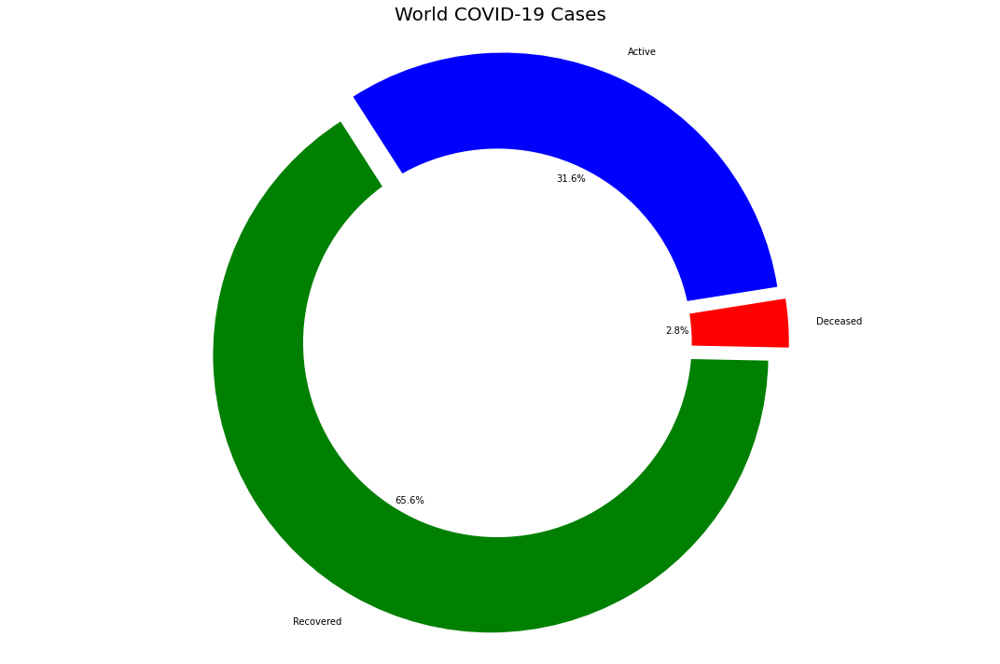


```python
dates
```


    [Timestamp('2020-01-22 00:00:00'),
     Timestamp('2020-01-23 00:00:00'),
     Timestamp('2020-01-24 00:00:00'),
     Timestamp('2020-01-25 00:00:00'),
     Timestamp('2020-01-26 00:00:00'),
     Timestamp('2020-01-27 00:00:00'),
     Timestamp('2020-01-28 00:00:00'),
     Timestamp('2020-01-29 00:00:00'),
     Timestamp('2020-01-30 00:00:00'),
     Timestamp('2020-01-31 00:00:00'),
     Timestamp('2020-02-01 00:00:00'),
     Timestamp('2020-02-02 00:00:00'),
     Timestamp('2020-02-03 00:00:00'),
     Timestamp('2020-02-04 00:00:00'),
     Timestamp('2020-02-05 00:00:00'),
     Timestamp('2020-02-06 00:00:00'),
     Timestamp('2020-02-07 00:00:00'),
     Timestamp('2020-02-08 00:00:00'),
     Timestamp('2020-02-09 00:00:00'),
     Timestamp('2020-02-10 00:00:00'),
     Timestamp('2020-02-11 00:00:00'),
     Timestamp('2020-02-12 00:00:00'),
     Timestamp('2020-02-13 00:00:00'),
     Timestamp('2020-02-14 00:00:00'),
     Timestamp('2020-02-15 00:00:00'),
     Timestamp('2020-02-16 00:00:00'),
     Timestamp('2020-02-17 00:00:00'),
     Timestamp('2020-02-18 00:00:00'),
     Timestamp('2020-02-19 00:00:00'),
     Timestamp('2020-02-20 00:00:00'),
     Timestamp('2020-02-21 00:00:00'),
     Timestamp('2020-02-22 00:00:00'),
     Timestamp('2020-02-23 00:00:00'),
     Timestamp('2020-02-24 00:00:00'),
     Timestamp('2020-02-25 00:00:00'),
     Timestamp('2020-02-26 00:00:00'),
     Timestamp('2020-02-27 00:00:00'),
     Timestamp('2020-02-28 00:00:00'),
     Timestamp('2020-02-29 00:00:00'),
     Timestamp('2020-03-01 00:00:00'),
     Timestamp('2020-03-02 00:00:00'),
     Timestamp('2020-03-03 00:00:00'),
     Timestamp('2020-03-04 00:00:00'),
     Timestamp('2020-03-05 00:00:00'),
     Timestamp('2020-03-06 00:00:00'),
     Timestamp('2020-03-07 00:00:00'),
     Timestamp('2020-03-08 00:00:00'),
     Timestamp('2020-03-09 00:00:00'),
     Timestamp('2020-03-10 00:00:00'),
     Timestamp('2020-03-11 00:00:00'),
     Timestamp('2020-03-12 00:00:00'),
     Timestamp('2020-03-13 00:00:00'),
     Timestamp('2020-03-14 00:00:00'),
     Timestamp('2020-03-15 00:00:00'),
     Timestamp('2020-03-16 00:00:00'),
     Timestamp('2020-03-17 00:00:00'),
     Timestamp('2020-03-18 00:00:00'),
     Timestamp('2020-03-19 00:00:00'),
     Timestamp('2020-03-20 00:00:00'),
     Timestamp('2020-03-21 00:00:00'),
     Timestamp('2020-03-22 00:00:00'),
     Timestamp('2020-03-23 00:00:00'),
     Timestamp('2020-03-24 00:00:00'),
     Timestamp('2020-03-25 00:00:00'),
     Timestamp('2020-03-26 00:00:00'),
     Timestamp('2020-03-27 00:00:00'),
     Timestamp('2020-03-28 00:00:00'),
     Timestamp('2020-03-29 00:00:00'),
     Timestamp('2020-03-30 00:00:00'),
     Timestamp('2020-03-31 00:00:00'),
     Timestamp('2020-04-01 00:00:00'),
     Timestamp('2020-04-02 00:00:00'),
     Timestamp('2020-04-03 00:00:00'),
     Timestamp('2020-04-04 00:00:00'),
     Timestamp('2020-04-05 00:00:00'),
     Timestamp('2020-04-06 00:00:00'),
     Timestamp('2020-04-07 00:00:00'),
     Timestamp('2020-04-08 00:00:00'),
     Timestamp('2020-04-09 00:00:00'),
     Timestamp('2020-04-10 00:00:00'),
     Timestamp('2020-04-11 00:00:00'),
     Timestamp('2020-04-12 00:00:00'),
     Timestamp('2020-04-13 00:00:00'),
     Timestamp('2020-04-14 00:00:00'),
     Timestamp('2020-04-15 00:00:00'),
     Timestamp('2020-04-16 00:00:00'),
     Timestamp('2020-04-17 00:00:00'),
     Timestamp('2020-04-18 00:00:00'),
     Timestamp('2020-04-19 00:00:00'),
     Timestamp('2020-04-20 00:00:00'),
     Timestamp('2020-04-21 00:00:00'),
     Timestamp('2020-04-22 00:00:00'),
     Timestamp('2020-04-23 00:00:00'),
     Timestamp('2020-04-24 00:00:00'),
     Timestamp('2020-04-25 00:00:00'),
     Timestamp('2020-04-26 00:00:00'),
     Timestamp('2020-04-27 00:00:00'),
     Timestamp('2020-04-28 00:00:00'),
     Timestamp('2020-04-29 00:00:00'),
     Timestamp('2020-04-30 00:00:00'),
     Timestamp('2020-05-01 00:00:00'),
     Timestamp('2020-05-02 00:00:00'),
     Timestamp('2020-05-03 00:00:00'),
     Timestamp('2020-05-04 00:00:00'),
     Timestamp('2020-05-05 00:00:00'),
     Timestamp('2020-05-06 00:00:00'),
     Timestamp('2020-05-07 00:00:00'),
     Timestamp('2020-05-08 00:00:00'),
     Timestamp('2020-05-09 00:00:00'),
     Timestamp('2020-05-10 00:00:00'),
     Timestamp('2020-05-11 00:00:00'),
     Timestamp('2020-05-12 00:00:00'),
     Timestamp('2020-05-13 00:00:00'),
     Timestamp('2020-05-14 00:00:00'),
     Timestamp('2020-05-15 00:00:00'),
     Timestamp('2020-05-16 00:00:00'),
     Timestamp('2020-05-17 00:00:00'),
     Timestamp('2020-05-18 00:00:00'),
     Timestamp('2020-05-19 00:00:00'),
     Timestamp('2020-05-20 00:00:00'),
     Timestamp('2020-05-21 00:00:00'),
     Timestamp('2020-05-22 00:00:00'),
     Timestamp('2020-05-23 00:00:00'),
     Timestamp('2020-05-24 00:00:00'),
     Timestamp('2020-05-25 00:00:00'),
     Timestamp('2020-05-26 00:00:00'),
     Timestamp('2020-05-27 00:00:00'),
     Timestamp('2020-05-28 00:00:00'),
     Timestamp('2020-05-29 00:00:00'),
     Timestamp('2020-05-30 00:00:00'),
     Timestamp('2020-05-31 00:00:00'),
     Timestamp('2020-06-01 00:00:00'),
     Timestamp('2020-06-02 00:00:00'),
     Timestamp('2020-06-03 00:00:00'),
     Timestamp('2020-06-04 00:00:00'),
     Timestamp('2020-06-05 00:00:00'),
     Timestamp('2020-06-06 00:00:00'),
     Timestamp('2020-06-07 00:00:00'),
     Timestamp('2020-06-08 00:00:00'),
     Timestamp('2020-06-09 00:00:00'),
     Timestamp('2020-06-10 00:00:00'),
     Timestamp('2020-06-11 00:00:00'),
     Timestamp('2020-06-12 00:00:00'),
     Timestamp('2020-06-13 00:00:00'),
     Timestamp('2020-06-14 00:00:00'),
     Timestamp('2020-06-15 00:00:00'),
     Timestamp('2020-06-16 00:00:00'),
     Timestamp('2020-06-17 00:00:00'),
     Timestamp('2020-06-18 00:00:00'),
     Timestamp('2020-06-19 00:00:00'),
     Timestamp('2020-06-20 00:00:00'),
     Timestamp('2020-06-21 00:00:00'),
     Timestamp('2020-06-22 00:00:00'),
     Timestamp('2020-06-23 00:00:00'),
     Timestamp('2020-06-24 00:00:00'),
     Timestamp('2020-06-25 00:00:00'),
     Timestamp('2020-06-26 00:00:00'),
     Timestamp('2020-06-27 00:00:00'),
     Timestamp('2020-06-28 00:00:00'),
     Timestamp('2020-06-29 00:00:00'),
     Timestamp('2020-06-30 00:00:00'),
     Timestamp('2020-07-01 00:00:00'),
     Timestamp('2020-07-02 00:00:00'),
     Timestamp('2020-07-03 00:00:00'),
     Timestamp('2020-07-04 00:00:00'),
     Timestamp('2020-07-05 00:00:00'),
     Timestamp('2020-07-06 00:00:00'),
     Timestamp('2020-07-07 00:00:00'),
     Timestamp('2020-07-08 00:00:00'),
     Timestamp('2020-07-09 00:00:00'),
     Timestamp('2020-07-10 00:00:00'),
     Timestamp('2020-07-11 00:00:00'),
     Timestamp('2020-07-12 00:00:00'),
     Timestamp('2020-07-13 00:00:00'),
     Timestamp('2020-07-14 00:00:00'),
     Timestamp('2020-07-15 00:00:00'),
     Timestamp('2020-07-16 00:00:00'),
     Timestamp('2020-07-17 00:00:00'),
     Timestamp('2020-07-18 00:00:00'),
     Timestamp('2020-07-19 00:00:00'),
     Timestamp('2020-07-20 00:00:00'),
     Timestamp('2020-07-21 00:00:00'),
     Timestamp('2020-07-22 00:00:00'),
     Timestamp('2020-07-23 00:00:00'),
     Timestamp('2020-07-24 00:00:00'),
     Timestamp('2020-07-25 00:00:00'),
     Timestamp('2020-07-26 00:00:00'),
     Timestamp('2020-07-27 00:00:00'),
     Timestamp('2020-07-28 00:00:00'),
     Timestamp('2020-07-29 00:00:00'),
     Timestamp('2020-07-30 00:00:00'),
     Timestamp('2020-07-31 00:00:00'),
     Timestamp('2020-08-01 00:00:00'),
     Timestamp('2020-08-02 00:00:00'),
     Timestamp('2020-08-03 00:00:00'),
     Timestamp('2020-08-04 00:00:00'),
     Timestamp('2020-08-05 00:00:00'),
     Timestamp('2020-08-06 00:00:00'),
     Timestamp('2020-08-07 00:00:00'),
     Timestamp('2020-08-08 00:00:00'),
     Timestamp('2020-08-09 00:00:00'),
     Timestamp('2020-08-10 00:00:00'),
     Timestamp('2020-08-11 00:00:00'),
     Timestamp('2020-08-12 00:00:00'),
     Timestamp('2020-08-13 00:00:00'),
     Timestamp('2020-08-14 00:00:00'),
     Timestamp('2020-08-15 00:00:00'),
     Timestamp('2020-08-16 00:00:00'),
     Timestamp('2020-08-17 00:00:00'),
     Timestamp('2020-08-18 00:00:00'),
     Timestamp('2020-08-19 00:00:00'),
     Timestamp('2020-08-20 00:00:00'),
     Timestamp('2020-08-21 00:00:00'),
     Timestamp('2020-08-22 00:00:00'),
     Timestamp('2020-08-23 00:00:00'),
     Timestamp('2020-08-24 00:00:00'),
     Timestamp('2020-08-25 00:00:00'),
     Timestamp('2020-08-26 00:00:00'),
     Timestamp('2020-08-27 00:00:00'),
     Timestamp('2020-08-28 00:00:00'),
     Timestamp('2020-08-29 00:00:00'),
     Timestamp('2020-08-30 00:00:00'),
     Timestamp('2020-08-31 00:00:00'),
     Timestamp('2020-09-01 00:00:00'),
     Timestamp('2020-09-02 00:00:00'),
     Timestamp('2020-09-03 00:00:00'),
     Timestamp('2020-09-04 00:00:00'),
     Timestamp('2020-09-05 00:00:00'),
     Timestamp('2020-09-06 00:00:00'),
     Timestamp('2020-09-07 00:00:00'),
     Timestamp('2020-09-08 00:00:00'),
     Timestamp('2020-09-09 00:00:00'),
     Timestamp('2020-09-10 00:00:00'),
     Timestamp('2020-09-11 00:00:00'),
     Timestamp('2020-09-12 00:00:00'),
     Timestamp('2020-09-13 00:00:00'),
     Timestamp('2020-09-14 00:00:00'),
     Timestamp('2020-09-15 00:00:00'),
     Timestamp('2020-09-16 00:00:00'),
     Timestamp('2020-09-17 00:00:00'),
     Timestamp('2020-09-18 00:00:00'),
     Timestamp('2020-09-19 00:00:00'),
     Timestamp('2020-09-20 00:00:00'),
     Timestamp('2020-09-21 00:00:00'),
     Timestamp('2020-09-22 00:00:00'),
     Timestamp('2020-09-23 00:00:00'),
     Timestamp('2020-09-24 00:00:00'),
     Timestamp('2020-09-25 00:00:00'),
     Timestamp('2020-09-26 00:00:00'),
     Timestamp('2020-09-27 00:00:00'),
     Timestamp('2020-09-28 00:00:00'),
     Timestamp('2020-09-29 00:00:00'),
     Timestamp('2020-09-30 00:00:00')]


```python
hotspots = ['China','Germany','Iran','Italy','Spain','US','Korea, South','France','Turkey','United Kingdom','India']
dates = list(confirmed_df.columns[4:])
dates = list(pd.to_datetime(dates))
dates_india = dates[8:]

df1 = confirmed_df.groupby('Country/Region').sum().reset_index()
df2 = deaths_df.groupby('Country/Region').sum().reset_index()
df3 = recovered_df.groupby('Country/Region').sum().reset_index()

global_confirmed = {}
global_deaths = {}
global_recovered = {}
global_active= {}

for country in hotspots:
    k =df1[df1['Country/Region'] == country].loc[:,'1/30/20':]
    global_confirmed[country] = k.values.tolist()[0]

    k =df2[df2['Country/Region'] == country].loc[:,'1/30/20':]
    global_deaths[country] = k.values.tolist()[0]

    k =df3[df3['Country/Region'] == country].loc[:,'1/30/20':]
    global_recovered[country] = k.values.tolist()[0]
    
# for country in hotspots:
#     k = list(map(int.__sub__, global_confirmed[country], global_deaths[country]))
#     global_active[country] = list(map(int.__sub__, k, global_recovered[country]))
    
fig = plt.figure(figsize= (15,25))
plt.suptitle('Active, Recovered, Deaths in Hotspot Countries and India as of '+ today,fontsize = 20,y=1.0)
#plt.legend()
k=0
for i in range(1,12):
    ax = fig.add_subplot(6,2,i)
    ax.xaxis.set_major_formatter(mdates.DateFormatter('%d-%b'))
    # ax.bar(dates_india,global_active[hotspots[k]],color = 'green',alpha = 0.6,label = 'Active');
    ax.bar(dates_india,global_confirmed[hotspots[k]],color='blue',label = 'Confirmed');
    ax.bar(dates_india,global_recovered[hotspots[k]],color='grey',label = 'Recovered');
    ax.bar(dates_india,global_deaths[hotspots[k]],color='red',label = 'Death');   
    plt.title(hotspots[k])
    handles, labels = ax.get_legend_handles_labels()
    fig.legend(handles, labels, loc='upper left')
    k=k+1

plt.tight_layout(pad=3.0)
```


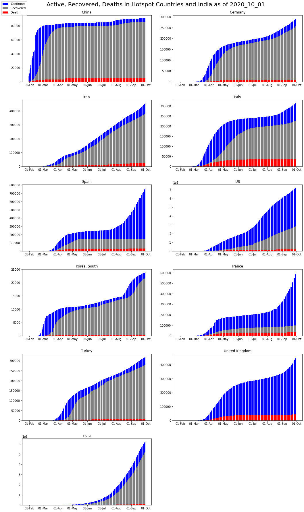


```python
countries = ['China','Germany','Iran','Italy','Spain','US','Korea, South','France','United Kingdom','India']

global_confirmed = []
global_recovered = []
global_deaths = []

for country in countries:
    k =df1[df1['Country/Region'] == country].loc[:,'1/30/20':]
    global_confirmed.append(k.values.tolist()[0]) 

    k =df2[df2['Country/Region'] == country].loc[:,'1/30/20':]
    global_deaths.append(k.values.tolist()[0]) 

    k =df3[df3['Country/Region'] == country].loc[:,'1/30/20':]
    global_deaths.append(k.values.tolist()[0])  
```


```python
plt.figure(figsize= (15,10))
plt.xticks(rotation = 90 ,fontsize = 11)
plt.yticks(fontsize = 10)
plt.xlabel("Dates",fontsize = 20)
plt.ylabel('Total cases',fontsize = 20)
plt.title("Comparison with other Countries" , fontsize = 20)

for i in range(len(countries)):
    plt.plot_date(y= global_confirmed[i],x= dates_india,label = countries[i])
plt.legend();
```


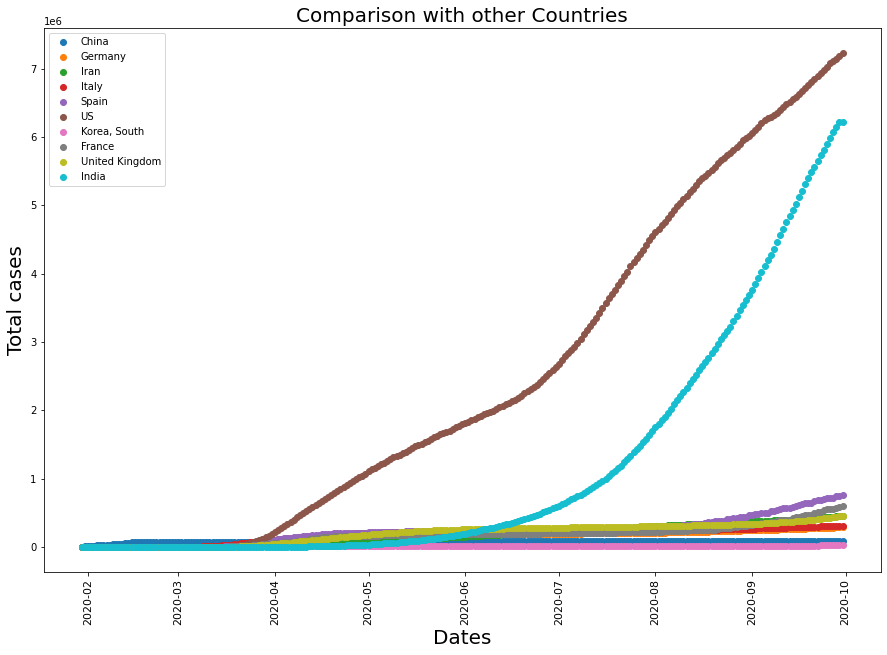


# COVID-19 Symptoms


SOURCE: www.cdc.gov/coronavirus

# **Data Source:**
- https://www.mohfw.gov.in/
- https://www.kaggle.com/sudalairajkumar/novel-corona-virus-2019-dataset
- https://www.worldometers.info/coronavirus/#countries
- https://api.covid19india.org/

The latest data can also be extracted from the available APIs and reading the json. Below are the API list that have been provided by crowd sourced. Extract and use these data to find meaningful insights.

- [National time series, statewise stats and test counts](https://api.covid19india.org/data.json)
- [State-district-wise](https://api.covid19india.org/state_district_wise.json)
[State-district-wise V2](https://api.covid19india.org/v2/state_district_wise.json)
- [Travel history](https://api.covid19india.org/travel_history.json)
- [Raw data](https://api.covid19india.org/raw_data.json)
- [States Daily changes](https://api.covid19india.org/states_daily.json)
- [Statewise Tested Numbers](https://api.covid19india.org/csv/latest/statewise_tested_numbers_data.csv)


## Extracting data from [Hirokuapp](https://www.worldometers.info/coronavirus/#countries)


```python
api = pd.read_json('https://corona-virus-stats.herokuapp.com/api/v1/cases/countries-search')
```


```python
json_data = api['data']['rows']
```


```python
from pandas.io.json import json_normalize

data = json_normalize(json_data)
data
```


<div>
<style scoped>
    .dataframe tbody tr th:only-of-type {
        vertical-align: middle;
    }

    .dataframe tbody tr th {
        vertical-align: top;
    }

    .dataframe thead th {
        text-align: right;
    }
</style>
<table border="1" class="dataframe">
  <thead>
    <tr style="text-align: right;">
      <th></th>
      <th>country</th>
      <th>country_abbreviation</th>
      <th>total_cases</th>
      <th>new_cases</th>
      <th>total_deaths</th>
      <th>new_deaths</th>
      <th>total_recovered</th>
      <th>active_cases</th>
      <th>serious_critical</th>
      <th>cases_per_mill_pop</th>
      <th>flag</th>
    </tr>
  </thead>
  <tbody>
    <tr>
      <th>0</th>
      <td>World</td>
      <td></td>
      <td>4,525,103</td>
      <td>3,077</td>
      <td>303,351</td>
      <td>269</td>
      <td>1,703,742</td>
      <td>2,518,010</td>
      <td>45,560</td>
      <td>581.0</td>
      <td>https://upload.wikimedia.org/wikipedia/commons...</td>
    </tr>
    <tr>
      <th>1</th>
      <td>USA</td>
      <td>US</td>
      <td>1,457,593</td>
      <td>0</td>
      <td>86,912</td>
      <td>0</td>
      <td>318,027</td>
      <td>1,052,654</td>
      <td>16,240</td>
      <td>4,404.0</td>
      <td>https://www.worldometers.info/img/flags/us-fla...</td>
    </tr>
    <tr>
      <th>2</th>
      <td>Spain</td>
      <td>ES</td>
      <td>272,646</td>
      <td>0</td>
      <td>27,321</td>
      <td>0</td>
      <td>186,480</td>
      <td>58,845</td>
      <td>1,376</td>
      <td>5,831.0</td>
      <td>https://www.worldometers.info/img/flags/sp-fla...</td>
    </tr>
    <tr>
      <th>3</th>
      <td>Russia</td>
      <td>RU</td>
      <td>252,245</td>
      <td>0</td>
      <td>2,305</td>
      <td>0</td>
      <td>53,530</td>
      <td>196,410</td>
      <td>2,300</td>
      <td>1,728.0</td>
      <td>https://www.worldometers.info/img/flags/rs-fla...</td>
    </tr>
    <tr>
      <th>4</th>
      <td>UK</td>
      <td>GB</td>
      <td>233,151</td>
      <td>0</td>
      <td>33,614</td>
      <td>0</td>
      <td>N/A</td>
      <td>199,193</td>
      <td>1,559</td>
      <td>3,434.0</td>
      <td>https://www.worldometers.info/img/flags/uk-fla...</td>
    </tr>
    <tr>
      <th>5</th>
      <td>Italy</td>
      <td>IT</td>
      <td>223,096</td>
      <td>0</td>
      <td>31,368</td>
      <td>0</td>
      <td>115,288</td>
      <td>76,440</td>
      <td>855</td>
      <td>3,690.0</td>
      <td>https://www.worldometers.info/img/flags/it-fla...</td>
    </tr>
    <tr>
      <th>6</th>
      <td>Brazil</td>
      <td>BR</td>
      <td>203,165</td>
      <td>247</td>
      <td>13,999</td>
      <td>6</td>
      <td>79,479</td>
      <td>109,687</td>
      <td>8,318</td>
      <td>956.0</td>
      <td>https://www.worldometers.info/img/flags/br-fla...</td>
    </tr>
    <tr>
      <th>7</th>
      <td>France</td>
      <td>FR</td>
      <td>178,870</td>
      <td>0</td>
      <td>27,425</td>
      <td>0</td>
      <td>59,605</td>
      <td>91,840</td>
      <td>2,299</td>
      <td>2,740.0</td>
      <td>https://www.worldometers.info/img/flags/fr-fla...</td>
    </tr>
    <tr>
      <th>8</th>
      <td>Germany</td>
      <td>DE</td>
      <td>174,975</td>
      <td>0</td>
      <td>7,928</td>
      <td>0</td>
      <td>150,300</td>
      <td>16,747</td>
      <td>1,329</td>
      <td>2,088.0</td>
      <td>https://www.worldometers.info/img/flags/gm-fla...</td>
    </tr>
    <tr>
      <th>9</th>
      <td>Turkey</td>
      <td>TR</td>
      <td>144,749</td>
      <td>0</td>
      <td>4,007</td>
      <td>0</td>
      <td>104,030</td>
      <td>36,712</td>
      <td>963</td>
      <td>1,716.0</td>
      <td>https://www.worldometers.info/img/flags/tu-fla...</td>
    </tr>
  </tbody>
</table>
</div>


### Collecting Data for Statewise Insights


```python
# to parse json contents
import json
# to parse csv files
import csv
import requests
```


```python
# get response from the web page for LIVE data
response = requests.get('https://api.covid19india.org/raw_data3.json')
# get contents from the response
content = response.content
# parse the json file
parsed = json.loads(content)
# keys
parsed.keys()
```


    dict_keys(['raw_data'])


```python
# save to df
df = pd.DataFrame(parsed['raw_data'])

# shape of the dataframe
print(df.shape)

# # list of columns
print(df.columns)

# # first few rows
df.head()
```

    (10020, 20)
    Index(['agebracket', 'contractedfromwhichpatientsuspected', 'currentstatus',
           'dateannounced', 'detectedcity', 'detecteddistrict', 'detectedstate',
           'entryid', 'gender', 'nationality', 'notes', 'numcases',
           'patientnumber', 'source1', 'source2', 'source3', 'statecode',
           'statepatientnumber', 'statuschangedate', 'typeoftransmission'],
          dtype='object')
    


<div>
<style scoped>
    .dataframe tbody tr th:only-of-type {
        vertical-align: middle;
    }

    .dataframe tbody tr th {
        vertical-align: top;
    }

    .dataframe thead th {
        text-align: right;
    }
</style>
<table border="1" class="dataframe">
  <thead>
    <tr style="text-align: right;">
      <th></th>
      <th>agebracket</th>
      <th>contractedfromwhichpatientsuspected</th>
      <th>currentstatus</th>
      <th>dateannounced</th>
      <th>detectedcity</th>
      <th>detecteddistrict</th>
      <th>detectedstate</th>
      <th>entryid</th>
      <th>gender</th>
      <th>nationality</th>
      <th>notes</th>
      <th>numcases</th>
      <th>patientnumber</th>
      <th>source1</th>
      <th>source2</th>
      <th>source3</th>
      <th>statecode</th>
      <th>statepatientnumber</th>
      <th>statuschangedate</th>
      <th>typeoftransmission</th>
    </tr>
  </thead>
  <tbody>
    <tr>
      <th>0</th>
      <td></td>
      <td></td>
      <td>Hospitalized</td>
      <td>27/04/2020</td>
      <td></td>
      <td></td>
      <td>West Bengal</td>
      <td>1</td>
      <td></td>
      <td></td>
      <td>Details awaited</td>
      <td>38</td>
      <td>27892</td>
      <td>mohfw.gov.in</td>
      <td></td>
      <td></td>
      <td>WB</td>
      <td></td>
      <td></td>
      <td></td>
    </tr>
    <tr>
      <th>1</th>
      <td></td>
      <td></td>
      <td>Hospitalized</td>
      <td>27/04/2020</td>
      <td></td>
      <td>Bhilwara</td>
      <td>Rajasthan</td>
      <td>2</td>
      <td></td>
      <td></td>
      <td>Details awaited</td>
      <td>2</td>
      <td>27893</td>
      <td>https://twitter.com/ANI/status/125461859651442...</td>
      <td></td>
      <td></td>
      <td>RJ</td>
      <td></td>
      <td></td>
      <td></td>
    </tr>
    <tr>
      <th>2</th>
      <td></td>
      <td></td>
      <td>Hospitalized</td>
      <td>27/04/2020</td>
      <td></td>
      <td>Jaipur</td>
      <td>Rajasthan</td>
      <td>3</td>
      <td></td>
      <td></td>
      <td>Details awaited</td>
      <td>9</td>
      <td>27894</td>
      <td>https://twitter.com/ANI/status/125461859651442...</td>
      <td></td>
      <td></td>
      <td>RJ</td>
      <td></td>
      <td></td>
      <td></td>
    </tr>
    <tr>
      <th>3</th>
      <td>28</td>
      <td></td>
      <td>Deceased</td>
      <td>27/04/2020</td>
      <td>Surajpol</td>
      <td>Jaipur</td>
      <td>Rajasthan</td>
      <td>4</td>
      <td>M</td>
      <td></td>
      <td>Details awaited</td>
      <td>1</td>
      <td>27895</td>
      <td>https://twitter.com/ANI/status/125461859651442...</td>
      <td></td>
      <td></td>
      <td>RJ</td>
      <td></td>
      <td></td>
      <td></td>
    </tr>
    <tr>
      <th>4</th>
      <td></td>
      <td></td>
      <td>Hospitalized</td>
      <td>27/04/2020</td>
      <td></td>
      <td>Jaisalmer</td>
      <td>Rajasthan</td>
      <td>5</td>
      <td></td>
      <td></td>
      <td>Details awaited</td>
      <td>1</td>
      <td>27896</td>
      <td>https://twitter.com/ANI/status/125461859651442...</td>
      <td></td>
      <td></td>
      <td>RJ</td>
      <td></td>
      <td></td>
      <td></td>
    </tr>
  </tbody>
</table>
</div>


```python
# creating patient id column from patient number
# ===============================================

df['p_id'] = df['patientnumber'].apply(lambda x : 'P'+str(x))
df.columns
```


    Index(['agebracket', 'contractedfromwhichpatientsuspected', 'currentstatus',
           'dateannounced', 'detectedcity', 'detecteddistrict', 'detectedstate',
           'entryid', 'gender', 'nationality', 'notes', 'numcases',
           'patientnumber', 'source1', 'source2', 'source3', 'statecode',
           'statepatientnumber', 'statuschangedate', 'typeoftransmission', 'p_id'],
          dtype='object')


### Rearrange and rename columns


```python
# order of columns
cols = ['patientnumber', 'p_id', 'statepatientnumber', 
        'dateannounced', 'agebracket', 'gender', 
        'detectedcity', 'detecteddistrict', 'detectedstate', 'statecode', 'nationality',
        'typeoftransmission', 'contractedfromwhichpatientsuspected',
        'statuschangedate', 'currentstatus', 'source1', 'source2', 'source3', 'notes']

# rearrange columns
df = df[cols]

# rename columns
df.columns = ['patient_number', 'p_id', 'state_patient_number', 
              'date_announced', 'age_bracket', 'gender', 
              'detected_city', 'detected_district', 'detected_state', 'state_code', 'nationality',
              'type_of_transmission', 'contracted_from_which_patient_suspected',
              'status_change_date', 'current_status', 'source1', 'source2', 'source3', 'notes']

# dataframe shape
df.shape
```


    (10020, 19)


```python
# first 3 rows of the dataframe
df.head(3)
```


<div>
<style scoped>
    .dataframe tbody tr th:only-of-type {
        vertical-align: middle;
    }

    .dataframe tbody tr th {
        vertical-align: top;
    }

    .dataframe thead th {
        text-align: right;
    }
</style>
<table border="1" class="dataframe">
  <thead>
    <tr style="text-align: right;">
      <th></th>
      <th>patient_number</th>
      <th>p_id</th>
      <th>state_patient_number</th>
      <th>date_announced</th>
      <th>age_bracket</th>
      <th>gender</th>
      <th>detected_city</th>
      <th>detected_district</th>
      <th>detected_state</th>
      <th>state_code</th>
      <th>nationality</th>
      <th>type_of_transmission</th>
      <th>contracted_from_which_patient_suspected</th>
      <th>status_change_date</th>
      <th>current_status</th>
      <th>source1</th>
      <th>source2</th>
      <th>source3</th>
      <th>notes</th>
    </tr>
  </thead>
  <tbody>
    <tr>
      <th>0</th>
      <td>27892</td>
      <td>P27892</td>
      <td></td>
      <td>27/04/2020</td>
      <td></td>
      <td></td>
      <td></td>
      <td></td>
      <td>West Bengal</td>
      <td>WB</td>
      <td></td>
      <td></td>
      <td></td>
      <td></td>
      <td>Hospitalized</td>
      <td>mohfw.gov.in</td>
      <td></td>
      <td></td>
      <td>Details awaited</td>
    </tr>
    <tr>
      <th>1</th>
      <td>27893</td>
      <td>P27893</td>
      <td></td>
      <td>27/04/2020</td>
      <td></td>
      <td></td>
      <td></td>
      <td>Bhilwara</td>
      <td>Rajasthan</td>
      <td>RJ</td>
      <td></td>
      <td></td>
      <td></td>
      <td></td>
      <td>Hospitalized</td>
      <td>https://twitter.com/ANI/status/125461859651442...</td>
      <td></td>
      <td></td>
      <td>Details awaited</td>
    </tr>
    <tr>
      <th>2</th>
      <td>27894</td>
      <td>P27894</td>
      <td></td>
      <td>27/04/2020</td>
      <td></td>
      <td></td>
      <td></td>
      <td>Jaipur</td>
      <td>Rajasthan</td>
      <td>RJ</td>
      <td></td>
      <td></td>
      <td></td>
      <td></td>
      <td>Hospitalized</td>
      <td>https://twitter.com/ANI/status/125461859651442...</td>
      <td></td>
      <td></td>
      <td>Details awaited</td>
    </tr>
  </tbody>
</table>
</div>


### Missing values


```python
# no. of empty values in each column
# ==================================

print(df.shape, '\n')

for i in df.columns:
    print(i, '\t', df[df[i]==''].shape[0])
```

    (10020, 19) 
    
    patient_number 	 12
    p_id 	 0
    state_patient_number 	 4882
    date_announced 	 0
    age_bracket 	 4837
    gender 	 5366
    detected_city 	 9599
    detected_district 	 86
    detected_state 	 5
    state_code 	 5
    nationality 	 10020
    type_of_transmission 	 10020
    contracted_from_which_patient_suspected 	 9779
    status_change_date 	 10020
    current_status 	 0
    source1 	 65
    source2 	 9940
    source3 	 9989
    notes 	 8089
    


```python
# no. of non-empty values in each column
# ===================================

print(df.shape, '\n')

for i in df.columns:
    print(i, '\t', df[df[i]!=''].shape[0])
```

    (10020, 19) 
    
    patient_number 	 10008
    p_id 	 10020
    state_patient_number 	 5138
    date_announced 	 10020
    age_bracket 	 5183
    gender 	 4654
    detected_city 	 421
    detected_district 	 9934
    detected_state 	 10015
    state_code 	 10015
    nationality 	 0
    type_of_transmission 	 0
    contracted_from_which_patient_suspected 	 241
    status_change_date 	 0
    current_status 	 10020
    source1 	 9955
    source2 	 80
    source3 	 31
    notes 	 1931
    


```python
# replacing empty strings with np.nan
# ==================================-

print(df.shape)

df = df.replace(r'', np.nan, regex=True)
df.isna().sum()
```

    (10020, 19)
    


    patient_number                                12
    p_id                                           0
    state_patient_number                        4882
    date_announced                                 0
    age_bracket                                 4837
    gender                                      5366
    detected_city                               9599
    detected_district                             86
    detected_state                                 5
    state_code                                     5
    nationality                                10020
    type_of_transmission                       10020
    contracted_from_which_patient_suspected     9779
    status_change_date                         10020
    current_status                                 0
    source1                                       65
    source2                                     9940
    source3                                     9989
    notes                                       8089
    dtype: int64


```python
# droping empty rows (row with just row number but without patient entry
# ======================================================================

print(df.shape)

# df.dropna(subset=['detected_state'], inplace=True)

print(df.shape)
df.isna().sum()
```

    (10020, 19)
    (10020, 19)
    


    patient_number                                12
    p_id                                           0
    state_patient_number                        4882
    date_announced                                 0
    age_bracket                                 4837
    gender                                      5366
    detected_city                               9599
    detected_district                             86
    detected_state                                 5
    state_code                                     5
    nationality                                10020
    type_of_transmission                       10020
    contracted_from_which_patient_suspected     9779
    status_change_date                         10020
    current_status                                 0
    source1                                       65
    source2                                     9940
    source3                                     9989
    notes                                       8089
    dtype: int64


```python

```

### Save data


```python
# save to csv`
df.to_csv('patients_data.csv', index=False)
```

## Collecting Some more Statewise Data


```python
# get response from the web page
response = requests.get('https://api.covid19india.org/state_test_data.json')

# get contents from the response
content = response.content

# parse the json file
parsed = json.loads(content)

# keys
parsed.keys()
```


    dict_keys(['states_tested_data'])


```python
# get response from the web page
response = requests.get('https://api.covid19india.org/state_test_data.json')

# get contents from the response
content = response.content

# parse the json file
parsed = json.loads(content)

# keys
parsed.keys()
```


    dict_keys(['states_tested_data'])


```python
# save data in a dataframe
th = pd.DataFrame(parsed['states_tested_data'])

# first few rows
th
```


<div>
<style scoped>
    .dataframe tbody tr th:only-of-type {
        vertical-align: middle;
    }

    .dataframe tbody tr th {
        vertical-align: top;
    }

    .dataframe thead th {
        text-align: right;
    }
</style>
<table border="1" class="dataframe">
  <thead>
    <tr style="text-align: right;">
      <th></th>
      <th>antigentests</th>
      <th>coronaenquirycalls</th>
      <th>cumulativepeopleinquarantine</th>
      <th>negative</th>
      <th>numcallsstatehelpline</th>
      <th>numicubeds</th>
      <th>numisolationbeds</th>
      <th>numventilators</th>
      <th>othertests</th>
      <th>peopleinicu</th>
      <th>...</th>
      <th>testsperpositivecase</th>
      <th>testsperthousand</th>
      <th>totaln95masks</th>
      <th>totalpeoplecurrentlyinquarantine</th>
      <th>totalpeoplereleasedfromquarantine</th>
      <th>totalppe</th>
      <th>totaltested</th>
      <th>unconfirmed</th>
      <th>updatedon</th>
      <th>_djhdx</th>
    </tr>
  </thead>
  <tbody>
    <tr>
      <th>0</th>
      <td></td>
      <td></td>
      <td></td>
      <td>1210</td>
      <td></td>
      <td></td>
      <td>50</td>
      <td></td>
      <td></td>
      <td></td>
      <td>...</td>
      <td>117</td>
      <td>3.53</td>
      <td></td>
      <td></td>
      <td></td>
      <td></td>
      <td>1403</td>
      <td>181</td>
      <td>17/04/2020</td>
      <td>NaN</td>
    </tr>
    <tr>
      <th>1</th>
      <td></td>
      <td></td>
      <td></td>
      <td></td>
      <td>280</td>
      <td></td>
      <td>50</td>
      <td></td>
      <td></td>
      <td></td>
      <td>...</td>
      <td>99</td>
      <td>6.75</td>
      <td></td>
      <td>614</td>
      <td>347</td>
      <td></td>
      <td>2679</td>
      <td>246</td>
      <td>24/04/2020</td>
      <td>NaN</td>
    </tr>
    <tr>
      <th>2</th>
      <td></td>
      <td></td>
      <td></td>
      <td></td>
      <td>298</td>
      <td></td>
      <td>50</td>
      <td></td>
      <td></td>
      <td></td>
      <td>...</td>
      <td>86</td>
      <td>7.17</td>
      <td></td>
      <td>724</td>
      <td>420</td>
      <td></td>
      <td>2848</td>
      <td>106</td>
      <td>27/04/2020</td>
      <td>NaN</td>
    </tr>
    <tr>
      <th>3</th>
      <td></td>
      <td></td>
      <td></td>
      <td></td>
      <td>340</td>
      <td></td>
      <td>50</td>
      <td></td>
      <td></td>
      <td></td>
      <td>...</td>
      <td>114</td>
      <td>9.46</td>
      <td></td>
      <td>643</td>
      <td>556</td>
      <td></td>
      <td>3754</td>
      <td>199</td>
      <td>01/05/2020</td>
      <td>NaN</td>
    </tr>
    <tr>
      <th>4</th>
      <td></td>
      <td></td>
      <td></td>
      <td></td>
      <td>471</td>
      <td></td>
      <td>98</td>
      <td></td>
      <td></td>
      <td></td>
      <td>...</td>
      <td>202</td>
      <td>16.82</td>
      <td></td>
      <td>16</td>
      <td>1196</td>
      <td></td>
      <td>6677</td>
      <td>136</td>
      <td>16/05/2020</td>
      <td>NaN</td>
    </tr>
    <tr>
      <th>...</th>
      <td>...</td>
      <td>...</td>
      <td>...</td>
      <td>...</td>
      <td>...</td>
      <td>...</td>
      <td>...</td>
      <td>...</td>
      <td>...</td>
      <td>...</td>
      <td>...</td>
      <td>...</td>
      <td>...</td>
      <td>...</td>
      <td>...</td>
      <td>...</td>
      <td>...</td>
      <td>...</td>
      <td>...</td>
      <td>...</td>
      <td>...</td>
    </tr>
    <tr>
      <th>5803</th>
      <td>1057947</td>
      <td></td>
      <td></td>
      <td></td>
      <td></td>
      <td>1243</td>
      <td>12675</td>
      <td>790</td>
      <td></td>
      <td></td>
      <td>...</td>
      <td></td>
      <td></td>
      <td>2298040</td>
      <td>2444</td>
      <td>107697</td>
      <td>2370262</td>
      <td>3098657</td>
      <td></td>
      <td>27/09/2020</td>
      <td>NaN</td>
    </tr>
    <tr>
      <th>5804</th>
      <td>1082706</td>
      <td></td>
      <td></td>
      <td></td>
      <td></td>
      <td>1243</td>
      <td>12675</td>
      <td>790</td>
      <td></td>
      <td></td>
      <td>...</td>
      <td></td>
      <td></td>
      <td>2308040</td>
      <td>2447</td>
      <td>107712</td>
      <td>2375262</td>
      <td>3139938</td>
      <td></td>
      <td>28/09/2020</td>
      <td>NaN</td>
    </tr>
    <tr>
      <th>5805</th>
      <td>1107750</td>
      <td></td>
      <td></td>
      <td></td>
      <td></td>
      <td>1243</td>
      <td>12675</td>
      <td>790</td>
      <td></td>
      <td></td>
      <td>...</td>
      <td></td>
      <td></td>
      <td>2323040</td>
      <td>2439</td>
      <td>107706</td>
      <td>2381262</td>
      <td>3183697</td>
      <td></td>
      <td>29/09/2020</td>
      <td>NaN</td>
    </tr>
    <tr>
      <th>5806</th>
      <td>1131535</td>
      <td></td>
      <td></td>
      <td></td>
      <td></td>
      <td>1243</td>
      <td>12715</td>
      <td>790</td>
      <td></td>
      <td></td>
      <td>...</td>
      <td></td>
      <td></td>
      <td>2335040</td>
      <td>2442</td>
      <td>107721</td>
      <td>2387262</td>
      <td>3227462</td>
      <td></td>
      <td>30/09/2020</td>
      <td>NaN</td>
    </tr>
    <tr>
      <th>5807</th>
      <td>1155254</td>
      <td></td>
      <td></td>
      <td></td>
      <td></td>
      <td>1243</td>
      <td>12715</td>
      <td>790</td>
      <td></td>
      <td></td>
      <td>...</td>
      <td></td>
      <td></td>
      <td>2350040</td>
      <td>2439</td>
      <td>107726</td>
      <td>2393262</td>
      <td>3271316</td>
      <td></td>
      <td>01/10/2020</td>
      <td>NaN</td>
    </tr>
  </tbody>
</table>
<p>5808 rows × 32 columns</p>
</div>


```python
th.columns
```


    Index(['antigentests', 'coronaenquirycalls', 'cumulativepeopleinquarantine',
           'negative', 'numcallsstatehelpline', 'numicubeds', 'numisolationbeds',
           'numventilators', 'othertests', 'peopleinicu', 'peopleonventilators',
           'populationncp2019projection', 'positive', 'rtpcrtests', 'source1',
           'source2', 'source3', 'state', 'tagpeopleinquarantine',
           'tagtotaltested', 'testpositivityrate', 'testspermillion',
           'testsperpositivecase', 'testsperthousand', 'totaln95masks',
           'totalpeoplecurrentlyinquarantine', 'totalpeoplereleasedfromquarantine',
           'totalppe', 'totaltested', 'unconfirmed', 'updatedon', '_djhdx'],
          dtype='object')


```python
# save to csv`
th.to_csv('tests_latest_state_level.csv', index=False)
```


```python
# to get web contents
import requests
# to parse json contents
import json
# to parse csv files
import csv
```


```python

```

## Zones


```python
# get response from the web page
response = requests.get('https://api.covid19india.org/zones.json')

# get contents from the response
content = response.content

# parse the json file
parsed = json.loads(content)

# keys
parsed.keys()
```


    dict_keys(['zones'])


```python
zo = pd.DataFrame(parsed['zones'])
zo.head()
```


<div>
<style scoped>
    .dataframe tbody tr th:only-of-type {
        vertical-align: middle;
    }

    .dataframe tbody tr th {
        vertical-align: top;
    }

    .dataframe thead th {
        text-align: right;
    }
</style>
<table border="1" class="dataframe">
  <thead>
    <tr style="text-align: right;">
      <th></th>
      <th>district</th>
      <th>districtcode</th>
      <th>lastupdated</th>
      <th>source</th>
      <th>state</th>
      <th>statecode</th>
      <th>zone</th>
    </tr>
  </thead>
  <tbody>
    <tr>
      <th>0</th>
      <td>Nicobars</td>
      <td>AN_Nicobars</td>
      <td>01/05/2020</td>
      <td>https://www.facebook.com/airnewsalerts/photos/...</td>
      <td>Andaman and Nicobar Islands</td>
      <td>AN</td>
      <td>Green</td>
    </tr>
    <tr>
      <th>1</th>
      <td>North and Middle Andaman</td>
      <td>AN_North and Middle Andaman</td>
      <td>01/05/2020</td>
      <td>https://www.facebook.com/airnewsalerts/photos/...</td>
      <td>Andaman and Nicobar Islands</td>
      <td>AN</td>
      <td>Green</td>
    </tr>
    <tr>
      <th>2</th>
      <td>South Andaman</td>
      <td>AN_South Andaman</td>
      <td>01/05/2020</td>
      <td>https://www.facebook.com/airnewsalerts/photos/...</td>
      <td>Andaman and Nicobar Islands</td>
      <td>AN</td>
      <td>Red</td>
    </tr>
    <tr>
      <th>3</th>
      <td>Anantapur</td>
      <td>AP_Anantapur</td>
      <td>01/05/2020</td>
      <td>https://www.facebook.com/airnewsalerts/photos/...</td>
      <td>Andhra Pradesh</td>
      <td>AP</td>
      <td>Orange</td>
    </tr>
    <tr>
      <th>4</th>
      <td>Chittoor</td>
      <td>AP_Chittoor</td>
      <td>01/05/2020</td>
      <td>https://www.facebook.com/airnewsalerts/photos/...</td>
      <td>Andhra Pradesh</td>
      <td>AP</td>
      <td>Red</td>
    </tr>
  </tbody>
</table>
</div>


```python
# save to csv`
zo.to_csv('zones.csv', index=False)
```

## National level daily


```python
response = requests.get('https://api.covid19india.org/data.json')
content = response.content
parsed = json.loads(content)
parsed.keys()
```


    dict_keys(['cases_time_series', 'statewise', 'tested'])


```python
national = pd.DataFrame(parsed['cases_time_series'])
national.head()
```


<div>
<style scoped>
    .dataframe tbody tr th:only-of-type {
        vertical-align: middle;
    }

    .dataframe tbody tr th {
        vertical-align: top;
    }

    .dataframe thead th {
        text-align: right;
    }
</style>
<table border="1" class="dataframe">
  <thead>
    <tr style="text-align: right;">
      <th></th>
      <th>dailyconfirmed</th>
      <th>dailydeceased</th>
      <th>dailyrecovered</th>
      <th>date</th>
      <th>totalconfirmed</th>
      <th>totaldeceased</th>
      <th>totalrecovered</th>
    </tr>
  </thead>
  <tbody>
    <tr>
      <th>0</th>
      <td>1</td>
      <td>0</td>
      <td>0</td>
      <td>30 January</td>
      <td>1</td>
      <td>0</td>
      <td>0</td>
    </tr>
    <tr>
      <th>1</th>
      <td>0</td>
      <td>0</td>
      <td>0</td>
      <td>31 January</td>
      <td>1</td>
      <td>0</td>
      <td>0</td>
    </tr>
    <tr>
      <th>2</th>
      <td>0</td>
      <td>0</td>
      <td>0</td>
      <td>01 February</td>
      <td>1</td>
      <td>0</td>
      <td>0</td>
    </tr>
    <tr>
      <th>3</th>
      <td>1</td>
      <td>0</td>
      <td>0</td>
      <td>02 February</td>
      <td>2</td>
      <td>0</td>
      <td>0</td>
    </tr>
    <tr>
      <th>4</th>
      <td>1</td>
      <td>0</td>
      <td>0</td>
      <td>03 February</td>
      <td>3</td>
      <td>0</td>
      <td>0</td>
    </tr>
  </tbody>
</table>
</div>


```python
national.columns
```


    Index(['dailyconfirmed', 'dailydeceased', 'dailyrecovered', 'date',
           'totalconfirmed', 'totaldeceased', 'totalrecovered'],
          dtype='object')


```python
national = national[['date', 'totalconfirmed', 'totaldeceased', 'totalrecovered', 
                     'dailyconfirmed', 'dailydeceased', 'dailyrecovered']]
national.head()
```


<div>
<style scoped>
    .dataframe tbody tr th:only-of-type {
        vertical-align: middle;
    }

    .dataframe tbody tr th {
        vertical-align: top;
    }

    .dataframe thead th {
        text-align: right;
    }
</style>
<table border="1" class="dataframe">
  <thead>
    <tr style="text-align: right;">
      <th></th>
      <th>date</th>
      <th>totalconfirmed</th>
      <th>totaldeceased</th>
      <th>totalrecovered</th>
      <th>dailyconfirmed</th>
      <th>dailydeceased</th>
      <th>dailyrecovered</th>
    </tr>
  </thead>
  <tbody>
    <tr>
      <th>0</th>
      <td>30 January</td>
      <td>1</td>
      <td>0</td>
      <td>0</td>
      <td>1</td>
      <td>0</td>
      <td>0</td>
    </tr>
    <tr>
      <th>1</th>
      <td>31 January</td>
      <td>1</td>
      <td>0</td>
      <td>0</td>
      <td>0</td>
      <td>0</td>
      <td>0</td>
    </tr>
    <tr>
      <th>2</th>
      <td>01 February</td>
      <td>1</td>
      <td>0</td>
      <td>0</td>
      <td>0</td>
      <td>0</td>
      <td>0</td>
    </tr>
    <tr>
      <th>3</th>
      <td>02 February</td>
      <td>2</td>
      <td>0</td>
      <td>0</td>
      <td>1</td>
      <td>0</td>
      <td>0</td>
    </tr>
    <tr>
      <th>4</th>
      <td>03 February</td>
      <td>3</td>
      <td>0</td>
      <td>0</td>
      <td>1</td>
      <td>0</td>
      <td>0</td>
    </tr>
  </tbody>
</table>
</div>


```python
# save to csv`
national.to_csv('nation_level_daily.csv', index=False)
```

## National level latest


```python
state_level = pd.DataFrame(parsed['statewise'])
state_level.head()
```


<div>
<style scoped>
    .dataframe tbody tr th:only-of-type {
        vertical-align: middle;
    }

    .dataframe tbody tr th {
        vertical-align: top;
    }

    .dataframe thead th {
        text-align: right;
    }
</style>
<table border="1" class="dataframe">
  <thead>
    <tr style="text-align: right;">
      <th></th>
      <th>active</th>
      <th>confirmed</th>
      <th>deaths</th>
      <th>deltaconfirmed</th>
      <th>deltadeaths</th>
      <th>deltarecovered</th>
      <th>lastupdatedtime</th>
      <th>migratedother</th>
      <th>recovered</th>
      <th>state</th>
      <th>statecode</th>
      <th>statenotes</th>
    </tr>
  </thead>
  <tbody>
    <tr>
      <th>0</th>
      <td>945551</td>
      <td>6397896</td>
      <td>99833</td>
      <td>5936</td>
      <td>29</td>
      <td>2941</td>
      <td>02/10/2020 12:20:45</td>
      <td>918</td>
      <td>5351594</td>
      <td>Total</td>
      <td>TT</td>
      <td></td>
    </tr>
    <tr>
      <th>1</th>
      <td>259006</td>
      <td>1400922</td>
      <td>37056</td>
      <td>0</td>
      <td>0</td>
      <td>0</td>
      <td>01/10/2020 23:39:43</td>
      <td>434</td>
      <td>1104426</td>
      <td>Maharashtra</td>
      <td>MH</td>
      <td>[Sep 9] :239 cases have been removed from the ...</td>
    </tr>
    <tr>
      <th>2</th>
      <td>57858</td>
      <td>700235</td>
      <td>5869</td>
      <td>0</td>
      <td>0</td>
      <td>0</td>
      <td>01/10/2020 22:07:48</td>
      <td>0</td>
      <td>636508</td>
      <td>Andhra Pradesh</td>
      <td>AP</td>
      <td></td>
    </tr>
    <tr>
      <th>3</th>
      <td>46369</td>
      <td>603290</td>
      <td>9586</td>
      <td>0</td>
      <td>0</td>
      <td>0</td>
      <td>01/10/2020 18:46:44</td>
      <td>0</td>
      <td>547335</td>
      <td>Tamil Nadu</td>
      <td>TN</td>
      <td>[July 22]: 444 backdated deceased entries adde...</td>
    </tr>
    <tr>
      <th>4</th>
      <td>110412</td>
      <td>611837</td>
      <td>8994</td>
      <td>0</td>
      <td>0</td>
      <td>0</td>
      <td>01/10/2020 22:07:49</td>
      <td>19</td>
      <td>492412</td>
      <td>Karnataka</td>
      <td>KA</td>
      <td></td>
    </tr>
  </tbody>
</table>
</div>


```python
state_level.columns
```


    Index(['active', 'confirmed', 'deaths', 'deltaconfirmed', 'deltadeaths',
           'deltarecovered', 'lastupdatedtime', 'migratedother', 'recovered',
           'state', 'statecode', 'statenotes'],
          dtype='object')


```python
state_level = state_level[['state', 'statecode', 'lastupdatedtime',  
                           'confirmed', 'active', 'deaths', 'recovered',
                           'deltaconfirmed', 'deltadeaths', 'deltarecovered', 'statenotes']]
state_level.head()
```


<div>
<style scoped>
    .dataframe tbody tr th:only-of-type {
        vertical-align: middle;
    }

    .dataframe tbody tr th {
        vertical-align: top;
    }

    .dataframe thead th {
        text-align: right;
    }
</style>
<table border="1" class="dataframe">
  <thead>
    <tr style="text-align: right;">
      <th></th>
      <th>state</th>
      <th>statecode</th>
      <th>lastupdatedtime</th>
      <th>confirmed</th>
      <th>active</th>
      <th>deaths</th>
      <th>recovered</th>
      <th>deltaconfirmed</th>
      <th>deltadeaths</th>
      <th>deltarecovered</th>
      <th>statenotes</th>
    </tr>
  </thead>
  <tbody>
    <tr>
      <th>0</th>
      <td>Total</td>
      <td>TT</td>
      <td>02/10/2020 12:20:45</td>
      <td>6397896</td>
      <td>945551</td>
      <td>99833</td>
      <td>5351594</td>
      <td>5936</td>
      <td>29</td>
      <td>2941</td>
      <td></td>
    </tr>
    <tr>
      <th>1</th>
      <td>Maharashtra</td>
      <td>MH</td>
      <td>01/10/2020 23:39:43</td>
      <td>1400922</td>
      <td>259006</td>
      <td>37056</td>
      <td>1104426</td>
      <td>0</td>
      <td>0</td>
      <td>0</td>
      <td>[Sep 9] :239 cases have been removed from the ...</td>
    </tr>
    <tr>
      <th>2</th>
      <td>Andhra Pradesh</td>
      <td>AP</td>
      <td>01/10/2020 22:07:48</td>
      <td>700235</td>
      <td>57858</td>
      <td>5869</td>
      <td>636508</td>
      <td>0</td>
      <td>0</td>
      <td>0</td>
      <td></td>
    </tr>
    <tr>
      <th>3</th>
      <td>Tamil Nadu</td>
      <td>TN</td>
      <td>01/10/2020 18:46:44</td>
      <td>603290</td>
      <td>46369</td>
      <td>9586</td>
      <td>547335</td>
      <td>0</td>
      <td>0</td>
      <td>0</td>
      <td>[July 22]: 444 backdated deceased entries adde...</td>
    </tr>
    <tr>
      <th>4</th>
      <td>Karnataka</td>
      <td>KA</td>
      <td>01/10/2020 22:07:49</td>
      <td>611837</td>
      <td>110412</td>
      <td>8994</td>
      <td>492412</td>
      <td>0</td>
      <td>0</td>
      <td>0</td>
      <td></td>
    </tr>
  </tbody>
</table>
</div>


```python
# save to csv`
state_level.to_csv('state_level_latest.csv', index=False)
```
